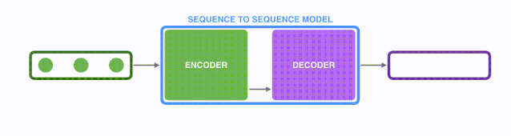
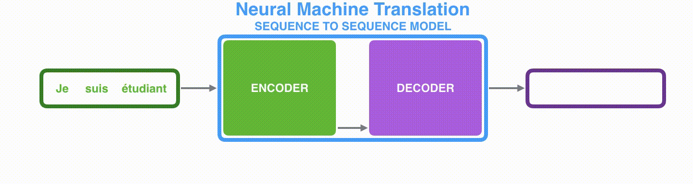

## ध्यान आरेख
सामग्री संगठन:
-ध्यान आरेख
- seq2seq ढांचा
- seq2seq विवरण
-ध्यान
-स्वीकृति

अध्याय 1 में, हमने एनएलपी में ट्रांसफॉर्मर्स के उदय का एक सिंहावलोकन दिया है। इस ट्यूटोरियल का सीखने का तरीका है: ध्यान दें-> ट्रांसफार्मर-> बीईआरटी-> एनएलपी एप्लिकेशन। इसलिए, यह अध्याय ध्यान से शुरू होगा और धीरे-धीरे इसमें शामिल ज्ञान को समझाएगा ट्रांसफार्मर संरचना में गहराई से, पाठकों को एक विशद विवरण देने की उम्मीद है।

प्रश्न: इसका कारण क्या है?ध्यान का उद्भव?
संभावित उत्तर: आवर्ती तंत्रिका नेटवर्क (आरएनएन) पर आधारित Seq2seq मॉडल लंबे पाठों को संसाधित करते समय चुनौतियों का सामना करते हैं, और लंबे पाठों में विभिन्न स्थानों पर जानकारी पर ध्यान देने से आरएनएन के मॉडल प्रभाव को बेहतर बनाने में मदद मिलती है।

तो सीखने के प्रश्नों को इस प्रकार विभाजित किया गया है: 1. seq2seq मॉडल क्या है? 2. RNN पर आधारित seq2seq मॉडल पाठ/लंबे पाठ अनुक्रमों को कैसे संसाधित करता है? 3. लंबे पाठ अनुक्रम को संसाधित करते समय seq2seq मॉडल को किन समस्याओं का सामना करना पड़ा4. मॉडल प्रभाव को बेहतर बनाने के लिए RNN-आधारित seq2seq मॉडल के साथ ध्यान कैसे जोड़ें?

## seq2seq ढांचा

seq2seq एक सामान्य एनएलपी मॉडल संरचना है, इसका पूरा नाम है: अनुक्रम से अनुक्रम, जैसा कि नाम से पता चलता है: एक पाठ अनुक्रम से एक नया पाठ अनुक्रम प्राप्त करें: मशीन अनुवाद कार्य, पाठ सारांशीकरण कार्य। Google Translate ने 2016 के अंत में seq2seq मॉडल का उपयोग करना शुरू किया और दो अभूतपूर्व पेपर प्रकाशित किए: [Sequencई से अनुक्रम सीखना
न्यूरल नेटवर्क्स के साथ](https://papers.nips.cc/paper/5346-sequence-to-sequence-learning-with-neural-networks.pdf) 2014 में Sutskever et al द्वारा प्रकाशित और [RNN का उपयोग करके वाक्यांश प्रतिनिधित्व सीखना एनकोडर-डिकोडर
सांख्यिकीय मशीन अनुवाद के लिए](http://emnlp2014.org/papers/pdf/EMNLP2014179.pdf) चो एट अल द्वारा 2014 में प्रकाशित। इच्छुक पाठक सीखने के लिए मूल पाठ पढ़ सकते हैं।

भले ही आपने उपरोक्त दो Google लेख पढ़े हों, यह आसान नहीं हैया एनएलपी के शुरुआती लोगों के लिए seq2seq मॉडल को पूरी तरह से समझना और कार्यान्वित करना आवश्यक है। क्योंकि हमें संबंधित एनएलपी अवधारणाओं की एक श्रृंखला को अलग करने की आवश्यकता है, और ये एनएलपी अवधारणाएं प्रगतिशील हैं, इसलिए seq2seq मॉडल की स्पष्ट समझ होना आसान नहीं है जटिल और अजीब एनएलपी अवधारणाओं की कल्पना की जा सकती है, वास्तव में इसे समझना आसान है, इसलिए, यह लेख चित्रों और डायनेमी की एक श्रृंखला के माध्यम से एनएलपी शुरुआती लोगों को seq2seq और ध्यान से संबंधित अवधारणाओं और ज्ञान को सीखने में मदद करने की उम्मीद करता है।सी चित्र.

सबसे पहले, आइए देखें कि seq2seq क्या करता है? Seq2seq मॉडल का इनपुट (शब्दों, अक्षरों या छवि सुविधाओं) का एक अनुक्रम हो सकता है, और आउटपुट (शब्दों, अक्षरों या छवि सुविधाओं) का एक और अनुक्रम है नीचे दिए गए चित्र में दिखाया गया है (नोट: चित्र पर माउस रखें और चित्र हिल जाएगा):

गतिशील चित्र: seq2seq

जैसा कि नीचे दिए गए चित्र में दिखाया गया है, एनएलपी में मशीनी अनुवाद कार्य को एक उदाहरण के रूप में लेते हुए, अनुक्रम रेफरीशब्दों की एक श्रृंखला के लिए आरएस, और आउटपुट भी शब्दों की एक श्रृंखला है।
गतिशील छवि: अनुवाद

## seq2seq विवरण
उपरोक्त चित्र में नीले seq2seq मॉडल को अलग करें, जैसा कि निम्नलिखित चित्र में दिखाया गया है: seq2seq मॉडल में एक एनकोडर और एक डिकोडर होता है। (डिकोडर) हरे एनकोडर इनपुट अनुक्रम में प्रत्येक तत्व को संसाधित करता है और इनपुट जानकारी प्राप्त करता है, जिसे परिवर्तित किया जाता है एक पीले वेक्टर में (जिसे संदर्भ वेक्टर कहा जाता है)।ई इनपुट अनुक्रम, एनकोडर संदर्भ वेक्टर को बैंगनी डिकोडर को भेजता है, जो संदर्भ वेक्टर में जानकारी के माध्यम से तत्व द्वारा नए अनुक्रम तत्व को आउटपुट करता है।

डायनामिक ग्राफ़: seq2seq में एनकोडर-डिकोडर

चूँकि seq2seq मॉडल का उपयोग मशीनी अनुवाद कार्य को हल करने के लिए किया जा सकता है, seq2seq मॉडल द्वारा हल की जा रही मशीनी अनुवाद की प्रक्रिया को नीचे दिए गए चित्र में दिखाया गया है, और इसे seq2seq mo के एक विशिष्ट उदाहरण के रूप में अध्ययन किया गया है।डेल.

डायनामिक ग्राफ़: seq2seq में एनकोडर-डिकोडर, मशीनी अनुवाद का एक उदाहरण

मशीन अनुवाद कार्य में seq2seq मॉडल का गहन अध्ययन, जैसा कि नीचे दिए गए चित्र में दिखाया गया है। Seq2seq मॉडल में एनकोडर और डिकोडर आम तौर पर आवर्तक तंत्रिका नेटवर्क (आरएनएन) का उपयोग करते हैं (अतीत में जब ट्रांसफार्मर मॉडल मौजूद नहीं था)। एनकोडर इनपुट फ्रेंच शब्द अनुक्रम को एक संदर्भ वेक्टर (हरे एनकोडर और बैंगनी डिकोडर में) में एनकोड करता है, और फिरडिकोडर संदर्भ वेक्टर के अनुसार अंग्रेजी शब्द अनुक्रम को डिकोड करता है। *आवर्तक तंत्रिका नेटवर्क के लिए, यह लेख पढ़ने की सलाह देता है [लुइस सेरानो का आवर्तक तंत्रिका नेटवर्क का अद्भुत परिचय](https://www.youtube.com/watch?v=UNmqTiOnRfg) .*

ures/1-4-context-example.png)

चित्र: संदर्भ वेक्टर उपरोक्त चित्र में मध्य फ़्लोटिंग पॉइंट वेक्टर से मेल खाता है, निम्नलिखित में, हम उच्च मूल्यों का प्रतिनिधित्व करने के लिए चमकीले रंगों का उपयोग करके इन डिजिटल वैक्टर की कल्पना करेंगे, जैसा कि उपरोक्त चित्र के दाईं ओर दिखाया गया है।

जैसा कि उपरोक्त चित्र में दिखाया गया है, आइए देखें कि पीला संदर्भ वेक्टर क्या है? यह अनिवार्य रूप से फ़्लोटिंग पॉइंट संख्याओं का एक सेट है। इस संदर्भ सरणी की लंबाई छिपी हुई परत न्यूरॉन्स की संख्या पर आधारित हैएनकोडर आरएनएन का। उपरोक्त चित्र लंबाई 4 का एक संदर्भ वेक्टर दिखाता है, लेकिन वास्तविक अनुप्रयोगों में, संदर्भ वेक्टर की लंबाई अनुकूलित की जाती है, जैसे 256, 512 या 1024।

तो आरएनएन विशेष रूप से इनपुट अनुक्रम को कैसे संसाधित करता है?

1. मान लें कि अनुक्रम इनपुट एक वाक्य है, जिसे $n$ शब्दों द्वारा दर्शाया जा सकता है: $sentence = \{w_1, w_2,...,w_n\}$।
2. आरएनएन पहले एक वेक्टर अनुक्रम प्राप्त करने के लिए वाक्य में प्रत्येक शब्द को एक वेक्टर में मैप करता है: $X = \{x_1, x_2,...,x_n\}$। मैप द्वारा प्राप्त वेक्टरप्रत्येक शब्द को आमतौर पर शब्द एम्बेडिंग कहा जाता है।
3. फिर $t \ के अनुक्रम इनपुट $x_t$ को [1,n]$वें समय चरण में संसाधित करते समय, RNN नेटवर्क के इनपुट और आउटपुट को इस प्रकार व्यक्त किया जा सकता है: $h_{t} = RNN(x_t, h_{t-1})$

- इनपुट: समय चरण $t$ पर RNN के इनपुट में से एक वेक्टर $x_t$ है जो शब्द $w_t$ को मैप करके प्राप्त किया जाता है।
- इनपुट: आरएनएन का एक अन्य इनपुट छिपा हुआ राज्य वेक्टर $h_{t-1}$ है जो पिछले चरण चरण $t-1$ पर प्राप्त हुआ था, जो एक वेक्टर भी है।
- आउटपुट: समय सेंट पर आरएनएन का आउटपुटep $t$ $h_t$ छिपा हुआ राज्य वेक्टर है।

 चित्र: शब्द एम्बेडिंग उदाहरण इससे पहले कि हम शब्दों को संसाधित करें, हमें उन्हें वैक्टर में मैप करना होगा, जो है आमतौर पर का उपयोग करके किया जाता हैशब्द एम्बेडिंग एल्गोरिदम। सामान्यतया, हम अपने स्वयं के डेटासेट पर पूर्व-प्रशिक्षित शब्द एम्बेडिंग या ट्रेन शब्द एम्बेडिंग का उपयोग कर सकते हैं, ऊपर दिए गए चित्र में दिखाया गया शब्द एम्बेडिंग आयाम 4 है। ऊपर दिए गए चित्र के बाईं ओर प्रत्येक शब्द के बाद। शब्द एम्बेडिंग एल्गोरिदम से गुजरता है, मध्य में एक संबंधित 4-आयामी वेक्टर प्राप्त होता है।

आइए आगे देखें कि RNN-आधारित seq2seq मॉडल में एनकोडर पहले चरण में कैसे काम करता है:

 गतिशील आरेख: जैसा कि चित्र में दिखाया गया है, दूसरी बार चरण में, आरएनएन पहली बार चरण में प्राप्त छिपी हुई स्थिति#10 (छिपी हुई परत स्थिति) और दूसरी बार चरण के इनपुट वेक्टर इनपुट#1 को प्राप्त करने के लिए उपयोग करता है। नया आउटपुट छिपा हुआ राज्य#1.

नीचे दिए गए डायनामिक आरेख को देखते हुए, आइए देखें कि एनकोडर प्रत्येक समय चरण में छिपी हुई स्थिति को कैसे प्राप्त करता है और अंतिम छिपी हुई स्थिति को डिकोडर तक पहुंचाता है। डिकोडर अंतिम छिपे हुए एस के अनुसार आउटपुट अनुक्रम को डिकोड करता है।एनकोडर द्वारा दी गई टेट जानकारी ध्यान दें कि अंतिम छिपी हुई स्थिति वास्तव में संदर्भ वेक्टर है जिसका हमने ऊपर उल्लेख किया है।
 गतिशील आरेख: एनकोडर धीरे-धीरे छिपी हुई स्थिति प्राप्त करता है और अंतिम छिपी हुई स्थिति को डिकोडर तक पहुंचाता है।

इसके बाद, आइए देखें कि डिकोडर इनपुट अनुक्रम को संसाधित करने वाले एनकोडर के साथ चरण दर चरण आउटपुट अनुक्रम का एल कैसे प्राप्त करता है, एनकोडर के समान, डिकोडर भी प्रत्येक पर छिपी हुई स्थिति प्राप्त करता हैसमय कदम, और छिपी हुई स्थिति को एक समय कदम से अगले समय कदम तक पारित करने की भी आवश्यकता है।

 गतिशील आरेख: एनकोडर पहले समय चरण के अनुसार क्रम में प्रत्येक फ्रेंच शब्द को एन्कोड करता है, और अंत में अंतिम छिपी हुई स्थिति, यानी संदर्भ वेक्टर को पास करता है , डिकोडर को अंग्रेजी आउटपुट प्राप्त करने के लिए डिकोडर धीरे-धीरे संदर्भ वेक्टर को डिकोड करता है।

अब तक, मुझे आशा है कि आप इस लेख की शुरुआत में उठाए गए पहले दो प्रश्नों को समझ गए होंगे: 1. seq2seq मॉडल क्या है? 2. seq2seq मॉडल टेक्स्ट/लंबे टेक्स्ट अनुक्रमों को कैसे संसाधित करता है? फिर कृपया तीसरे और चौथे प्रश्न के बारे में सोचें: 3. seq टेक्स्ट अनुक्रमों (विशेष रूप से लंबे टेक्स्ट) को संसाधित करते समय seq2seq मॉडल को क्या समस्याएं आएंगी? अनुक्रम)? 4. RNN-आधारित seq2seq मॉडल समस्या 3 को हल करने और मॉडल प्रभाव में सुधार करने के लिए कैसे ध्यान केंद्रित कर सकता है?

## ध्यान
RNN-आधारित seq2seq मॉडल एनकोडर सभी सूचनाओं को एक संदर्भ वेक्टर में एनकोड करता है, जो कि बाधा हैइस प्रकार के मॉडल में एक ओर, एक वेक्टर के लिए पाठ अनुक्रम की सभी जानकारी शामिल करना मुश्किल होता है, दूसरी ओर, आरएनएन पाठ अनुक्रम को पुनरावर्ती रूप से एन्कोड करता है, जिससे लंबे पाठों को संसाधित करते समय मॉडल को बड़ी चुनौतियों का सामना करना पड़ता है। (उदाहरण के लिए, जब आरएनएन 500वें शब्द को संसाधित करता है, तो 1-499 शब्दों में सारी जानकारी समाहित करना मुश्किल होता है)।

उपरोक्त समस्याओं के जवाब में, बहदानौ एट अल ने संयुक्त रूप से एलाइन और ट्रांस द्वारा न्यूरल मशीन ट्रांसलेशन प्रकाशित कियादेर से] (https://arxiv.org/abs/1409.0473) 2014 में और लुओंग एट अल ने [ध्यान-आधारित तंत्रिका मशीन अनुवाद के लिए प्रभावी दृष्टिकोण] प्रकाशित किया
](https://arxiv.org/abs/1508.04025) ने 2015 में अटेंशन टेक्नोलॉजी नामक एक विधि प्रस्तावित की। ध्यान तकनीक के माध्यम से, seq2seq मॉडल ने मशीन अनुवाद की गुणवत्ता में काफी सुधार किया है। इसका कारण यह है कि ध्यान तंत्र seq2seq मॉडल की अनुमति देता है भेदभावपूर्ण और केंद्रित तरीके से इनपुट अनुक्रम पर ध्यान केंद्रित करना।

निम्नलिखित चित्रपुनः अभी भी मशीनी अनुवाद का एक उदाहरण है:

 चित्र: 7वें समय चरण में, ध्यान तंत्र डिकोडर को फ़्रेंच i पर ध्यान केंद्रित करने की अनुमति देता है।एनपुट अनुक्रम: अंग्रेजी अनुवाद छात्र अंग्रेजी अनुवाद उत्पन्न करने से पहले इनपुट अनुक्रम की महत्वपूर्ण जानकारी पर यह भेदभावपूर्ण ध्यान मॉडल को बेहतर परिणाम देता है।

आइए seq2seq मॉडल को ध्यान से समझना जारी रखें: एक ध्यान मॉडल क्लासिक seq2seq मॉडल से दो मुख्य तरीकों से भिन्न होता है:

- ए. सबसे पहले, एनकोडर डिकोडर को अधिक डेटा भेजता है, एनकोडर सभी समय चरणों की छिपी हुई स्थिति को डिकोडर तक भेजता है, और इसके बजायजैसा कि निम्नलिखित गतिशील चित्र में दिखाया गया है, बस अंतिम छिपी हुई स्थिति को पार कर रहा हूँ:
 डायनामिक आरेख: अधिक जानकारी डिकोडर को भेज दी जाती है

- बी. ध्यान मॉडल का डिकोडर आउटपुट उत्पन्न करने से पहले एक अतिरिक्त ध्यान प्रक्रिया करता है, जैसा कि विशेष रूप से नीचे दिए गए चित्र में दिखाया गया है:

- 1. चूंकि एनकोडर में प्रत्येक छिपी हुई स्थिति इनपुट वाक्य में एक शब्द से मेल खाती है, डिकोडर को एनकोडर की सभी प्राप्त छिपी हुई स्थितियों की जांच करने की आवश्यकता है।

- 2. गणना करें एप्रत्येक छिपी हुई स्थिति के लिए स्कोर (अभी हम इस स्कोर की गणना प्रक्रिया को अनदेखा करेंगे)।
- 3. सभी छिपे हुए राज्यों के स्कोर को सॉफ्टमैक्स द्वारा सामान्यीकृत किया जाता है।
- 4. प्रत्येक छिपे हुए राज्य को संबंधित स्कोर से गुणा करें, ताकि उच्च स्कोर के अनुरूप छिपे हुए राज्य को बड़ा किया जा सके, और कम स्कोर के अनुरूप छिपे हुए राज्य को कम किया जा सके।
- 5. संगत के संदर्भ वेक्टर को प्राप्त करने के लिए सभी छुपे हुए राज्यों का उनके संबंधित स्कोर के अनुसार भारित योग करेंआईएनजी टाइम स्टेप. एनिमेशन: चौथे टाइम स्टेप पर, एनकोडर संदर्भ वेक्टर के 5 चरणों को प्राप्त करने के लिए ध्यान को जोड़ता है।

तो, ध्यान को बस इस प्रकार समझा जा सकता है: एक प्रभावी भारित योग तकनीक, और कला इस बात में निहित है कि भार कैसे प्राप्त किया जाए।

अब, आइए seq2seq मॉडल डिकोडर की पूरी प्रक्रिया को ध्यान से देखने के लिए निम्नलिखित चित्र में सब कुछ संयोजित करें। एनीमेशन चौथा समय चरण दिखाता है:

1. टी के डिकोडर आरएनएन का इनपुटउनके ध्यान मॉडल में शामिल हैं: एक शब्द एम्बेडिंग वेक्टर, और एक आरंभिक डिकोडर छिपी हुई स्थिति, चित्र में $h_{init}$।

2. आरएनएन उपरोक्त 2 इनपुट को संसाधित करता है और एक आउटपुट और एक नई छिपी हुई स्थिति, चित्र में h4 उत्पन्न करता है।

3. ध्यान देने योग्य चरण: हम इस समय चरण के लिए संदर्भ वेक्टर (C4) की गणना करने के लिए एनकोडर और h4 वेक्टर के सभी छिपे हुए राज्य वैक्टर का उपयोग करते हैं।

4. हम नारंगी वेक्टर प्राप्त करने के लिए h4 और C4 को जोड़ते हैं।
5. हम इस नारंगी वेक्टर को एक फीडफॉरवर्ड न्यूरल नेटवर्क में इनपुट करते हैं (यह network को पूरे मॉडल के साथ प्रशिक्षित किया जाता है)।
6. फीडफॉरवर्ड न्यूरल नेटवर्क के आउटपुट वेक्टर के आधार पर आउटपुट शब्द प्राप्त करें: मान लें कि आउटपुट अनुक्रम में एन संभावित शब्द हैं, तो इस फीडफॉरवर्ड न्यूरल नेटवर्क का आउटपुट वेक्टर आमतौर पर एन-आयामी होता है, प्रत्येक आयाम की सबस्क्रिप्ट के साथ आउटपुट शब्द के अनुरूप, और शब्द की आउटपुट संभावना के अनुरूप प्रत्येक आयाम का मान।
7. अगली बार चरण में चरण 1-6 दोहराएँ।
 गतिशील ग्राफ: डिकोडर की पूरी प्रक्रिया ध्यान के साथ संयुक्त

अब तक, मुझे आशा है कि आपके पास इस लेख की शुरुआत में उठाए गए प्रश्न 3 और 4 के उत्तर हैं: 3. लंबे पाठ अनुक्रमों को संसाधित करने में seq2seq की क्या चुनौतियाँ हैं? 4. समस्या 3 में चुनौतियों को हल करने के लिए seq2seq कैसे ध्यान केंद्रित करता है?

अंत में, आइए यह देखने के लिए ध्यान तंत्र की कल्पना करें कि डिकोडर प्रत्येक समय चरण में इनपुट अनुक्रम के किन हिस्सों पर ध्यान देता है:
 डायनामिक ग्राफ़: वे शब्द जिन पर डिकोडिंग चरण के दौरान ध्यान केंद्रित होता है

यह ध्यान दिया जाना चाहिए कि ध्यान मॉडल अनजाने में आउटपुट के पहले शब्द को इनपुट के पहले शब्द से मेल नहीं खाता है, यह सीखता है कि दो भाषाओं (हमारे मामले में, फ्रेंच और अंग्रेजी) में शब्दों को कैसे मेल किया जाए प्रशिक्षण चरण.

निम्नलिखित आंकड़ा यह भी दर्शाता है कि ध्यान तंत्र कितना सटीक है (ऊपर उल्लिखित पेपर से चित्र):
। .png) चित्र: जब मॉडल "यूरोपीय आर्थिक क्षेत्र" आउटपुट करता है तो आप उसका ध्यान वितरण देख सकते हैं, फ़्रेंच में, इन शब्दों का क्रम अंग्रेजी ("यूरोपियन इकोनोमिक ज़ोन") की तुलना में उलटा है समान।

ध्यान समझने के बाद और seq2seq मोडेल्स, जीथब पर जाएं और चेक इन करने के लिए **स्टार** पर क्लिक करें~~

## आभार
यह लेख मुख्य रूप से हार्बिन इंस्टीट्यूट ऑफ टेक्नोलॉजी के झांग जियान द्वारा अनुवादित है (मूल लेखक [@JayAlammmar](https://twitter.com/JayAlammar) द्वारा अधिकृत), और डुओडुओ और डेटाव्हेल शिक्षार्थियों द्वारा पुनर्गठित और क्रमबद्ध किया गया है आपकी पढ़ने की प्रतिक्रिया और सितारों के लिए आगे।