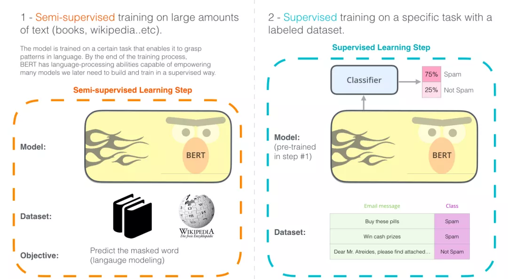
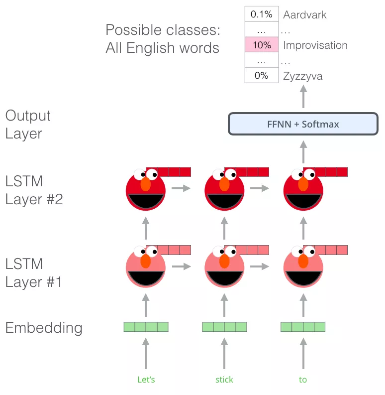
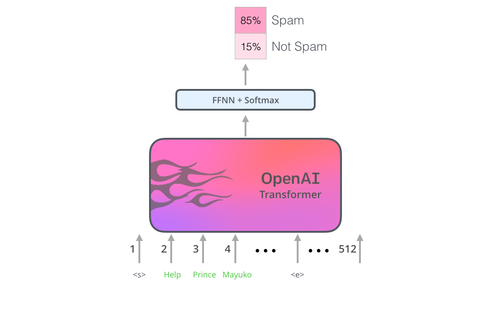

#बर्ट इलस्ट्रेटेड

सामग्री संगठन;
- बर्ट इलस्ट्रेटेड
- बर्ट वाक्य वर्गीकरण
- मॉडल संरचना
- मॉडल इनपुट
-मॉडल आउटपुट
- पूर्व-प्रशिक्षण कार्य: नकाबपोश भाषा मॉडल
- पूर्व-प्रशिक्षण कार्य: आसन्न वाक्य निर्णय
- बीईआरटी का आवेदन
- बर्ट फ़ीचर एक्सट्रैक्शन
- अग्रिम पठन
- सीएनएन के साथ तुलना
- शब्द एम्बेडिंग प्रगति
- वर्ड एंबेडिंग की समीक्षा
-प्रासंगिक मुद्दे
- ट्रांसफार्मर: LSTM से परे
- ओपनएआई ट्रांसफार्मर: भाषा मॉडलिंग के लिए ट्रांसफार्मर डिकोडर को पूर्व-प्रशिक्षित करना
-बीईआरटी: डिकोडर से एनकोडर
-स्वीकृति

अध्याय 2.2 में ट्रांसफार्मर के बारे में सीखने के बाद, आइए एक क्लासिक मॉडल के बारे में जानें जो ट्रांसफार्मर मॉडल संरचना को बढ़ावा देता है: BERT।

2021 के दृष्टिकोण से, 2018 प्राकृतिक भाषा प्रसंस्करण प्रौद्योगिकी में एक महत्वपूर्ण मोड़ था, और एनएलपी ओपन सोर्स समुदाय के योगदान के साथ, गहन शिक्षण तकनीक का उपयोग करके पाठ को संसाधित करने की क्षमता का पूर्व-प्रशिक्षित मॉडल के माध्यम से बहुत उपयोग किया गया था , कई शक्तिशाली मॉडल रहे हैंघटकों में पैक किया गया है, जिससे एनएलपी शुरुआती लोगों को विभिन्न एनएलपी कार्यों पर बहुत अच्छे परिणाम प्राप्त करने का मौका मिलता है, कई एनएलपी पूर्व-प्रशिक्षण मॉडल में से, सबसे क्लासिक बीईआरटी और जीपीटी हैं, इसलिए यह लेख बीईआरटी (द) के बारे में सीखना शुरू कर देगा। एक लेख के उद्धरण लगभग 20,000 हैं)।

BERT को 2018 में प्रस्तावित किया गया था, और BERT मॉडल ने सामने आते ही कई प्राकृतिक भाषा प्रसंस्करण कार्यों के सर्वश्रेष्ठ रिकॉर्ड तोड़ दिए, BERT टीम एममॉडल कोड को सार्वजनिक किया और बड़े पैमाने पर नए पुस्तक डेटासेट के आधार पर एक मॉडल डाउनलोड पूर्व-प्रशिक्षित किया, BERT के मॉडल कोड और मॉडल मापदंडों का खुला स्रोत किसी भी एनएलपी व्यवसायी को इस शक्तिशाली मॉडल घटक के आधार पर अपना स्वयं का एनएलपी सिस्टम बनाने की अनुमति देता है। और किसी भाषा प्रसंस्करण मॉडल को शुरू से प्रशिक्षित करने के लिए आवश्यक समय, ऊर्जा, ज्ञान और संसाधनों की भी बचत होती है।

तो BERT वास्तव में क्या करता है? जैसा कि नीचे दिए गए चित्र में दिखाया गया है, BERT पहले बड़े पैमाने पर बिना पर्यवेक्षित कॉर्पू पर प्री-ट्रेनिंग करता हैs, फिर पूर्व-प्रशिक्षित मापदंडों के आधार पर एक कार्य-संबंधित तंत्रिका नेटवर्क परत जोड़ता है, और कार्य के डेटा पर प्रशिक्षण को ठीक करता है, और अंत में बहुत अच्छे परिणाम प्राप्त करता है। BERT की प्रशिक्षण प्रक्रिया को संक्षेप में वर्णित किया जा सकता है: प्री-ट्रेनिंग + फाइन-ट्यूनिंग, जो हाल के वर्षों में एनएलपी समाधानों के लिए सबसे लोकप्रिय प्रतिमान बन गया है।

 चित्र: BERT प्रशिक्षण और फाइन-ट्यूनिंग

## बर्ट वाक्य वर्गीकरण
BERT को बहुत समझनाखैर, पहले BERT के उपयोग परिदृश्यों को समझना, इनपुट और आउटपुट को स्पष्ट करना और अंत में BERT की आंतरिक मॉडल संरचना और प्रशिक्षण विधियों को विस्तार से सीखना सबसे अच्छा है, इसलिए मॉडल में शामिल BERT-संबंधित अवधारणाओं को पेश करने से पहले, आइए देखें कि BERT को सीधे कैसे लागू करें।
- बिना पर्यवेक्षित कॉर्पस पर पूर्व-प्रशिक्षित BERT मॉडल डाउनलोड करें, जो आम तौर पर 3 फ़ाइलों से मेल खाती है: BERT मॉडल कॉन्फ़िगरेशन फ़ाइल (Transf की परतों की संख्या निर्धारित करने के लिए उपयोग की जाती है)ओमर, छिपी हुई परत का आकार, आदि), बीईआरटी मॉडल पैरामीटर, बीईआरटी शब्दावली (सभी टोकन जिन्हें बीईआरटी संसाधित कर सकता है)।
- विशिष्ट कार्य आवश्यकताओं के लिए, BERT मॉडल में एक कार्य-संबंधित तंत्रिका नेटवर्क जोड़ें, जैसे कि एक सरल क्लासिफायरियर, और फिर विशिष्ट कार्य पर्यवेक्षण डेटा पर प्रशिक्षण को ठीक करें (फाइन-ट्यूनिंग की एक समझ: एक छोटी सीखने की दर , प्रशिक्षण युगों की एक छोटी संख्या, और समग्र मॉडल मापदंडों का थोड़ा समायोजन)

सबसे पहले, आइए देखें कि वाक्य वर्ग के लिए BERT का उपयोग कैसे करेंआकारीकरण.
मान लीजिए कि हमारा वाक्य वर्गीकरण कार्य है: यह निर्धारित करना कि कोई ईमेल "स्पैम" है या "गैर-स्पैम", जैसा कि नीचे दिए गए चित्र में दिखाया गया है, बेशक, स्पैम निर्णय के अलावा, यह अन्य एनएलपी कार्य भी हो सकते हैं, जैसे:

- इनपुट: मूवी या उत्पाद मूल्यांकन: निर्धारित करें कि यह समीक्षा सकारात्मक है या नकारात्मक।
- इनपुट: दो वाक्य। आउटपुट: क्या दोनों वाक्यों का अर्थ समान है।

चित्र: स्पैम वर्गीकरण

जैसा कि में दिखाया गया हैनीचे दिए गए चित्र में, वाक्य वर्गीकरण के लिए BERT का उपयोग करने के लिए, हम BERT मॉडल में एक सरल क्लासिफायर परत जोड़ते हैं क्योंकि तंत्रिका नेटवर्क मापदंडों की यह परत नई जोड़ी गई है, इसके मापदंडों को केवल शुरुआत में यादृच्छिक रूप से आरंभ किया जा सकता है, इसलिए क्लासिफायर को इसकी आवश्यकता होती है। संबंधित पर्यवेक्षण डेटा के साथ प्रशिक्षित किया जाए क्योंकि क्लासिफायरियर BERT मॉडल से जुड़ा है, BERT के मापदंडों को प्रशिक्षण के दौरान भी अपडेट किया जा सकता है।

चित्र:बर्ट वाक्य वर्गीकरण

## मॉडल संरचना

उपरोक्त उदाहरणों के माध्यम से, हम समझते हैं कि BERT का उपयोग कैसे करें। आइए गहराई से देखें कि यह कैसे काम करता है। मूल BERT पेपर में दो मॉडल प्रस्तावित हैं, BERT-बेस और BERT-लार्ज बड़े आकार का, जिसे नीचे दिए गए चित्र में दर्शाए अनुसार स्पष्ट रूप से दर्शाया जा सकता है।

 चित्र: BERT आधार और बड़ा

अध्याय 2.2 में ट्रांसफार्मर की समीक्षा करते हुए, बीईआरटी मॉडल संरचना iमूल रूप से ट्रांसफार्मर का एनकोडर हिस्सा BERT-बेस 12-लेयर एनकोडर से मेल खाता है, और BERT-लार्ज 24-लेयर एनकोडर से मेल खाता है।

 चित्र: BERT-बेस एक 12-लेयर एनकोडर है

## मॉडल इनपुट

आगे, आइए मॉडल इनपुट और आउटपुट पर एक नज़र डालें: BERT मॉडल इनपुट में एक विशेष सुविधा है कि एक वाक्य की शुरुआत में एक [CLS] टोकन को जोड़ा जाता है, जैसा कि नीचे दिए गए चित्र में दिखाया गया है [सीएलएस]बीईआरटी द्वारा प्राप्त टोकन आमतौर पर वर्तमान वाक्य प्रतिनिधित्व के रूप में उपयोग किया जाता है। इस विशेष [सीएलएस] टोकन को छोड़कर, बाकी इनपुट शब्द अध्याय 2.2 में ट्रांसफार्मर के समान हैं, और ये शब्द जारी रहते हैं मल्टी-लेयर एनकोडर में ऊपर की ओर प्रवाहित होने के लिए, और प्रत्येक परत सेल्फ-अटेंशन और फीडफॉरवर्ड न्यूरल नेटवर्क से होकर गुजरेगी।

 चित्र: मॉडल इनपुट

## मॉडल आउटपुट

आख़िरकार BERT इनपुट के सभी टोकन ई हैंबीईआरटी द्वारा एनकोड किया गया, प्रत्येक स्थिति मेंhidden_size (बीईआरटी-बेस में 768) आकार का एक वेक्टर आउटपुट होगा।

चित्र: BERT आउटपुट

ऊपर उल्लिखित वाक्य वर्गीकरण के उदाहरण में, हम इसे क्लासिफायरियर नेटवर्क में पास करने के लिए सीधे पहली स्थिति ([सीएलएस] के अनुरूप) के वेक्टर आउटपुट का उपयोग करते हैं, और फिर वर्गीकरण कार्य करते हैं, जैसा कि नीचे दिए गए चित्र में दिखाया गया है।

 चित्र: बीईआरटी कनेक्टडी क्लासिफायरियर के लिए

## पूर्व-प्रशिक्षण कार्य: नकाबपोश भाषा मॉडल

मॉडल इनपुट, आउटपुट और ट्रांसफार्मर संरचना को जानने के बाद, BERT को बिना पर्यवेक्षण के कैसे प्रशिक्षित किया जाता है? प्रभावी शब्द और वाक्य प्रतिनिधित्व जानकारी कैसे प्राप्त करें? पिछला एनएलपी पूर्व-प्रशिक्षण आमतौर पर भाषा मॉडल पर आधारित होता है, जैसे कि भाषा मॉडल के पहले तीन शब्द दिए गए हैं , मॉडल को चौथे शब्द की भविष्यवाणी करने दें, हालाँकि, BERT को मास्क्ड भाषा मॉडल के आधार पर पूर्व-प्रशिक्षित किया गया है: इनपुट टेक्स्ट अनुक्रम में कुछ (15%) शब्द हैं।बेतरतीब ढंग से छिपा हुआ, और BERT का उपयोग इन छिपे हुए शब्दों की भविष्यवाणी करने के लिए किया जाता है, जैसा कि निम्नलिखित चित्र में दिखाया गया है:
चित्र: बीईआरटी मास्क

इस प्रशिक्षण पद्धति का पता Word2Vec युग से लगाया जा सकता है। विशिष्ट Word2Vec एल्गोरिथ्म इस प्रकार है: शब्द C के दोनों ओर A, B और D, E शब्दों के आधार पर शब्द C की भविष्यवाणी करें।
## पूर्व-प्रशिक्षण कार्य: आसन्न वाक्य निर्णय

नकाबपोश भाषा मॉडल के अलावा, BERT ने पूर्व-प्रशिक्षण के दौरान एक नया कार्य भी पेश किया: यह निर्धारित करना कि क्या दो वाक्य विज्ञापन हैंजैसेंट वाक्य। जैसा कि नीचे दिए गए चित्र में दिखाया गया है: इनपुट वाक्य ए और वाक्य बी है। बीईआरटी एन्कोडिंग के बाद, [सीएलएस] टोकन के वेक्टर प्रतिनिधित्व का उपयोग यह अनुमान लगाने के लिए किया जाता है कि क्या दो वाक्य आसन्न वाक्य हैं।

चित्र: 2 वाक्य कार्य

ध्यान दें: इस लेख की सुविधा के लिए, पिछले विवरण में BERT टोकननाइज़ प्रक्रिया को छोड़ दिया गया है, लेकिन पाठकों को यह ध्यान देने की आवश्यकता है कि BERT वास्तव में वर्डपीस को सबसे छोटी प्रसंस्करण इकाई (usi) के रूप में उपयोग करता हैशब्द विभाजन के लिए वर्डपीस एल्गोरिथ्म को एनजी): शब्द के बजाय टोकन। वर्डपीस शब्द विभाजन के संबंध में, कुछ शब्दों को छोटे भागों में विभाजित किया गया है। इच्छुक पाठक इसे पढ़ और सीख सकते हैं ](https://towardsdatascience.com/a-comprehenive-guide-to-subword-tokenisers-4bbd3 Bad9a7c, बाद के अध्ययनों में यह पता लगाने का काम धीरे-धीरे कमजोर हो गया है कि क्या दो वाक्य आसन्न हैं।बर्टा मॉडल प्रस्तावित किया गया था, इसने अब पूर्व-प्रशिक्षण के लिए इस कार्य का उपयोग नहीं किया।

## बर्ट आवेदन

बीईआरटी पेपर विभिन्न कार्यों में बीईआरटी के अनुप्रयोग को दर्शाता है, जैसा कि नीचे दिए गए चित्र में दिखाया गया है, इसका उपयोग यह निर्धारित करने के लिए किया जा सकता है कि क्या दो वाक्य समान हैं, एक वाक्य की भावना निर्धारित करें, निष्कर्षात्मक प्रश्न उत्तर दें और अनुक्रम लेबलिंग करें।

चित्र: BERT एप्लीकेशन

## बर्ट फ़ीचर एक्सट्रैक्शन

चूँकि BERT मॉडल वेक्टर प्राप्त कर सकता हैइनपुट अनुक्रम के अनुरूप सभी टोकन का प्रतिनिधित्व, फाइन-ट्यूनिंग के लिए कार्य नेटवर्क को जोड़ने के लिए न केवल BERT की अंतिम परत के आउटपुट का उपयोग करना संभव है, बल्कि उदाहरण के लिए इन टोकन के वैक्टर का सीधे उपयोग करना भी संभव है एनकोडर की प्रत्येक परत के टोकन प्रतिनिधित्व को प्रशिक्षण के लिए मौजूदा कार्य-विशिष्ट तंत्रिका नेटवर्क में एक सुविधा और इनपुट के रूप में सीधे निकाला जा सकता है।

चित्र: BERT फ़ीचर एक्सटेंशनकार्रवाई

तो क्या हम अंतिम परत, पिछली परतों या दोनों के वेक्टर प्रतिनिधित्व का उपयोग करते हैं? निम्नलिखित चित्र एक प्रयोगात्मक परिणाम दिखाता है:

चित्र: BERT सुविधा चयन

## अग्रिम पठन

### सीएनएन के साथ तुलना

उन लोगों के लिए जिनके पास कंप्यूटर विज़न पृष्ठभूमि वाले लोगों के लिए योजना है, BERT की एन्कोडिंग प्रक्रिया हमें वर्गीकरण कार्यों के लिए कंप्यूटर विज़न में उपयोग किए जाने वाले कन्वेन्शनल न्यूरल नेटवर्क + पूरी तरह से कनेक्टेड नेटवर्क की याद दिलाती है।, जैसा कि नीचे दिए गए चित्र में दिखाया गया है, बुनियादी प्रशिक्षण विधि और प्रक्रिया समान है।

 चित्र: सीएनएन

### शब्द एम्बेडिंग प्रगति

#### वर्ड एंबेडिंग की समीक्षा

शब्दों को सीधे मशीन लर्निंग मॉडल में इनपुट नहीं किया जा सकता है, लेकिन कुछ प्रकार के संख्यात्मक प्रतिनिधित्व की आवश्यकता होती है ताकि मॉडल गणना में उनका उपयोग कर सके, हम शब्दों को ठीक से प्रस्तुत करने और उनके शब्दार्थ को पकड़ने के लिए एक वेक्टर (संख्याओं का एक सेट) का उपयोग कर सकते हैं शब्द और शब्दों के बीच संबंध (के लिए)उदाहरण के लिए, क्या शब्द समान या विपरीत हैं, या क्या "स्टॉकहोम" और "स्वीडन" जैसे शब्दों की जोड़ी का "काहिरा" और "मिस्र" शब्दों की जोड़ी के समान संबंध है), साथ ही वाक्यात्मक और व्याकरणिक संबंध (के लिए) उदाहरण के लिए, "था" और "है" के बीच का संबंध वही है जो "था" और "है" के बीच का संबंध है)।

लोगों को जल्द ही एहसास हुआ कि मॉडल के साथ शब्द एम्बेडिंग को प्रशिक्षित करने की तुलना में बड़े पैमाने पर टेक्स्ट डेटा पर पूर्व-प्रशिक्षित शब्द एम्बेडिंग का उपयोग करना बेहतर था।मॉल डेटासेट। इसलिए, हम Word2Vec और GloVe द्वारा पूर्व-प्रशिक्षित शब्द सूचियों और उनके शब्द एम्बेडिंग को डाउनलोड कर सकते हैं। नीचे "स्टिक" शब्द के लिए ग्लव एम्बेडिंग का एक उदाहरण दिया गया है (एम्बेडिंग की लंबाई 200 है)।

चित्रा: wroad वेक्टर

"स्टिक" शब्द के लिए ग्लोव एम्बेडिंग: 200 फ़्लोटिंग पॉइंट संख्याओं का एक वेक्टर (2 दशमलव स्थानों तक गोल)।

चूँकि ये वेक्टर लंबे हैं और सभी संख्याएँ हैं, इसलिए मैं इस लेख में वेक्टरों को दर्शाने के लिए निम्नलिखित मूल आकृतियों का उपयोग करता हूँ:
चित्र: वेक्टर

#### संदर्भ समस्या

यदि हम ग्लव के शब्द एम्बेडिंग प्रतिनिधित्व का उपयोग करते हैं, तो संदर्भ की परवाह किए बिना "स्टिक" शब्द को केवल एक वेक्टर के रूप में दर्शाया जाएगा। कुछ शोधकर्ताओं ने बताया है कि "स्टिक" जैसे शब्दों के कई अर्थ हैं। हम शब्द एम्बेडिंग आधारित क्यों नहीं सीख सकते किस संदर्भ में इसका उपयोग किया जाता है? यह शब्द की अर्थ संबंधी जानकारी और संदर्भ की अर्थ संबंधी जानकारी दोनों को ग्रहण करता हैवास्तविक शब्द एम्बेडिंग मॉडल अस्तित्व में आया: ईएलएमओ।

चित्र: ELMo

प्रासंगिक शब्द एम्बेडिंग एक वाक्य के संदर्भ में उनके अर्थ के अनुसार शब्दों को संदर्भ प्रदान कर सकते हैं। प्रत्येक शब्द को अलग-अलग शब्द एम्बेडिंग दिए जाते हैं।

प्रत्येक शब्द के लिए निश्चित शब्द एम्बेडिंग का उपयोग करने के बजाय, ईएलएमओ पूरे वाक्य को देखता है और प्रत्येक शब्द को एक शब्द एम्बेडिंग निर्दिष्ट करने से पहले प्रासंगिक जानकारी शामिल करता है। यह सीआर के लिए एक विशिष्ट कार्य पर प्रशिक्षित द्विदिशात्मक एलएसटीएम का उपयोग करता हैइन शब्द एम्बेडिंग को खाओ।

चित्र: एल्मो एम्बेडिंग

ईएलएमओ प्रासंगिक पूर्व-प्रशिक्षण में एक बड़ा कदम है। ईएलएमओ एलएसटीएम को एक बड़े डेटासेट पर प्रशिक्षित किया जाता है, और फिर हम भाषा कार्यों को संभालने के लिए इसे अन्य प्राकृतिक भाषा प्रसंस्करण मॉडल के हिस्से के रूप में उपयोग कर सकते हैं।

तो एल्मो का रहस्य क्या है?

ईएलएमओ ने शब्दों के अनुक्रम में अगले शब्द की भविष्यवाणी करने के लिए प्रशिक्षण द्वारा भाषा समझने की क्षमता हासिल की, यह कार्य भाषा मॉडलिंग के रूप में जाना जाता हैलागू करने के लिए क्योंकि हमारे पास बहुत सारा टेक्स्ट डेटा है जिससे मॉडल अतिरिक्त लेबल की आवश्यकता के बिना सीख सकता है।

 चित्र: ELMO प्रशिक्षण

ईएलएमओ पूर्व-प्रशिक्षण प्रक्रिया एक विशिष्ट भाषा मॉडल है: इनपुट के रूप में "लेट्स स्टिक टू" लें और अगले सबसे संभावित शब्द की भविष्यवाणी करें, जब हम एक बड़े डेटासेट पर प्रशिक्षण लेते हैं, तो मॉडल भाषा के पैटर्न सीखना शुरू कर देता है। "हैंग" में, मॉडल "आउट" को उच्च संभावना देगा (क्योंकि "हैंग आउट" हैएक वाक्यांश) "कैमरा" आउटपुट के बजाय।

उपरोक्त चित्र में, हम देख सकते हैं कि LSTM के प्रत्येक चरण की छिपी हुई परत स्थिति वेक्टर ELMo हेड के ऊपर प्रदर्शित होती है। इस पूर्व-प्रशिक्षण प्रक्रिया के पूरा होने के बाद, ये छिपी हुई परत स्थिति शब्द एम्बेडिंग प्रक्रिया में काम आती है।

 चित्र: ELMO प्रशिक्षण

ईएलएमओ एलएसटीएम मॉडल के छिपे हुए परत प्रतिनिधित्व वैक्टर (और आरंभिक शब्द एम्बेडिंग) के संयोजन से प्रासंगिक शब्द एम्बेडिंग प्राप्त करता हैएडिंग) एक निश्चित तरीके से (वेक्टर संयोजन के बाद भारित योग)।

चित्र: ELMO प्रशिक्षण

#### ट्रांसफार्मर: LSTM से परे

ट्रांसफॉर्मर कागजात और कोड जारी होने और मशीनी अनुवाद जैसे कार्यों में इसकी उपलब्धियों के साथ, लोगों ने यह सोचना शुरू कर दिया कि यह LSTM का एक विकल्प है: 1. क्योंकि ट्रांसफॉर्मर LSTM से बेहतर हो सकता है और लंबे समय तक बेहतर ढंग से संभाल सकता है -टर्म निर्भरताएँ 2. ट्रांसफार्मर समानांतर संचालन कर सकता हैइनपुट.

2017 में, ट्रांसफॉर्मर के एनकोडर-डिकोडर पर आधारित मशीनी अनुवाद में इसकी शक्ति दिखाई देती है, लेकिन इसका उपयोग पाठ वर्गीकरण के लिए कैसे किया जा सकता है? आप इसका उपयोग किसी भाषा मॉडल को पूर्व-प्रशिक्षित करने और इसे अन्य कार्यों (डाउनस्ट्रीम कार्यों को संदर्भित) पर कैसे ठीक कर सकते हैं पर्यवेक्षित शिक्षण कार्यों के लिए जो पूर्व-प्रशिक्षित मॉडल का उपयोग कर सकते हैं)?

#### ओपनएआई ट्रांसफार्मर: भाषा मॉडलिंग के लिए ट्रांसफार्मर डिकोडर को पूर्व-प्रशिक्षित करें

LSTM को ट्रांसफार्मर संरचना से बदलने के बाद, LSTM भाषा मॉडल पूर्व-प्रशिक्षण के पथ का अनुसरण करते हुए (समकक्ष), भाषा मॉडल पूर्व-प्रशिक्षण के मापदंडों को सीधे डाउनस्ट्रीम कार्य पर्यवेक्षण डेटा के साथ ठीक किया जाता है। शुरुआत में seq2seq अनुवाद के लिए उपयोग किए जाने वाले ट्रांसफार्मर की तुलना में, यह ट्रांसफार्मर संरचना के साथ केवल डिकोडर भाग का उपयोग करने के बराबर है और भाषा मॉडल कार्य डिज़ाइन, बड़े पैमाने पर बिना लेबल वाले डेटा का उपयोग सीधे अगले शब्द की भविष्यवाणी करने के लिए किया जाता है: बस 7,000 पुस्तकों के पाठ को एक-एक करके मॉडल पर फेंकें, और फिर इसे लगातार सीखने देंअगले शब्द को सक्रिय करें.

 चित्र: ओपन एआई मॉडल अगले शब्द की भविष्यवाणी करता है

अब, ओपनएआई ट्रांसफॉर्मर को पूर्व-प्रशिक्षित किया गया है, और इसकी नेटवर्क लेयर लाइब्रेरी को कई बार समायोजित किया गया है और इसे वैक्टरटेक्स्ट द्वारा अच्छी तरह से दर्शाया जा सकता है, हम डाउनस्ट्रीम कार्यों को संभालने के लिए इसका उपयोग करना शुरू करते हैं, आइए सबसे पहले वाक्य वर्गीकरण कार्य (ईमेल को "के रूप में वर्गीकृत करना) को देखें। स्पैम" या "गैर-स्पैम"):

Figure: वाक्य वर्गीकरण के लिए एआई मॉडल खोलें

विभिन्न प्रकार के एनएलपी कार्यों के लिए, ओपनएआई का पेपर इनपुट परिवर्तन विधियों की एक श्रृंखला सूचीबद्ध करता है जो विभिन्न कार्य प्रकारों के इनपुट को संभाल सकता है। निम्नलिखित चित्र पेपर से है और विभिन्न कार्यों को संसाधित करने के लिए मॉडल संरचना और संबंधित इनपुट परिवर्तनों को दिखाता है।

चित्रा: ओपन एआई फाइन-ट्यूनिंग

#### BERT: डिकोडर से एनकोडर

OpenAI ट्रांसफार्मर हमें एक पूर्व-प्रशिक्षित नेटवर्क प्रदान करता हैऑर्क ट्रांसफार्मर पर आधारित है। लेकिन LSTM को ट्रांसफार्मर से बदलने की प्रक्रिया में, कुछ खो गया है, उदाहरण के लिए, पिछला ELMo भाषा मॉडल द्विदिशात्मक है, लेकिन OpenAI ट्रांसफार्मर केवल एक फॉरवर्ड भाषा मॉडल को प्रशिक्षित कर सकता है आगे और पीछे दोनों तरफ दिखता है (तकनीकी शब्दों में - पिछले और निम्नलिखित संदर्भों से जानकारी शामिल करता है)? उत्तर यह BERT है: एक द्विदिश ट्रांसफार्मर-आधारित एनकोडर, एक नकाबपोश भाषा मॉडल पर पूर्व-प्रशिक्षित, औरअंततः कई एनएलपी डाउनस्ट्रीम कार्यों में एसओटीए परिणाम प्राप्त हुए।

## आभार
इस लेख का अनुवाद मुख्य रूप से हार्बिन इंस्टीट्यूट ऑफ टेक्नोलॉजी (मूल लेखक के प्राधिकरण के साथ) के झांग जियान द्वारा किया गया था, और जैकब डेवलिन, मैट गार्डनर, केंटन ली, मार्क न्यूमैन और [मैथ्यू पीटर्स] (https) को धन्यवाद। इस लेख के शुरुआती संस्करणों पर प्रतिक्रिया प्रदान करने के लिए ://twitter.com/mattthemathman)।