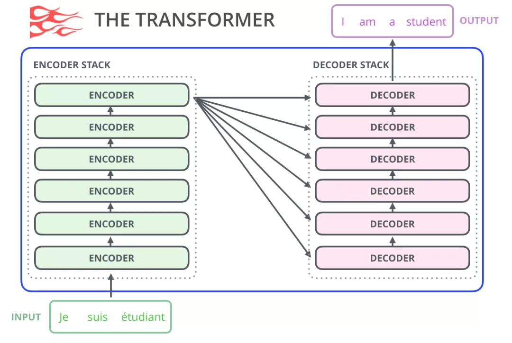
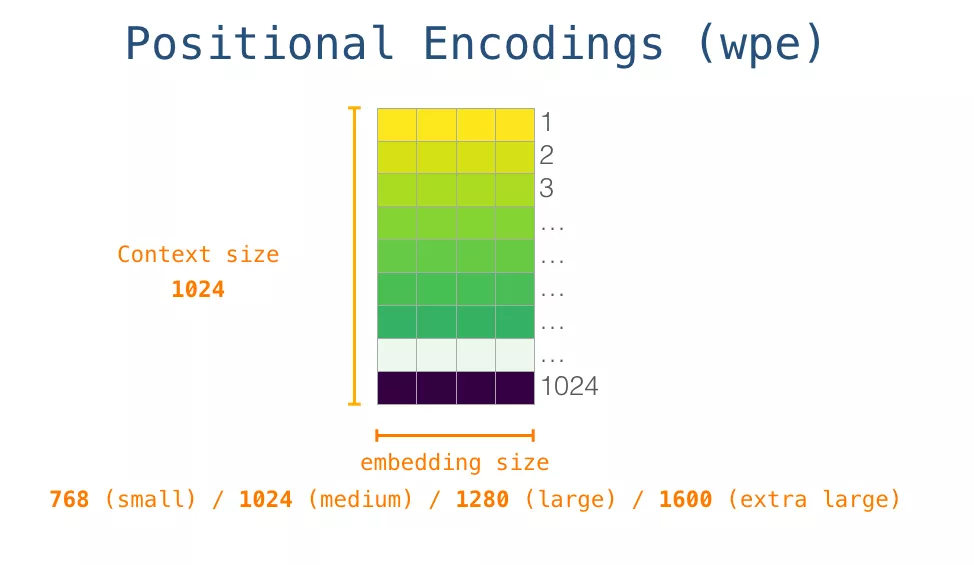
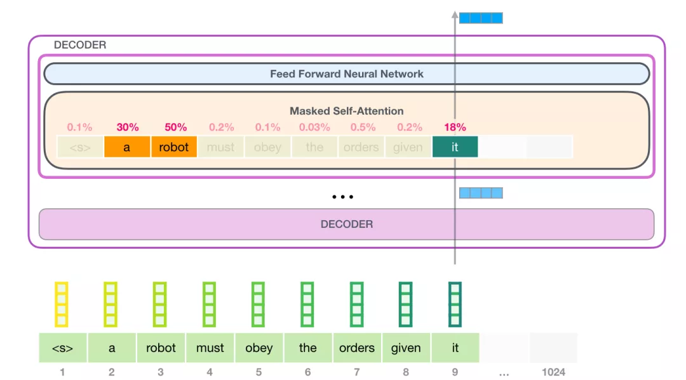
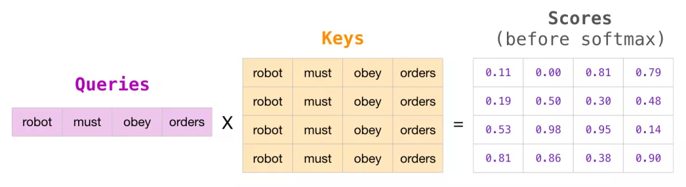

# जीपीटी आरेख
सामग्री संगठन:
- जीपीटी आरेख
-भाषा मॉडल क्या है?
- ऑटो-एनकोडर भाषा मॉडल
- ऑटो-रिग्रेसिव भाषा मॉडल
- ट्रांसफार्मर-आधारित भाषा मॉडल
- ट्रांसफार्मर विकास
- GPT2 सिंहावलोकन
- GPT2 विस्तृत विवरण
-इनपुट एन्कोडिंग
-मल्टी-लेयर डिकोडर
-डिकोडर में आत्म-ध्यान
-आत्म-ध्यान विस्तृत विवरण
- आत्म-ध्यान का दृश्य
- नकाबपोश आत्म-ध्यान आरेख
- GPT2 में आत्म-ध्यान
- GPT2 पूरी तरह से कनेक्टेड न्यूरल नेटवर्क
- भाषा मॉडल अनुप्रयोगव्यावहारिक
-मशीन अनुवाद
-सारांश तैयार करें
- स्थानांतरण सीखना
-संगीत पीढ़ी
-सारांश
-स्वीकृति

BERT के अलावा, एक अन्य पूर्व-प्रशिक्षित मॉडल GPT ने भी NLP क्षेत्र में बहुत सनसनी ला दी है। यह खंड GPT का विस्तृत विवरण भी देता है।

OpenAI द्वारा प्रस्तावित GPT-2 मॉडल (https://openai.com/blog/better-भाषा-मॉडल/) सुसंगत और उच्च-गुणवत्ता वाले लेख लिख सकता है, जो कि पिछले भाषा मॉडल की तुलना में काफी बेहतर है ट्रांसफार्मर की तुलनापिछले एनएलपी भाषा मॉडल के साथ, यह ट्रांसफार्मर बड़े मॉडल पर आधारित है और एक विशाल डेटा सेट पर पूर्व-प्रशिक्षित है। इस अध्याय में, हम जीपीटी-2 की संरचना का विश्लेषण करेंगे, जीपीटी-2 के अनुप्रयोग के बारे में और गहराई से सीखेंगे इसमें शामिल आत्म-ध्यान संरचना का विश्लेषण करें। इस लेख को अध्याय 2.2 में ट्रांसफार्मर के चित्रण और अध्याय 2.3 में बीईआरटी के चित्रण के पूरक के रूप में माना जा सकता है।

यह लेख [GPT2](http://jalammar.github.io/ Illustrator-gpt2) से अनुवादित है।

## लान्गुएज मॉडल और जीपीटी-2

### भाषा मॉडल क्या है
यह आलेख मुख्य रूप से दो भाषा मॉडलों का वर्णन और तुलना करता है:
- ऑटो-एनकोडर भाषा मॉडल
- ऑटो-रिग्रेसिव भाषा मॉडल

सबसे पहले ऑटो-एनकोडर भाषा मॉडल को देखें।
ऑटो-एनकोडर भाषा मॉडल का विशिष्ट प्रतिनिधि अध्याय 2.3 में वर्णित बीईआरटी है। जैसा कि नीचे दिए गए चित्र में दिखाया गया है, ऑटोएनकोडर भाषा मॉडल कुछ शब्दों के इनपुट को यादृच्छिक रूप से मास्क करता है, और फिर पूर्व-प्रशिक्षण लक्ष्य मास्क किए गए शब्दों की भविष्यवाणी करना है। जो नहीं हो सकतायह न केवल पिछली जानकारी को शामिल करता है, बल्कि स्वाभाविक रूप से निम्नलिखित जानकारी को भी एकीकृत करता है।चित्र: BERT मास्क

ऑटोएन्कोडर भाषा मॉडल के फायदे और नुकसान:
- लाभ: स्वाभाविक रूप से द्विदिश भाषा मॉडल में एकीकृत, और पूर्वानुमानित शब्द का संदर्भ एक ही समय में देखा जा सकता है
- नुकसान: प्रशिक्षण और भविष्यवाणी के बीच असंगतता। [मास्क] टैग को प्रशिक्षण के दौरान इनपुट में पेश किया जाता है, लेकिन यह [मास्क] टैग अक्सर भविष्यवाणी चरण के दौरान मौजूद नहीं होता है, जिसके परिणामस्वरूप पूर्व-प्रशिक्षण चरण और फाइन-ट्यूनिंग चरण के बीच असंगतता होती है।

आगे, आइए देखें कि आमतौर पर इस्तेमाल किया जाने वाला ऑटो-रिग्रेसिव भाषा मॉडल क्या है: भाषा मॉडल इनपुट वाक्य के पाठ के एक भाग के आधार पर अगले शब्द की भविष्यवाणी करता है। दैनिक जीवन में सबसे आम भाषा मॉडल इनपुट विधि संकेत है , जो आपके इनपुट के आधार पर अगले शब्द का संकेत दे सकता है।


चित्र: इनपुट प्रॉम्प्ट

ऑटो-रिग्रेसिव भाषा मॉडल के फायदे और नुकसान:
- लाभ: जेनेरिक एनएलपी कार्यों के लिए, जैसे कि पाठ सारांश, मशीन अनुवाद, आदि, सामग्री बाएं से दाएं उत्पन्न होती है, जो स्वाभाविक रूप से ऑटो-रिग्रेसिव भाषा मॉडल के अनुरूप है।
- नुकसान: चूंकि यह आमतौर पर बाएं से दाएं होता है (बेशक यह दाएं से बाएं भी हो सकता है), यह केवल पिछले या निम्नलिखित संदर्भ की जानकारी का उपयोग कर सकता है, लेकिन दोनों का नहीं।

जीपीटी-2 एक ऑटोरेग्रेसिव भाषा मॉडल है। मोबाइल ऐप्स पर इनपुट संकेतों की तुलना में, GPT-2 अधिक जटिल और अधिक शक्तिशाली है क्योंकि OpenAI शोधकर्ताओं ने इंटरनेट से 40GB वेबटेक्स्ट डेटासेट को क्रॉल किया और इसके साथ GPT-2 मॉडल को प्रशिक्षित किया GPT-2 मॉडल सीधे [AllenAI GPT-2 Explorer वेबसाइट](https://gpt2.apps.allenai.org/?text=Joel) पर।
 चित्र: ऑटोरेग्रेसिव GPT-2

 चित्र: विभिन्न जीपीटी मॉडल
### ट्रांसफार्मर-आधारित भाषा मॉडल

जैसा कि हमने ट्रांसफार्मर आरेख में सीखा, मूल ट्रांसफार्मर मॉडल एनकोडर भाग और डिकोडर भाग से बना है, जो दोनों ट्रांसफार्मर की कई परतों से बने होते हैं, मूल ट्रांसफार्मर की seq2seq संरचना मशीन अनुवाद के लिए बहुत उपयुक्त है, क्योंकि मशीन अनुवाद है किसी पाठ अनुक्रम को किसी अन्य भाषा के पाठ अनुक्रम में अनुवाद करना।

 चित्रई: मूल ट्रांसफार्मर संरचना

हालाँकि, यदि आप भाषा मॉडल कार्यों को हल करने के लिए ट्रांसफार्मर का उपयोग करना चाहते हैं, तो आपको पूर्ण एनकोडर और डिकोडर भागों की आवश्यकता नहीं है, इसलिए, मूल ट्रांसफार्मर के बाद कई शोध कार्यों में, लोगों ने केवल ट्रांसफार्मर एनकोडर या डिकोडर का उपयोग करने और उन्हें स्टैक करने का प्रयास किया। जितना संभव हो सके, और फिर पूर्व-प्रशिक्षण के लिए बड़ी मात्रा में प्रशिक्षण कोष और बड़ी मात्रा में कंप्यूटिंग संसाधनों (इन मॉडलों को प्रशिक्षित करने के लिए सैकड़ों हजारों डॉलर का उपयोग किया जाता है) का उपयोग करेंmple, BERT केवल मास्क्ड भाषा मॉडल (स्वयं-एन्कोडिंग) प्रशिक्षण के लिए एनकोडर भाग का उपयोग करता है, और GPT-2 केवल ऑटोरेग्रेसिव भाषा मॉडल प्रशिक्षण के लिए डिकोडर भाग का उपयोग करता है।
 चित्र: GPT, BERT, ट्रांसफार्मर-XL

 चित्र: अधिक से अधिक परतों वाला GPT2 मॉडल

### ट्रांसफार्मर का विकास
ट्रांसफार्मर का एनकोडर BERT में विकसित हुआ, और डिकोडर GPT2 में विकसित हुआ।

सबसे पहले, आइए एनकोडर भाग को देखें।


चित्र: एनकोडर

मूल ट्रांसफार्मर पेपर में एनकोडर भाग एक विशिष्ट लंबाई (जैसे 512 टोकन) के इनपुट को स्वीकार करता है। यदि कोई इनपुट अनुक्रम इस सीमा से छोटा है, तो हम शेष अनुक्रम को भरने के लिए पैड का उपयोग कर सकते हैं। जैसा कि अध्याय 2.3, बीईआरटी में बताया गया है सीधे एनकोडर भाग का उपयोग करता है।

आइए डिकोडर भाग की समीक्षा करें

एनकोडर की तुलना में, डिकोडर भाग में एक अतिरिक्त एनकोडर-डिकोडर आत्म-ध्यान परत होती है, जो डिकोडर को विशिष्ट जानकारी पर ध्यान देने की अनुमति देती है।एनकोडर द्वारा एन्कोड किया गया रेमेशन।

 चित्र: डिकोडर

डिकोडर में मास्क्ड सेल्फ-अटेंशन भविष्य के टोकन को मास्क कर देगा, विशेष रूप से, यह बीईआरटी की तरह बेतरतीब ढंग से इनपुट शब्द को मास्क में नहीं बदलता है, बल्कि सेल्फ-अटेंशन की गणना को बदलकर भविष्य की शब्द जानकारी को मास्क करता है।

उदाहरण के लिए, यदि हम स्थिति 4 के ध्यान की गणना करना चाहते हैं, तो हमें केवल स्थिति 4 से पहले और उस पर टोकन देखने की अनुमति है।

 चित्र: डिकोडर केवल पिछले और वर्तमान टोकन देख सकता है

चूंकि GPT2 डिकोडर पर बनाया गया है, BERT और GPT के बीच एक महत्वपूर्ण अंतर आता है: चूंकि BERT एनकोडर पर बनाया गया है, BERT सेल्फ अटेंशन लेयर का उपयोग करता है, जबकि GPT2 डिकोडर पर बनाया गया है, और GPT-2 मास्क्ड सेल्फ अटेंशन ए का उपयोग करता है सामान्य सेल्फ अटेंशन किसी स्थिति को उसके दोनों तरफ की जानकारी पर ध्यान देने की अनुमति देता है, जबकि नकाबपोश सेल्फ अटेंशन केवल मॉडल को जानकारी देखने की अनुमति देता हैबायीं ओर तर्क:

चित्र: आत्म ध्यान बनाम मुखौटा आत्म ध्यान

तो GPT2 में डिकोडर कैसा दिखता है? सबसे पहले, आइए लेख के बारे में बात करें [लंबे अनुक्रमों को सारांशित करके विकिपीडिया उत्पन्न करना](https://arxiv.org/pdf/1801.10198.pdf), जिसने सबसे पहले भाषा मॉडल प्रशिक्षण का प्रस्ताव रखा था। ट्रांसफार्मर-डिकोडर भाग को हटाने के कारण एनकोडर भाग को हटा दिया गया है, इसलिए एनकोडर-डिकोडर पर स्वयं ध्यान देने की अब आवश्यकता नहीं है, और नया ट्रांसफार्मर-डेकोडेर मॉडल नीचे दिए गए चित्र में दिखाया गया है:

चित्र: ट्रांसफार्मर-डिकोडर

OpenAI का GPT2 फिर ऊपर दिखाए गए ट्रांसफार्मर-डिकोडर संरचना का भी उपयोग करता है।

### GPT2 अवलोकन

आइए अब एक प्रशिक्षित GPT-2 को अलग करें और देखें कि यह कैसे काम करता है।

चित्र: जीपीटी2 को अलग करना

GPT-2 1024 टोकन संसाधित कर सकता है। प्रत्येक टोकन अपने पथ के साथ सभी डिकोडर परतों से होकर गुजरता है। प्रशिक्षित GPT-2 m को आज़माने का सबसे आसान तरीकाओडेल का उद्देश्य इसे स्वयं पाठ उत्पन्न करने देना है (इसे तकनीकी रूप से कहा जाता है: बिना शर्त पाठ उत्पन्न करना)। वैकल्पिक रूप से, हम इसे एक निश्चित विषय के बारे में बात करने देने का संकेत दे सकते हैं (अर्थात इंटरैक्टिव सशर्त नमूने उत्पन्न करना)।

लक्ष्यहीनता की स्थिति में, हम इसे शब्दों का निर्माण शुरू करने के लिए बस एक विशेष \<s> प्रारंभिक टोकन दे सकते हैं: जैसा कि नीचे दिखाया गया है:

 चित्र: GPT2 प्रारंभिक टोकन

चूँकि मॉडल में केवल एक इनपुट है, वहाँ चालू हैकेवल एक सक्रिय पथ। \<s> टोकन को बारी-बारी से सभी डिकोडर परतों में संसाधित किया जाता है, और इस पथ के साथ एक वेक्टर उत्पन्न होता है। नीचे दिए गए उदाहरण में इस वेक्टर और मॉडल की शब्दावली के आधार पर सभी संभावित शब्दों के लिए एक स्कोर की गणना की जाती है , हमने सबसे अधिक संभावना वाले को चुना, इसके बाद, हम अपने इनपुट अनुक्रम में पहले चरण का आउटपुट जोड़ते हैं और मॉडल को अगली भविष्यवाणी करने के लिए कहते हैं।

डायनामिक ग्राफ़: GPT2 को अलग करना

ध्यान दें कि एसइस गणना में दूसरा पथ एकमात्र सक्रिय पथ है। GPT-2 की प्रत्येक परत पहले टोकन के बारे में एन्कोड की गई जानकारी को बरकरार रखती है और दूसरे टोकन को संसाधित करते समय सीधे इसका उपयोग करती है: GPT-2 दूसरे टोकन के आधार पर पहले टोकन की पुनर्गणना नहीं करता है। .

उपरोक्त चरणों को बार-बार दोहराने से अधिक शब्द उत्पन्न हो सकते हैं।

### GPT2 विस्तृत स्पष्टीकरण
#### इनपुट एन्कोडिंग

आइए अब इनपुट से शुरू करते हुए जीपीटी के बारे में और जानें। अन्य एनएलपी मॉडलों की तरह, जिन पर हमने पहले चर्चा की थी, जीपीटी-2 देखता हैएम्बेडिंग मैट्रिक्स में इनपुट शब्द का संगत एम्बेडिंग वेक्टर। जैसा कि नीचे दिए गए चित्र में दिखाया गया है: प्रत्येक पंक्ति एक शब्दांकन का एम्बेडिंग है: यह एक संख्यात्मक वेक्टर है जो एक शब्द का प्रतिनिधित्व करता है और कुछ अर्थ पकड़ता है। इस वेक्टर का आकार अलग-अलग होता है GPT-2 मॉडल। सबसे छोटा मॉडल 768 के एम्बेडिंग आकार का उपयोग करता है।

चित्र: टोकन एम्बेडिंग

तो शुरुआत में, हम एम्बेडिंग मैट्रिक्स में पहले टोकन \<s> की एम्बेडिंग को देखेंगे।इस एम्बेडिंग को मॉडल के पहले मॉड्यूल में पास करने से पहले, हमें पोजिशनल एन्कोडिंग (ट्रांसफॉर्मर की विस्तृत व्याख्या के लिए अध्याय 2.2 देखें) को भी शामिल करने की आवश्यकता है, जो अनुक्रम में शब्दों के क्रम को इंगित कर सकता है।

चित्र: स्थिति एन्कोडिंग

चित्र: टोकन+स्थिति

तो इनपुट संसाधित होता है: शब्द वेक्टर + स्थिति एन्कोडिंग प्राप्त करें

#### मल्टी-लेयर डिकोडर

डिकोडर कैन की पहली परतअब \<s> टोकन के अनुरूप वेक्टर को प्रोसेस करें: पहले सेल्फ अटेंशन लेयर के माध्यम से, फिर पूरी तरह से कनेक्टेड न्यूरल नेटवर्क के माध्यम से। ऑर्मर का पहला डिकोडर \<s> टोकन को प्रोसेस करता है और फिर भी एक वेक्टर प्राप्त करता है, जिसे भेजा जाता है अगले डिकोडर पर फिर से।

चित्रा: मल्टी-लेयर एन्कोडिंग

#### डिकोडर में आत्म-ध्यान

डिकोडर में मास्क्ड सेल्फ-अटेंशन शामिल है क्योंकि मास्क ऑपरेशन स्वतंत्र रूप से किया जा सकता है, आइए इसकी समीक्षा करेंई आत्म-ध्यान संचालन स्वतंत्र रूप से संदर्भ पर बहुत अधिक निर्भर है।

```
रोबोटिक्स का दूसरा नियम: एक रोबोट को मनुष्यों द्वारा दिए गए आदेशों का पालन करना चाहिए, सिवाय इसके कि जब वे आदेश पहले कानून के साथ टकराव में हों।
```

उदाहरण वाक्य में कई सर्वनाम हैं। इन शब्दों को उस संदर्भ पर विचार किए बिना समझा या संसाधित नहीं किया जा सकता है, जब कोई मॉडल इस वाक्य को संसाधित करता है, तो उसे यह जानने में सक्षम होना चाहिए:

- यह रोबोट को संदर्भित करता है
-आदेश आरइस कानून के पिछले भाग को संदर्भित करता है, अर्थात, मनुष्यों द्वारा इसे दिया गया आदेश
- पहला नियम रोबोटिक्स के पहले नियम को संदर्भित करता है

आत्म-ध्यान क्या करता है: यह वाक्य खंड में प्रत्येक शब्द की प्रासंगिकता को स्कोर करता है और प्रासंगिकता के आधार पर इन शब्दों के प्रतिनिधित्व वैक्टर को जोड़ता है, ताकि मॉडल शब्द की जानकारी को अन्य संबंधित शब्द वैक्टर के साथ जोड़ सके। उदाहरण के लिए , जैसा कि नीचे दिए गए चित्र में दिखाया गया है, शीर्ष-स्तरीय डिकोडर में सेल्फ अटेंशन परत ध्यान देती है`इट` शब्द को संसाधित करते समय `रोबोट` के लिए, इसलिए, बाद के तंत्रिका नेटवर्क पर आत्म-ध्यान द्वारा पारित `इट` वेक्टर तीन शब्दों और उनके संबंधित स्कोर के अनुरूप वैक्टर का भारित योग है।

 चित्र: यह ध्यान है

**आत्म-ध्यान प्रक्रिया**

वाक्य में प्रत्येक टोकन के साथ आत्म-ध्यान संसाधित किया जाता है, और मुख्य घटकों में 3 वैक्टर शामिल होते हैं।

- क्वेरी: क्वेरी वेक्टर टी के वेक्टर प्रतिनिधित्व द्वारा प्राप्त किया जाता हैउसका वर्तमान शब्द और अन्य सभी शब्दों को स्कोर करने के लिए उपयोग किया जाता है (इन शब्दों के मुख्य वैक्टर का उपयोग करके)।

- कुंजी: कुंजी वेक्टर वाक्य में सभी शब्दों के वेक्टर प्रतिनिधित्व द्वारा प्राप्त किया जाता है और इसे एक पहचान वेक्टर के रूप में माना जा सकता है।

- मूल्य: मूल्य वेक्टर वास्तव में आत्म-ध्यान में कुंजी वेक्टर के समान है।

चित्रा: क्वेरी

एक मोटा सादृश्य इसे फ़ाइल कैबिनेट में खोज के रूप में सोचना है, क्वेरी वेक्टर एक चिपचिपा नोट है जो बताता है कि आप क्या खोज रहे हैंचिंग फॉर। क्वेरी वेक्टर शोध का विषय है, और कुंजी वेक्टर कैबिनेट में फ़ोल्डर के लेबल की तरह है। जब आप नोट को लेबल से मिलाते हैं, तो हम मेल खाने वाले फ़ोल्डरों की सामग्री और इन सामग्रियों को निकाल लेते हैं मान सदिश हैं, लेकिन आप केवल एक मान सदिश की तलाश में नहीं हैं, आप मान सदिशों की एक श्रृंखला की तलाश कर रहे हैं।

प्रत्येक फ़ोल्डर के कुंजी वेक्टर के साथ क्वेरी वेक्टर को गुणा करने पर प्रत्येक फ़ोल्डर के लिए एक स्कोर उत्पन्न होगा (तकनीकी रूप से: डॉट उत्पाद के बाद सॉफ्टमैक्स)।चित्रा: स्कोर

हम प्रत्येक मान वेक्टर को संबंधित स्कोर से गुणा करते हैं और आत्म-ध्यान का आउटपुट प्राप्त करने के लिए इसका योग करते हैं।

 चित्र: आत्म ध्यान आउटपुट

इन भारित मान वैक्टर के परिणामस्वरूप एक वेक्टर बनेगा, जैसे कि ऊपर वाला, जो रोबोट शब्द पर 50% ध्यान देता है, शब्द ए पर 30% ध्यान देता है, और शब्द पर 19% ध्यान देता है।

तथाकथित नकाबपोश आत्म-ध्यान का तात्पर्य है: ध्यान मोड़नामास्क स्थिति के अनुरूप अयस्क को बहुत कम संख्या में शब्दों या 0 में बाँट लें, ताकि आत्म-ध्यान (भारित योग) होने पर अन्य शब्दों पर विचार न किया जाए।

**मॉडल आउटपुट**

जब मॉडल के शीर्ष पर डिकोडर परत एक आउटपुट वेक्टर उत्पन्न करती है (यह वेक्टर स्व-ध्यान परत और तंत्रिका नेटवर्क परत द्वारा प्राप्त किया जाता है), तो मॉडल गणना करने के लिए इस वेक्टर को एक विशाल एम्बेडिंग मैट्रिक्स (वोकैब आकार x एम्बेडिंग आकार) से गुणा करता है इस वेक्टर और सभी शब्द एम्बेडिंग के बीच सहसंबंध स्कोरवेक्टर

चित्र: शीर्ष मॉड्यूल आउटपुट उत्पन्न करता है

याद रखें कि एम्बेडिंग मैट्रिक्स में प्रत्येक पंक्ति मॉडल शब्दावली में एक शब्द से मेल खाती है। इस गुणन के परिणाम को मॉडल शब्दावली में प्रत्येक शब्द के स्कोर के रूप में व्याख्या किया जाता है, जिसे सॉफ्टमैक्स के बाद संभावना में बदल दिया जाता है।

चित्रा: टोकन प्रायिकता

हम उच्चतम स्कोर (top_k=1) वाला टोकन चुन सकते हैं, या हम कर सकते हैंएक ही समय में अन्य शब्दों पर विचार करें (शीर्ष k)। यह मानते हुए कि k टोकन प्रत्येक स्थिति में आउटपुट हैं और n टोकन कुल आउटपुट हैं, n शब्दों की संयुक्त संभावना के आधार पर चयनित आउटपुट अनुक्रम बेहतर होगा।

 चित्र: शीर्ष 1 आउटपुट का चयन करें

इस तरह, मॉडल एक पुनरावृत्ति को पूरा करता है और एक शब्द को आउटपुट करता है जब तक कि सभी शब्द उत्पन्न नहीं हो जाते या वाक्य के अंत को इंगित करने वाला टोकन आउटपुट नहीं हो जाताटी।

## आत्म-ध्यान की विस्तृत व्याख्या

अब हमें इस बात की बुनियादी समझ है कि GPT-2 कैसे काम करता है। यदि आप जानना चाहते हैं कि सेल्फ अटेंशन लेयर के अंदर क्या हो रहा है, तो लेख के नीचे का अतिरिक्त अनुभाग आपके लिए है। सेल्फ अटेंशन को और अधिक समझाने के लिए मैंने यह अतिरिक्त अनुभाग जोड़ा है विज़ुअलाइज़ेशन.

यहां लेख में कुछ अतिसरलीकरण दिए गए हैं:

- मैं लेख में टोकन और शब्दों का परस्पर उपयोग करता हूं लेकिन वास्तव में, GPT-2 शब्दावली में टोकन बनाने के लिए बाइट पेयर एन्कोडिंग का उपयोग करता है।इसका मतलब यह है कि टोकन आमतौर पर शब्दों के भाग होते हैं।

- जो उदाहरण हम दिखाते हैं वह अनुमान मोड में चल रहा है, इसलिए यह एक समय में केवल एक टोकन को संसाधित करता है, मॉडल को लंबे पाठ अनुक्रमों पर प्रशिक्षित किया जाएगा और एक ही समय में, मॉडल को संसाधित किया जाएगा अनुमान के दौरान उपयोग किए गए 1 के बैच आकार के बजाय एक बड़े बैच आकार को संसाधित करेगा।
- सिद्धांत को समझाना आसान बनाने के लिए, मैं आमतौर पर इस लेख में चित्रों में पंक्ति वैक्टर का उपयोग करता हूंकुछ वेक्टर वास्तव में कॉलम वेक्टर हैं। आपको कोड कार्यान्वयन में इन वैक्टर के रूप पर ध्यान देने की आवश्यकता है।
- ट्रांसफॉर्मर बहुत अधिक परत सामान्यीकरण का उपयोग करते हैं, जो महत्वपूर्ण है। हमने ट्रांसफॉर्मर आरेख में इस पर थोड़ा ध्यान दिया है, लेकिन इस पोस्ट में, हम सेल्फ-अटेंशन पर अधिक ध्यान केंद्रित करेंगे।
- कभी-कभी मुझे वेक्टर को दर्शाने के लिए अधिक बक्सों की आवश्यकता होती है, जैसे:

चित्रा: इनपुट और आउटपुट आयाम

### आत्म-ध्यान की कल्पना करना

ईएइस पोस्ट में पहले, हमने यह दिखाने के लिए इस छवि का उपयोग किया था कि सेल्फ-अटेंशन `इट` शब्द पर कैसे काम करता है।

चित्र: यह ध्यान है

इस अनुभाग में, हम यह कैसे करें इसके बारे में अधिक विस्तार से जानेंगे। ध्यान दें कि हम इस बारे में बहुत स्पष्ट होंगे कि प्रत्येक शब्द के साथ क्या हो रहा है, इसलिए हम बहुत सारे व्यक्तिगत वैक्टर दिखाते हैं, लेकिन वास्तविक कोड कार्यान्वयन है विशाल मैट्रिक्स गुणन के साथ किया गया।

आइए एक साधारण ट्रांसफार्मर पर नजर डालें जो एक समय में केवल 4 टोकन संसाधित कर सकता हैइ।

आत्म-ध्यान यह 3 चरणों में किया जाता है:

- प्रत्येक पथ के लिए क्वेरी, कुंजी, मान मैट्रिक्स बनाएं।
- प्रत्येक इनपुट टोकन के लिए, अन्य सभी कुंजी वैक्टर को स्कोर करने के लिए उसके क्वेरी वेक्टर का उपयोग करें।
- वैल्यू वैक्टर को उनके संबंधित अंकों से गुणा करें और उनका योग करें।

चित्र: 3 चरण

(1) क्वेरी, कुंजी और वैल्यू वैक्टर बनाएं

आइए पहले पथ पर ध्यान केंद्रित करें। हम इसके क्वेरी वेक्टर का उपयोग करेंगे और सभी प्रमुख वैक्टरों की तुलना करेंगे। यह प्रत्येक कुंजी वेक्टर के लिए एक स्कोर तैयार करेगाध्यान प्रत्येक टोकन के पथ के लिए 3 वैक्टर की गणना करने पर है।

चित्र: चरण 1

(2) अंकों की गणना करें

अब जबकि हमारे पास ये वेक्टर हैं, हम केवल चरण 2 के लिए क्वेरी और वैल्यू वेक्टर का उपयोग करते हैं। चूंकि हम पहले टोकन के वेक्टर में रुचि रखते हैं, इसलिए हम पहले टोकन के क्वेरी वेक्टर को अन्य सभी टोकन के मुख्य वैक्टर के साथ गुणा करते हैं। चार टोकन के स्कोर.

चित्र: चरण 2

(3) योग की गणना करना

अब हम गुणा कर सकते हैंवैल्यू वेक्टर के साथ इन स्कोरों को एक साथ जोड़ने के बाद, उच्च स्कोर वाला एक वैल्यू वेक्टर परिणामी वेक्टर का एक बड़ा हिस्सा ले लेगा।

चित्र: चरण 3

स्कोर जितना कम होगा, वैल्यू वेक्टर उतना ही अधिक पारदर्शी होगा। इसका मतलब यह है कि एक छोटी संख्या से गुणा करने पर वैल्यू वेक्टर पतला हो जाता है।

यदि हम प्रत्येक पथ के लिए समान ऑपरेशन करते हैं, तो हमें एक वेक्टर मिलेगा जो प्रत्येक टोकन टी के लिए उपयुक्त प्रासंगिक जानकारी के साथ प्रत्येक टोकन का प्रतिनिधित्व करता हैइन वैक्टरों को ट्रांसफॉर्मर मॉड्यूल (फीडफॉरवर्ड न्यूरल नेटवर्क) के अगले सबलेयर में फीड किया जाता है।

चित्र: सारांश

### नकाबपोश आत्म-ध्यान का आरेख

अब जब हमने ट्रांसफार्मर के सेल्फ अटेंशन चरण को समझ लिया है, तो आइए हम मास्क्ड सेल्फ अटेंशन की ओर बढ़ें, दूसरे चरण को छोड़कर मास्क्ड सेल्फ अटेंशन सेल्फ अटेंशन के समान है।

अब मान लीजिए कि मॉडल में इनपुट के रूप में 2 टोकन हैं और हम देख रहे हैं (इस मामले में, अंतिम 2 टोकन छिपे हुए हैं)इसलिए मॉडल स्कोरिंग चरण में हस्तक्षेप करता है, यह हमेशा भविष्य के टोकन स्कोर को 0 पर सेट करता है, इसलिए मॉडल भविष्य के शब्दों को नहीं देख सकता है, जैसा कि नीचे दिए गए चित्र में दिखाया गया है:

 चित्र: नकाबपोश आत्म-ध्यान

इस मास्किंग को अक्सर एक मैट्रिक्स के साथ कार्यान्वित किया जाता है, जिसे अटेंशन मास्क मैट्रिक्स कहा जाता है। आइए एक उदाहरण के रूप में 4 शब्दों का अनुक्रम लें (उदाहरण के लिए, एक भाषा मॉडलिंग परिदृश्य में, इस अनुक्रम को 4 चरणों में संसाधित किया जाएगा: एक शब्द)। प्रति चरण (गधायह मानते हुए कि प्रत्येक शब्द अब एक टोकन है)। इसके अलावा, चूंकि मॉडल बैच आकार के रूप में काम करता है, हम मान सकते हैं कि इस सरल मॉडल का बैच आकार 4 है, और यह एक बैच के रूप में 4 अनुक्रम निर्माण कार्यों को संसाधित करेगा। जैसा कि नीचे दिए गए चित्र में दिखाया गया है, बाईं ओर इनपुट और दाईं ओर लेबल है।

चित्र: बैच इनपुट और आउटपुट

मैट्रिक्स रूप में, हम स्कोर की गणना करने के लिए क्वेरी मैट्रिक्स और कुंजी मैट्रिक्स का उपयोग करते हैं। इसे निम्नानुसार देखा जा सकता हैशब्दों को सीधे मैट्रिक्स-संचालित नहीं किया जा सकता है, इसलिए नीचे दिए गए चित्र में शब्दों को एक वेक्टर में मैप करने की आवश्यकता है।

 चित्र: क्वेरी और कुंजियों का सहसंबंध मैट्रिक्स

गुणन के बाद, हम त्रिकोणीय ध्यान मास्क जोड़ते हैं यह उन कोशिकाओं को सेट करता है जिन्हें हम नकारात्मक अनंत या बहुत बड़ी नकारात्मक संख्या (जैसे जीपीटी -2 में नकारात्मक अरब) पर छिपाना चाहते हैं:

 चित्र: अटेटनियन मास्क जोड़ें

फिर प्रत्येक पंक्ति पर सॉफ्टमैक्स लागू करें, जो wमैं वास्तविक स्कोर प्रस्तुत करूंगा, जिसका उपयोग हम आत्म-ध्यान के लिए करेंगे।

 चित्र: सॉफ्टमैक्स

इस अंक तालिका का अर्थ इस प्रकार है:

- जब मॉडल डेटासेट (पंक्ति 1) में पहला डेटा संसाधित करता है, जिसमें केवल एक शब्द (रोबोट) होता है, तो यह अपना 100% ध्यान इस शब्द पर केंद्रित करता है।
- जब मॉडल डेटासेट (पंक्ति 2) में दूसरे डेटा को संसाधित करता है, जिसमें शब्द (रोबोट अवश्य) शामिल होता है, जब मॉडल वर्डमस्ट को संसाधित करता है, तो यह अपना 48% ध्यान केंद्रित करता हैरोबोट पर और 52% अवश्य।
- और इसी तरह, निम्नलिखित शब्दों को संसाधित करना जारी रखें।

अब तक हम नकाबपोश आत्म-ध्यान को समझ चुके हैं।

### GPT2 में आत्म-ध्यान

आइए GPT-2 के छिपे हुए आत्म-ध्यान पर करीब से नज़र डालें।

*जब मॉडल भविष्यवाणी करता है: एक समय में एक टोकन*

लेकिन जब हम भविष्यवाणी करने के लिए मॉडल का उपयोग करते हैं, तो मॉडल प्रत्येक पुनरावृत्ति के बाद केवल एक नया शब्द जोड़ता है, इसलिए संसाधित किए गए टोकन के लिए, पिछले पथ के साथ सेल्फ अटेंशन की पुनर्गणना करना अक्षम है, तो GPT-2 कैसे प्राप्त करता हैकुशल प्रसंस्करण?

पहले पहले टोकन a को प्रोसेस करें, जैसा कि नीचे दिए गए चित्र में दिखाया गया है (अभी के लिए \<s> को अनदेखा करें)।

चित्र: gpt2 पहला टोकन

GPT-2 टोकन `ए` के कुंजी वेक्टर और वैल्यू वेक्टर को सहेजता है। प्रत्येक सेल्फ अटेंशन परत इस टोकन के अनुरूप कुंजी वेक्टर और वैल्यू वेक्टर रखती है:

चित्र: जीपीटी2 शब्द ए

अब अगले पुनरावृत्ति में, जब मॉडल रोबोट शब्द को संसाधित करता है, तो उसे क्वेरी उत्पन्न करने की आवश्यकता नहीं होती हैटोकन ए के लिए , मान और कुंजी वैक्टर, इसे केवल पहले पुनरावृत्ति में सहेजे गए संबंधित वैक्टर का पुन: उपयोग करने की आवश्यकता है:

चित्र: जीपीटी2 वर्ड रोबोट

`(1) क्वेरी, कुंजी और वैल्यू मैट्रिक्स बनाएं`

आइए मान लें कि मॉडल डिकोडर में प्रवेश करने से पहले `इट` शब्द को संसाधित कर रहा है, इस टोकन के अनुरूप इनपुट `इट` के साथ-साथ 9वीं स्थिति की स्थितिगत एन्कोडिंग है:

चित्र: इसे संसाधित किया जा रहा है

पूर्वी वायु कमानट्रांसफार्मर में h परत का अपना पैरामीटर मैट्रिक्स होता है (जिसे बाद में अलग किया जाएगा और दिखाया जाएगा)। हमारी पहली मुठभेड़ में एम्बेडिंग वेक्टर का वजन मैट्रिक्स क्वेरी, कुंजी और वैल्यू वैक्टर बनाने के लिए उपयोग किया जाता है।

चित्र: इसे प्रोसेस करें

सेल्फ-अटेंशन अपने इनपुट को वेट मैट्रिक्स से गुणा करता है (और एक बायस वेक्टर जोड़ता है, जो यहां नहीं दिखाया गया है) इस गुणन के परिणामस्वरूप एक वेक्टर बनेगा, जो क्वेरी, कुंजी और वैल्यू वैक्टर का संयोजन है।
 चित्र: क्वेरी, कुंजी और मान

क्वेरी, कुंजी और वैल्यू वैक्टर प्राप्त करने के बाद, हम उन्हें मल्टी-हेड में विभाजित करते हैं, जैसा कि नीचे दिए गए चित्र में दिखाया गया है, यह एक बड़े वेक्टर को कई छोटे वैक्टर में विभाजित करना है।

 चित्र: मल्टी हेड

मल्टी हेड को बेहतर ढंग से समझने के लिए, हम इसे इस प्रकार दिखाएंगे:

चित्र: मल्टी हेड

`(2) स्कोरिंग`

हम अब स्कोरिंग के साथ आगे बढ़ सकते हैं, यह मानते हुए कि हम आगे हैंकेवल एक ध्यान शीर्ष पर ध्यान केंद्रित करें (अन्य ध्यान शीर्ष भी समान कार्य कर रहे हैं)।

 चित्र: स्कोरिंग

अब, इस टोकन को अन्य सभी टोकन के प्रमुख वैक्टरों के आधार पर स्कोर किया जा सकता है (इन प्रमुख वैक्टरों की गणना पिछले पुनरावृत्ति में पहले ध्यान शीर्ष द्वारा की जाती है)):

चित्रा: भारित योग

`(3) योग`

जैसा कि हमने पहले देखा है, अब हम प्रत्येक वैल्यू वेक्टर को संबंधित स्कोर से गुणा करते हैं और फिर सेल्फ एट प्राप्त करने के लिए उन्हें जोड़ते हैंप्रथम ध्यान शीर्ष का मानसिक परिणाम:

चित्र:

`ध्यान प्रमुखों को मिलाएँ`

मल्टी हेड कई भारित योग वैक्टर से मेल खाता है, और हम उन्हें फिर से जोड़ते हैं:

चित्रा: मल्टी हेड के कई भारित योग वैक्टर को जोड़ें

फिर प्राप्त वेक्टर को वांछित आयाम प्राप्त करने के लिए एक रैखिक मानचित्रण के अधीन किया जाता है और फिर पूरी तरह से जुड़े नेटवर्क में इनपुट किया जाता है।

`(4) मैपिंग (प्रक्षेपण)`

हम मो जाने देंगेडेल सीखें कि समेकित सेल्फ अटेंशन परिणामों को इनपुट में कैसे परिवर्तित किया जाए जिसे फीडफॉरवर्ड न्यूरल नेटवर्क द्वारा संसाधित किया जा सकता है। यहां, हम सेल्फ अटेंशन सबलेयर के आउटपुट वेक्टर पर ध्यान प्रमुखों के परिणामों को मैप करने के लिए एक दूसरे विशाल वेट मैट्रिक्स का उपयोग करते हैं:

 चित्र: मैपिंग उपरोक्त चरणों के माध्यम से, हमने एक वेक्टर उत्पन्न किया है, जिसे हम अगली परत पर भेज सकते हैं:

 चित्र: अगली परत पर जाएं

###जीपीटी-2 पूरी तरह से जुड़ा हुआ तंत्रिका नेटवर्क

`परत 1`

पूरी तरह से कनेक्टेड न्यूरल नेटवर्क का उपयोग सेल्फ अटेंशन लेयर के आउटपुट को प्रोसेस करने के लिए किया जाता है, और इस आउटपुट के प्रतिनिधित्व में उचित संदर्भ होता है। पूरी तरह से कनेक्टेड न्यूरल नेटवर्क में दो परतें होती हैं। पहली परत मॉडल के आकार से 4 गुना अधिक होती है। चूँकि GPT-2 छोटा 768 है, इस नेटवर्क में 3072 न्यूरॉन होंगे)।

गतिशील छवि: पूरी तरह से जुड़ी हुई परत

पूर्वाग्रह वेक्टर नहीं दिखाया गया हैएन

`परत 2. वेक्टर को मॉडल आयाम में मैप करें`

दूसरी परत पहली परत के परिणाम को मॉडल आयाम (जीपीटी-2 छोटे में 768) पर मैप करती है। इस गुणन का परिणाम इस टोकन के लिए ट्रांसफार्मर का आउटपुट है।

चित्र: पूरी तरह से जुड़ी हुई परत

पूर्वाग्रह वेक्टर नहीं दिखाया गया है

संक्षेप में कहें तो, हमारा इनपुट निम्नलिखित वजन मैट्रिक्स का सामना करेगा:

 चित्र: सारांश

प्रत्येक मॉड्यूल का अपना वजन होता हैदूसरी ओर, मॉडल में केवल एक टोकन एम्बेडिंग मैट्रिक्स और एक स्थितीय एन्कोडिंग मैट्रिक्स है।

 चित्र: सारांश

यदि आप मॉडल के सभी पैरामीटर देखना चाहते हैं, तो मैंने उन्हें यहां गिना है:

 चित्र: सारांश
किसी कारण से, वे 117एम के बजाय 124एम तक जुड़ जाते हैं, मुझे यकीन नहीं है कि क्यों, लेकिन यह जारी कोड में दिखाया गया आकार है (यदि मैं गलत हूं तो कृपया मुझे सुधारें)।

## भाषा मॉडल अनुप्रयोग

केवल एक डिकोडर वाला ट्रांसफार्मर hजैसा कि भाषा मॉडल के बाहर अच्छे परिणाम दिखा रहा है, इसका कई अनुप्रयोगों में सफलतापूर्वक उपयोग किया गया है, और हम उपरोक्त जैसे विज़ुअलाइज़ेशन के साथ इन सफल अनुप्रयोगों का वर्णन कर सकते हैं। आइए इस पोस्ट को समाप्त करने के लिए इन अनुप्रयोगों को देखें।

### मशीन अनुवाद

मशीनी अनुवाद के लिए एनकोडर की आवश्यकता नहीं है, हम केवल एक डिकोडर के साथ ट्रांसफार्मर का उपयोग करके उसी कार्य को हल कर सकते हैं:

चित्र: अनुवाद

### सारांश उत्पन्न करें

यह बी का पहला कार्य हैई को केवल एक डिकोडर के साथ एक ट्रांसफार्मर का उपयोग करके प्रशिक्षित किया जाता है, इसे विकिपीडिया लेखों के साथ एक पाठ पढ़ने के लिए प्रशिक्षित किया जाता है (सामग्री की तालिका से पहले शुरुआत हटा दी जाती है), और फिर लेख की वास्तविक शुरुआत को प्रशिक्षण के लिए लेबल के रूप में उपयोग किया जाता है डेटा:
चित्र:

पेपर विकिपीडिया लेखों पर मॉडल को प्रशिक्षित करता है, ताकि मॉडल लेखों को सारांशित कर सके और सारांश उत्पन्न कर सके:

 चित्र: सारांश

### ट्रांसफर लर्निंग

मैंn नमूना कुशल पाठ सारांश एकल पूर्व-प्रशिक्षित ट्रांसफार्मर (https://arxiv.org/abs/1905.08836) का उपयोग करते हुए, केवल एक डिकोडर वाले ट्रांसफार्मर को पहले एक भाषा मॉडल पर पूर्व-प्रशिक्षित किया जाता है और फिर सारांश उत्पन्न करने के लिए ठीक किया जाता है। नतीजे बताते हैं कि डेटा की मात्रा सीमित होने पर यह पूर्व-प्रशिक्षित एनकोडर-डिकोडर ट्रांसफार्मर की तुलना में बेहतर परिणाम प्राप्त कर सकता है।

GPT-2 पेपर भाषा मॉडल पर पूर्व-प्रशिक्षित सारांश तैयार करने के परिणाम भी दिखाता है।

### संगीत पीढ़ी

संगीत परिवर्तनएर (https://magenta.tensorflow.org/music-transformer) पेपर अभिव्यंजक अस्थायी और गतिशील संगीत उत्पन्न करने के लिए केवल डिकोडर ट्रांसफार्मर का उपयोग करता है। भाषा मॉडलिंग की तरह, आप मॉडल को बिना पर्यवेक्षित तरीके से संगीत सीखने देते हैं और फिर इसे आउटपुट का नमूना लेने दें (हमने इसे पहले वॉक कहा था)।

आप इस बात को लेकर उत्सुक हो सकते हैं कि इस परिदृश्य में संगीत का प्रतिनिधित्व कैसे किया जाता है। याद रखें कि भाषा मॉडलिंग संगीत में पात्रों, शब्दों या शब्दों के कुछ हिस्सों (टोकन) का प्रतिनिधित्व कर सकती हैसभी प्रदर्शनों में (आइए पियानो के बारे में सोचें), हमें न केवल नोट्स का प्रतिनिधित्व करना है, बल्कि वेग का भी प्रतिनिधित्व करना है - यह माप है कि पियानो की चाबियाँ कितनी जोर से दबाई जाती हैं।

चित्रा: म्यूजिक जेनरेशन

एक प्रदर्शन एक-हॉट वैक्टर की एक श्रृंखला है। एक मिडी फ़ाइल को उदाहरण के रूप में निम्नलिखित इनपुट अनुक्रम का उपयोग किया जा सकता है।

चित्रा: म्यूजिक जेनरेशन

इसका एक-हॉट वेक्टर प्रतिनिधित्वइनपुट अनुक्रम इस प्रकार है:

चित्रा: म्यूजिक जेनरेशन

मुझे पेपर में म्यूजिक ट्रांसफॉर्मर द्वारा दिखाया गया सेल्फ अटेंशन विज़ुअलाइज़ेशन पसंद आया, मैंने इसके शीर्ष पर कुछ एनोटेशन जोड़े:

 चित्र: संगीत पीढ़ी

संगीत के इस टुकड़े में एक आवर्ती त्रिकोणीय रूपरेखा है। क्वेरी मैट्रिक्स पीछे एक शिखर पर स्थित है, और यह शुरुआत जानने के लिए पिछले सभी शिखरों के उच्च नोट्स पर ध्यान देता है।संगीत। यह चित्र एक क्वेरी वेक्टर (सभी ध्यान रेखाओं का स्रोत) और पिछले ध्यान की स्मृति (वे हाइलाइट किए गए नोट जो एक बड़ी सॉफ्टमैक्स संभावना प्राप्त करते हैं) दिखाता है, ध्यान रेखा का रंग अलग-अलग ध्यान शीर्ष और चौड़ाई से मेल खाता है सॉफ्टमैक्स प्रायिकता के भार से मेल खाता है।

## सारांश

अब, हमने GPT-2 की अपनी यात्रा और इसके मूल मॉडल (केवल डिकोडर के साथ ट्रांसफार्मर) की खोज समाप्त कर दी है, मुझे आशा है कि इस लेख को पढ़ने के बाद, आप ऐसा करेंगेमुझे सेल्फ अटेंशन की बेहतर समझ है और मुझे आशा है कि आपको ट्रांसफार्मर के अंदर क्या होता है इसकी बेहतर समझ होगी।

## आभार
मुख्य रूप से हार्बिन इंस्टीट्यूट ऑफ टेक्नोलॉजी से झांग जियान द्वारा अनुवादित (मूल लेखक के प्राधिकरण के साथ), और डुओडुओ द्वारा व्यवस्थित और क्रमबद्ध।