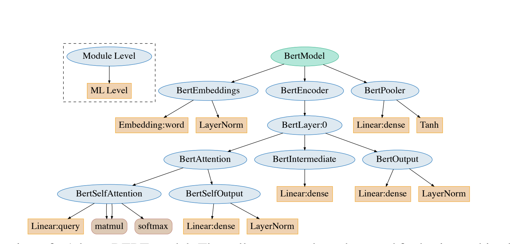
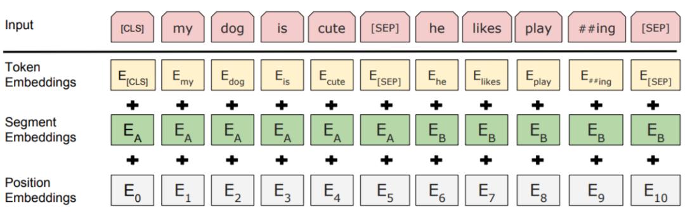
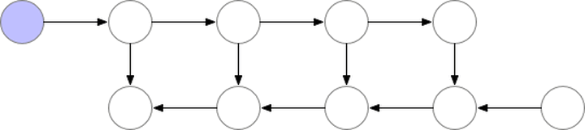

## Preface
This article contains a lot of source code and explanations. Each module is divided by paragraphs and horizontal lines. At the same time, the website is equipped with a sidebar to help everyone quickly jump between each section. I hope that everyone will have a deep understanding of BERT after reading it. At the same time, it is recommended to use tools such as pycharm and vscode to debug the bert source code step by step, debug to the corresponding module and then compare the explanation of this chapter.

The jupyter involved can be found in [Code Base: Chapter 3-Write a Transformer Model: BERT, Download](https://github.com/datawhalechina/learn-nlp-with-transformers/tree/main/docs/%E7%AF%87%E7%AB%A03-%E7%BC%96%E5%86%99%E4%B8%80%E4%B8%AATransformer%E6%A8%A1%E5%9E%8B%EF%BC%9ABERT)

This chapter will be based on H[HuggingFace/Transformers, 48.9k Star](https://github.com/huggingface/transformers) for learning. All the codes in this chapter are in [huggingface bert, please note that due to the rapid version update, it may beThere are differences, please refer to version 4.4.2](https://github.com/huggingface/transformers/tree/master/src/transformers/models/bert)HuggingFace is a chatbot startup service provider headquartered in New York. It caught the signal of the BERT trend very early and started to implement the BERT model based on pytorch. The project was originally named pytorch-pretrained-bert. While reproducing the original effect, it provides easy-to-use methods to facilitate various play and research based on this powerful model.

As the number of users increased, the project also developed into a larger open source community, merging various pre-trained language models and adding Tensorflow implementations, and was renamed Transformers in the second half of 2019. As of the time of writing this article (March 30, 2021), the project has 43k+ stars. It can be said that Transformers has become a de facto basic NLP tool.

## Main content of this section
 Figure: BERT structure, source IrEne: Interpretable Energy Prediction for Transformers

This article is based on the BERT-related code of the pytorch version of the Transformers version 4.4.2 (released on March 19, 2021) project, and analyzes it from the perspective of code structure, specific implementation and principle, and usage.
Main contents:

1. BERT Tokenization word segmentation model (BertTokenizer)

2. BERT Model ontology model (BertModel)

- BertEmbeddings

- BertEncoder

- BertLayer

- BertAttention

- BertIntermediate

- BertOutput

- BertPooler

***
## 1-Tokenization word segmentation-BertTokenizer
The Tokenizer related to BERT is mainly written in [`models/bert/tokenization_bert.py`](https://github.com/huggingface/transformers/blob/master/src/transformers/models/bert/tokenization_bert.py).

```python
import collections
import os
import unicodedata
from typing import List, Optional, Tuple

from transformers.tokenization_utils import PreTrainedTokenizer, _is_control, _is_punctuation, _is_whitespace
from transformers.utils import logging

logger = logging.get_logger(__name__)

VOCAB_FILES_NAMES = {"vocab_file" : "vocab.txt"}

PRETRAINED_VOCAB_FILES_MAP = {
"vocab_file": {
"bert-base-uncased": "https://huggingface.co/bert-base-uncased/resolve/main/vocab.txt",
}
}

PRETRAINED_POSITIONAL_EMBEDDINGS_SIZES = {
"bert-base-uncased": 512,
}

PRETRAINED_INIT_CONFIGURATION = {
"bert-base-uncased": {"do_lower_case": True},
}

def load_vocab(vocab_file):
"""Loads a vocabulary file into a dictionary."""
vocab = collections.OrderedDict()
with open(vocab_file, "r", encoding="utf-8") as reader:
tokens = reader.readlines()
for index, token in enumerate(tokens):
token = token.rstrip("\n")
vocab[token] = index
return vocab

def whitespace_tokenize(text):
"""Runs basic whitespace cleaning and splitting on a piece of text."""
text = text.strip()
if not text:
return []
tokens = text.split()
return tokens

class BertTokenizer(PreTrainedTokenizer):

vocab_files_names = VOCAB_FILES_NAMES
pretrained_vocab_files_map = PRETRAINED_VOCAB_FILES_MAP
pretrained_init_configuration = PRETRAINED_INIT_CONFIGURATION
max_model_input_sizes = PRETRAINED_POSITIONAL_EMBEDDINGS_SIZES

def __init__(
self,
vocab_file,
do_lower_case=True,
do_basic_tokenize=True,
never_split=None,
unk_token="[UNK]",
sep_token="[SEP]",
pad_token="[PAD]",
cls_token="[CLS]",
mask_token="[MASK]",
tokenize_chinese_chars=True,
strip_accents=None,
**kwargs
):
super().__init__(
do_lower_case=do_lower_case,
do_basic_tokenize=do_basic_tokenize,
never_split=never_split,
unk_token=unk_token,
sep_token=sep_token,
pad_token=pad_token,
cls_token=cls_token,
mask_token=mask_token,
tokenize_chinese_chars=tokenize_chinese_chars,
strip_accents=strip_accents,
**kwargs,
)

if not os.path.isfile(vocab_file):
raise ValueError(
f"Can't find a vocabulary file at path '{vocab_file}'. To load the vocabulary from a Google pretrained "
"model use `tokenizer = BertTokenizer.from_pretrained(PRETRAINED_MODEL_NAME)`"
)
self.vocab = load_vocab(vocab_file)
self.ids_to_tokens = collections.OrderedDict([(ids, tok) for tok, ids in self.vocab.items()])
self.do_basic_tokenize = do_basic_tokenize
if do_basic_tokenize:
self.basic_tokenizer = BasicTokenizer(
do_lower_case=do_lower_case,
never_split=never_split,
tokenize_chinese_chars=tokenize_chinese_chars,
strip_accents=strip_accents,
)
self.wordpiece_tokenizer = WordpieceTokenizer(vocab=self.vocab, unk_token=self.unk_token)

@property
def do_lower_case(self):
return self.basic_tokenizer.do_lower_case

@property
def vocab_size(self):
return len(self.vocab)

def get_vocab(self):
return dict(self.vocab, **self.added_tokens_encoder)

def _tokenize(self, text):
split_tokens = []
if self.do_basic_tokenize:
for token in self.basic_tokenizer.tokenize(text, never_split=self.all_special_tokens):

# If the token is part of the never_split set
if token in self.basic_tokenizer.never_split:
split_tokens.append(token)
else:
split_tokens += self.wordpiece_tokenizer.tokenize(token)
else:
split_tokens = self.wordpiece_tokenizer.tokenize(text)
return split_tokens

def _convert_token_to_id(self, token):
"""Converts a token (str) in an id using the vocab."""
return self.vocab.get(token, self.vocab.get(self.unk_token))

def _convert_id_to_token(self, index):
"""Converts an index (integer) in a token (str) using the vocab."""
return self.ids_to_tokens.get(index, self.unk_token)

def convert_tokens_to_string(self, tokens):
"""Converts a sequence of tokens (string) in a single string."""
out_string = " ".join(tokens).replace(" ##", "").strip()
return out_string

def build_inputs_with_special_tokens(
self, token_ids_0: List[int], token_ids_1: ​​Optional[List[int]] = None
) -> List[int]:
"""
Build model inputs from a sequence or a pair of sequence for sequence classification tasks by concatenating and
adding special tokens. A BERT sequencence has the following format:
- single sequence: ``[CLS] X [SEP]``
- pair of sequences: ``[CLS] A [SEP] B [SEP]``
Args:
token_ids_0 (:obj:`List[int]`):
List of IDs to which the special tokens will be added.
token_ids_1 (:obj:`List[int]`, `optional`):
Optional second list of IDs for sequence pairs.
Returns:
:obj:`List[int]`: List of `input IDs <../glossary.html#input-ids>`__ with the appropriate special tokens.
"""
if token_ids_1 is None:
return [self.cls_token_id] + token_ids_0 + [self.sep_token_id]
cls = [self.cls_token_id]
sep = [self.sep_token_id]
return cls + token_ids_0 + sep + token_ids_1 + sep

def get_special_tokens_mask(
self, token_ids_0: List[int], token_ids_1: ​​Optional[List[int]] = None, already_has_special_tokens: bool = False
) -> List[int]:
"""
Retrieve sequence ids from a token list that has special tokensas no special tokens added. This method is called when adding
special tokens using the tokenizer ``prepare_for_model`` method.
Args:
token_ids_0 (:obj:`List[int]`):
List of IDs.
token_ids_1 (:obj:`List[int]`, `optional`):
Optional second list of IDs for sequence pairs.
already_has_special_tokens (:obj:`bool`, `optional`, defaults to :obj:`False`):
Whether or not the token list is already formattedwith special tokens for the model.
Returns:
:obj:`List[int]`: A list of integers in the range [0, 1]: 1 for a special token, 0 for a sequence token.
"""

if already_has_special_tokens:
return super().get_special_tokens_mask(
token_ids_0=token_ids_0, token_ids_1=token_ids_1, already_has_special_tokens=True
)

if token_ids_1 is not None:
return [1] + ([0] * len(token_ids_0)) + [1] + ([0] * len(token_ids_1)) + [1]
return [1] + ([0] * len(token_ids_0)) + [1]

def create_token_type_ids_from_sequences(
self, token_ids_0: List[int], token_ids_1: ​​Optional[List[int]] = None
) -> List[int]:
"""
Create a mask from the two sequences passed to be used in a sequence-pair classification task. A BERT sequence
pair mask has the following format:
::
0 0 0 0 0 0 0 0 0 0 0 1 1 1 1 1 1 1 1
| first sequence | second sequence |If :obj:`token_ids_1` is :obj:`None`, this method only returns the first portion of the mask (0s).
Args:
token_ids_0 (:obj:`List[int]`):
List of IDs.
token_ids_1 (:obj:`List[int]`, `optional`):
Optional second list of IDs for sequence pairs.
Returns:
:obj:`List[int]`: List of `token type IDs <../glossary.html#token-type-ids>`_ according to the given
sequence(s).
"""
sep = [self.sep_token_id]
cls = [self.cls_token_id]
if token_ids_1 is None:
return len(cls + token_ids_0 + sep) * [0]
return len(cls + token_ids_0 + sep) * [0] + len(token_ids_1 + sep) * [1]

def save_vocabulary(self, save_directory: str, filename_prefix: Optional[str] = None) -> Tuple[str]:
index = 0
if os.path.isdir(save_directory):
vocab_file = os.path.join(
save_directory, (filename_prefix + "-" if filename_prefix else "") + VOCAB_FILES_NAMES["vocab_file"]
)
else:
vocab_file = (filename_prefix + "-" if filename_prefix else "") + save_directory
with open(vocab_file, "w", encoding="utf-8") as writer:
for token, token_index in sorted(self.vocab.items(), key=lambda kv: kv[1]):
if index != token_index:
logger.warning(
f"Saving vocabulary to {vocab_file}: vocabulary indices are not consecutive."" Please check that the vocabulary is not corrupted!"
)
index = token_index
writer.write(token + "\n")
index += 1
return (vocab_file,)

class BasicTokenizer(object):

def __init__(self, do_lower_case=True, never_split=None, tokenize_chinese_chars=True, strip_accents=None):
if never_split is None:
never_split = []
self.do_lower_case = do_lower_case
self.never_split= set(never_split)
self.tokenize_chinese_chars = tokenize_chinese_chars
self.strip_accents = strip_accents

def tokenize(self, text, never_split=None):
"""
Basic Tokenization of a piece of text. Split on "white spaces" only, for sub-word tokenization, see
WordPieceTokenizer.
Args:
**never_split**: (`optional`) list of str
Kept for backward compatibility purposes. Now implemented directly at the base class level (see:func:`PreTrainedTokenizer.tokenize`) List of tokens not to split.
"""
# union() returns a new set by concatenating the two sets.
never_split = self.never_split.union(set(never_split)) if never_split else self.never_split
text = self._clean_text(text)

# This was added on November 1st, 2018 for the multilingual and Chinese
# models. This is also applied to the English models now, but it doesn't
# matter since the English models were not trained on any Chinese data
# and generally don't have any Chinese data in them (there are Chinese
# characters in the vocabulary because Wikipedia does have some Chinese
# words in the English Wikipedia.).
if self.tokenize_chinese_chars:
text = self._tokenize_chinese_chars(text)
orig_tokens = whitespace_tokenize(text)
split_tokens = []
for token in orig_tokens:
if token not in never_split:if self.do_lower_case:
token = token.lower()
if self.strip_accents is not False:
token = self._run_strip_accents(token)
elif self.strip_accents:
token = self._run_strip_accents(token)
split_tokens.extend(self._run_split_on_punc(token, never_split))

output_tokens = whitespace_tokenize(" ".join(split_tokens))
return output_tokens

def _run_strip_accents(self, text):
"""Strips accents from a piece of text."""
text = unicodedata.normalize("NFD", text)
output = []
for char in text:
cat = unicodedata.category(char)
if cat == "Mn":
continue
output.append(char)
return "".join(output)

def _run_split_on_punc(self, text, never_split=None):
"""Splits punctuation on a piece of text."""
if never_split is not None and text in never_split:
returnn [text]
chars = list(text)
i = 0
start_new_word = True
output = []
while i < len(chars):
char = chars[i]
if _is_punctuation(char):
output.append([char])
start_new_word = True
else:
if start_new_word:
output.append([])
start_new_word = False
output[-1].append(char)
i += 1

return ["".join(x) for x in output]

def _tokenize_chinese_chars(self, text):
"""Adds whitespace around any CJK character."""
output = []
for char in text:
cp = ord(char)
if self._is_chinese_char(cp):
output.append(" ")
output.append(char)
output.append(" ")
else:
output.append(char)
return "".join(output)

def _is_chinese_char(self, cp):
"""Checks whether CP is the codepoint ofa CJK character."""
# This defines a "chinese character" as anything in the CJK Unicode block:
# https://en.wikipedia.org/wiki/CJK_Unified_Ideographs_(Unicode_block)
#
# Note that the CJK Unicode block is NOT all Japanese and Korean characters,
# despite its name. The modern Korean Hangul alphabet is a different block,
# as is Japanese Hiragana and Katakana. Those alphabets are used to write
# space-separated words, so they are not treatedd specially and handled
# like the all of the other languages.
if (
(cp >= 0x4E00 and cp <= 0x9FFF)
or (cp >= 0x3400 and cp <= 0x4DBF) #
or (cp >= 0x20000 and cp <= 0x2A6DF) #
or (cp >= 0x2A700 and cp <= 0x2B73F) #
or (cp >= 0x2B740 and cp <= 0x2B81F) #
or (cp >= 0x2B820 and cp <= 0x2CEAF) #
or (cp >= 0xF900 and cp <= 0xFAFF)
or (cp >= 0x2F800 and cp <= 0x2FA1F) #
): #return True

return False

def _clean_text(self, text):
"""Performs invalid character removal and whitespace cleanup on text."""
output = []
for char in text:
cp = ord(char)
if cp == 0 or cp == 0xFFFD or _is_control(char):
continue
if _is_whitespace(char):
output.append(" ")
else:
output.append(char)
return "".join(output)

class WordpieceTokenizer(object):
"""Runs WordPiece tokenization."""

def __init__(self, vocab, unk_token, max_input_chars_per_word=100):
self.vocab = vocab
self.unk_token = unk_token
self.max_input_chars_per_word = max_input_chars_per_word

def tokenize(self, text):
"""
Tokenizes a piece of text into its word pieces. This uses a greedy longest-match-first algorithm to perform
tokenization using the given vocabulary.
For example, :obj:`input = "unaffable"` will return as output :obj:`["un", "##aff", "##able"]`.
Args:
text: A single token or whitespace separated tokens. This should have
already been passed through `BasicTokenizer`.
Returns:
A list of wordpiece tokens.
"""

output_tokens = []
for token in whitespace_tokenize(text):
chars = list(token)
if len(chars) > self.max_input_chars_per_word:
output_tokens.append(self.unk_token)continue

is_bad = False
start = 0
sub_tokens = []
while start < len(chars):
end = len(chars)
cur_substr = None
while start < end:
substr = "".join(chars[start:end])
if start > 0:
substr = "##" + substr
if substr in self.vocab:
cur_substr = substr
breakend -= 1
if cur_substr is None:
is_bad = True
break
sub_tokens.append(cur_substr)
start = end

if is_bad:
output_tokens.append(self.unk_token)
else:
output_tokens.extend(sub_tokens)
return output_tokens
```

```
class BertTokenizer(PreTrainedTokenizer):
"""
Construct a BERT tokenizer. Based on WordPiece.

This tokenizer inherits from :class:`~transformers.PreTrainedTokenizer` which contains most of the main methods.
Users should refer to this superclass for more information regarding those methods.
...
"""
```

`BertTokenizer` is a tokenizer based on `BasicTokenizer` and `WordPieceTokenizer`:
- BasicTokenizer is responsible for the first step of processing - splitting sentences by punctuation, spaces, etc., and handling whether to unify lowercase and cleaning illegal characters.
- For Chinese characters, split by word through preprocessing (adding spaces);
- At the same time, you can specify that some words are not split through never_split;
- This step is optional (executed by default).
- WordPieceTokenizer further decomposes words into subwords based on words.
- Subword is between char and word, that is,While retaining the meaning of the word to a certain extent, it can also take into account the word list explosion caused by singular and plural, tense and OOV (Out-Of-Vocabulary) problems of unregistered words in English, and separate the root and tense affixes, thereby reducing the word list and the difficulty of training; 
- For example, the word tokenizer can be decomposed into two parts: "token" and "##izer". Note that the "##" of the latter word means that it is connected to the previous word. 
BertTokenizer has the following common methods:
- from_pretrained: Initialize a tokenizer from a directory containing a vocabulary file (vocab.txt);
- tokenize: Decompose a text (word or sentence) into a list of subwords;
- convert_tokens_to_ids: Convert a list of subwords to a list of subword subscripts;
- convert_ids_to_tokens: The opposite of the previous one;
- convert_tokens_to_string: Concatenate the subword list back to a word or sentence by “##”;
- encode: For a single sentence input, decompose the word and add special words to form a structure of “[CLS], x, [SEP]” and convert it to a list of vocabulary subscripts; for two sentence inputs (only the first two for multiple sentences), decompose the word and add special words to form a structure of “[CLS], x1, [SEP], x2, [SEP]" and convert it to a subscript list; - decode: The output of the encode method can be turned into a complete sentence. And the class's own methods: ```python bt = BertTokenizer.from_pretrained('bert-base-uncased') bt('I like natural language progressing!') # {'input_ids': [101, 1045, 2066, 3019, 2653, 27673, 999, 102], 'token_type_ids': [0, 0, 0, 0, 0, 0, 0, 0], 'attention_mask': [1, 1, 1, 1, 1, 1, 1, 1]} ```

Downloading: 100%|██████████| 232k/232k [00:00<00:00, 698kB/s]
Downloading: 100%|██████████| 28.0/28.0 [00:00<00:00, 11.1kB/s]
Downloadingg: 100%|██████████| 466k/466k [00:00<00:00, 863kB/s]

{'input_ids': [101, 1045, 2066, 3019, 2653, 27673, 999, 102], 'token_type_ids': [0, 0, 0, 0, 0, 0, 0, 0], 'attention_mask': [1, 1, 1, 1, 1, 1, 1, 1]}

*** 
## 2-Model-BertModel
and BERT The code related to the model is mainly written in [`/models/bert/modeling_bert.py`](https://github.com/huggingface/transformers/blob/master/src/transformers/models/bert/modeling_bert.py), which has more than a thousand lines of code, including the basic structure of the BERT model and the fine-tuning model based on it.

Let's start with the analysis of the BERT model body:
```
class BertModel(BertPreTrainedModel):"""

The model can behave as an encoder (with only self-attention) as well as a decoder, in which case a layer of
cross-attention is added between the self-attention layers, following the architecture described in `Attention is
all you need <https://arxiv.org/abs/1706.03762>`__ by Ashish Vaswani, Noam Shazeer, Niki Parmar, Jakob Uszkoreit,
Llion Jones, Aidan N. Gomez, Lukasz Kaiser and Illia Polosukhin.

To behave as an decoder the model needs to be initialized with the :obj:`is_decoder` argument of the configuration
set to :obj:`True`. To be used in a Seq2Seq model, the model needs to be initialized with both :obj:`is_decoder`
argument and :obj:`add_cross_attention` set to :obj:`True`; an :obj:`encoder_hidden_states` is then expected as an
input to the forward pass.
""" 
```
BertModel is mainly a transformer encoder structure, which contains three parts:
1. embeddings, that is, entities of the BertEmbeddings class, which obtain the corresponding vector representation according to the word symbol;
2. encoder, that is, entities of the BertEncoder class;
3. pooler, that is, entities of the BertPooler class, this part is optional.

**Note that BertModel can alsoIt is configured as a Decoder, but this part is not discussed below. **

The following will introduce the meaning of each parameter and the return value during the forward propagation of BertModel:
```
def forward(
self,
input_ids=None,
attention_mask=None,
token_type_ids=None,
position_ids=None,
head_mask=None,
inputs_embeds=None,
encoder_hidden_states=None,
encoder_attention_mask=None,
past_key_values=None,
use_cache=None,
output_attentions=None,
output_hidden_states=None,
return_dict=None,
): ...
```
-input_ids: the subscript list corresponding to the subword after tokenizer segmentation;
- attention_mask: in the process of self-attention, this mask is used to mark the difference between the sentence where the subword is located and the padding, and fill the padding part with 0;
- token_type_ids: mark the sentence where the subword is currently located (first sentence/second sentence/padding);
- position_ids: mark the position subscript of the sentence where the current word is located;
- head_mask: used to invalidate some attention calculations of some layers;
- inputs_embeds: if provided, then input_ids is not needed, and the embedding lookup process is skipped and directly entered into the encoder calculation as an embedding;
- encoder_hidden_states: this part works when BertModel is configured as a decoder, and cross-attention will be performed instead of self-attention;
- encoder_attention_mask: as above, used to mark encoder in cross-attentionpadding of the input of the oder end;
- past_key_values: This parameter seems to pass in the pre-calculated K-V product to reduce the cost of cross-attention (because this part is originally a repeated calculation);
- use_cache: save the previous parameter and pass it back to speed up decoding;
- output_attentions: whether to return the attention output of each intermediate layer;
- output_hidden_states: whether to return the output of each intermediate layer;
- return_dict: whether to return the output in the form of key-value pairs (ModelOutput class, which can also be used as tuple), the default is true.

**Note that the head_mask here invalidates the attention calculation, which is different from the attention head pruning mentioned below, and only multiplies the calculation results of some attention by this coefficient. **

The output part is as follows:
```
# BertModel forward propagation return part
if not return_dict:
return (sequence_output, pooled_output) + encoder_outputs[1:]

returnrn BaseModelOutputWithPoolingAndCrossAttentions(
last_hidden_state=sequence_output,
pooler_output=pooled_output,
past_key_values=encoder_outputs.past_key_values,
hidden_states=encoder_outputs.hidden_states,
attentions=encoder_outputs.attentions,
cross_attentions=encoder_outputs.cross_attentions,
)
```
It can be seen that the return value not only contains the output of encoder and pooler, but also contains other specified output parts (hidden_states and attention, etc., which are conveniently accessed in encoder_outputs[1:]):

```# BertEncoder forward propagation return part, that is, the encoder_outputs above
if not return_dict:
return tuple(
v
for v in [
hidden_states,
next_decoder_cache,
all_hidden_states,
all_self_attentions,
all_cross_attentions,
]
if v is not None
)
return BaseModelOutputWithPastAndCrossAttentions(
last_hidden_state=hidden_states,
past_key_values=next_decoder_cache,
hidden_states=all_hidden_states,
attentions=all_self_attentions,
cross_attentions=all_cross_attentions,
)
```

In addition, BertModel also has the following methods to facilitate BERT players to perform various operations:

- get_input_embeddings: extract word_embeddings in embedding, that is, the word vector part;
- set_input_embeddings: assign values ​​to word_embeddings in embedding;
- _prune_heads: provides a function for pruning attention heads, with the input as a dictionary of {layer_num: list of heads to prune in this layer}, which can prune some attention heads of the specified layer.

** Pruning is a complex operation that requires the attention heads to be retained.Copy the Wq, Kq, Vq of the head part and the weights of the fully connected part after splicing to a new smaller weight matrix (note that grad is disabled before copying), and record the pruned heads in real time to prevent subscript errors. For details, refer to the prune_heads method in the BertAttention part.**

```python
from transformers.models.bert.modeling_bert import *
class BertModel(BertPreTrainedModel):
"""
The model can behave as an encoder (with only self-attention) as well as a decoder, in which case a layer of
cross-attention is added between the self-attention layers, following the architecture described in `Attention is
all you need <https://arxiv.org/abs/1706.03762>`__ by Ashish Vaswani, Noam Shazeer, Niki Parmar, Jakob Uszkoreit,
Llion Jones, Aidan N. Gomez, Lukasz Kaiser and Illia Polosukhin.
To behave as an decoder the model needs to be initialized with the :obj:`is_decoder` argument of the configuration
set to :obj:`True`. To be used in a Seq2Seq model, the model needs to be initialized with both :obj:`is_decoder`
argument and :obj:`add_cross_attention` set to :obj:`True`; an :obj:`encoder_hidden_states` is then expected as an
input to the forward pass.
"""

def __init__(self, config, add_pooling_layer=True):
super().__init__(config)
self.config = config

self.embeddings = BertEmbeddings(config)
self.encoder = BertEncoder(config)

self.pooler = BertPooler(config) if add_pooling_layer else None

self.init_weights()

def get_input_embeddings(self):
return self.embeddings.word_embeddings

def set_input_embeddings(self, value):
self.embeddings.wordrd_embeddings = value

def _prune_heads(self, heads_to_prune):
"""
Prunes heads of the model. heads_to_prune: dict of {layer_num: list of heads to prune in this layer} See base
class PreTrainedModel
"""
for layer, heads in heads_to_prune.items():
self.encoder.layer[layer].attention.prune_heads(heads)

@add_start_docstrings_to_model_forward(BERT_INPUTS_DOCSTRING.format("batch_size, sequence_length"))
@add_code_sample_docstrings(tokenizer_class=_TOKENIZER_FOR_DOC,
checkpoint=_CHECKPOINT_FOR_DOC,
output_type=BaseModelOutputWithPoolingAndCrossAttentions,
config_class=_CONFIG_FOR_DOC,
)
def forward(
self,
input_ids=None,
attention_mask=None,
token_type_ids=None,
position_ids=None,
head_mask=None,
inputs_embeds=None,
encoder_hidden_states=None,
encoder_attention_mask=None,
past_key_values=None,
use_cache=None,
output_attentions=None,
output_hidden_states=None,
return_dict=None,
):
r"""
encoder_hidden_states (:obj:`torch.FloatTensor` of shape :obj:`(batch_size, sequence_length, hidden_size)`, `optional`):
Sequence of hidden-states at the output of the last layer of the encoder. Used in the cross-attention if
the model is configured as a decoder.
encoder_attention_mask (:obj:`torch.FloatTensor` of shape :obj:`(batch_size, sequence_length, hidden_size)`, `optional`):
Sequence of hidden-states at the output of the last layer of the encoder. Used in the cross-attention if
the model is configured as a decoder.ze, sequence_length)`, `optional`):
Mask to avoid performing attention on the padding token indices of the encoder input. This mask is used in
the cross-attention if the model is configured as a decoder. Mask values ​​selected in ``[0, 1]``:
- 1 for tokens that are **not masked**,
- 0 for tokens that are **masked**.
past_key_values ​​(:obj:`tuple(tuple(torch.FloatTensor))` of length :obj:`config.n_layers` with each tuple having 4 tensors of shape :obj:`(batch_size, num_heads, sequence_length - 1, embed_size_per_head)`):
Contains precomputed key and value hidden states of the attention blocks. Can be used to speed up decoding.
If :obj:`past_key_values` are used, the user can optionally input only the last :obj:`decoder_input_ids`
(those that don't have their past key value states given to this model) of shape :obj:`(batch_size, 1)`
instead of all :obj:`decoder_input_ids` of shape :obj:`(batch_size, sequence_length)`.
use_cache (:obj:`bool`, `optional`):
If set to :obj:`True`, :obj:`past_key_values` key value states are returned and can be used to speed up
decoding (see :obj:`past_key_values`).
"""
output_attentions = output_attentions if output_attentions is not None else self.config.output_attentions
output_hidden_states = (
output_hidden_states if output_hidden_states is not None else self.config.output_hidden_states
)
return_dict = return_dict if return_dict is not None else self.config.use_return_dict

if self.config.is_decoder:
use_cache = use_cache if use_cache is not None else self.config.use_cache
else:
use_cache = False

if input_ids is not None and inputs_embeds is not None:
raise ValueError("You cannot specify both input_ids and inputs_embeds at the same time")
elif input_ids is not None:
input_shape = input_ids.size()
batch_size, seq_length = input_shape
elif inputs_embeds is not None:
input_shape = inputs_embeds.size()[:-1]
batch_size, seq_length = input_shape
else:
raise ValueError("You have to specify either input_ids or inputs_embeds")

device = input_ids.device if input_ids is not None else inputs_embeds.device

# past_key_values_length
past_key_values_length = past_key_values[0][0].shape[2] ifpast_key_values ​​is not None else 0

if attention_mask is None:
attention_mask = torch.ones(((batch_size, seq_length + past_key_values_length)), device=device)

if token_type_ids is None:
if hasattr(self.embeddings, "token_type_ids"):
buffered_token_type_ids = self.embeddings.token_type_ids[:, :seq_length]
buffered_token_type_ids_expanded = buffered_token_type_ids.expand(batch_size, seq_length)
token_type_ids= buffered_token_type_ids_expanded
else:
token_type_ids = torch.zeros(input_shape, dtype=torch.long, device=device)

# We can provide a self-attention mask of dimensions [batch_size, from_seq_length, to_seq_length]
# ourselves in which case we just need to make it broadcastable to all heads.
extended_attention_mask: torch.Tensor = self.get_extended_attention_mask(attention_mask, input_shape, device)

# If a 2D or 3D attention mask is provided for the cross-attention
# we need to make broadcastable to [batch_size, num_heads, seq_length, seq_length]
if self.config.is_decoder and encoder_hidden_states is not None:
encoder_batch_size, encoder_sequence_length, _ = encoder_hidden_states.size()
encoder_hidden_shape = (encoder_batch_size, encoder_sequence_length)
if encoder_attention_mask is None:
encoder_attention_mask = torch.ones(encoder_hidden_shape, device=device)
encoder_extended_attention_mask = self.invert_attention_mask(encoder_attention_mask)
else:
encoder_extended_attention_mask = None

# Prepare head mask if needed
# 1.0 in head_mask indicate we keep the head
# attention_probs has shape bsz x n_heads x N x N
# input head_mask has shape [num_heads] or [num_hidden_layers x num_heads]
# and head_mask is converted to shape [num_hidden_layers x batch x num_heads x seq_length x seq_length]
head_mask = self.get_head_mask(head_mask, self.config.num_hidden_layers)

embedding_output = self.embeddings(
input_ids=input_ids,
position_ids=position_ids,
token_type_ids=token_type_ids,
inputs_embeds=inputs_embeds,
past_key_values_length=past_key_values_length,
)
encoder_outputs = self.encoder(
embedding_output,
attention_mask=extended_attention_mask,
head_mask=head_mask,
encoder_hidden_states=encoder_hidden_states,
encoder_attention_mask=encoder_extended_attention_mask,
past_key_values=past_key_values,
use_cache=use_cache,
output_attentions=output_attentions,
output_hidden_states=output_hidden_states,
return_dict=return_dict,
)
sequence_output = encoder_outputs[0]
pooled_output = self.pooler(sequence_output) if self.pooler is not None else None

if not return_dict:
return (sequence_output, pooled_output) + encoder_outputs[1:]

return BaseModelOutputWithPoolingAndCrossAttentions(
last_hidden_state=sequence_output,
pooler_output=pooled_output,
past_key_values=encoder_outputs.past_key_values,
hidden_states=encoder_outputs.hidden_states,
attentions=encoder_outputs.attentions,
cross_attentions=encoder_outputs.cross_attentions,
)
```

***
### 2.1-BertEmbeddings
Contains three parts summed up:
 Figure: Bert-embedding

1. word_embeddings, the embedding corresponding to the subword in the above text.
2. token_type_embeddings, used to indicate the sentence where the current word is located, to help distinguish the difference between the sentence and the padding and sentence pairs.
3. position_embeddings, the position embedding of each word in the sentence, used to distinguish the order of words. Unlike the design in the transformer paper, this part is trained instead of the fixed embedding calculated by the Sinusoidal function. It is generally believed that this implementation is not conducive to scalability (difficult to directly migrate to longer sentences).

The three embeddings are added without weights and output after passing through a layer of LayerNorm+dropout, and its size is (batch_size, sequence_length, hidden_size).

** [Why use LayerNorm+Dropout here? Why use LayerNorm instead of Bat?chNorm? You can refer to a good answer: Why does transformer use layer normalization instead of other normalization methods? ](https://www.zhihu.com/question/395811291/answer/1260290120)**

```python
class BertEmbeddings(nn.Module):
"""Construct the embeddings from word, position and token_type embeddings."""

def __init__(self, config):
super().__init__()
self.word_embeddings = nn.Embedding(config.vocab_size, config.hidden_size, padding_idx=config.pad_token_id)
self.position_embeddings = nn.Embedding(config.max_position_embeddings, config.hidden_size)
self.token_type_embeddings = nn.Embedding(config.type_vocab_size, config.hidden_size)

# self.LayerNorm is not snake-cased to stick with TensorFlow model variable name and be able to load
# any TensorFlow checkpoint file
self.LayerNorm = nn.LayerNorm(config.hidden_size, eps=config.layer_norm_eps)
self.dropout = nn.Dropout(config.hidden_dropout_prob)
# position_ids (1, len position emb) is contiguous in memory andexported when serialized
self.position_embedding_type = getattr(config, "position_embedding_type", "absolute")
self.register_buffer("position_ids", torch.arange(config.max_position_embeddings).expand((1, -1)))
if version.parse(torch.__version__) > version.parse("1.6.0"):
self.register_buffer(
"token_type_ids",
torch.zeros(self.position_ids.size(), dtype=torch.long, device=self.position_ids.device),
persistent=False,
)

def forward(
self, input_ids=None, token_type_ids=None, position_ids=None, inputs_embeds=None, past_key_values_length=0
):
if input_ids is not None:
input_shape = input_ids.size()
else:
input_shape = inputs_embeds.size()[:-1]

seq_length = input_shape[1]

if position_ids is None:
position_ids = self.position_ids[:, past_key_values_length : seq_length + past_key_values_length]

# Setting the token_type_ids to the registered buffer in constructor where it is all zeros, which usually occurs
# when its auto-generated, the registered buffer helps users when tracing the model without passing token_type_ids, solves
# issue #5664
if token_type_ids is None:
if hasattr(self, "token_type_ids"):
buffered_token_type_ids = self.token_type_ids[:, :seq_length]
buffered_token_type_ids_expanded = buffered_token_type_ids.expand(input_shape[0], seq_length)
token_type_ids = buffered_token_type_ids_expanded
else:
token_type_ids = torch.zeros(input_shape, dtype=torch.long, device=self.position_ids.device)

if inputs_embeds is None:
inputs_embeds = self.word_embeddings(input_ids)
token_type_embeddings = self.token_type_embeddings(token_type_ids)

embeddings = inputs_embeds + token_type_embeddings
if self.position_embedding_type == "absolute":
position_embeddings = self.position_embeddings(position_ids)
embeddings += position_embeddings
embeddings = self.LayerNorm(embeddings)
embeddings = self.dropout(embeddings)
return embeddings
```

*** 
### 2.2-BertEncoder

Contains multiple layers of BertLayer. There is nothing special to explain about this part itself, but there is a detail worth referring to: using gradient checkpointing technology to reduce the memory usage during training.

**Gradient checkpointing is a gradient checkpoint. It compresses the model space by reducing the saved calculation graph nodes, but when calculating the gradient, it is necessary to recalculate the unstored value. Refer to the paper "Training Deep Nets with Sublinear Memory Cost". The process is as follows**
 Figure: gradient-checkpointing

In BertEncoder, gradient checkpoint is implemented through torch.utils.checkpoint.checkpoint, which is convenient to use. You can refer to the document: torch.utils.checkpoint - PyTorch 1.8.1 documentation. The specific implementation of this mechanism is relatively complicated and will not be expanded here.

Going deeper, we enter a layer of Encoder:

```python
class BertEncoder(nn.Module):
def __init__(self, config):
super().__init__()
self.config = config
self.layer = nn.ModuleList([BertLayer(config) for _ in range(config.num_hidden_layers)])

def forward(
self,
hidden_states,
attention_mask=None,
head_mask=None,
encoder_hidden_states=None,
encoder_attention_mask=None,
past_key_values=None,
use_cache=None,
output_attentions=False,
output_hidden_states=False,
return_dict=True,
):
all_hidden_states = () if output_hidden_states else None
all_self_attentions = () if output_attentions else None
all_cross_attentions = () if output_attentions and self.config.add_cross_attention else None

next_decoder_cache = () if use_cache else None
for i, layer_module in enumerate(self.layer):
if output_hidden_states:
all_hidden_states = all_hidden_states + (hidden_states,)

layer_head_mask = head_mask[i] if head_mask is not None else None
past_key_value = past_key_values[i] if past_key_values ​​is not None else None

if getattr(self.config, "gradient_checkpointing", False) and self.training:

if use_cache:
logger.warning(
"`use_cache=True` is incompatible with `config.gradient_checkpointing=True`. Setting "
"`use_cache=False`..."
)
use_cache = False

def create_custom_forward(module):
def custom_forward(*inputs):
return module(*inputs, past_key_value, output_attentions)

return custom_forward

layer_outputs = torch.utils.checkpoint.checkpoint(
create_custom_forward(layer_module),
hidden_states,
attention_mask,
layer_head_mask,
encoder_hidden_states,
encoder_attention_mask,
)
else:
layer_outputs = layer_module(
hidden_states,
attention_mask,
layer_head_mask,
encoder_hidden_states,
encoder_attention_mask,
past_key_value,
output_attentions,
)

hidden_states = layer_outputs[0]
if use_cache:
next_decoder_cache += (layer_outputs[-1],)
if output_attentions:
all_self_attentions = all_self_attentions + (layer_outputs[1],)
if self.config.add_cross_attention:
all_cross_attentions = all_cross_attentions + (layer_outputs[2],)

if output_hidden_states:
all_hidden_states = all_hidden_states + (hidden_states,)

if not return_dict:
return tuple(
v
for v in [
hidden_states,
next_decoder_cache,
all_hidden_states,
all_self_attentions,all_cross_attentions,
]
if v is not None
)
return BaseModelOutputWithPastAndCrossAttentions(
last_hidden_state=hidden_states,
past_key_values=next_decoder_cache,
hidden_states=all_hidden_states,
attentions=all_self_attentions,
cross_attentions=all_cross_attentions,
)
```

*** 
#### 2.2.1.1 BertAttention

I thought the implementation of attention was here, but I didn’t expect to go down one more level… Among them, the self member is the implementation of multi-head attention, and the output member implements a series of operations after attention, including full connection + dropout + residual + LayerNorm.

```
class BertAttention(nn.Module):
def __init__(self, config):
super().__init__()
self.self = BertSelfAttention(config)
self.output = BertSelfOutput(config)
self.pruned_heads = set()
```
First, let's go back to this layer. The pruning operation mentioned above appears here, namely the prune_heads method:
```
def prune_heads(self, heads):
if len(heads) == 0:
return
heads, index = find_pruneable_heads_and_indices(
heads, self.self.num_attention_heads, self.self.attention_head_size, self.pruned_heads
)

# Prune linear layers
self.self.query = prune_linear_layer(self.self.query, index)
self.self.key = prune_linear_layer(self.self.key, index)
self.self.value = prune_linear_layer(self.self.value, index)
self.output.dense = prune_linear_layer(self.output.dense, index, dim=1)

# Update hyper params and store pruned heads
self.self.num_attention_heads = self.self.num_attention_heads - len(heads)
self.self.all_head_size = self.self.attention_head_size * self.self.num_attention_heads
self.pruned_heads = self.pruned_heads.union(heads) 
```
The specific implementation here is summarized as follows:
- `find_pruneable_heads_and_indices` locates the head to be pruned and the dimension index to be retained;

- `prune_linear_layer` is responsible for transferring the dimensions that have not been pruned in the Wk/Wq/Wv weight matrix (together with bias) according to the index to the new matrix.
Next, let's get to the highlight - the specific implementation of Self-Attention.

```python
class BertAttention(nn.Module):
def __init__(self, config):
super().__init__()
self.self = BertSelfAttention(config)
self.output = BertSelfOutput(config)
self.pruned_heads = set()

def prune_heads(self, heads):
if len(heads) == 0:
return
heads, index = find_pruneable_heads_and_indices(
heads, self.self.num_attention_heads, self.self.attention_head_size, self.pruned_heads
)

# Prune linear layers
self.self.query = prune_linear_layer(self.self.query, index)
self.self.key = prune_linear_layer(self.self.key, index)
self.self.value = prune_linear_layer(self.self.value, index)
self.output.dense = prune_linear_layer(self.output.dense, index, dim=1)

# Update hyper params and store pruned heads
self.self.num_attention_heads = self.self.num_attention_heads - len(heads)
self.self.all_head_size = self.self.attention_head_size * self.self.num_attention_heads
self.pruned_heads = self.pruned_heads.union(heads)

def forward(
self,hidden_states,
attention_mask=None,
head_mask=None,
encoder_hidden_states=None,
encoder_attention_mask=None,
past_key_value=None,
output_attentions=False,
):
self_outputs = self.self(
hidden_states,
attention_mask,
head_mask,
encoder_hidden_states,
encoder_attention_mask,
past_key_value,
output_attentions,
)
attention_output = self.output(self_outputs[0], hidden_states)
outputs = (attention_output,) + self_outputs[1:] # add attentions if we output them
return outputs
```

*** 
##### 2.2.1.1.1 BertSelfAttention

**Warning: This is the core area of ​​the model and the only place involving formulas, so a lot of code will be posted. **

Initialization part:
```
class BertSelfAttention(nn.Module):
def __init__(self, config):
super().__init__()
if config.hidden_size % config.num_attention_heads != 0 and not hasattr(config, "embedding_size"):
raise ValueError("The hidden size (%d) is not a multiple of the number of attention "
"heads (%d)" % (config.hidden_size, config.num_attention_heads)
)

self.num_attention_heads = config.num_attention_heads
self.attention_head_size = int(config.hidden_size / config.num_attention_heads)
self.all_head_size = self.num_attention_heads * self.attention_head_size

self.query = nn.Linear(config.hidden_size, self.all_head_size)
self.key = nn.Linear(config.hidden_size, self.all_head_size)
self.value = nn.Linear(config.hidden_size, self.all_head_size)

self.dropout = nn.Dropout(config.attention_probs_dropout_prob)
self.position_embedding_type = getattr(config, "position_embedding_type", "absolute")
if self.position_embedding_type == "relative_key" or self.position_embedding_type == "relative_key_query":
self.max_position_embeddings = config.max_position_embeddings
self.distance_embedding = nn.Embedding(2 * config.max_position_embeddings - 1, self.attention_head_size)

self.is_decoder = config.is_decoder
```

- In addition to the familiar query, key, value weights and a dropout, there is also a mysterious position_embedding_type and decoder tag;

- Note that hidden_size and all_head_size are the same at the beginning. As for why it seems unnecessary to set this variable-obviously because of the pruning function above, after cutting off a few attention heads, all_head_size will naturally be smaller;

- Hidden_size must be an integer multiple of num_attention_heads. Taking bert-base as an example, each attention contains 12 heads, and hidden_size is 768, so the size of each head is attention_head_size=768/12=64;- What is position_embedding_type? You will find out if you continue reading.

Then the key point is the forward propagation process.

First, let's review the basic formula of multi-head self-attention:

$$MHA(Q, K, V) = Concat(head_1, ..., head_h)W^O$$
$$head_i = SDPA(QW_i^Q, KW_i^K, VW_i^V)$$
$$SDPA(Q, K, V) = softmax(\frac{QK^T}{\sqrt(d_k)})V$$

And these attention heads are known to be calculated in parallel, so the query, key, and value weights above are unique - this does not mean that all heads share weights, but are "spliced" together.

**[The reason for the multi-head in the original paper is that Multi-head attention allows the model to jointly attend to information from different representation subspaces at different positions. With a single attention head, averaging inhibits this. Another more reliable analysis is: Why does Transformer need Multi-head Attention? ](https://www.zhihu.com/question/341222779/answer/814111138)**

Look at the forward method:
```
def transpose_for_scores(self, x):
new_x_shape = x.size()[:-1] + (self.num_attention_heads, self.attention_head_size)
x = x.view(*new_x_shape)
return x.permute(0, 2, 1, 3)

def forward(
self,
hidden_states,
attention_mask=None,
head_mask=None,
encoder_hidden_states=None,
encoder_attention_mask=None,
past_key_value=None,
output_attentions=False,
):
mixed_query_layer = self.query(hidden_states)

# Omit part of the cross-attention calculation
key_layer = self.transpose_for_scores(self.key(hidden_states))
value_layer = self.transpose_for_scores(self.value(hidden_states))
query_layer = self.transpose_for_scores(mixed_query_layer)

# Take the dot product between "query" and "key" to get the raw attention scores.
attention_scores = torch.matmul(query_layer, key_layer.transpose(-1, -2))
# ...
```
Here, `transpose_for_scores` is used to split `hidden_size` into the shape of multiple head outputs, and transpose the middle two dimensions for matrix multiplication;

Here, the shape of `key_layer/value_layer/query_layer`r is: (batch_size, num_attention_heads, sequence_length, attention_head_size);
Here, the shape of `attention_scores` is: (batch_size, num_attention_heads, sequence_length, sequence_length), which is consistent with the shape of the attention map obtained by calculating multiple heads separately.

At this point, we have implemented the multiplication of K and Q to obtain the raw attention scores. According to the formula, the next step should be to scale by $d_k$g and do a softmax operation. However, the first thing that appears is a strange positional_embedding, and a bunch of Einstein sums:

```
# ...
if self.position_embedding_type == "relative_key" or self.position_embedding_type == "relative_key_query":
seq_length = hidden_states.size()[1]
position_ids_l = torch.arange(seq_length, dtype=torch.long, device=hidden_states.device).view(-1, 1)
position_ids_r = torch.arange(seq_length, dtype=torch.long, device=hidden_states.device).view(1, -1)
distance = position_ids_l - position_ids_r
positional_embedding = self.distance_embedding(distance + self.max_position_embeddings - 1)
positional_embedding = positional_embedding.to(dtype=query_layer.dtype) # fp16 compatibility

if self.position_embedding_type == "relative_key":
relative_position_scores = torch.einsum("bhld,lrd->bhlr", query_layer, positional_embedding)
attention_scores = attention_scores + relative_position_scores
elifself.position_embedding_type == "relative_key_query":
relative_position_scores_query = torch.einsum("bhld,lrd->bhlr", query_layer, positional_embedding)
relative_position_scores_key = torch.einsum("bhrd,lrd->bhlr", key_layer, positional_embedding)
attention_scores = attention_scores + relative_position_scores_query + relative_position_scores_key
# ...
```
**[For Einstein summation convention, refer to the following document: torch.einsum - PyTorch 1.8.1 documentation](https://pytorch.org/docs/stable/generated/torch.einsum.html)**

For different positional_embedding_type, there are three operations:

- absolute: default value, no need to process this part;

- relative_key: process key_layer and multiply it with positional_embedding and key matrix here as key-related position encoding;

- relative_key_query: multiply both key and value as position encoding.

Back to the normal attention process:

```
# ...
attention_scores = attention_scores / math.sqrt(self.attention_head_size)
if attention_mask is not None:
# Apply the attention mask is (precomputed for all layers in BertModel forward() function)attention_scores = attention_scores + attention_mask # Why is it + instead of * here?

# Normalize the attention scores to probabilities.
attention_probs = nn.Softmax(dim=-1)(attention_scores)

# This is actually dropping out entire tokens to attend to, which might
# seem a bit unusual, but is taken from the original Transformer paper .
attention_probs = self.dropout(attention_probs)

# Mask heads if we want to
if head_mask is not None:
atattention_probs = attention_probs * head_mask

context_layer = torch.matmul(attention_probs, value_layer)

context_layer = context_layer.permute(0, 2, 1, 3).contiguous()
new_context_layer_shape = context_layer.size()[:-2] + (self.all_head_size,)
context_layer = context_layer.view(*new_context_layer_shape)

outputs = (context_layer, attention_probs) if output_attentions else (context_layer,)

# Omit the decoder return value part...
return outputs
```

Major question: the att hereWhat is ention_scores = attention_scores + attention_mask doing? Shouldn't it be multiplication by mask?
- Because the attention_mask here has been [tampered with], the part that was originally 1 becomes 0, and the part that was originally 0 (i.e. padding) becomes a large negative number, so the addition results in a large negative value:
- As for why [a large negative number] is used? Because after the softmax operation, this item will become a decimal close to 0.

```
(Pdb) attention_mask
tensor([[[[ -0., -0., -0., ..., -10000., -10000., -10000.]]],
[[[ -0., -0., -0., ..., -10000., -10000., -10000.]]],
[[[ -0., -0., -0., ..., -10000., -10000., -10000.]]],
...,
[[[-0., -0., -0., ..., -10000., -10000., -10000.]]],
[[[ -0., -0., -0., ..., -10000., -10000., -10000.]]],
[[[ -0., -0., -0., ..., -10000., -10000., -10000.]]]],
device='cuda:0')
```

So, where is this step executed?
I didn’t find the answer in modeling_bert.py, but I found a special class in modeling_utils.py: class ModuleUtilsMixin, and found a clue in its get_extended_attention_mask method:

```
def get_extended_attention_mask(self, attention_mask: Tensor, input_shape: Tuple[int], device: device) -> Tensor:"""
Makes broadcastable attention and causal masks so that future and masked tokens are ignored.

Arguments:
attention_mask (:obj:`torch.Tensor`):
Mask with ones indicating tokens to attend to, zeros for tokens to ignore.
input_shape (:obj:`Tuple[int]`):
The shape of the input to the model.
device: (:obj:`torch.device`):
The device of the input to the model.

Returns:
:obj:`torch.Tensor` The extended attention mask, with a the same dtype as :obj:`attention_mask.dtype`.
"""
# Omitting part...

# Since attention_mask is 1.0 for positions we want to attend and 0.0 for
# masked positions, this operation will create a tensor which is 0.0 for
# positions we want to attend and -10000.0 for masked positions.
# Since we are adding it to the raw scores before the softmax, this is
# effectively the same as removing these entirely.extended_attention_mask = extended_attention_mask.to(dtype=self.dtype) # fp16 compatibility
extended_attention_mask = (1.0 - extended_attention_mask) * -10000.0
return extended_attention_mask
```

So, when is this function called? What does it have to do with BertModel?

OK, here are the inheritance details of `BertModel`: `BertModel` inherits from `BertPreTrainedModel`, which inherits from `PreTrainedModel`, and `PreTrainedModel` inherits from the three base classes [nn.Module, ModuleUtilsMixin, GenerationMixin]. ——What a complex encapsulation!

This means that BertModel must have called get_extended_attention_mask on the original attention_mask at some intermediate step.k, causing the attention_mask to change from the original [1, 0] to [0, -1e4].

Finally, this call was found in the forward propagation of BertModel (line 944):

```
# We can provide a self-attention mask of dimensions [batch_size, from_seq_length, to_seq_length]
# ourselves in which case we just need to make it broadcastable to all heads.
extended_attention_mask: torch.Tensor = self.get_extended_attention_mask(attention_mask, input_shape, device)

```
The problem is solved: this method not only changes the value of the mask, but also broadcasts it to a shape that can be directly added to the attention map.
You are worthy of you, HuggingFace.

In addition, the details worth notingThere are:

- Scale according to the dimension of each head, for bert-base it is the square root of 64, that is, 8;
- attention_probs not only does softmax, but also uses dropout once. Is this because they are worried that the attention matrix is ​​too dense... It is also mentioned here that it is very unusual, but the original Transformer paper does this;
- head_mask is the mask for multi-head calculation mentioned earlier. If it is not set, the default is all 1, which will not work here;
- context_layer is the product of the attention matrix and the value matrix. The original size is: (batch_size, num_attention_heads, sequence_length, attention_head_size);
- After the context_layer is transposed and the view operation is performed, the shape is restored to (batch_size, sequence_length, hidden_size).

```python
class BertSelfAttention(nn.Module):
def __init__(self, config):super().__init__()
if config.hidden_size % config.num_attention_heads != 0 and not hasattr(config, "embedding_size"):
raise ValueError(
f"The hidden size ({config.hidden_size}) is not a multiple of the number of attention "
f"heads ({config.num_attention_heads})"
)

self.num_attention_heads = config.num_attention_heads
self.attention_head_size = int(config.hidden_size / config.num_attention_heads)
self.all_head_size = self.num_attention_heads * self.attention_head_size

self.query = nn.Linear(config.hidden_size, self.all_head_size)

self.key = nn.Linear(config.hidden_size, self.all_head_size)

self.value = nn.Linear(config.hidden_size, self.all_head_size)

self.dropout = nn.Dropout(config.attention_probs_dropout_prob)

self.position_embedding_type = getattr(config, "position_embedding_type", "absolute")

if self.position_embedding_type == "relative_key"or self.position_embedding_type == "relative_key_query":
self.max_position_embeddings = config.max_position_embeddings
self.distance_embedding = nn.Embedding(2 * config.max_position_embeddings - 1, self.attention_head_size)

self.is_decoder = config.is_decoder

def transpose_for_scores(self, x):
new_x_shape = x.size()[:-1] + (self.num_attention_heads, self.attention_head_size)
x = x.view(*new_x_shape)
return x.permute(0, 2, 1, 3)def forward(
self,
hidden_states,
attention_mask=None,
head_mask=None,
encoder_hidden_states=None,
encoder_attention_mask=None,
past_key_value=None,
output_attentions=False,
):
mixed_query_layer = self.query(hidden_states)

# If this is instantiated as a cross-attention module, the keys
# and values ​​come from an encoder; the attention mask needs to be
# such that the encoder's padding tokens are not attended to.
is_cross_attention = encoder_hidden_states is not None

if is_cross_attention and past_key_value is not None:
# reuse k,v, cross_attentions
key_layer = past_key_value[0]
value_layer = past_key_value[1]
attention_mask = encoder_attention_mask
elif is_cross_attention:
key_layer = self.transpose_for_scores(self.key(encoder_hidden_states))
value_layer = self.transpose_for_scores(self.value(encoder_hidden_states))
attention_mask = encoder_attention_mask
elif past_key_value is not None:
key_layer = self.transpose_for_scores(self.key(hidden_states))
value_layer = self.transpose_for_scores(self.value(hidden_states))
key_layer = torch.cat([past_key_value[0], key_layer], dim=2)
value_layer = torch.cat([past_key_value[1], value_layer], dim=2)
else:
key_layer = self.transpose_for_scores(self.key(hidden_states))n_states))
value_layer = self.transpose_for_scores(self.value(hidden_states))

query_layer = self.transpose_for_scores(mixed_query_layer)

if self.is_decoder:
# if cross_attention save Tuple(torch.Tensor, torch.Tensor) of all cross attention key/value_states.
# Further calls to cross_attention layer can then reuse all cross-attention
# key/value_states (first "if" case)
# if uni-directional self-attention (decoder) saveTuple(torch.Tensor, torch.Tensor) of
# all previous decoder key/value_states. Further calls to uni-directional self-attention
# can concat previous decoder key/value_states to current projected key/value_states (third "elif" case)
# if encoder bi-directional self-attention `past_key_value` is always `None`
past_key_value = (key_layer, value_layer)

# Take the dot product between "query" and "key" to get the raw attention scores.
attention_scores = torch.matmul(query_layer, key_layer.transpose(-1, -2))

if self.position_embedding_type == "relative_key" or self.position_embedding_type == "relative_key_query":
seq_length = hidden_states.size()[1]
position_ids_l = torch.arange(seq_length, dtype=torch.long, device=hidden_states.device).view(-1, 1)
position_ids_r = torch.arange(seq_length, dtype=torch.long, device=hidden_states.device).view(1, -1)
distance = position_ids_l- position_ids_r
positional_embedding = self.distance_embedding(distance + self.max_position_embeddings - 1)
positional_embedding = positional_embedding.to(dtype=query_layer.dtype) # fp16 compatibility

if self.position_embedding_type == "relative_key":
relative_position_scores = torch.einsum("bhld,lrd->bhlr", query_layer, positional_embedding)
attention_scores = attention_scores + relative_position_scores
elif self.position_embedding_type == "relative_key_query":
relative_position_scores_query = torch.einsum("bhld,lrd->bhlr", query_layer, positional_embedding)
relative_position_scores_key = torch.einsum("bhrd,lrd->bhlr", key_layer, positional_embedding)
attention_scores = attention_scores + relative_position_scores_query + relative_position_scores_key

attention_scores = attention_scores / math.sqrt(self.attention_head_size)
if attention_maskis not None:
# Apply the attention mask is (precomputed for all layers in BertModel forward() function)
attention_scores = attention_scores + attention_mask

# Normalize the attention scores to probabilities.
attention_probs = nn.Softmax(dim=-1)(attention_scores)

# This is actually dropping out entire tokens to attend to, which might
# seem a bit unusual, but is taken from the original Transformer paper.
attention_probs = self.dropout(attention_probs)

# Mask heads if we want to
if head_mask is not None:
attention_probs = attention_probs * head_mask

context_layer = torch.matmul(attention_probs, value_layer)

context_layer = context_layer.permute(0, 2, 1, 3).contiguous()
new_context_layer_shape = context_layer.size()[:-2] + (self.all_head_size,)
context_layer = context_layer.view(*new_context_layer_shape)

outputs = (context_layer, attention_probs) if outtput_attentions else (context_layer,)

if self.is_decoder:
outputs = outputs + (past_key_value,)
return outputs
```

*** 
##### 2.2.1.1.2 BertSelfOutput
```
class BertSelfOutput(nn.Module):
def __init__(self, config):
super().__init__()
self.dense = nn.Linear(config.hidden_size, config.hidden_size)
self.LayerNorm = nn.LayerNorm(config.hidden_size, eps=config.layer_norm_eps)
self.dropout = nn.Dropout(config.hidden_dropout_prob)def forward(self, hidden_states, input_tensor):
hidden_states = self.dense(hidden_states)
hidden_states = self.dropout(hidden_states)
hidden_states = self.LayerNorm(hidden_states + input_tensor)
return hidden_states
```

**Here again, the combination of LayerNorm and Dropout appears, except that Dropout is used first, and then the residual connection is performed before LayerNorm. As for why residual connection is used, the most direct purpose is to reduce the difficulty of training caused by too deep network layers, and to be more sensitive to the original input~**

```python

class BertSelfOutput(nn.Module):
def __init__(self, config):
super().__init__()
self.dense = nn.Linear(config.hidden_size, config.hidden_size)
self.LayerNorm = nn.LayerNorm(config.hidden_size, eps=config.layer_norm_eps)
self.dropout = nn.Dropout(config.hidden_dropout_prob)

def forward(self, hidden_states, input_tensor):
hidden_states = self.dense(hidden_states)
hidden_states = self.dropout(hidden_states)
hidden_states = self.LayerNorm(hidden_states + input_tensor)
return hidden_states
```

*** 
#### 2.2.1.2 BertIntermediate

Read BertAttention, there is a full connection + activation operation after Attention:
```
class BertIntermediate(nn.Module):
def __init__(self, config):
super().__init__()
self.dense = nn.Linear(config.hidden_size, config.intermediate_size)
if isinstance(config.hidden_act, str):
self.intermediate_act_fn = ACT2FN[config.hidden_act]
else:
self.intermediate_act_fn = config.hidden_act

def forward(self, hidden_states):
hidden_states = self.dense(hidden_states)
hidden_states = self.intermediate_act_fn(hidden_states)
return hidden_states
```

- The full connection here is extended. Taking bert-base as an example, the extended dimension is 3072, which is 4 times the original dimension of 768;
- The activation function here is implemented by default as gelu (Gaussian Error Linerar Units (GELUS)). Of course, it cannot be calculated directly, but can be approximated by an expression containing tanh (omitted).

```python
class BertIntermediate(nn.Module):
def __init__(self, config):
super().__init__()
self.dense = nn.Linear(config.hidden_size, config.intermediate_size)
if isinstance(config.hidden_act, str):
self.intermediate_act_fn= ACT2FN[config.hidden_act]
else:
self.intermediate_act_fn = config.hidden_act

def forward(self, hidden_states):
hidden_states = self.dense(hidden_states)
hidden_states = self.intermediate_act_fn(hidden_states)
return hidden_states
```

*** 
#### 2.2.1.3 BertOutput

Here is another full connection + dropout + LayerNorm, and a residual connection residual connect:
```
class BertOutput(nn.Module):
def __init__(self, config):
super().__init__()
self.dense = nn.Linear(config.intermediate_size, config.hidden_size)
self.LayerNorm = nn.LayerNorm(config.hidden_size, eps=config.layer_norm_eps)
self.dropout = nn.Dropout(config.hidden_dropout_prob)

def forward(self, hidden_states, input_tensor):
hidden_states = self.dense(hidden_states)
hidden_states = self.dropout(hidden_states)
hidden_states = self.LayerNorm(hidden_states + input_tensor)
return hidden_states
```

The operation here is not unrelated to BertSelfOutput, but it is exactly the same... Two components that are very easy to confuse.The following content also includes BERT-based application models, as well as BERT-related optimizers and usage, which will be introduced in detail in the next article.

```python
class BertOutput(nn.Module):
def __init__(self, config):
super().__init__()
self.dense = nn.Linear(config.intermediate_size, config.hidden_size)
self.LayerNorm = nn.LayerNorm(config.hidden_size, eps=config.layer_norm_eps)
self.dropout = nn.Dropout(config.hidden_dropout_prob)

def forward(self, hidden_states, input_tensor):
hidden_states = self.dense(hidden_states)
hidden_states = self.dropout(hidden_states)
hidden_states = self.LayerNorm(hidden_states + input_tensor)
return hidden_states
```

*** 
### 2.2.3 BertPooler
This layer simply takes out the first token of the sentence, that is, the vector corresponding to `[CLS]`, and then passes it through a fully connected layer and an activation function to output: (This part is optional because pooling has many different operations)

```
class BertPooler(nn.Module):
def __init__(self, config):
super().__init__()
self.dense = nn.Linear(config.hidden_size, config.hidden_size)
self.activation = nn.Tanh()

def forward(self, hidden_states):
# We "pool" the model by simply taking the hidden state corresponding
# to the first token.
first_token_tensor = hidden_states[:, 0]
pooled_output = self.dense(first_token_tensor)
pooled_output = self.activation(pooled_output)
return pooled_output
```

```python
class BertPooler(nn.Module):
def __init__(self, config):
super().__init__()
self.dense = nn.Linear(config.hidden_size, config.hidden_size)
self.activation = nn.Tanh()

def forward(self, hidden_states):
# We "pool" the model by simply taking the hidden state corresponding
# to the first token.
first_token_tensor = hidden_states[:, 0]
pooled_output = self.dense(first_token_tensor)
pooled_output = self.activation(pooled_output)
return pooled_output
from transformers.models.bert.configuration_bert import *
import torch
config = BertConfig.from_pretrained("bert-base-uncased")
bert_pooler = BertPooler(config=config)
print("input to bert pooler size: {}".format(config.hidden_size))
batch_size = 1
seq_len = 2
hidden_size = 768
x = torch.rand(batch_size, seq_len, hidden_size)
y = bert_pooler(x)
print(y.size())
```

input to bert pooler size: 768
torch.Size([1, 768])

```python

```

## Summary
This section analyzes and studies the implementation of the Bert model. I hope that readers can have a more detailed grasp of the Bert implementation.

It is worth noting that in the Bert model implemented by HuggingFace, a variety of memory-saving technologies are used:

- gradient checkpoint, which does not retain the forward propagation nodes and only calculates them when needed; apply_chunking_to_forward, which calculates the FFN part in multiple small batches and low dimensions
- BertModel contains complex encapsulation and many components.For example, the main components are as follows:
- Dropout appears 1+(1+1+1)x12=37 times in total;
- LayerNorm appears 1+(1+1)x12=25 times in total;
BertModel has a very large number of parameters. Taking bert-base as an example, its parameter volume is 109M.

## Acknowledgements
This article was mainly written by Li Luoqiu of Zhejiang University, and the students of this project were responsible for organizing and summarizing it.