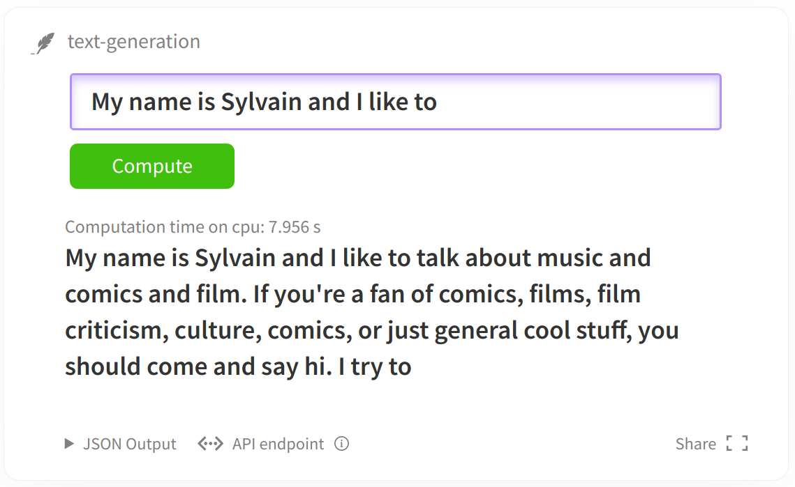
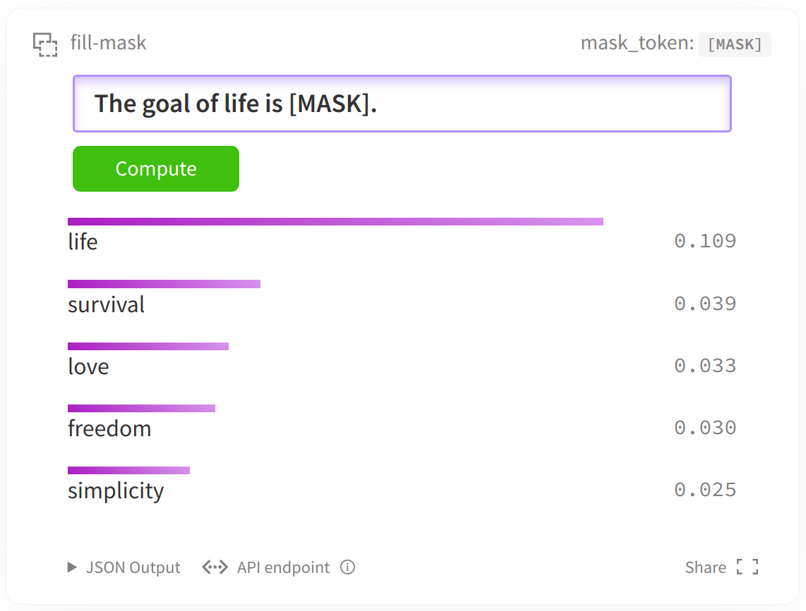
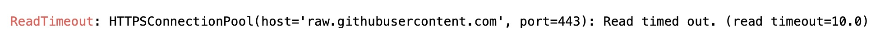

The jupter notebook involved in this article is in the [Chapter 4 code base](https://github.com/datawhalechina/learn-nlp-with-transformers/tree/main/docs/%E7%AF%87%E7%AB%A04-%E4%BD%BF%E7%94%A8Transformers%E8%A7%A3%E5%86%B3NLP%E4%BB%BB%E5%8A%A1).

It is recommended to open this tutorial directly using google colab notebook to quickly download relevant datasets and models.
If you are opening this notebook in google colab, you may need to install the Transformers and 🤗Datasets libraries. Uncomment the following commands to install.

```python
# ! pip install datasets transformers 
# -i https://pypi.tuna.tsinghua.edu.cn/simple
```

If you are opening this jupyter notebook on your local machine, please make sure your environment has the latest version of the above libraries installed.

You can find the latest version of the above libraries here (https://github.com/huggingface/transformers/tree/master/examples/language-modeling) to find the specific python script file for this jupyter notebook. You can also fine-tune your model in a distributed way using multiple GPUs or TPUs.

# Fine-tuning language model

In the current jupyter notebook, we will illustrate how to fine-tune any [🤗Transformers](https://github.com/huggingface/transformers) model using the language model task. 

This tutorial will cover two types of language modeling tasks:

+ Causal language modeling (CLM): The model needs to predict the next character in the sentence (similar to the decoder and GPT of BERT-like models, where characters are input from left to right). To ensure that the model does not cheat, the model uses an attention mask to prevent the model from seeing the characters after. For example, when the model tries to predict the character at position i+1 in the sentence, this mask will prevent it from accessing the characters after position i.



+ Masked Language Modelingd language modeling, MLM): The model needs to restore some characters that were "MASKed" in the input (pre-training task for BERT-like models). This way the model sees the entire sentence, so the model can predict the character before the "\[MASK\]" marker based on the characters before and after the "\[MASK\]" marker.



Next, we will explain how to easily load and preprocess the dataset for each task, and how to fine-tune the model using the "Trainer" API.

Of course, you can also run the python script version of this jupyter notebook directly on a distributed environment or TPU, which can be found in the [examples folder](https://github.com/huggingface/transformers/tree/master/examples).

## Prepare the data

In the following tasks, we will use [Wikitext 2](https://huggingface.co/datasets/wikitext#data-instances) dataset as an example. You can load this dataset through the 🤗Datasets library:

```python
from datasets import load_dataset
datasets = load_dataset('wikitext', 'wikitext-2-raw-v1')
```

Reusing dataset wikitext (/Users/niepig/.cache/huggingface/datasets/wikitext/wikitext-2-raw-v1/1.0.0/aa5e094000ec7afeb74c3be92c88313cd6f132d564c7effd961c10fd47c76f20)

If you get the following error:



Solution:

MAC users: Add a line ```199.232.68.133 to the ```/etc/hosts``` file raw.githubusercontent.com```

Windows users: in ```C:\Windowsws\System32\drivers\etc\hosts``` add a line ```199.232.68.133 raw.githubusercontent.com```

You can of course replace the dataset above with any dataset publicly available on [hub](https://huggingface.co/datasets) or use your own files. Simply uncomment the following cell and replace the path with the path that will lead to your file:

```python
# datasets = load_dataset("text", data_files={"train": path_to_train.txt, "validation": path_to_validation.txt}
```

You can also load datasets from csv or JSON files, see the [full documentation](https://huggingface.co/docs/datasets/loading_datasets.html#from-local-files) for more information.

To access the actual element in a data set, you need to first select a key and then give an index:

```python
datasets["text", data_files={"train": path_to_train.txt, "validation": path_to_validation.txt}
```in"][10]
```

{'text': ' The game \'s battle system , the BliTZ system , is carried over directly from Valkyira Chronicles . During missions , players select each unit using a top @-@ down perspective of the battlefield map : once a character is selected , the player moves the character around the battlefield in third @-@ person . A character can only act once per @-@ turn , but characters can be granted multiple turns at the expense of other characters \' turns . Each character has a field and distance of movement limited by their Action Gauge . Up to nine characters can be assigned to a single mission . During gameplay , characters will call out if something happens to them , such as their health points ( HP ) getting low or being knocked out by enemy attacks . Each character has specific " Potentials " , skills unique to each character . They are divided into " Personal Potential " , which are innate skills that remain unaltered unless otherwise dictated by the story and caneither help or impede a character , and " Battle Potentials " , which are grown throughout the game and always grant boons to a character . To learn Battle Potentials , each character has a unique " Masters Table " , a grid @-@ based skill table that can be used to acquire and link different skills . Characters also have Special Abilities that grant them temporary boosts on the battlefield : Kurt can activate " Direct Command " and move around the battlefield without depleting his Action Point gauge , the character Reila can shift into her " Valkyria Form " and become invincible , while Imca can target multiple enemy units with her heavy weapon . \n'}

To quickly understand the structure of the data, the function below will display some randomly picked examples from the dataset.

```python
from datasets import ClassLabel
import random
import pandas as pd
from IPython.display import display, HTML

def show_random_elements(dataset, num_examples=10):
assert num_examples <= len(dataset), "Can't pick more elements than there are in the dataset."
picks = []
for _ in range(num_examples):
pick = random.randint(0, len(dataset)-1)
while pick in picks:
pick = random.randint(0, len(dataset)-1)
picks.append(pick)

df = pd.DataFrame(dataset[picks])
for column, typ in dataset.features.items():
if isinstance(typ, ClassLabel):
df[column] = df[column].transform(lambda i: typ.names[i])
display(HTML(df.to_html()))
```

```python
show_random_elements(datasets["train"])
```

<table border="1" class="dataframe">
<thead>
<tr style="text-align: right;">
<th></th>
<th>text</th>
</tr>
</thead>
<tbody>
<tr>
<th>0</th>
<td>On 3 March 1967 , parliament decided to build four short take @-@ off and landing airports along the Helgeland coast between Trondheim and Bodø . Braathens placed an order for a de Havilland Canada DHC @-@ 6 Twin Otter and planned to start the company Braathens STOL . It applied to operate the route without subsidies , but the concession was rejected and granted with subsidies to Wideroe , which had been operating the routes using seaplanes . \n</td>
</tr>
<tr>
<th>1</th>
<td></td>
</tr>
<tr>
<th>2</th>
<td>Rao Ramesh was cast as a tantrik who helps Gill 's character in the present era . Mumaith Khan was selected for another item number , a remix version of the hit song " Bangaru Kodipetta " from Gharana Mogudu ( 1992 ) ; Gharana Mogudu 's music was also composed by M. M. Keeravani . Chiranjeevi made a special appearance after the song , making Magadheera the first film he appeared in after his entry into politics . When Rajamouli suggested the idea of ​​a cameo appearance , Chiranjeevi was initially hesitant till the director narrated the complete sequence and the importance of the song . \n</td>
</tr>
<tr>
<th>3</th>
<td></td>
</tr>
<tr>
<th>4</th>
<td></td>
</tr>
<tr>
<th>5</th>
<td>= = = Total Nonstop Action Wrestling (2015 – present ) = = = \n</td>
</tr>
<tr>
<th>6</th>
<td>The Daily Telegraph gave the visual novel the award for " Best Script " in its video game awards of 2011 , stating that " Love 's layered narrative of a high school teacher embroiled in his student ’ s worries goes places most mainstream video games wouldn 't dare . " \n</td>
</tr>
<tr>
<th>7</th>
<td></td>
</tr>
<tr>
<th>8</th>
<td></td>
</tr>
<tr>
<th>9</th><td></td>
</tr>
</tbody>
</table>

As we can see, some texts are full paragraphs of Wikipedia articles, while others are just titles or empty lines.

## Causal Language Modeling (CLM)

For Causal Language Modeling (CLM), we first get all the texts in the dataset and concatenate them after they are tokenized. Then, we will split them in examples of specific sequence lengths. In this way, the model will receive continuous chunks of text like this:

```
text1
```
or
```
text1 end [BOS_TOKEN] text2 start
```
depending on whether they span several original texts in the dataset. The labels will be the same as the input, but shifted to the left.

In this example, we will use the [`distilgpt2`](https://huggingface.co/distilgpt2) model. You can also choose any of the checkpoints listed here:

```python
model_checkpoint = "distilgpt2"
```

To use the training modelTo tokenize all the text using the vocabulary we have to download a pre-trained tokenizer. This can all be done with the AutoTokenizer class:

```python
from transformers import AutoTokenizer

tokenizer = AutoTokenizer.from_pretrained(model_checkpoint, use_fast=True)

```

We can now call the tokenizer on all the text, which can be done simply using the map method from the Datasets library. First, we define a function that calls the tokenizer on the text:

```python
def tokenize_function(examples):
return tokenizer(examples["text"])
```

We then apply it to the tokens in the datasets object, using ```batch=True``` and ```4``` processes to speed up preprocessing. We don't need the ```text``` column later, so we discard it.

```python
tokenized_datasets = datasets.map(tokenize_function, batched=True, num_proc=4, remove_columns=["text"])
```

If we now look at an element of the dataset, we’ll see that the text has been replaced by the input_ids required by the model:

```python
tokenized_datasets["train"][1]
```

{'attention_mask': [1, 1, 1, 1, 1, 1, 1, 1, 1],
'input_ids': [796, 569, 18354, 7496, 17740, 6711, 796, 220, 198]}

The next step is a little more difficult: we need to concatenate all the text together and then split the result into blocks of a specific `block_size`. To do this, we’ll use the `map` method again with the option `batch=True`. This option allows us to change the number of examples in the dataset by returning a different number of examples. This way we can create new examples from a batch of examples.

First, we need to get the maximum length used when pre-training the model. The maximum length is set to 128 here to prevent your video memory from exploding 💥.

```python
# block_size = tokenizer.model_max_length
block_size = 128
```

Then we write a preprocessing function to group our text:

```python
def group_texts(examples):
# Concatenate all texts
concatenated_examples = {k: sum(examples[k], []) for k in examples.keys()}
total_length = len(concatenated_examples[list(examples.keys())[0]])
# We remove the part corresponding to the remainder. But if the model supports it, you can add padding, you can customize this part as needed.
total_length = (total_length // block_size) * block_size
# Split by max_len.
result = {
k: [t[i : i + block_size] for i in range(0, total_length, block_size)]
for k, t in concatenated_examples.items()
}
result["labels"] = result["input_ids"].copy()
return result
```

First note that we copied the input for the labels.

This is because the 🤗 transformer library's models shift right by default, so we don't need to do it manually.

Also note that by default, the `map` method will send a batch of 1,000 examples to be processed by the preprocessing function. So here, we will remove the remainder and make the concatenated tokenized text a multiple of `block_size` every 1,000 examples. You can adjust this behavior by passing a higher batch size (which will of course be processed slower). You can also use `multiprocessing` to speed up preprocessing:

```python
lm_datasets = tokenized_datasets.map(
group_texts,
batched=True,
batch_size=1000,
num_proc=4,
)```

Now we can check that the dataset has changed: now the samples contain `block_size` consecutive blocks of characters, possibly spanning several original texts.

```python
tokenizer.decode(lm_datasets["train"][1]["input_ids"])
```

' The game and follows the " Nameless ", a penal military unit serving the nation of Gallia during the Second Europan War who perform secret black operations and are pitted against the Imperial unit " Calamaty Raven ". \n The game began development in 2010, carrying over a large portion of the work done on Valkyria Chronicles II. While it retained the standardfeatures of the series, it also underwent multiple adjustments, such as making the game more forgiving for series newcomers. Character designer Raita Honjou and composer Hitoshi Sakimoto both returned from previous entries, along with Valkyria Chronicles II director Takeshi Oz'

Now that the data is cleaned, we can instantiate our trainer. We will build a model:

```python
from transformers import AutoModelForCausalLM
model = AutoModelForCausalLM.from_pretrained(model_checkpoint)
```

Check torch version

```python

import importlib.util
# importimportlib_metadata
a = importlib.util.find_spec("torch") is not None
print(a)
# _torch_version = importlib_metadata.version("torch")
# print(_torch_version)
```

True

and some `TrainingArguments`:

```python
from transformers import Trainer, TrainingArguments
```

```python
training_args = TrainingArguments(
"test-clm",
evaluation_strategy = "epoch",
learning_rate=2e-5,
weight_decay=0.01,
)
```

We pass all of this to the `Trainer` class:

```python
trainer = Trainer(
model=model,
args=trainning_args,
train_dataset=lm_datasets["train"],
eval_dataset=lm_datasets["validation"],
)
```

Then we can train our model🌶:

```python
trainer.train()
```

0%| | 31/7002 [04:16<14:27:52, 7.47s/it]

Once training is complete, we can evaluate our model and get its perplexity on the validation set as follows:

```python
import math
eval_results = trainer.evaluate()
print(f"Perplexity: {math.exp(eval_results['eval_loss']):.2f}")
```

## Mask Language Model Modeling, MLM)

We will use the same dataset preprocessing as before with one additional step:

We will randomly "MASK" some characters (replace them with "[MASK]") and adjust the labels to onlyThe label at the "[MASK]" position (since we don't need to predict characters that are not "MASKed").

In this example, we will use the [`distilroberta-base`](https://huggingface.co/distilroberta-base) model. You can also choose any of the checkpoints listed [here](https://huggingface.co/models?filter=causal-lm):

```python
model_checkpoint = "distilroberta-base"
```

We can apply the same tokenizer function as before, we just need to update our tokenizer to use the checkpoint we just selected:

```python
tokenizer = AutoTokenizer.from_pretrained(model_checkpoint, use_fast=True)
tokenized_datasets = datasets.map(tokenize_function, batched=True, num_proc=4, remove_columns=["text"])```

Like before, we group the texts together and split them into samples of length `block_size`. If your dataset consists of individual sentences, you can skip this step.

```python
lm_datasets = tokenized_datasets.map(
group_texts,
batched=True,
batch_size=1000,
num_proc=4,
)
```

The rest is very similar to what we did before, with two exceptions. First we use a model that fits a masked language model:

```python
from transformers import AutoModelForMaskedLM
model = AutoModelForMaskedLM.from_pretrained(model_checkpoint)
```

Second, we use a special data_collator. A data_collator is a function that is responsible for taking samples and batching them into tensors.

In the previous example, we didn't have anything special to do, so we just used the default value for this parameter. Here we are doing a random "MASK".

We can use this asThe preprocessing step (`tokenizer`) is processed, but at each stage, the characters are always masked in the same way. By performing this step in the data_collator, we can ensure that the random masking is done in a new way each time the data is examined.

To implement masking, `Transformers` provides a `DataCollatorForLanguageModeling` for masked language models. We can adjust the probability of masking:

```python
from transformers import DataCollatorForLanguageModeling
data_collator = DataCollatorForLanguageModeling(tokenizer=tokenizer, mlm_probability=0.15)
```

Then we have to pass everything to the trainer and start training:

```python
trainer = Trainer(
model=model,
args=training_args,
train_dataset=lm_datasets["train"],
eval_dataset=lm_datasets["validation"],
data_collator=data_collator,
)
```

```python
trainer.train()
```

Like before, we can evaluate our model on the validation set.

The perplexity is much lower compared to the CLM objective because for the MLM objective we only need to predict on the hidden tokens (here 15% of the total) while having access to the rest of the tokens.

Hence, it is an easier task for the model.

```python
eval_results = trainer.evaluate()
print(f"Perplexity: {math.exp(eval_results['eval_loss']):.2f}")
```

```python
Don't forget to [upload](https://huggingface.co/transformers/model_sharing.html) your model to the [🤗 Model Hub](https://huggingface.co/models).
```