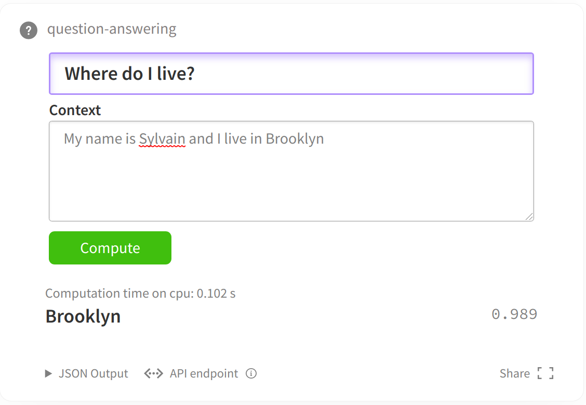

इस लेख में शामिल जप्टर नोटबुक [अध्याय 4 कोड बेस](https://github.com/datawhalechina/learn-nlp-with-transformers/tree/main/docs/%E7%AF%87%E7%) में है AB%A04-%E4%BD%BF%E7%94%A8Transformers%E8%A7%A3%E5%86%B3NLP%E4%BB%BB%E5%8A%A1).

प्रासंगिक डेटासेट और मॉडल को तुरंत डाउनलोड करने के लिए इस ट्यूटोरियल को सीधे Google कोलाब नोटबुक का उपयोग करके खोलने की अनुशंसा की जाती है।
यदि आप इस नोटबुक को Google कोलैब में खोल रहे हैं, तो आपको ट्रांसफॉर्मर और 🤗डेटासेट लाइब्रेरीज़ को इंस्टॉल करने की आवश्यकता हो सकती हैस्थापित करने के लिए निम्न आदेश।

```अजगर
# !पिप डेटासेट ट्रांसफार्मर स्थापित करें
```

# मशीन प्रश्न उत्तर कार्य पर ट्रांसफार्मर मॉडल को फाइन-ट्यून करें

इस नोटबुक में, हम सीखेंगे कि मशीन प्रश्न उत्तर कार्यों को हल करने के लिए [🤗 ट्रांसफॉर्मर्स] (https://github.com/huggingface/transformers)rmer मॉडल के ट्रांसफॉर्मर मॉडल को कैसे ठीक किया जाए। यह लेख मुख्य रूप से एक्सट्रैक्टिव प्रश्न उत्तर को हल करता है कार्य: एक प्रश्न और एक पाठ दिया गया है, उस पाठ खंड (स्पैन) को खोजें जो प्रश्न का उत्तर दे सकेटेक्स्ट से स्टियन। 'ट्रेनर' एपीआई और डेटासेट पैकेज का उपयोग करके, हम आसानी से डेटासेट लोड करेंगे और फिर ट्रांसफॉर्मर को फाइन-ट्यून करेंगे। नीचे दिया गया चित्र एक सरल उदाहरण दिखाता है


**नोट:** नोट: इस लेख में प्रश्न का उत्तर देने का कार्य पाठ से उत्तर निकालना है, न कि सीधे उत्तर उत्पन्न करना!

इस नोटबुक में डिज़ाइन किए गए उदाहरणों का उपयोग SQU के समान किसी भी निष्कर्षात्मक प्रश्न उत्तर कार्य को हल करने के लिए किया जा सकता हैAD 1 और SQUAD 2, और [मॉडल लाइब्रेरी मॉडल हब] (https://huggingface.co/models) में किसी भी मॉडल चेकपॉइंट का उपयोग किया जा सकता है, जब तक कि इन मॉडलों में एक टोकन वर्गीकरण हेड और एक तेज़ टोकननाइज़र होता है मॉडल और तेज़ टोकननाइज़र के बीच पत्राचार, देखें: [यह तालिका] (https://huggingface.co/transformers/index.html#bigtable)।

यदि आपका डेटासेट इस नोटबुक से अलग है, तो आप अपने हार्डवेयर (कंप्यूटर एम) के आधार पर, केवल मामूली समायोजन के साथ सीधे इस नोटबुक का उपयोग कर सकते हैंएमोरी, ग्राफिक्स कार्ड आकार), आपको आउट-ऑफ-मेमोरी त्रुटियों से बचने के लिए बैच आकार को उचित रूप से समायोजित करने की आवश्यकता है।
उन तीन मापदंडों को सेट करें, फिर बाकी नोटबुक सुचारू रूप से चलनी चाहिए:

```अजगर
# स्क्वाड_v2 क्रमशः SQUAD v1 या SQUAD v2 का उपयोग करने के लिए सही या गलत के बराबर है।
# यदि आप अन्य डेटासेट का उपयोग कर रहे हैं, तो सत्य का अर्थ है कि मॉडल "अनिवार्य" प्रश्नों का उत्तर दे सकता है, अर्थात, कुछ प्रश्नों का उत्तर नहीं दिया गया है, जबकि गलत का अर्थ है कि सभी प्रश्नों का उत्तर दिया जाना चाहिए।
स्क्वाड_v2 = ग़लत
मॉडल_चेकपॉइंट = "डिस्टिलबर्ट-बेस-अनकेस्ड"
बैच_आकार = 16
```

## डेटासेट लोड करें

हम डेटा डाउनलोड करने और हमें आवश्यक मेट्रिक्स प्राप्त करने के लिए (बेंचमार्क के साथ तुलना करने के लिए) [🤗 डेटासेट] (https://github.com/huggingface/datasets) लाइब्रेरी का उपयोग करेंगे।

इन दोनों कार्यों को `load_dataset` और `load_metric` फ़ंक्शन का उपयोग करके आसानी से पूरा किया जा सकता है।

```अजगर
डेटासेट से लोड_डेटासेट, लोड_मेट्रिक आयात करें
```

उदाहरण के लिए, हम इस नोटबुक सिमिलर में [SQUAD डेटासेट](https://rajpurkar.github.io/SQuAD-explorer/) का उपयोग करेंगेवाई, यह नोटबुक डेटासेट लाइब्रेरी द्वारा प्रदान किए गए सभी प्रश्न उत्तर डेटासेट के साथ भी संगत है।

यदि आप अपने स्वयं के डेटासेट (json या csv प्रारूप) का उपयोग कर रहे हैं, तो लोड करने का तरीका जानने के लिए कृपया [डेटासेट दस्तावेज़] (https://huggingface.co/docs/datasets/loading_datasets.html#from-local-files) देखें आपका अपना डेटासेट। आपको प्रत्येक कॉलम के लिए उपयोग किए गए नामों को समायोजित करने की आवश्यकता हो सकती है।

```अजगर
# डेटा डाउनलोड करें (सुनिश्चित करें कि आपके पास नेटवर्क है)
डेटासेट = लोड_डेटासेट ("स्क्वाड_v2" यदि स्क्वाड_v2 अन्यथा "स्क्वाड")```

यह `डेटासेट` ऑब्जेक्ट एक [`डेटासेटडिक्ट`](https://huggingface.co/docs/datasets/package_reference/main_classes.html#datasetdict) संरचना है, और प्रशिक्षण, सत्यापन और परीक्षण क्रमशः इस निर्देश में एक कुंजी के अनुरूप हैं .

```अजगर
# निम्नलिखित डेटासेट और उनके गुण देखें
डेटासेट
```

डेटासेटडिक्ट({
ट्रेन: डेटासेट({
विशेषताएं: ['आईडी', 'शीर्षक', 'संदर्भ', 'प्रश्न', 'उत्तर'],
num_rows: 87599
})
सत्यापन: डेटासेट({
विशेषताएं: ['आईडी', 'शीर्षक', 'संदर्भ', 'प्रश्न', 'उत्तर'],
num_rows: 10570})
})

चाहे वह प्रशिक्षण सेट हो, सत्यापन सेट हो या परीक्षण सेट हो, प्रत्येक प्रश्नोत्तर डेटा नमूने में तीन कुंजी होंगी: "संदर्भ", "प्रश्न" और "उत्तर"।

हम किसी नमूने का चयन करने के लिए सबस्क्रिप्ट का उपयोग कर सकते हैं।

```अजगर
डेटासेट["ट्रेन"][0]
# उत्तर उत्तर दर्शाते हैं
# सन्दर्भ पाठ अंशों का प्रतिनिधित्व करता है
# प्रश्न प्रश्नों का प्रतिनिधित्व करता है
```

{'उत्तर': {'उत्तर_प्रारंभ': [515], 'पाठ': ['सेंट बर्नाडेट सोबिरस']},
'संदर्भ': 'वास्तुकला की दृष्टि से, स्कूल का चरित्र कैथोलिक हैभवन का सोने का गुंबद वर्जिन मैरी की एक स्वर्ण प्रतिमा है। मुख्य भवन के ठीक सामने और उसके सामने, मुख्य भवन के बगल में "वेनाइट एड मी ओम्नेस" के साथ हथियार उठाए हुए ईसा मसीह की एक तांबे की मूर्ति है पवित्र हृदय का बेसिलिका है। बेसिलिका के ठीक पीछे ग्रोटो है, जो प्रार्थना और चिंतन का एक मैरिएन स्थान है। यह फ्रांस के लूर्डेस में ग्रोटो की प्रतिकृति है जहां वर्जिन मैरी ने 1858 में सेंट बर्नाडेट सोबिरस को दर्शन दिए थे। के अंतमुख्य ड्राइव (और एक सीधी रेखा में जो 3 मूर्तियों और गोल्ड डोम से जुड़ती है), मैरी की एक सरल, आधुनिक पत्थर की मूर्ति है।',
'आईडी': '5733be284776f41900661182',
'प्रश्न': 'वर्जिन मैरी कथित तौर पर 1858 में लूर्डेस फ्रांस में किसके सामने प्रकट हुई थीं?',
'शीर्षक': 'यूनिवर्सिटी_ऑफ़_नोट्रे_डेम'}

उत्तरों के एनोटेशन पर ध्यान दें। टेक्स्ट स्निपेट में उत्तर पाठ के अलावा, उत्तर उत्तर की स्थिति भी देते हैं (वर्ण की शुरुआत से गिना जाता है, उपरोक्त उदाहरण में 515वां)।

टीo आगे समझें कि डेटा कैसा दिखता है, निम्नलिखित फ़ंक्शन प्रदर्शन के लिए डेटासेट से यादृच्छिक रूप से कुछ उदाहरणों का चयन करेगा।

```अजगर
डेटासेट से क्लास लेबल, अनुक्रम आयात करें
यादृच्छिक आयात करें
पांडा को पीडी के रूप में आयात करें
IPython.display से आयात डिस्प्ले, HTML

def show_random_elements(डेटासेट, num_examples=10):
assert num_examples <= len(डेटासेट), "डेटासेट में मौजूद तत्वों से अधिक तत्व नहीं चुन सकते।"
चुनता है = []
रेंज में _ के लिए (num_examples):
पिक = रैंडम.रैंडिंट(0, लेन(डेटासेट)-1)
जबकिचयन में चयन करें:
पिक = रैंडम.रैंडिंट(0, लेन(डेटासेट)-1)
चुनता है.जोड़ें(चुनें)

डीएफ = पीडी.डेटाफ़्रेम(डेटासेट[चुनता है])
कॉलम के लिए, dataset.features.items() टाइप करें:
यदि isinstance(प्रकार, क्लासलेबल):
डीएफ[कॉलम] = डीएफ[कॉलम].ट्रांसफॉर्म(लैम्ब्डा आई: टाइप.नाम[आई])
elif isinstance(type, Sequence) और isinstance(typ.feature, ClassLabel):
डीएफ[कॉलम] = डीएफ[कॉलम].ट्रांसफॉर्म(लैम्ब्डा एक्स: [टाइप.फीचर.नाम[आई] फॉर आई इन एक्स])
डिस्प्ले(HTML(df.to_html()))
```

```अजगर
show_random_elements(डेटासेट["ट्रेन"], num_examples=2)
```<तालिका सीमा = "1" वर्ग = "डेटाफ़्रेम">
<सिर>
<tr शैली = "पाठ-संरेखण: दाएं;">
<थ></थ>
<th>उत्तर</th>
<th>संदर्भ</th>
<th>आईडी</th>
<th>प्रश्न</th>
<th>शीर्षक</th>
</tr>
</thead>
<tbody><tr>
<th>0</th>
<td>{'answer_start': [185], 'text': ['डीजल ईंधन']}</td>
<td>अल्बर्टा में, पांच बिटुमेन अपग्रेडर सिंथेटिक कच्चे तेल और कई अन्य उत्पादों का उत्पादन करते हैं: फोर्ट मैकमरे के पास सनकोर एनर्जी अपग्रेडर, अल्बर्टा सिंथेटिक कच्चे तेल और डीजल ईंधन का उत्पादन करता है, कैनेडियन नेचर;अल रिसोर्सेज, और फोर्ट मैकमरे के पास नेक्सन अपग्रेडर सिंथेटिक कच्चे तेल का उत्पादन करते हैं; और एडमॉन्टन के पास शेल स्कॉटफोर्ड अपग्रेडर सिंथेटिक कच्चे तेल के साथ-साथ पास के शेल ऑयल रिफाइनरी के लिए एक मध्यवर्ती फीडस्टॉक का उत्पादन करता है, जो 2015 में रेडवाटर, अल्बर्टा के पास निर्माणाधीन है अपने कच्चे बिटुमेन के आधे हिस्से को सीधे डीजल ईंधन में अपग्रेड करें, शेष उत्पादन को पास के तेल रिफाइनरियों और पेट्रोकेमिकल संयंत्रों को फीडस्टॉक के रूप में बेचा जाएगा।</td>
<td>571b074c9499d21900609be3</tघ>
<td>कच्चे तेल के अलावा, सनकोर एनर्जी संयंत्र क्या उत्पादन करता है?</td>
<td>डामर</td>
</tr>
<tr>
<th>1</th>
<td>{'answer_start': [191], 'text': ['गैलीलियो प्रणाली के लिए GIOVE उपग्रह']}</td>
<td>कम्पास-एम1 एक प्रायोगिक उपग्रह है जिसे सिग्नल परीक्षण और सत्यापन और आवृत्ति फाइलिंग के लिए 14 अप्रैल 2007 को लॉन्च किया गया था। कम्पास के लिए कम्पास-एम1 की भूमिका गैलीलियो कक्षा के लिए जीआईओवीई उपग्रहों की भूमिका के समान है कम्पास-एम1 लगभग गोलाकार है, इसमें ऊंचाई है21,150 किमी और 55.5 डिग्री का झुकाव।</td>
<td>56e1161ccd28a01900c6757b</td>
<td>कम्पास-एम1 उपग्रह का उद्देश्य अन्य किस उपग्रह के उद्देश्य के समान है?</td>
<td>BeiDou_नेविगेशन_सैटेलाइट_सिस्टम</td>
</tr>
</tbody>
</तालिका>

## प्रशिक्षण डेटा को प्रीप्रोसेस करना

मॉडल में डेटा फीड करने से पहले, हमें डेटा को प्रीप्रोसेस करना होगा। प्रीप्रोसेसिंग टूल को `टोकनाइज़र` कहा जाता है। पहले इनपुट को टोकनाइज़ करता है, फिर टोकन को संबंधित में परिवर्तित करता हैप्री-मॉडल में आवश्यक टोकन आईडी, और फिर इसे मॉडल द्वारा आवश्यक इनपुट प्रारूप में परिवर्तित करता है।

डेटा प्रीप्रोसेसिंग के उद्देश्य को प्राप्त करने के लिए, हम अपने टोकननाइज़र को इंस्टेंट करने के लिए `AutoTokenizer.from_pretrained` विधि का उपयोग करते हैं, जो सुनिश्चित करता है:

- हमें एक टोकननाइज़र मिलता है जो एक-एक करके पूर्व-प्रशिक्षित मॉडल से मेल खाता है।
- निर्दिष्ट मॉडल चेकपॉइंट के अनुरूप टोकननाइज़र का उपयोग करते समय, हम मॉडल द्वारा आवश्यक शब्दावली, अधिक सटीक रूप से, टोकन शब्दावली भी डाउनलोड करते हैं।ई डाउनलोड किए गए टोकन शब्दावली को कैश किया जाएगा ताकि दोबारा उपयोग करने पर इसे दोबारा डाउनलोड न किया जा सके।

```अजगर
ट्रांसफार्मर से ऑटोटोकनाइज़र आयात करें

टोकननाइज़र = AutoTokenizer.from_pretrained(model_checkpoint)
```

निम्नलिखित कोड के लिए आवश्यक है कि टोकननाइज़र ट्रांसफार्मर प्रकार का होना चाहिए। PreTrainedTokenizerFast, क्योंकि हमें प्रीप्रोसेसिंग के दौरान फास्ट टोकननाइज़र (जैसे मल्टी-थ्रेडेड फास्ट टोकननाइज़र) की कुछ विशेष सुविधाओं का उपयोग करने की आवश्यकता होती है।

मॉडलों से संबंधित लगभग सभी टोकननाइज़र में कोर होता हैतेजी से प्रतिक्रिया देने वाले टोकनाइज़र। हम [मॉडल टोकनाइज़र कॉरेस्पोंडेंस टेबल] (https://huggingface.co/transformers/index.html#bigtable) में पूर्व-प्रशिक्षित मॉडल के अनुरूप सभी टोकनाइज़र की विशेषताओं को देख सकते हैं।

```अजगर
ट्रांसफार्मर आयात करें
ज़ोर isinstance(टोकनाइज़र, ट्रांसफार्मर.PreTrainedTokenizerFast)
```

```अजगर
# यदि हम टोकननाइज़र प्रीप्रोसेसिंग के बाद टेक्स्ट फॉर्मेट देखना चाहते हैं, तो हम केवल टोकननाइज़र की टोकननाइज़ विधि का उपयोग करते हैं, विशेष टोकन जोड़ने का अर्थ है पी द्वारा आवश्यक विशेष टोकन जोड़नापुनः प्रशिक्षित मॉडल.
प्रिंट करें ("एकल पाठ टोकननाइज़: {}"। प्रारूप (टोकनाइज़र.टोकनाइज़ ("आपका नाम क्या है?"), add_special_tokens=True))
प्रिंट करें ("2 टेक्स्ट टोकननाइज़: {}"। प्रारूप (टोकनाइज़र.टोकनाइज़ ("मेरा नाम सिल्वेन है।", add_special_tokens=True)))
# पूर्व-प्रशिक्षित मॉडल के इनपुट प्रारूप के लिए टोकन आईडी और एक एटेटनियन मास्क की आवश्यकता होती है। पूर्व-प्रशिक्षित मॉडल प्रारूप के लिए आवश्यक इनपुट प्राप्त करने के लिए आप निम्न विधि का उपयोग कर सकते हैं।
```

एकल पाठ टोकननाइज़: ['क्या', 'है', 'आपका', 'नाम', '?']
2 टेक्स्ट टोकननाइज़: ['[सीएलएस]','माय', 'नाम', 'है', 'sy', '##lva', '##in', '.', '[SEP]']

टोकनेज़र एक एकल पाठ या पाठों की एक जोड़ी को प्रीप्रोसेस कर सकता है। टोकनेज़र प्रीप्रोसेसिंग के बाद प्राप्त डेटा पूर्व-प्रशिक्षित मॉडल के इनपुट प्रारूप से मिलता है

```अजगर
# एकल पाठ को प्रीप्रोसेस करें
टोकननाइज़र ("आपका नाम क्या है?")
```

{'इनपुट_आईडी': [101, 2054, 2003, 2115, 2171, 1029, 102], 'अटेंशन_मास्क': [1, 1, 1, 1, 1, 1, 1]}

```अजगर
# प्रीप्रोसेस 2 टेक्स्ट। आप देख सकते हैं कि टोकनाइज़र शुरुआत में 101 टोकन आईडी और बीच में 102 टोकन जोड़ता हैdle. आईडी दो पाठों को अलग करती है और 102 के साथ समाप्त होती है। ये नियम पूर्व-प्रशिक्षित मॉडल द्वारा डिज़ाइन किए गए हैं।
टोकननाइज़र ("आपका नाम क्या है?", "मेरा नाम सिल्वेन है।")
```

{'इनपुट_आईडी': [101, 2054, 2003, 2115, 2171, 1029, 102, 2026, 2171, 2003, 25353, 22144, 2378, 1012, 102], 'अटेंशन_मास्क': [1, 1, 1, 1, 1, 1, 1, 1, 1, 1, 1, 1, 1, 1]}

जो टोकन आईडी या इनपुट_आईडी आप ऊपर देखते हैं, वे आम तौर पर पूर्व-प्रशिक्षित मॉडल के नाम के साथ भिन्न होते हैं। इसका कारण यह है कि अलग-अलग पूर्व-प्रशिक्षित मॉडल अलग-अलग आरयू सेट करते हैंपूर्व-प्रशिक्षण के दौरान। लेकिन जब तक टोकनाइज़र और मॉडल के नाम समान हैं, टोकनाइज़र प्रीप्रोसेसिंग का इनपुट प्रारूप मॉडल आवश्यकताओं को पूरा करेगा, [इस ट्यूटोरियल] को देखें। https://huggingface.co/transformers/preprocessing.html)

अब हमें यह भी सोचने की ज़रूरत है कि पूर्व-प्रशिक्षित मशीन प्रश्न उत्तर देने वाले मॉडल बहुत लंबे टेक्स्ट को कैसे संभालते हैं, सामान्यतया, पूर्व-प्रशिक्षित मॉडल इनपुट के लिए अधिकतम लंबाई की आवश्यकता होती है, इसलिए हमहालाँकि, यदि हम प्रश्न-उत्तर डेटा में ओवरलॉन्ग संदर्भ को तीन <प्रश्न, संदर्भ, उत्तर> से छोटा करते हैं, तो हम उत्तर खो सकते हैं (क्योंकि हम इस समस्या को हल करने के लिए उत्तर के रूप में एक छोटा सा स्निपेट निकालते हैं)। निम्नलिखित कोड लंबाई से अधिक होने का एक उदाहरण ढूंढता है और फिर आपको दिखाता है कि इसे कैसे संभालना है। हम लंबे इनपुट को कई छोटे इनपुट में विभाजित करते हैं, जिनमें से प्रत्येक को मॉडल की अधिकतम लंबाई इनपुट आवश्यकता को पूरा करना होगा क्योंकि उत्तर मौजूद हो सकता हैस्लाइस, हमें आसन्न स्लाइस के बीच इंटरसेक्शन की अनुमति देने की आवश्यकता है, जिसे कोड में `doc_stride` पैरामीटर द्वारा नियंत्रित किया जाता है।

मशीन प्रश्न उत्तर देने वाले पूर्व-प्रशिक्षित मॉडल आमतौर पर प्रश्न और संदर्भ को इनपुट के रूप में जोड़ते हैं, और फिर मॉडल को संदर्भ से उत्तर ढूंढने देते हैं।

```अजगर
अधिकतम_लंबाई = 384 # प्रश्न और संदर्भ को संयोजित करने के बाद इनपुट सुविधा की अधिकतम लंबाई
doc_stride = 128 # 2 स्लाइस के बीच ओवरलैपिंग टोकन की संख्या।
```

फॉर लूप डेटा के माध्यम से पुनरावृत्त होता हैएसेट और एक अत्यंत लंबे नमूने की तलाश करता है। नोटबुक उदाहरण मॉडल के लिए आवश्यक अधिकतम इनपुट 384 है (512 भी आमतौर पर उपयोग किया जाता है)

```अजगर
मेरे लिए, उदाहरण के लिए गणना करें (डेटासेट["ट्रेन"]):
यदि लेन(टोकनाइज़र(उदाहरण["प्रश्न"], उदाहरण["संदर्भ"])["input_ids"]) > 384:
तोड़ना
उदाहरण = डेटासेट["ट्रेन"][i]
```

यदि इसे छोटा नहीं किया गया है, तो इनपुट लंबाई 396 है

```अजगर
लेन(टोकनाइज़र(उदाहरण["प्रश्न"], उदाहरण["संदर्भ"])["input_ids"])
```

396

अब यदि हम 3 की अधिकतम लंबाई तक काट-छांट करते हैं84, अतिरिक्त-लंबे भाग की जानकारी खो जाएगी

```अजगर
लेन (टोकनाइज़र (उदाहरण ["प्रश्न"], उदाहरण ["संदर्भ"], अधिकतम लंबाई = अधिकतम लंबाई, ट्रंकेशन = "केवल_सेकंड") ["इनपुट_आईडी"])
```

384

ध्यान दें कि सामान्य तौर पर, हम केवल संदर्भ को काटते हैं, प्रश्न को नहीं। चूंकि संदर्भ प्रश्न के बाद दूसरे पाठ के अनुरूप होता है, हम इसे नियंत्रित करने के लिए `only_third` का उपयोग करते हैं। ओवरलैप लंबाई को नियंत्रित करने के लिए टोकननाइज़र `doc_stride` का उपयोग करता है स्लाइस के बीच.

```अजगर
टोकननाइज्ड_उदाहरण = टोकनइज़ेर(
उदाहरण["प्रश्न"],
उदाहरण["संदर्भ"],
अधिकतम_लंबाई=अधिकतम_लंबाई,
ट्रंकेशन = "केवल_सेकंड",
return_overflowing_tokens=सत्य,
स्ट्राइड=doc_स्ट्राइड
)
```

सुपर लॉन्ग इनपुट की स्लाइसिंग के कारण हमें कई इनपुट मिलते हैं, इन इनपुट_आईडी की लंबाई होती है

```अजगर
[टोकनकृत_उदाहरण में x के लिए len(x)["input_ids"]]
```

[384,157]

हम पूर्व-संसाधित टोकन आईडी, इनपुट_आईडी को टेक्स्ट प्रारूप में पुनर्स्थापित कर सकते हैं:

```अजगर
i, x के लिए enumerate(tokenized_example["input_ids"][:2]):
प्रिंट करें ("स्लाइस: {}"। प्रारूप (i))
पंचायती राजnt(tokenizer.decode(x))
```स्लाइस: 0
[सीएलएस] नोट्रे डेम पुरुषों की बास्केटबॉल टीम ने कितनी जीत हासिल की है? [एसईपी] पुरुषों की बास्केटबॉल टीम ने 1,600 से अधिक जीत हासिल की हैं, जो केवल 12 स्कूलों में से एक है जो उस आंकड़े तक पहुंची है, और 28 एनसीएए टूर्नामेंट में भाग ले चुकी है ऑस्टिन कैर के नाम टूर्नामेंट के एक गेम में सर्वाधिक 61 अंक हासिल करने का रिकॉर्ड है। हालांकि टीम ने कभी भी एनसीएए टूर्नामेंट नहीं जीता है, लेकिन उन्हें हेल्म्स एथलेटिक फाउंडेशन द्वारा दो बार राष्ट्रीय चैंपियन के रूप में नामित किया गया थानंबर एक रैंक वाली टीमों के लिए कई उलटफेर किए हैं, जिनमें से सबसे उल्लेखनीय था 1974 में यूसीएलए के रिकॉर्ड 88 - गेम जीतने के सिलसिले को समाप्त करना। टीम ने अतिरिक्त आठ नंबर - एक टीमों को हराया है, और वे नौ जीत यूसीएलए के बाद दूसरे स्थान पर हैं। 10, सर्वकालिक शीर्ष टीम के खिलाफ जीत में टीम नव पुनर्निर्मित परसेल पवेलियन (एडमंड पी. जॉयस सेंटर के भीतर) में खेलती है, जो 2009-2010 सीज़न की शुरुआत के लिए फिर से खोला गया, टीम को माइक ब्रे द्वारा प्रशिक्षित किया गया है। जो, 201 के अनुसार4 - 15 सीज़न, नोट्रे डेम में उनका पंद्रहवां, 2009 में 332 - 165 का रिकॉर्ड हासिल किया, उन्हें एनआईटी के लिए आमंत्रित किया गया, जहां वे सेमीफाइनल में पहुंचे लेकिन पेन स्टेट ने उन्हें हरा दिया, जिन्होंने चैंपियनशिप में बायलर को हराया। 2010 - 11 की टीम ने 25 - 5 के रिकॉर्ड के साथ अपने नियमित सीज़न को देश में सातवें स्थान पर समाप्त किया, ब्रे की लगातार पांचवीं 20 - जीत सीज़न, और 2014 - 15 सीज़न के दौरान बिग ईस्ट में दूसरे स्थान पर रही। टीम 32-6 से आगे रही और एसीसी सम्मेलन जीताई टूर्नामेंट, बाद में एलीट 8 में आगे बढ़ा, जहां एनबीए ड्राफ्ट पिक्स जेरियन ग्रांट और पैट कनॉटन के नेतृत्व में तत्कालीन अपराजित केंटुकी के खिलाफ लड़ते हुए आयरिश एक मिस्ड बजर-बीटर पर हार गए, इस दौरान लड़ते हुए आयरिश ने अंतिम राष्ट्रीय चैंपियन ड्यूक ब्लू डेविल्स को दो बार हराया। सीज़न में 32 जीतें थीं [सितम्बर]
टुकड़ा: 1
[सीएलएस] नोट्रे डेम पुरुषों की बास्केटबॉल टीम ने कितनी जीत हासिल की है? [एसईपी] चैंपियनशिप 2010-11 टीम ने अपने नियमित सत्र का समापन देश में सातवें स्थान पर किया25-5 का रिकॉर्ड, ब्रे की लगातार पांचवीं 20-जीत सीज़न, और 2014-15 सीज़न के दौरान बिग ईस्ट में दूसरे स्थान पर रही, टीम 32-6 से आगे हो गई और एसीसी कॉन्फ्रेंस टूर्नामेंट जीता, बाद में अभिजात वर्ग में आगे बढ़ी। 8, जहां फाइटिंग आयरिश तत्कालीन अपराजित केंटुकी के खिलाफ मिस्ड बजर-बीटर पर हार गया, एनबीए ड्राफ्ट पिक्स जेरियन ग्रांट और पैट कनॉटन के नेतृत्व में फाइटिंग आयरिश ने सीजन के दौरान अंतिम राष्ट्रीय चैंपियन ड्यूक ब्लू डेविल्स को दो बार हराया सबसे ज्यादा लड़ाई से1908-09 से आयरिश टीम। [सितम्बर]

चूंकि हमने लंबे पाठ को काट दिया है, इसलिए हमें उत्तर स्थिति फिर से ढूंढने की आवश्यकता है (प्रत्येक संदर्भ की शुरुआत के सापेक्ष)। मशीन प्रश्न उत्तर मॉडल उत्तर स्थिति (उत्तर की शुरुआत और अंत स्थिति) का उपयोग करेगा। प्रारंभ और अंत) प्रशिक्षण लेबल के रूप में (उत्तर के टोकन आईडीएस के बजाय)। इसलिए स्लाइस को मूल इनपुट के साथ संबंधित संबंध, स्लाइसिंग के बाद संदर्भ में प्रत्येक टोकन की स्थिति और स्थिति की आवश्यकता होती है।मूल लंबे संदर्भ में, टोकननाइज़र में, आप इस पत्राचार का मानचित्र प्राप्त करने के लिए `रिटर्न_ऑफ़सेट्स_मैपिंग` पैरामीटर का उपयोग कर सकते हैं:

```अजगर
टोकननाइज्ड_उदाहरण = टोकननाइजर(
उदाहरण["प्रश्न"],
उदाहरण["संदर्भ"],
अधिकतम_लंबाई=अधिकतम_लंबाई,
ट्रंकेशन = "केवल_सेकंड",
return_overflowing_tokens=सत्य,
return_offsets_mapping=सत्य,
स्ट्राइड=doc_स्ट्राइड
)
# स्लाइस के पहले और बाद में स्थिति सबस्क्रिप्ट के बीच पत्राचार प्रिंट करें
प्रिंट (टोकनयुक्त_उदाहरण["ऑफ़सेट_मैपिंग"][0][:100])
```[(0, 0), (0, 3), (4, 8), (9, 13), (14, 18), (19, 22), (23, 28), (29, 33), ( 34, 37), (37, 38), (38, 39), (40, 50), (51, 55), (56, 60), (60, 61), (0, 0), (0, 3), (4, 7), (7, 8), (8, 9), (10, 20), (21, 25), (26, 29), (30, 34), (35, 36) , (36, 37), (37, 40), (41, 45), (45, 46), (47, 50), (51, 53), (54, 58), (59, 61), ( 62, 69), (70, 73), (74, 78), (79, 86), (87, 91), (92, 96), (96, 97), (98, 101), (102, 106), (107, 115), (116, 118), (119, 121), (122, 126), (127, 138), (138, 139), (140, 146), (147, 153)), (154, 160), (161, 165), (166, 171), (172, 175), (176, 182), (183, 186), (187, 191), (192, 198), (199, 205), (206, 208), (209, 210), (211, 217), (218, 222), (223, 225), (226, 229), (230, 240), (241) , 245), (246, 248), (248, 249), (250, 258), (259, 262), (263, 267), (268, 271), (272, 277), (278, 281 ), (282, 285), (286, 290), (291, 301), (301, 302), (303, 307), (308, 312), (313, 318), (319, 321), (322, 325), (326, 330), (330, 331), (332, 340), (341, 351), (352, 354), (355, 363), (364, 373), (374 ,379), (379, 380), (381, 384), (385, 389), (390, 393), (394, 406), (407, 408), (409, 415), (416, 418) ]
[0, 0]

उपरोक्त मूल संदर्भ स्लाइस मेंटोकनाइज्ड_उदाहरण के 0वें स्लाइस के पहले 100 टोकन की स्थिति को प्रिंट करता है। ध्यान दें कि पहला टोकन `[सीएलएस]` (0, 0) पर सेट है क्योंकि यह टोकन प्रश्न का हिस्सा नहीं है। उत्तर। दूसरे टोकन की आरंभ और समाप्ति स्थिति 0 और 3 है। हम स्लाइसिंग के बाद संबंधित टोकन को टोकन आईडी के अनुसार परिवर्तित कर सकते हैं;मूल स्थिति पर टोकन खोजने के लिए स्लाइस करने से पहले टोकन स्थिति पर वापस मैप करने के लिए ffset_mapping` पैरामीटर। चूंकि प्रश्न को संदर्भ से पहले संयोजित किया गया है, हम इसे सबस्क्रिप्ट के अनुसार सीधे प्रश्न से पा सकते हैं।

```अजगर
फर्स्ट_टोकन_आईडी = टोकनयुक्त_उदाहरण["इनपुट_आईडी"][0][1]
ऑफसेट = टोकनयुक्त_उदाहरण["ऑफसेट_मैपिंग"][0][1]
print(tokenizer.convert_ids_to_tokens([first_token_id])[0], उदाहरण["प्रश्न"][ऑफसेट[0]:ऑफसेट[1]])
```

कैसे कैसे

इसलिए, हम जी.ईस्लाइस से पहले और बाद में स्थिति पत्राचार के लिए हमें प्रश्न और संदर्भ के बीच अंतर करने के लिए `sequence_ids` पैरामीटर का भी उपयोग करने की आवश्यकता है।

```अजगर
अनुक्रम_आईडी = टोकनयुक्त_उदाहरण.अनुक्रम_आईडी()
प्रिंट(अनुक्रम_आईडी)
```

[कोई नहीं, 0, 0, 0, 0, 0, 0, 0, 0, 0, 0, 0, 0, 0, कोई नहीं, 1, 1, 1, 1, 1, 1, 1, 1, 1, 1, 1 , 1, 1, 1, 1, 1, 1, 1, 1, 1, 1, 1, 1, 1, 1, 1, 1, 1, 1, 1, 1, 1, 1, 1, 1, 1, 1, 1, 1 , 1, 1, 1, 1, 1, 1, 1, 1, 1, 1, 1, 1, 1, 1, 1, 1, 1, 1, 1, 1, 1, 1, 1, 1, 1, 1, 1, 1 , 1, 1, 1, 1, 1, 1, 1, 1, 1, 1, 1,1, 1, 1, 1, 1, 1, 1, 1, 1, 1, 1, 1, 1, 1, 1, 1, 1, 1, 1, 1, 1, 1, 1, 1, 1, 1, 1, 1, 1, 1, 1, 1, 1, 1, 1, 1, 1, 1, 1, 1, 1, 1, 1, 1, 1, 1, 1, 1, 1, 1, 1, 1, 1, 1, 1, 1, 1, 1, 1, 1, 1, 1, 1, 1, 1, 1, 1, 1, 1, 1, 1, 1, 1, 1, 1, 1, 1, 1, 1, 1, 1, 1, 1, 1, 1, 1, 1, 1, 1, 1, 1, 1, 1, 1, 1, 1, 1, 1, 1, 1, 1, 1, 1, 1, 1, 1, 1, 1, 1, 1, 1, 1, 1, 1, 1, 1, 1, 1, 1, 1, 1, 1, 1, 1, 1, 1, 1, 1, 1, 1, 1, 1, 1, 1, 1, 1, 1, 1, 1, 1, 1, 1, 1, 1, 1, 1, 1, 1, 1, 1, 1, 1, 1, 1, 1, 1, 1, 1, 1, 1, 1, 1, 1, 1, 1, 1, 1, 1, 1, 1, 1, 1, 1, 1, 1, 1, 1, 1, 1, 1, 1, 1, 1, 1, 1, 1,1, 1, 1, 1, 1, 1, 1, 1, 1, 1, 1, 1, 1, 1, 1, 1, 1, 1, 1, 1, 1, 1, 1, 1, 1, 1, 1, 1, 1, 1, 1, 1, 1, 1, 1, 1, 1, 1, 1, 1, 1, 1, 1, 1, 1, 1, 1, 1, 1, 1, 1, 1, 1, 1, 1, 1, 1, 1, 1, 1, 1, 1, 1, 1, 1, 1, 1, 1, 1, 1, 1, 1, 1, 1, 1, 1, 1, 1, 1, 1, 1, 1, 1, 1, 1, 1, 1, 1, 1, 1, 1, 1, 1, 1, 1, 1, 1, 1, 1, 1, 1, 1, 1, 1, 1, 1, 1, 1, 1, 1, 1, 1, 1, 1, 1, 1, 1, 1, 1, 1, 1, 1, 1, 1, 1, 1, 1, 1, 1, 1, 1, 1, 1, 1, 1, 1, 1, 1, 1, 1, 1, 1, 1, 1, 1, कोई नहीं]

`कोई नहीं` विशेष टोकन से मेल खाता है, और 0 या 1 पहले और दूसरे पाठ का प्रतिनिधित्व करता है क्योंकि हम q पास करते हैंपहले के रूप में ईस्टिन और दूसरे के रूप में संदर्भ, वे क्रमशः प्रश्न और संदर्भ के अनुरूप हैं, हम प्रीप्रोसेसिंग के बाद सुविधाओं में एनोटेटेड उत्तर की स्थिति पा सकते हैं:

```अजगर
उत्तर = उदाहरण["उत्तर"]
प्रारंभ_चार = उत्तर["उत्तर_प्रारंभ"][0]
अंत_चार = प्रारंभ_चार + लेन(उत्तर["पाठ"][0])

# वर्तमान टेक्स्ट का स्टार्ट टोकन इंडेक्स ढूंढें।
टोकन_स्टार्ट_इंडेक्स = 0
जबकि अनुक्रम_आईडी[टोकन_स्टार्ट_इंडेक्स] != 1:
टोकन_स्टार्ट_इंडेक्स += 1

# सी का अंतिम टोकन आईडीनेक्स ढूंढेंवर्तमान पाठ.
टोकन_एंड_इंडेक्स = लेन(टोकनयुक्त_उदाहरण["इनपुट_आईडी"][0]) - 1
जबकि अनुक्रम_आईडी[टोकन_एंड_इंडेक्स] != 1:
टोकन_एंड_इंडेक्स -= 1

# जांचें कि क्या उत्तर पाठ अंतराल के बाहर है, इस मामले में, इसका मतलब है कि नमूने का डेटा सीएलएस टोकन स्थिति पर चिह्नित है।
ऑफसेट = टोकनयुक्त_उदाहरण["ऑफसेट_मैपिंग"][0]
यदि (ऑफसेट्स[टोकन_स्टार्ट_इंडेक्स][0] <= स्टार्ट_चार और ऑफसेट्स[टोकन_एंड_इंडेक्स][1] >=एंड_चार):
# टोकन_स्टार्ट_इंडेक्स और टोकन_एंड_इंडेक्स को उत्तर स्थिति के दोनों ओर ले जाएंपर।
# नोट: उत्तर सीमा शर्त के अंत में है।
जबकि टोकन_स्टार्ट_इंडेक्स <लेन(ऑफ़सेट) और ऑफ़सेट[टोकन_स्टार्ट_इंडेक्स][0] <= स्टार्ट_चार:
टोकन_स्टार्ट_इंडेक्स += 1
स्टार्ट_पोजीशन = टोकन_स्टार्ट_इंडेक्स - 1जबकि ऑफसेट्स[टोकन_एंड_इंडेक्स][1] >=एंड_चार:
टोकन_एंड_इंडेक्स -= 1
एंड_पोजीशन = टोकन_एंड_इंडेक्स + 1
प्रिंट करें ("प्रारंभ_स्थिति: {}, समाप्ति_स्थिति: {}"। प्रारूप (प्रारंभ_स्थिति, समाप्ति_स्थिति))
अन्य:
प्रिंट करें ("उत्तर इस सुविधा में नहीं है।")
```

प्रारंभ_स्थिति: 23, समाप्ति_स्थिति: 26

ज़रुरत हैउत्तर की स्थिति को सत्यापित करने के लिए सत्यापन विधि है: उत्तर स्थिति सूचकांक का उपयोग करें, संबंधित टोकन आईडी प्राप्त करें, फिर इसे पाठ में परिवर्तित करें, और फिर इसकी तुलना मूल उत्तर से करें।

```अजगर
print(tokenizer.decode(tokenized_example["input_ids"][0][start_position: end_position+1]))
प्रिंट (उत्तर["पाठ"][0])
```

1,600 से अधिक
1,600 से अधिक

कभी-कभी प्रश्न को संदर्भ के साथ जोड़ा जाता है, और कभी-कभी संदर्भ को प्रश्न के साथ जोड़ा जाता है। विभिन्न मॉडलों की अलग-अलग आवश्यकताएं होती हैंसंकेत, इसलिए हमें इसे निर्दिष्ट करने के लिए `पैडिंग_साइड` पैरामीटर का उपयोग करने की आवश्यकता है।

```अजगर
पैड_ऑन_राइट = टोकननाइज़र.पैडिंग_साइड == "दाएं" #संदर्भ दाईं ओर है
```

अब, सभी चरणों को एक साथ मर्ज करें। ऐसे मामले में जहां संदर्भ में कोई उत्तर नहीं है, हम सीधे एनोटेटेड उत्तर की शुरुआत और अंत स्थिति को सीएलएस की सबस्क्रिप्ट पर रखते हैं। यदि `allow_impossible_answers` पैरामीटर `गलत` है इन अनुत्तरित नमूनों को फेंक दिया जाएगा सरलता के लिए, हम पहले उन्हें फेंक देते हैं।

```पायथपर
डीईएफ़ तैयार_ट्रेन_विशेषताएं(उदाहरण):
# हमें उदाहरणों को छोटा और पैड करना होगा और सारी जानकारी रखनी होगी, इसलिए हमें स्लाइसिंग विधि का उपयोग करने की आवश्यकता है।
# प्रत्येक सुपर लंबे टेक्स्ट उदाहरण को कई इनपुट में विभाजित किया जाएगा, जिसमें चौराहे होंगे।
टोकननाइज्ड_उदाहरण = टोकननाइजर(
उदाहरण["प्रश्न" यदि पैड_ऑन_सही है अन्यथा "संदर्भ"],
उदाहरण["संदर्भ" यदि पैड_ऑन_राइट अन्यथा "प्रश्न"],
ट्रंकेशन = "केवल_सेकंड" यदि पैड_पर_दाएं अन्यथा "केवल_पहले",
अधिकतम_लंबाई=अधिकतम_लंबाई,
स्ट्राइड=doc_स्ट्राइड,
वापस करनाn_overflowing_tokens=सत्य,
return_offsets_mapping=सत्य,
पैडिंग='अधिकतम_लंबाई',
)

# हम स्लाइस आईडी को मूल आईडी पर मैप करने के लिए ओवरफ़्लो_टू_सैंपल_मैपिंग पैरामीटर का उपयोग करते हैं।
# उदाहरण के लिए, यदि 2 उदाहरणों को 4 स्लाइस में काटा जाता है, तो संबंधित टुकड़े [0, 0, 1, 1] होते हैं, पहले दो टुकड़े मूल पहले उदाहरण के अनुरूप होते हैं।
नमूना_मैपिंग = टोकनयुक्त_उदाहरण.पॉप('ओवरफ्लो_टू_सैंपल_मैपिंग'')
# ऑफसेट_मैपिंग भी 4 टुकड़ों से मेल खाती है
# ऑफसेट_मैपिंग पैरामीटर हमें ओ पर मैप करने में मदद करता हैकच्चा इनपुट। चूंकि उत्तर मूल इनपुट पर अंकित है, इससे हमें उत्तर की प्रारंभिक और अंतिम स्थिति ढूंढने में मदद मिलती है।
ऑफसेट_मैपिंग = टोकनयुक्त_उदाहरण.पॉप("ऑफसेट_मैपिंग")

# डेटा को पुनः लेबल करें
टोकनयुक्त_उदाहरण["प्रारंभ_स्थान"] = []
टोकनयुक्त_उदाहरण["end_positions"] = []

i के लिए, गणना में ऑफसेट (ऑफसेट_मैपिंग):
# प्रत्येक टुकड़े को संसाधित करें
# बिना उत्तर वाले नमूनों को सीएलएस पर चिह्नित करें
इनपुट_आईडी = टोकनयुक्त_उदाहरण["इनपुट_आईडी"][i]
cls_index = इनपुट_ids.index(tokenizer.cls_token_id)

# प्रश्न और संदर्भ में अंतर बताएं
अनुक्रम_आईडी = टोकनयुक्त_उदाहरण.अनुक्रम_आईडी(i)

# मूल उदाहरण सूचकांक प्राप्त करें।
नमूना_सूचकांक = नमूना_मैपिंग[i]
उत्तर = उदाहरण["उत्तर"][sample_index]
# यदि कोई उत्तर नहीं है, तो उत्तर के रूप में सीएलएस की स्थिति का उपयोग करें।
यदि लेन(उत्तर["answer_start"]) == 0:
टोकनयुक्त_उदाहरण["प्रारंभ_स्थान"] जोड़ें(cls_index)
टोकनयुक्त_उदाहरण["end_positions"].जोड़ें(cls_index)
अन्य:
# उत्तर की वर्ण स्तरीय आरंभ/समाप्ति स्थिति.
प्रारंभ_चार = उत्तर["उत्तर_एसतीखा"][0]
अंत_चार = प्रारंभ_चार + लेन(उत्तर["पाठ"][0])

# टोकन लेवल इंडेक्स प्रारंभ ढूंढें।
टोकन_स्टार्ट_इंडेक्स = 0
जबकि अनुक्रम_आईड्स[टोकन_स्टार्ट_इंडेक्स] != (1 यदि पैड_ऑन_राइट अन्यथा 0):
टोकन_स्टार्ट_इंडेक्स += 1

# टोकन लेवल इंडेक्स का अंत ढूंढें।
टोकन_एंड_इंडेक्स = लेन(इनपुट_आईडी) - 1
जबकि अनुक्रम_आईडी[टोकन_एंड_इंडेक्स] != (1 यदि पैड_ऑन_राइट अन्यथा 0):
टोकन_एंड_इंडेक्स -= 1

# जांचें कि क्या उत्तर पाठ की लंबाई से अधिक है। यदि यह अधिक है, तो सीएलएस इंडेक्स का उपयोग मार्कर के रूप में भी किया जाता है।
यदि नहीं (offsets[token_start_indपूर्व][0] <= स्टार्ट_चार और ऑफसेट्स[टोकन_एंड_इंडेक्स][1] >= एंड_चार):
टोकनयुक्त_उदाहरण["प्रारंभ_स्थान"] जोड़ें(cls_index)
टोकनयुक्त_उदाहरण["end_positions"].जोड़ें(cls_index)
अन्य:
# यदि यह अधिक नहीं है, तो उत्तर टोकन की आरंभ और समाप्ति स्थिति ज्ञात करें।
# नोट: यदि उत्तर अंतिम शब्द (एज केस) है तो हम अंतिम ऑफसेट के बाद जा सकते हैं।
जबकि टोकन_स्टार्ट_इंडेक्स <लेन(ऑफ़सेट) और ऑफ़सेट[टोकन_स्टार्ट_इंडेक्स][0] <= स्टार्ट_चार:
टोकन_स्टार्ट_इंडेक्स += 1
टोकनयुक्त_उदाहरण["प्रारंभ_स्थान"]।संलग्न करें(टोकन_स्टार्ट_इंडेक्स - 1)
जबकि ऑफसेट्स[टोकन_एंड_इंडेक्स][1] >=एंड_चार:
टोकन_एंड_इंडेक्स -= 1
टोकनयुक्त_उदाहरण["end_positions"].जोड़ें(टोकन_end_index + 1)

टोकनयुक्त_उदाहरण लौटाएँ
```

उपरोक्त प्रीप्रोसेसिंग फ़ंक्शन एक नमूने या एकाधिक नमूनों को संसाधित कर सकता है। यदि कई नमूने संसाधित किए जाते हैं, तो लौटाई गई परिणाम सूची कई नमूनों के पूर्व-संसाधित होने के बाद परिणाम सूची होती है।

```अजगर
विशेषताएं = तैयार_ट्रेन_फीचर्स(डेटासेट['ट्रेन'][:5])
#प्रक्रिया 5 नमूने
```

आगे सब सासभी नमूनों में प्रीप्रोसेसिंग फ़ंक्शन 'prepare_train_features' को लागू करने के लिए 'मैप' फ़ंक्शन का उपयोग करके डेटासेट डेटासेट में एमपीएल को प्रीप्रोसेस किया जाता है।

```अजगर
टोकननाइज्ड_डेटासेट = डेटासेट.मैप (तैयार_ट्रेन_फीचर, बैच = सही, रिमूव_कॉलम = डेटासेट ["ट्रेन"]। कॉलम_नाम)
```

इससे भी बेहतर, अगली बार संसाधित होने पर पुनर्गणना से बचने के लिए लौटाया गया परिणाम स्वचालित रूप से कैश किया जाता है (लेकिन यह भी ध्यान दें कि यदि इनपुट बदल जाता है, तो यह कैश से प्रभावित हो सकता है!)एक्शन यह निर्धारित करने के लिए इनपुट पैरामीटर का पता लगाएगा कि क्या कोई परिवर्तन है, यदि कोई परिवर्तन है, तो कैश्ड डेटा का उपयोग किया जाएगा, हालांकि, यदि इनपुट पैरामीटर अपरिवर्तित रहते हैं, तो यह सबसे अच्छा है जब आप इनपुट बदलना चाहते हैं तो कैश साफ़ करने का तरीका `load_from_cache_file=False` पैरामीटर का उपयोग करना है। इसके अलावा, ऊपर उपयोग किया गया `बैच = True` पैरामीटर टोकननाइज़र की एक विशेषता है, क्योंकि यह एकाधिक थ्रेड का उपयोग करता है। इनपुट को संसाधित करने के लिए iएन समानांतर.

## मॉडल को फाइन-ट्यूनिंग करना

वर्तमान में, हमने प्रशिक्षण/फाइन-ट्यूनिंग के लिए आवश्यक डेटा को पूर्व-प्रसंस्कृत किया है, और अब हम पूर्व-प्रशिक्षित मॉडल डाउनलोड करते हैं, क्योंकि हम मशीन प्रश्न उत्तर देने वाले कार्य कर रहे हैं, हम टोकननाइज़र, मॉडल के समान इस वर्ग का उपयोग करते हैं `from_pretrained` पद्धति का उपयोग करके भी लोड किया जाता है।

```अजगर
ट्रांसफार्मर से AutoModelForQuestionAnswering, ट्रेनिंगआर्ग्युमेंट्स, ट्रेनर आयात करें

मॉडल = AutoModelForQuestionAnswering.from_pretrained(mओडेल_चेकप्वाइंट)
```

डाउनलोडिंग: 100%|██████████|268एम/268एम [00:46<00:00, 5.79एमबी/सेकंड]
DistilBertForQuestionAnswering को आरंभ करते समय डिस्टिलबर्ट-बेस-अनकेस्ड पर मॉडल चेकपॉइंट के कुछ वज़न का उपयोग नहीं किया गया था: ['vocab_transform.weight', 'vocab_transform.bias', 'vocab_layer_norm.weight', 'vocab_layer_norm.bias', 'vocab_projector.weight', ' vocab_projector.bias']
- यदि आप किसी अन्य कार्य पर प्रशिक्षित मॉडल के चेकपॉइंट से DistilBertForQuestionAnswering आरंभ कर रहे हैं तो यह अपेक्षित हैयह एक अन्य आर्किटेक्चर है (उदाहरण के लिए BertForPreTraining मॉडल से BertForSequenceClassification मॉडल को प्रारंभ करना)।
- यदि आप किसी मॉडल के चेकपॉइंट से DistilBertForQuestionAnswering प्रारंभ कर रहे हैं, जिसके बिल्कुल समान होने की आप अपेक्षा करते हैं तो यह अपेक्षित नहीं है (BertForSequenceClassification मॉडल से BertForSequenceClassification मॉडल प्रारंभ करना)।
DistilBertForQuestionAnswering के कुछ वेट डिस्टिलबर्ट-बेस-अनकेस्ड पर मॉडल चेकपॉइंट से आरंभ नहीं किए गए थे और नए आरंभ किए गए हैंalized: ['qa_outputs.weight', 'qa_outputs.bias']
भविष्यवाणियों और अनुमान के लिए इसका उपयोग करने में सक्षम होने के लिए आपको संभवतः इस मॉडल को डाउनस्ट्रीम कार्य पर प्रशिक्षित करना चाहिए।

चूंकि हमारा फाइन-ट्यूनिंग कार्य एक मशीन प्रश्न उत्तर देने वाला कार्य है, और हम एक पूर्व-प्रशिक्षित भाषा मॉडल लोड करते हैं, यह हमें संकेत देगा कि मॉडल लोड करते समय कुछ बेजोड़ तंत्रिका नेटवर्क पैरामीटर हटा दिए गए थे (पूर्व-प्रशिक्षित तंत्रिका नेटवर्क प्रमुख) भाषा मॉडल को फेंक दिया गया, और मशीन के तंत्रिका नेटवर्क प्रमुख ने प्रश्न उठायाउत्तर देना यादृच्छिक रूप से प्रारंभ किया गया था)।

इन बेतरतीब ढंग से आरंभ किए गए मापदंडों के कारण, हमें अपने मॉडल को नए डेटासेट पर फिर से ठीक करना होगा।

`ट्रेनर` प्रशिक्षण उपकरण प्राप्त करने के लिए, हमें 3 और तत्वों की आवश्यकता है, जिनमें से सबसे महत्वपूर्ण है प्रशिक्षण सेटिंग्स/पैरामीटर [`ट्रेनिंगआर्ग्यूमेंट्स`](https://huggingface.co/transformers/main_classes/trainer.html# ट्रांसफार्मर.ट्रेनिंगआर्ग्युमेंट्स) इस प्रशिक्षण सेटिंग में वे सभी गुण शामिल हैं जो एक ही समय में, इसे परिभाषित कर सकते हैंएक फ़ोल्डर नाम की आवश्यकता है। इस फ़ोल्डर का उपयोग मॉडल और अन्य मॉडल कॉन्फ़िगरेशन को सहेजने के लिए किया जाएगा।

```अजगर
तर्क = प्रशिक्षण तर्क(
f"टेस्ट-स्क्वाड",
मूल्यांकन_रणनीति = "युग",
सीखने की दर=2e-5, #सीखने की दर
प्रति_डिवाइस_ट्रेन_बैच_आकार=बैच_आकार,
per_device_eval_batch_size=बैच_आकार,
num_train_epochs=3, # प्रशिक्षण युग
वज़न_क्षय=0.01,
)
```

उपरोक्त `evaluation_strategy = "epoch"` पैरामीटर प्रशिक्षण कोड को बताता है कि हम प्रति वर्ष एक सत्यापन मूल्यांकन करेंगे।

`बाtch_size` ऊपर इस नोटबुक से पहले परिभाषित किया गया है।

हम मॉडल में प्रीप्रोसेस्ड डेटा फीड करने के लिए default_data_collater का उपयोग करते हैं।

```अजगर
ट्रांसफार्मर से default_data_collater आयात करें

डेटा_कोलेटर = डिफ़ॉल्ट_डेटा_कोलेटर
```

प्रशिक्षण के दौरान, हम केवल मूल्यांकन के अनुसार नुकसान की गणना करेंगे। मूल्यांकन मॉडल अगले भाग में रखा जाएगा।

बस ट्रेनर को मॉडल, प्रशिक्षण पैरामीटर, डेटा, पहले उपयोग किए गए टोकननाइज़र और डेटा डिलीवरी टूल default_data_colllator पास करें।

```अजगरएन
प्रशिक्षक = प्रशिक्षक(
नमूना,
तर्क,
ट्रेन_डेटासेट=टोकनयुक्त_डेटासेट["ट्रेन"],
eval_dataset=टोकनयुक्त_डेटासेट["सत्यापन"],
डेटा_कोलेटर=डेटा_कोलेटर,
टोकननाइजर=टोकनाइजर,
)
```

प्रशिक्षण शुरू करने के लिए `ट्रेन` विधि को कॉल करें

```अजगर
ट्रेनर.ट्रेन()
```

क्योंकि प्रशिक्षण का समय बहुत लंबा है, यदि इसे स्थानीय मैक पर प्रशिक्षित किया जाता है, तो प्रत्येक एपकोह को गायब होने में लगभग 2 सेकंड लगते हैं, इसलिए प्रत्येक प्रशिक्षण के बाद निम्नलिखित मॉडल को सहेजें।

```अजगर
ट्रेनर.सेव_मॉडल("टेस्ट-स्क्वाड-प्रशिक्षित")
```

## मूल्यांकन

तरीकामूल्यांकन थोड़ा अधिक जटिल होगा। हमें मॉडलपोस्ट-प्रोसेस्ड के आउटपुट को उस टेक्स्ट प्रारूप में सहेजना होगा जिसकी हमें आवश्यकता है। यदि हम मूल्यांकन के दौरान मॉडल को एक बैच खिलाते हैं तो मॉडल स्वयं उत्तर के प्रारंभ/अंत में लॉगिट की भविष्यवाणी करता है , आउटपुट इस प्रकार है:

```अजगर
मशाल आयात करें

ट्रेनर.get_eval_dataloader() में बैच के लिए:
तोड़ना
बैच = {k: v.to(trainer.args.device) for k, v in बैच.आइटम्स()}
Torch.no_grad() के साथ:
आउटपुट = ट्रेनर.मॉडल(**बैच)
आउटपुट.कुंजियाँ()
```

आउटपुट ओf मॉडल एक तानाशाही-जैसी डेटा संरचना है, जिसमें हानि शामिल है (क्योंकि लेबल प्रदान किया गया है, सभी हानि), उत्तर प्रारंभ और अंत लॉग जब हम भविष्यवाणी परिणाम आउटपुट करते हैं, तो हमें हानि को देखने की आवश्यकता नहीं होती है लॉगिट्स को सीधे देखें।

```अजगर
आउटपुट.स्टार्ट_लॉगिट्स.शेप, आउटपुट.एंड_लॉगिट्स.शेप
```

(मशाल.आकार([16, 384]), मशाल.आकार([16,384]))

प्रत्येक सुविधा में प्रत्येक टोकन में एक लॉगिट होगा। उत्तर की भविष्यवाणी करने का सबसे सरल तरीका स्टार्ट लॉग में सबसे बड़ी सबस्क्रिप्ट का चयन करना हैउत्तर की वास्तविक स्थिति, और अंतिम लॉग में सबसे बड़ी सबस्क्रिप्ट उत्तर की अंतिम स्थिति के रूप में।

```अजगर
आउटपुट.स्टार्ट_लॉगिट्स.argmax(dim=-1), आउटपुट.end_logits.argmax(dim=-1)
```

(टेंसर([46, 57, 78, 43, 118, 15, 72, 35, 15, 34, 73, 41, 80, 91,
156, 35], डिवाइस='क्यूडा:0'),
टेंसर([47, 58, 81, 55, 118, 110, 75, 37, 110, 36, 76, 53, 83, 94,
158, 35], डिवाइस='क्यूडा:0'))

उपरोक्त रणनीति अधिकांश मामलों में अच्छी है, हालाँकि, यदि हमारा इनपुट हमें बताता है कि हमें उत्तर नहीं मिल रहा है: ई के लिएउदाहरण के लिए, आरंभ की स्थिति अंत की स्थिति से बड़ी है, या आरंभ और अंत की स्थिति प्रश्न की ओर इशारा करती है।

इस समय, सरल तरीका यह है कि हमें अपने उत्तर के रूप में दूसरी सबसे अच्छी भविष्यवाणी को चुनना जारी रखना होगा यदि यह काम नहीं करती है, तो तीसरी सबसे अच्छी भविष्यवाणी को देखें, इत्यादि।

चूंकि उपरोक्त विधि से व्यवहार्य उत्तर ढूंढना आसान नहीं है, इसलिए हमें एक अधिक उचित विधि के बारे में सोचने की आवश्यकता है। हम एक नया स्कोर प्राप्त करने के लिए प्रारंभ और अंत के लॉग जोड़ते हैं, और फिर सर्वोत्तम `n_best_ को देखते हैं।आकार` प्रारंभ और अंत जोड़े। `n_best_size` प्रारंभ और अंत जोड़े से, संबंधित उत्तर प्राप्त होता है, और फिर यह देखने के लिए जांच की जाती है कि क्या यह वैध है, अंत में, उन्हें स्कोर और उच्चतम स्कोर के अनुसार क्रमबद्ध किया जाता है उत्तर के रूप में चुना गया है.

```अजगर
n_best_size = 20
```

```अजगर
एनपी के रूप में सुन्न आयात करें

स्टार्ट_लॉगिट्स = आउटपुट.स्टार्ट_लॉगिट्स[0].सीपीयू().नम्पी()
End_logits = आउटपुट.end_logits[0].cpu().numpy()
# सर्वोत्तम आरंभ और अंत लॉग स्थिति एकत्रित करें:
प्रारंभ_सूचकांक = np.argsort(start_logits)[-1 : -n_best_size - 1 : -1].tolist()
End_indexes = np.argsort(end_logits)[-1 : -n_best_size - 1 : -1].tolist()
वैध_उत्तर = []
स्टार्ट_इंडेक्स में स्टार्ट_इंडेक्स के लिए:
End_indexes में End_index के लिए:
यदि प्रारंभ_सूचकांक <= अंत_सूचकांक: # यदि प्रारंभ छोटी वर्षा है, तो यह उचित है
वैध_उत्तर.जोड़ें(
{
"स्कोर": स्टार्ट_लॉगिट्स[स्टार्ट_इंडेक्स] + एंड_लॉगिट्स[एंड_इंडेक्स],
"पाठ":"" # उत्तर को टोकन इंडेक्स के अनुसार ढूंढना होगा
}
)
```

फिर हम वैध_उत्तरों को स्कोर के आधार पर क्रमबद्ध करते हैं और पाते हैंसबसे अच्छा। अंतिम चरण यह जांचना है कि प्रारंभ और अंत स्थिति में पाठ प्रश्न के बजाय संदर्भ में है या नहीं।

इसे पूरा करने के लिए, हमें सत्यापन सुविधाओं में निम्नलिखित दो जानकारी जोड़ने की आवश्यकता है:
- उस उदाहरण की आईडी जिसने सुविधा उत्पन्न की। चूंकि प्रत्येक उदाहरण कई विशेषताएं उत्पन्न कर सकता है, इसलिए प्रत्येक सुविधा/विशेषता के टुकड़े को उस उदाहरण को जानना होगा जिससे वे मेल खाते हैं।
- ऑफसेट मैपिंग: प्रत्येक स्लाइस के टोकन की स्थिति को मूल पाठ के आधार पर मैप करेंवर्ण सबस्क्रिप्ट स्थिति.

इसलिए हमने निम्नलिखित सत्यापन सेट को पुन: संसाधित किया, यह प्रशिक्षण को संसाधित करते समय `prepare_train_features` से थोड़ा अलग है।

```अजगर

डीईएफ़ तैयार_मान्यता_विशेषताएं(उदाहरण):
# हमारे उदाहरणों को ट्रंकेशन और शायद पैडिंग के साथ टोकनाइज़ करें, लेकिन एक स्ट्राइड का उपयोग करके ओवरफ़्लो बनाए रखें
# एक उदाहरण में एक संदर्भ लंबा होने पर कई विशेषताएं देना संभव है, उनमें से प्रत्येक विशेषता में एक है
# संदर्भ जो पिछले फ़े के संदर्भ को थोड़ा ओवरलैप करता हैस्वभाव.
टोकननाइज्ड_उदाहरण = टोकननाइजर(
उदाहरण["प्रश्न" यदि पैड_ऑन_सही है अन्यथा "संदर्भ"],
उदाहरण["संदर्भ" यदि पैड_ऑन_राइट अन्यथा "प्रश्न"],
ट्रंकेशन = "केवल_सेकंड" यदि पैड_पर_दाएं अन्यथा "केवल_पहले",
अधिकतम_लंबाई=अधिकतम_लंबाई,
स्ट्राइड=doc_स्ट्राइड,
return_overflowing_tokens=सत्य,
return_offsets_mapping=सत्य,
पैडिंग='अधिकतम_लंबाई',
)

# चूंकि एक उदाहरण हमें कई विशेषताएं दे सकता है यदि इसका संदर्भ लंबा है, तो हमें एक सुविधा से लेकर एक मानचित्र की आवश्यकता है
# इसका संगत उदाहरण यह कुंजी हमें बस यही देती है।नमूना_मैपिंग = टोकनयुक्त_उदाहरण.पॉप('ओवरफ्लो_टू_सैंपल_मैपिंग'')

# हम example_id रखते हैं जिसने हमें यह सुविधा दी है और हम ऑफसेट मैपिंग संग्रहीत करेंगे।
टोकनयुक्त_उदाहरण["example_id"] = []

iin रेंज के लिए (len(टोकनयुक्त_उदाहरण["input_ids"])):
# उस उदाहरण के अनुरूप अनुक्रम को पकड़ें (यह जानने के लिए कि संदर्भ क्या है और प्रश्न क्या है)।
अनुक्रम_आईडी = टोकनयुक्त_उदाहरण.अनुक्रम_आईडी(i)
context_index = 1 यदि पैड_ऑन_राइट अन्यथा 0

# एक उदाहरण कई स्पैन दे सकता है, यह हैपाठ के इस विस्तार वाले उदाहरण का सूचकांक।
नमूना_सूचकांक = नमूना_मैपिंग[i]
टोकनयुक्त_उदाहरण["उदाहरण_आईडी"].जोड़ें(उदाहरण["आईडी"][नमूना_सूचकांक])# ऑफसेट_मैपिंग को कोई नहीं पर सेट करें जो संदर्भ का हिस्सा नहीं हैं इसलिए यह निर्धारित करना आसान है कि कोई टोकन है या नहीं
# स्थिति संदर्भ का हिस्सा है या नहीं.
टोकनयुक्त_उदाहरण["ऑफ़सेट_मैपिंग"][i] = [
(ओ यदि अनुक्रम_आईडी[के] == संदर्भ_सूचकांक अन्य कोई नहीं)
k, o के लिए गणना करें(टोकनयुक्त_उदाहरण["ऑफ़सेट_मैपिंग"][i])
]

टोकनयुक्त_उदाहरण लौटाएँ
```

लागू करेंपहले की तरह प्रत्येक सत्यापन सेट उदाहरण के लिए `prepare_validation_features` फ़ंक्शन।

```अजगर
वैलिडेशन_फीचर्स = डेटासेट्स["वैलिडेशन_फीचर्स"].ऑन"].मैप(
तैयारी_सत्यापन_सुविधाएँ,
बैच = सत्य,
रिमूव_कॉलम=डेटासेट["सत्यापन"].कॉलम_नाम
)
```

HBox(children=(FloatProgress(value=0.0, max=11.0), HTML(value='')))

सभी पूर्वानुमान परिणाम प्राप्त करने के लिए `Trainer.predict` विधि का उपयोग करें

```अजगर
raw_predictions = trainer.predict(validation_features)
```

यह `ट्रेनर` कुछ विशेषताओं को *छिपाता* हैमॉडल प्रशिक्षण के दौरान उपयोग नहीं किया जाता है (यहां `example_id` और `offset_mapping` हैं, जिनका उपयोग पोस्ट-प्रोसेसिंग में किया जाएगा), इसलिए हमें उन्हें वापस सेट करने की आवश्यकता है:

```अजगर
Validation_features.set_format(type=validation_features.format["type"], columns=list(vvalidation_features.features.keys()))
```

जब टोकन स्थिति प्रश्न भाग से मेल खाती है, तो `prepare_validation_features` फ़ंक्शन ऑफ़सेट मैपिंग को `कोई नहीं` पर सेट करता है, इसलिए हम आसानी से यह निर्धारित कर सकते हैं कि टोकन संदर्भ के आधार पर है या नहींऑफसेट मैपिंग। हम बहुत लंबे उत्तरों को फेंकने से भी बचते हैं।

```अजगर
अधिकतम_उत्तर_लंबाई = 30
```

```अजगर
स्टार्ट_लॉगिट्स = आउटपुट.स्टार्ट_लॉगिट्स[0].सीपीयू().नम्पी()
End_logits = आउटपुट.end_logits[0].cpu().numpy()
ऑफसेट_मैपिंग = सत्यापन_फीचर्स[0]["ऑफसेट_मैपिंग"]
# पहली विशेषता पहले उदाहरण से आती है। अधिक सामान्य मामले के लिए, हमें example_id से मिलान करने की आवश्यकता होगी
# एक उदाहरण सूचकांक
संदर्भ = डेटासेट["सत्यापन"][0]["संदर्भ"]

# सबसे अच्छे प्रारंभ/अंत लॉगी के सूचकांक इकट्ठा करेंटीएस:
प्रारंभ_सूचकांक = np.argsort(start_logits)[-1 : -n_best_size - 1 : -1].tolist()
End_indexes = np.argsort(end_logits)[-1 : -n_best_size - 1 : -1].tolist()
वैध_उत्तर = []
स्टार्ट_इंडेक्स में स्टार्ट_इंडेक्स के लिए:
End_indexes में End_index के लिए:
# दायरे से बाहर उत्तरों पर विचार न करें, क्योंकि या तो सूचकांक सीमा से बाहर हैं या अनुरूप हैं
# इनपुट_आईडी के उस भाग के लिए जो संदर्भ में नहीं है।
अगर (
स्टार्ट_इंडेक्स >= लेन(ऑफसेट_मैपिंग)
या End_index >= len(offset_mapping)
या ऑफसेट_मैपिंग[स्टार्ट_इंडेक्स]कोई नहीं है
या ऑफसेट_मैपिंग[एंड_इंडेक्स] कोई नहीं है
):
जारी रखना
# ऐसे उत्तरों पर विचार न करें जिनकी लंबाई या तो < 0 या > max_answer_length हो।
यदि एंड_इंडेक्स <स्टार्ट_इंडेक्स या एंड_इंडेक्स - स्टार्ट_इंडेक्स + 1 > अधिकतम_उत्तर_लंबाई:
जारी रखना
यदि प्रारंभ_सूचकांक <= अंत_सूचकांक: # हमें उत्तर को संदर्भ के अंदर जांचने के लिए उस परीक्षण को परिष्कृत करने की आवश्यकता है
स्टार्ट_चार = ऑफसेट_मैपिंग[स्टार्ट_इंडेक्स][0]
एंड_चार = ऑफसेट_मैपिंग[एंड_इंडेक्स][1]
वैध_उत्तर.जोड़ें(
{
"स्कोर": स्टार्ट_लॉगिट्स[स्टार्ट_इंडेक्स] + एंड_लॉगिट्स[एंड_इंडेक्स],
"टेक्सt": संदर्भ[start_char:end_char]
}
)

वैध_उत्तर = क्रमबद्ध (मान्य_उत्तर, कुंजी=लैम्ब्डा x: x["स्कोर"], उलटा=सही)[:n_best_size]
वैध_उत्तर
```

[{'स्कोर': 16.706663, 'टेक्स्ट': 'डेनवर ब्रोंकोस'},
{'स्कोर': 14.635585,
'पाठ': 'डेनवर ब्रोंकोस ने नेशनल फुटबॉल कॉन्फ्रेंस (एनएफसी) चैंपियन कैरोलिना पैंथर्स को हराया'},
{'स्कोर': 13.234194, 'पाठ': 'कैरोलिना पैंथर्स'},
{'स्कोर': 12.468662, 'टेक्स्ट': 'ब्रोंकोस'},
{'स्कोर': 11.709289, 'पाठ': 'डेनवर'},
{'स्कोर': 10.397583,
'पाठ': 'ब्रोंकोस हार गयाराष्ट्रीय फुटबॉल सम्मेलन (एनएफसी) चैंपियन कैरोलिना पैंथर्स'}, {'स्कोर': 10.104669,
'पाठ': 'अमेरिकन फुटबॉल कॉन्फ्रेंस (एएफसी) चैंपियन डेनवर ब्रोंकोस'},
{'स्कोर': 9.721636,
'पाठ': 'अमेरिकन फुटबॉल कॉन्फ्रेंस (एएफसी) चैंपियन डेनवर ब्रोंकोस'},
{'स्कोर': 9.007437,
'पाठ': 'डेनवर ब्रोंकोस ने नेशनल फुटबॉल कॉन्फ्रेंस (एनएफसी) चैंपियन कैरोलिना पैंथर्स को 24-10 से हराया'},
{'स्कोर': 8.834958,
'पाठ': 'डेनवर ब्रोंकोस ने नेशनल फुटबॉल कॉन्फ्रेंस (एनएफसी) चैंपियन कैरोलिना को हराया'},
{'एसकोर': 8.38701,
'पाठ': 'डेनवर ब्रोंकोस ने राष्ट्रीय फुटबॉल सम्मेलन (एनएफसी) को हराया'},
{'स्कोर': 8.143825,
'पाठ': 'डेनवर ब्रोंकोस ने नेशनल फुटबॉल कॉन्फ्रेंस (एनएफसी) चैंपियन कैरोलिना पैंथर्स को 24-10 से हराकर अपना तीसरा सुपर बाउल खिताब हासिल किया।'},
{'स्कोर': 8.03359,
'टेक्स्ट': 'अमेरिकन फुटबॉल कॉन्फ्रेंस (एएफसी) चैंपियन डेनवर ब्रोंकोस ने नेशनल फुटबॉल कॉन्फ्रेंस (एनएफसी) चैंपियन कैरोलिना पैंथर्स को हराया'},
{'स्कोर': 7.832466,
'पाठ': 'डेनवर ब्रोंकोस ने नेशनल फुटबॉल कॉन को हरायाफेरेंस (एनएफसी) चैंपियन कैरोलिना पैंथर्स ने 24-10 से अपना तीसरा सुपर बाउल खिताब अर्जित किया।'},
{'स्कोर': 8.03359,
'टेक्स्ट': 'अमेरिकन फुटबॉल कॉन्फ्रेंस (एएफसी) चैंपियन डेनवर ब्रोंकोस ने नेशनल फुटबॉल कॉन्फ्रेंस (एनएफसी) चैंपियन कैरोलिना पैंथर्स को हराया'},एल फुटबॉल कॉन्फ्रेंस (एनएफसी'},
{'स्कोर': 7.650557,
'टेक्स्ट': 'अमेरिकन फुटबॉल कॉन्फ्रेंस (एएफसी) चैंपियन डेनवर ब्रोंकोस ने नेशनल फुटबॉल कॉन्फ्रेंस (एनएफसी) चैंपियन कैरोलिना पैंथर्स को हराया'},
{'स्कोर': 7.6060467, 'पाठ': 'कैरोलिना पैंथर्स24-10'},
{'स्कोर': 7.5795317,
'पाठ': 'डेनवर ब्रोंकोस ने राष्ट्रीय फुटबॉल सम्मेलन को हराया'},
{'स्कोर': 7.433568, 'पाठ': 'कैरोलिना'},
{'स्कोर': 6.742434,
'पाठ': 'कैरोलिना पैंथर्स 24-10 अपना तीसरा सुपर बाउल खिताब अर्जित करने के लिए।'},
{'स्कोर': 6.71136,
'पाठ': 'डेनवर ब्रोंकोस ने नेशनल फुटबॉल कॉन्फ्रेंस (एनएफसी) चैंपियन कैरोलिना पैंथर्स 24 को हराया'}]

```अजगर
अनुमानित उत्तर की तुलना सही उत्तर से करें:
```

```अजगर
डेटासेट["सत्यापन"][0]["उत्तर"]
```

{'उत्तर_प्रारंभ': [177,177, 177],
'पाठ': ['डेनवर ब्रोंकोस', 'डेनवर ब्रोंकोस', 'डेनवर ब्रोंकोस']}

आप देख सकते हैं कि मॉडल ने यह सही किया!

जैसा कि ऊपर दिए गए उदाहरण में बताया गया है, चूंकि पहली विशेषता पहले उदाहरण से आनी चाहिए, इसलिए यह अपेक्षाकृत आसान है। अन्य आशंकाओं के लिए, हमें सुविधाओं और उदाहरणों के बीच एक मैपिंग मानचित्र की आवश्यकता होती है, क्योंकि एक उदाहरण को कई विशेषताओं में विभाजित किया जा सकता है ,इसलिए हमें सभी विशेषताओं में सभी उत्तर एकत्र करने की भी आवश्यकता है, निम्नलिखित कोड उदाहरण के सूचकांक और उपलब्धि के सूचकांक को मैप करता हैures.

```अजगर
आयात संग्रह

उदाहरण = डेटासेट["सत्यापन"]
सुविधाएँ = सत्यापन_सुविधाएँ

example_id_to_index = {k: i के लिए i, k in enumerate(उदाहरण["id"])}
फीचर्स_पर_उदाहरण = संग्रह.डिफॉल्टडिक्ट (सूची)
i के लिए, गणना में सुविधा(विशेषताएं):
फीचर्स_प्रति_उदाहरण[example_id_to_index[feature["example_id"]]].append(i)
```

पोस्ट-प्रोसेसिंग प्रक्रिया मूल रूप से पूरी हो गई है। आखिरी बात यह है कि उस स्थिति को कैसे हल किया जाए जहां कोई उत्तर नहीं है (जब स्क्वाड_v2=True)।केवल संदर्भ में उत्तरों पर विचार करता है, इसलिए हमें बिना उत्तरों के उत्तरों को भी मैप करने की आवश्यकता है। उत्तरों के पूर्वानुमान स्कोर एकत्र करें (यदि किसी उदाहरण के नमूने में कई विशेषताएं हैं तो बिना उत्तर की भविष्यवाणी के अनुरूप सीएलस्टोकेन की शुरुआत और अंत)। , तो हमें यह भी अनुमान लगाने की आवश्यकता है कि क्या कई विशेषताओं में कोई उत्तर नहीं है, इसलिए बिना उत्तर का अंतिम स्कोर सभी सुविधाओं में सबसे छोटा कोई उत्तर स्कोर नहीं है।

जब तक कि किसी भी उत्तर का अंतिम स्कोर एससीओ से अधिक न होअन्य सभी उत्तरों का उत्तर दें, तो प्रश्न अनुत्तरित है।

सब कुछ एक साथ रखें:

```अजगर
tqdm.auto से tqdm आयात करें

def postprocess_qa_predictions(उदाहरण, विशेषताएं, raw_predictions, n_best_size = 20, max_answer_length = 30):
all_start_logits, all_end_logits = raw_predictions
# इसकी संबंधित विशेषताओं के लिए एक मानचित्र उदाहरण बनाएं।
example_id_to_index = {k: i के लिए i, k in enumerate(उदाहरण["id"])}
फीचर्स_पर_उदाहरण = संग्रह.डिफॉल्टडिक्ट (सूची)
i के लिए, गणना में सुविधा(विशेषताएं):
फ़ेatures_per_example[example_id_to_index[feature["example_id"]]].append(i)

# जो शब्दकोष हमें भरने हैं.
भविष्यवाणियाँ = संग्रह.ऑर्डर्डडिक्ट()

#लॉगिंग.
print(f"पोस्ट-प्रोसेसिंग {len(examples)} उदाहरण भविष्यवाणियां {len(features)} फीचर्स में विभाजित हैं।")

# आइए सभी उदाहरणों पर नज़र डालें!
उदाहरण के लिए_index, उदाहरण enumerate(tqdm(examples)):# वे वर्तमान उदाहरण से जुड़ी सुविधाओं के सूचकांक हैं।
फीचर_इंडिसेस = फीचर्स_पर_उदाहरण[उदाहरण_सूचकांक]

min_null_score =कोई नहीं # केवल तभी उपयोग किया जाता है यदि स्क्वाड_v2 सत्य है।
वैध_उत्तर = []

संदर्भ = उदाहरण["संदर्भ"]
# वर्तमान उदाहरण से जुड़ी सभी सुविधाओं के माध्यम से लूपिंग।
फीचर_इंडिसेस में फीचर_इंडेक्स के लिए:
# हम इस सुविधा के लिए मॉडल की भविष्यवाणियों को पकड़ते हैं।
प्रारंभ_लॉगिट्स= सभी_स्टार्ट_लॉगिट्स[फीचर_इंडेक्स]
End_logits = all_end_logits[feature_index]
# यही वह चीज़ है जो हमें अपने लॉगिट में कुछ स्थितियों को मूल में पाठों की अवधि तक मैप करने की अनुमति देगी
# प्रसंग।
ऑफसेट_मैपिंग = फीचर्स[फीचर_इंडेक्स]["ऑफसेट_मैपिंग"]

# न्यूनतम शून्य पूर्वानुमान अपडेट करें.
cls_index = सुविधाएँ[feature_index]["input_ids"].index(tokenizer.cls_token_id)
फीचर_नल_स्कोर = स्टार्ट_लॉगिट्स[सीएलएस_इंडेक्स] + एंड_लॉगिट्स[सीएलएस_इंडेक्स]
यदि min_null_score कोई नहीं है या min_null_score <feature_null_score:
min_null_score = फीचर_null_score

# `n_best_size` के बड़े प्रारंभ और अंत लॉग के लिए सभी संभावनाओं पर गौर करें।
प्रारंभ_सूचकांक = np.argsort(start_logits)[-1 : -n_best_size - 1 : -1].tolist()
End_indexes = np.argsort(end_logits)[-1 : -n_best_size - 1 : -1].टोलिस्ट()
स्टार्ट_इंडेक्स में स्टार्ट_इंडेक्स के लिए:
End_indexes में End_index के लिए:
# दायरे से बाहर उत्तरों पर विचार न करें, क्योंकि या तो सूचकांक सीमा से बाहर हैं या अनुरूप हैं
# इनपुट_आईडी के उस भाग के लिए जो संदर्भ में नहीं है।
अगर (
स्टार्ट_इंडेक्स >= लेन(ऑफसेट_मैपिंग)
या End_index >= len(offset_mapping)
या ऑफसेट_मैपिंग[स्टार्ट_इंडेक्स] कोई नहीं है
या ऑफसेट_मैपिंग[एंड_इंडेक्स] कोई नहीं है
):जारी रखना
# ऐसे उत्तरों पर विचार न करें जिनकी लंबाई या तो < 0 या > max_answer_length हो।यदि एंड_इंडेक्स <स्टार्ट_इंडेक्स या एंड_इंडेक्स - स्टार्ट_इंडेक्स + 1 > अधिकतम_उत्तर_लंबाई:
जारी रखना
स्टार्ट_चार = ऑफसेट_मैपिंग[स्टार्ट_इंडेक्स][0]
एंड_चार = ऑफसेट_मैपिंग[एंड_इंडेक्स][1]
वैध_उत्तर.जोड़ें(
{
"स्कोर": स्टार्ट_लॉगिट्स[स्टार्ट_इंडेक्स] + एंड_लॉगिट्स[एंड_इंडेक्स],
"पाठ": संदर्भ [प्रारंभ_चार: अंत_चार]
}
)

यदि len(valid_answers) > 0:
best_answer = क्रमबद्ध (valid_answers, key=lambda x: x["स्कोर"], रिवर्स=ट्रू)[0]
अन्य:
# अत्यंत दुर्लभ किनारे के मामले में हमारे पास एक भी गैर-शून्य भविष्यवाणी नहीं है, हम एक नकली बनाते हैंबचने की भविष्यवाणी करें
# असफलता।
best_answer = {"text": "", "स्कोर": 0.0}

# आइए अपना अंतिम उत्तर चुनें: सबसे अच्छा या शून्य उत्तर (केवल स्क्वाड_v2 के लिए)
यदि स्क्वाड_v2 नहीं है:
भविष्यवाणियाँ[उदाहरण["id"]] = best_answer["text"]
अन्य:
उत्तर = best_answer["text"] यदि best_answer["स्कोर"] > min_null_score अन्यथा ""
भविष्यवाणियाँ[उदाहरण["आईडी"]] = उत्तर

वापसी की भविष्यवाणियाँ
```

पोस्टप्रोसेसिंग फ़ंक्शन को मूल भविष्यवाणियों पर लागू करें:

```अजगर

```

```अजगर
अंतिम_भविष्यवाणियां = पोस्टप्रोसेस_qa_predictions(डेटासेट["सत्यापन"], सत्यापन_सुविधाएँ, raw_predictions.predictions)
```

प्रसंस्करण के बाद 10570 उदाहरण भविष्यवाणियाँ 10784 सुविधाओं में विभाजित हो गईं।

HBox(children=(FloatProgress(value=0.0, max=10570.0), HTML(value='')))

फिर हम मेट्रिक्स लोड करते हैं:

```अजगर
मीट्रिक = लोड_मेट्रिक ("स्क्वाड_v2" यदि स्क्वाड_v2 अन्यथा "स्क्वाड")
```

फिर हम भविष्यवाणियों और एनोटेशन के आधार पर मेट्रिक्स की गणना करते हैं। एक उचित तुलना के लिए, हमें स्क्वाड2 के लिए पूर्वानुमानों और एनोटेशन को प्रारूपित करने की आवश्यकता होती है`no_answer_probability` पैरामीटर की भी आवश्यकता है (चूंकि कोई उत्तर नहीं है, यह सीधे एक खाली स्ट्रिंग पर सेट है, इसलिए यह पैरामीटर यहां सीधे 0.0 पर सेट है)

```अजगर
यदि स्क्वाड_v2:
स्वरूपित_भविष्यवाणियां = [{"id": k, "prediction_text": v, "no_answer_probability": 0.0} for k, v in Predictions.items()]
अन्य:
स्वरूपित_भविष्यवाणियां = [{"आईडी": के, "भविष्यवाणी_पाठ": वी} के के लिए, अंतिम_भविष्यवाणियों में वी। आइटम()]
संदर्भ = [{"आईडी": पूर्व["आईडी"], "उत्तर": पूर्व["उत्तर"]} डेटासेट में पूर्व के लिए["सत्यापन"]]
एमetric.compute(भविष्यवाणियां=स्वरूपित_भविष्यवाणियां, संदर्भ=संदर्भ)
```

{'सटीक_मैच': 76.74550614947965, 'एफ1': 85.13412652023338}

अंत में, [मॉडल अपलोड करने का तरीका जांचें](https://huggingface.co/transformers/model_sharing.html) और मॉडल को [🤗 मॉडल हब](https://huggingface.co/models) पर अपलोड करना न भूलें ) फिर आप अपने मॉडल का उपयोग नाम से कर सकते हैं, ठीक इस नोटबुक की शुरुआत की तरह।

```अजगर

```