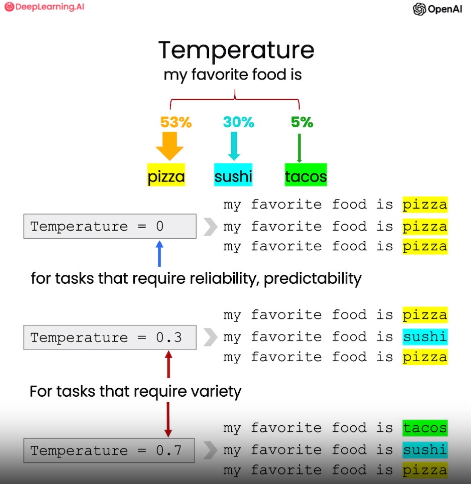

# Chapter 7 Text Extension

**Text extension** is an important application direction of large language models. It can input short text and generate richer long text. This provides strong support for creation, but it can also be abused. Therefore, when using it, developers must keep in mind social responsibility and avoid generating harmful content.

In this chapter, we will learn **an example of automatic customer email generation based on OpenAI API**, which is used to **optimize customer service emails based on customer feedback**. Here we will also introduce the "temperature" hyperparameter, which can **control the diversity of text generation**.

It should be noted that the extension function should only be used to assist human creation, not to automatically generate content on a large scale. Developers should use it with caution to avoid negative effects. Only when language models are applied in a responsible and beneficial way can their maximum value be realized. I believe that developers who practice social responsibility can use the extension function of language models to develop innovative applications that truly benefit mankind.

## 1. Customized customer emails

In this example of automatic customer email generation, we will **use the large language model to generate targeted reply emails based on the customer's evaluation and the emotional tendency in it**.

Specifically, we first input the customer's comment text and the corresponding sentiment analysis results (positive or negative). Then we construct a prompt and ask the big language model to generate a customized reply email based on this information.

Below is aFor example, it includes a customer review and the sentiment expressed in the review. This provides key input information for the subsequent language model to generate reply emails. By inputting the specific content and sentiment attitude of customer feedback, the language model can generate a personalized reply for this specific customer, taking into account its specific sentiment factors. This ** way of generating emails based on the characteristics of individual customers will greatly improve customer satisfaction**.

```python
# We can learn how to determine the sentiment of a review in the inference chapter
sentiment = "negative"

# A review of a product
review = f"""
They sold the 17-piece set for about $49 during the seasonal sale in November, which was about half off.\
But for some reason (probably price gouging), the same set prices all went up to $70 to $89 in the second week of December.\
The price of the 11-piece set also went up by about $10.\
While it looks OK, the part on the base that locks the blades doesn't look as good as the earlier version from a few years ago.\
But I plan to use it very gently, for example,\
I would grind hard objects like beans, ice, rice, etc. in the blender first before making the desired portion,\
switch to a whisk for finer flour, or use the cross-cut blade first and then the flat blade for a finer/non-stick effect when making smoothies.\
Special tip for making smoothies:\
Blend fruits and vegetablesVegetables are chopped and frozen (if using spinach, gently cook until soft and freeze until use; \
If making jam, use a small to medium food processor) to avoid adding too much ice when making smoothies. \
About a year later, the motor made a strange noise and I called customer service, but the warranty had expired so I had to buy another one. \
Overall, the overall quality of these products has declined, so they rely on brand recognition and consumer loyalty to maintain sales. \
The shipment arrived in two days.
"""
```

In this example, we have used the methods learned in the previous chapter to extract the sentiment from customer reviews. Here is a review about a blender. Now we want to use the big language model to automatically generate a reply email based on the sentiment in this review.

Take the following prompt as an example: First, the big language model is identified as a customer service AI assistant; its task is to send email replies to customers; then give specific customer comments between three backticks; finally, ask the language model to generate a reply based on this feedback email to thank the customer for his evaluation.

```python
from tool import get_completion

prompt = f"""
You are an AI assistant for customer service.
Your task is to send an email reply to an important customer.
Based on the customer's evaluation separated by "```", generate a reply to thank the customer for his evaluation.Thank the customer for their review. Remind the model to use specific details from the review
Write in a concise and professional tone.
Sign the email as an “AI Customer Agent.”
Customer review: 
```{review}```
Review sentiment: {sentiment}
"""
response = get_completion(prompt)
print(response)
```

Dear customer,

Thank you very much for your review of our product. We are very sorry that you encountered a price increase during the purchase process. We have always been committed to providing customers with the best prices, but due to market fluctuations, prices may change. We apologize and please feel free to contact our customer service team if you need any help.

We appreciate your detailed review and usage tips for our products. We will convey your feedback to our product team to improve our product quality and performance.

Thank you again for your support and feedback. If you need any help or have any questions, please feel free to contact our customer service team.

Wish you all the best!

AI Customer Agent

Through this prompt, we link the specific customer review content and the customer service assistant tone to be expressed with the reply email to be generated. The language model can fully understand the customerBased on the feedback, the appropriate response is automatically written.

This method of personalized response based on specific customer evaluation will greatly improve customer experience and satisfaction.

## 2. Introducing temperature coefficient

The "temperature" parameter in the large language model can control the randomness and diversity of the generated text. The larger the value of temperature, the greater the diversity of the language model output; the smaller the value of temperature, the more likely the output is to have high-probability text.

For example, in a certain context, the language model may think that "pizza" is the next most likely word, followed by "sushi" and "taco". If temperature is 0, "pizza" will be generated every time; and when temperature is closer to 1, the probability of generating the result is "sushi" or "taco", making the text more diverse.



<div align=center>Figure 1.7 Temperature Coefficient </div>

Generally speaking, if you need predictable and reliable output, set temperature to 0. In all courses, we always set the temperature to zero. If you need more creative and diverse text, it is helpful to increase the temperature appropriately. Adjusting this parameter can flexibly control the output characteristics of the language model.In the following example, for the same letter, we remind the language model to use the detailed information in the user's letter, set a higher temperature, run it twice, and compare the differences in their results.

```python
# First run
prompt = f"""
You are an AI assistant for customer service.
Your task is to send an email reply to an important customer.
Generate a reply based on the customer email separated by "```" to thank the customer for their review.
If the sentiment is positive or neutral, thank them for their review.
If the sentiment is negative, apologize and suggest that they contact customer service.
Make sure to use specific details from the review.
Write in a concise and professional tone.
Sign the email as "AI Customer Agent".
Customer review: ```{review}```
Review sentiment: {sentiment}
"""
response = get_completion(prompt, temperature=0.7)
print(response)
```

Dear customer,

Thank you for your review of our product. We value your feedback and sincerely apologize for the problems you encountered during use.

We are deeply sorry for the price change. According to your description, we understand that in the second week of December, the price of the setThere have been different degrees of increases. We will investigate this further and ensure that our pricing strategy is more transparent and consistent.

You mentioned the decline in quality of some parts of the product, especially the locking blade. We are very sorry about this and will feedback to our R&D team to improve the design and quality control of the product. We are always committed to providing quality products to meet the needs and expectations of our customers.

In addition, we would be very grateful for your sharing of your use of the product and related tips. Your experience and suggestions are very valuable to us and we will consider incorporating them into our product improvement plan.

If you need further help or have other questions, please feel free to contact our customer service team. We will wholeheartedly provide you with support and solutions.

Thank you again for your feedback and support. We will continue to work hard to provide better products and services.

Wish you all the best!

AI Customer Agent

The output will change after the second run:

```python
# Run second
prompt = f"""
You are an AI assistant for customer service.
Your task is to send an email reply to an important customer.
Generate a reply based on the customer email separated by "```" to thank the customer for their review.
If the sentiment is positive or neutral, thank them for their review.
If the sentiment is negative, thank them for their review.If the feedback is negative, apologize and suggest they contact customer service.
Make sure to use specific details in your review.
Write in a concise and professional tone.
Sign the email as “AI Customer Agent.”
Customer review: ```{review}```
Comment sentiment: {sentiment}
"""
response = get_completion(prompt, temperature=0.7)
print(response)
```

Dear customer,

Thank you very much for your evaluation and feedback on our products. We value your opinions and thank you for your support of our products.

First of all, we are very sorry that the price change has caused you trouble. We will seriously consider the situation you mentioned and take appropriate measures to improve our pricing strategy to avoid similar situations from happening again.

Regarding the problem of product quality, we are deeply sorry. We have always been committed to providing high-quality products, and we will feedback the problems you mentioned to our R&D team in order to improve the design and manufacturing process of the product.

If you need more information about the product warranty, or have any questions or needs about our other products, please feel free to contact our customer service team. We will be happy to provide you with help and support.

Thank you again for your support of our products's comments and support. We will continue to work hard to provide quality products and excellent customer service to meet your needs.

Have a nice day!

AI Customer Agent

**The temperature parameter controls the randomness of the text generated by the language model**. When the temperature is 0, the results are always the same each time the same prompt is used. In the above example, when the temperature is set to 0.7, different text is generated each time.

So, the result this time is different from the previous email. The content of the email will change when the same prompt is executed again. Therefore. I suggest that readers can try different temperatures to observe the changes in the output. In general, the higher the temperature, the more random the text generation of the language model. It can be imagined that at high temperatures, the language model is like a more active mood, but it may also be more creative.

Properly adjusting this hyperparameter can make the generation of the language model more diverse and more surprising. I hope these experiences can help you find the most suitable temperature setting in different scenarios.

## 3. English version

**1.1 Customized customer emails**

```python
# Given the sentiment from the lesson on "inferring",
# and the original customer message, customize the email
sentiment = "negative"

# review for a blender
review = f"""
So, they still had the 17 piece system on seasonal \
sale for around $49 in the month of November, about \
half off, but for some reason (call it price gouging) \
around the second week of December the prices all went \
up to about anywhere from between $70-$89 for the same \
system. And the 11 piece system went up around $10 or \
so in price also from the earlier sale price of $29. \
So it looks okay, but if you look at the base, the part \
where the blade locks into place doesn’t look as good \
as in previous editions from a few years ago, but I \
plan to be very gentle with it (example, I crush \
very hard items like beans, ice, rice, etc. in the \
blender first then pulverize them in the serving size \
I want in the blender then switch to the whipping \
blade for a finer flour, and use the cross cutting blade \
first when making smoothies, then use the flat blade \
if I need them finer/less pulpy). Special tip when making \
smoothies, finely cut and freeze the fruits and \
vegetables (if using spinach-lightly stew softens the \
spinach then freeze until ready for use-and if making \
sorbet, use a small to medium sized food processor) \ 
that you plan to use that way you can avoid adding so \
much ice if at all-when making your smoothie. \
After about a year, the motor was making a funny noise. \
I called customer service but the warranty expired \
already, so I had to buy another one. FYI: The overall \
quality has gone done in these types of products, so \
they are kind of counting on brand recognition and \
consumer loyalty to maintain sales. Got it in about \
two days.
"""
```

```python
prompt = f"""
You are a customer service AI assistant.
Your task is to send an email reply to a valued customer.
Given the customer email delimited by ```, \
Generate a reply to thank the customer for their review.
If the sentiment is positive or neutral,thank them for \
their review.
If the sentiment is negative, apologize and suggest that \
they can reach out to customer service. 
Make sure to use specific details from the review.
Write in a concise and professional tone.
Sign the email as `AI customer agent`.
Customer review: ```{review}```
Review sentiment: {sentiment}
"""
response = get_completion(prompt)
print(response)
```

Dear Valued Customer,

Thank you for taking the time to share your review with us. We appreciate your feedback.eedback and apologize for any inconvenience you may have experienced.

We are sorry to hear about the price increase you noticed in December. We strive to provide competitive pricing for our products, and we understand your frustration. If you have any further concerns regarding pricing or any other issues, we encourage you to reach out to our customer service team. They will be more than happy to assist you.

We also appreciate your feedback regarding the base of the system. Wework continuously to improve the quality of our products, and your comments will be taken into consideration for future enhancements.

We apologize for any inconvenience caused by the motor issue you encountered. Our customer service team is always available to assist with any warranty-related concerns. We understand that the warranty had expired, but we would still like to address this matter further. Please feel free to contact our customer service team, and they will do their best toassist you.

Thank you once again for your review. We value your feedback and appreciate your loyalty to our brand. If you have any further questions or concerns, please do not hesitate to contact us.

Best regards,

AI customer agent

**2.1 Introducing temperature coefficient**

```python
prompt = f"""
You are a customer service AI assistant.
Your task is to send an email reply to a valued customer.
Given the customer email delimited by ```, \
Generate a reply to thank the customer for their revieww.
If the sentiment is positive or neutral, thank them for \
their review.
If the sentiment is negative, apologize and suggest that \
they can reach out to customer service. 
Make sure to use specific details from the review.
Write in a concise and professional tone.
Sign the email as `AI customer agent`.
Customer review: ```{review}```
Review sentiment: {sentiment}
"""
response = get_completion(prompt, temperature=0.7)
print(response)
```

Dear Valued Customer,

Thank you for takingit's time to share your feedback with us. We sincerely apologize for any inconvenience you experienced with our pricing and the quality of our product.

We understand your frustration regarding the price increase of our 17 piece system in December. We assure you that price gouging is not our intention, and we apologize for any confusion caused. We appreciate your loyalty and we value your feedback, as it helps us to improve our products and services.

Regarding the issue with theblade lock and the decrease in overall quality, we apologize for any disappointment caused. We strive to provide our customers with the best possible products, and we regret that we did not meet your expectations. We will make sure to take your feedback into consideration for future improvements.

If you require further assistance or if you have any other concerns, please do not hesitate to reach out to our customer service team. They will be more than happy to assist you in resolving any issues you may have.

Once again, we apologize for any inconvenience caused and we appreciate your understanding. We value your business and we hope to have the opportunity to serve you better in the future.

Best regards,

AI customer agent