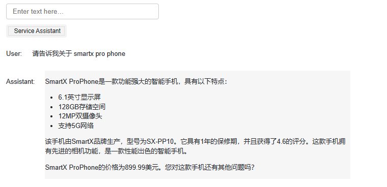

# Chapter 8 Build an End-to-End Question Answering System with Evaluation

In this chapter, we will build a complete question answering system with integrated evaluation. This system will integrate what we have learned in the previous lessons and add an evaluation step. The following is the core operation flow of the system:

1. Verify the user's input to verify whether it can pass the review API standards.

2. If the input passes the review, we will further search the product catalog.

3. If the product search is successful, we will continue to look for relevant product information.

4. We use the model to answer the user's question.

5. Finally, we will use the review API to verify the generated answer again.

If the final answer is not marked as harmful, then we will present it to the user without reservation.

## 2. End-to-End Question Answering System

In our exploration journey, we will implement a complete question answering system, an artificial intelligence that can understand and respond to human language. In this process, we will use OpenAI's related APIs and reference related functions to help us quickly build an efficient and accurate model. However, we need to note that we may occasionally encounter unsatisfactory results in Chinese understanding and processing due to the characteristics of the model. In this case, you can try a few more times or conduct in-depth research to find a more stable method.

Let's start with a function namedThe function is called `process_user_message_ch`, which is mainly responsible for processing the information input by the user. This function receives three parameters, the user's input, all historical information, and a flag indicating whether debugging is needed.
Inside the function, we first use OpenAI's Moderation API to check the compliance of the user's input. If the input is marked as non-compliant, we will return a message to inform the user that the request is non-compliant. In debug mode, we will print out the current progress.

Next, we use the `utils_zh.find_category_and_product_only` function (see the appendix code for details) to extract the products and corresponding categories in the user's input. Then, we convert the extracted information into a list.
After obtaining the list of products, we will query the specific information of these products. After that, we generate a system message and set some constraints to ensure that our response meets the expected standards. We send the generated message and historical information to the `get_completion_from_messages` function to get the model's response. After that, we use the Moderation API again to check whether the model's output is compliant. If the output is not compliant, we return a message saying that the information cannot be provided.

Finally, we let the model self-assess whether it has answered the question well.If the model thinks the answer meets the requirements, we return the model's answer; otherwise, we will inform the user that they will be transferred to manual customer service for further help.

```python
import openai 
import utils_zh
from tool import get_completion_from_messages

'''
Note: Due to the model's poor understanding of Chinese, the Chinese prompt may fail randomly. You can run it multiple times; you are also welcome to explore more stable Chinese prompts
'''
def process_user_message_ch(user_input, all_messages, debug=True):
"""
Preprocess user information

Parameters:
user_input: user input
all_messages: historical information
debug: whether to enable DEBUG mode, enabled by default
"""
# delimiter
delimiter = "```"

# Step 1: Use OpenAI's Moderation API to check user inputIs the input compliant or an injected prompt?
response = openai.Moderation.create(input=user_input)
moderation_output = response["results"][0]

# Check the input through the Moderation API and see if it is compliant
if moderation_output["flagged"]:
print("Step 1: Input rejected by Moderation")
return "Sorry, your request is not compliant"

# If the DEBUG mode is turned on, print the real-time progress
if debug: print("Step 1: Input passed Moderation check")

# Step 2: Extract the product and the corresponding catalog, similar to the method in the previous course, and make a package
category_and_product_response = utils_zh.find_category_and_product_only(user_input, utils_zh.get_products_and_category())
#print(category_and_product_response)
# Convert the extracted string to a list
category_and_product_list = utils_zh.read_string_to_list(category_and_product_response)
#print(category_and_product_list)

if debug: print("Step 2: Extract the product list")

# Step 3: Find the corresponding information of the product
product_information = utils_zh.generate_output_string(category_and_product_list)
if debug: print("Step 3: Find the extracted product information")

# Step 4: Generate an answer based on the information
system_message = f"""
You are a customer service assistant at a large electronics store.\
Please answer questions in a friendly and helpful tone and provide concise and clear answers.\Make sure to ask the user relevant follow-up questions.
"""
# Insert message
messages = [
{'role': 'system', 'content': system_message},
{'role': 'user', 'content': f"{delimiter}{user_input}{delimiter}"},
{'role': 'assistant', 'content': f"Related product information:\n{product_information}"}
]
# Get the answer from GPT3.5
# Implement multi-round dialogue by appending all_messages
final_response = get_completion_from_messages(all_messages + messages)
if debug:print("Step 4: Generate user answer")
# Add this round of information to the history
all_messages = all_messages + messages[1:]# Step 5: Check if the output is compliant based on the Moderation API
response = openai.Moderation.create(input=final_response)
moderation_output = response["results"][0]

# Output is not compliant
if moderation_output["flagged"]:
if debug: print("Step 5: Output rejected by Moderation")
return "Sorry, we can't provide that information"

if debug: print("Step 5: Output checked by Moderation")

# Step 6: Check if the model answers the user question well
user_message = f"""
User message: {delimiter}{user_input}{delimiter}
Agent response: {delimiter}{final_response}{delimiter}

Is the response sufficient to answer the question?
If sufficient, answer YIf it is not enough, answer N
Just answer the above letters
"""
# print(final_response)
messages = [
{'role': 'system', 'content': system_message},
{'role': 'user', 'content': user_message}
]
# Ask the model to evaluate the answer
evaluation_response = get_completion_from_messages(messages)
# print(evaluation_response)
if debug: print("Step 6: The model evaluates the answer")

# Step 7: If the evaluation is Y, output the answer; if the evaluation is N, the feedback will be manually corrected by the answer
if "Y" in evaluation_response: # Use in to avoid the model from generating Yes
if debug: print("Step 7: The model agrees with the answer.")
return final_response, all_messages
else:
if debug: print("Step 7: The model disagrees with this answer.")
neg_str = "I'm sorry, I can't provide the information you need. I will transfer you to a human customer service representative for further assistance."
return neg_str, all_messages

user_input = "Please tell me about the smartx pro phone and the fotosnap camera. Also, please tell me about your tvs."
response,_ = process_user_message_ch(user_input,[])
print(response)
```

Step 1: Input passes Moderation check
Step 2: Extract the product list
Step 3: Find the extracted product information
Step 4: Generate user answers
Step 5: Output passes Moderation check
Step 6: The model evaluates the answer
Step 7: The model agrees with the answer.
About SmartX ProPhone and FotoSThe information of the snap camera is as follows:

SmartX ProPhone:
- Brand: SmartX
- Model: SX-PP10
- Screen size: 6.1 inches
- Storage capacity: 128GB
- Camera: 12MP dual camera
- Network: 5G supported
- Warranty: 1 year
- Price: $899.99

FotoSnap camera series:
1. FotoSnap DSLR camera:
- Brand: FotoSnap
- Model: FS-DSLR200
- Sensor: 24.2MP
- Video: 1080p
- Screen: 3-inch LCD
- Interchangeable lens
- Warranty: 1 year
- Price: $599.99

2. FotoSnap mirrorless camera:
- Brand: FotoSnap
- Model: FS-ML100
- Sensor: 20.1MP
- Video: 4K
- Screen: 3-inch touch screen
- Interchangeable lens
- Warranty: 1 year
- Price: $799.993. FotoSnap instant camera:
- Brand: FotoSnap
- Model: FS-IC10
- Instant printing
- Built-in flash
- Selfie mirror
- Battery powered
- Warranty: 1 year
- Price: $69.99

About our TVs:

1. CineView 4K TV:
- Brand: CineView
- Model: CV-4K55
- Screen size: 55 inches
- Resolution: 4K
- HDR support
- Smart TV features
- Warranty: 2 years
- Price: $599.99

2. CineView 8K TV:
- Brand:

## 2. Continuously collect user and assistant messages

In order to continuously optimize the Q&A experience of users and assistants, we have created a friendly visual interface to facilitate convenient interaction between users and assistants.

```python
# Call the Chinese prompt version
def collect_messages_ch(debug=True):
"""
Used to collect user input and generate the assistant's answerParameters:
debug: used to determine whether to enable debug mode
"""
user_input = inp.value_input
if debug: print(f"User Input = {user_input}")
if user_input == "":
return
inp.value = ''
global context
# Call process_user_message function
#response, context = process_user_message(user_input, context, utils.get_products_and_category(),debug=True)
response, context = process_user_message_ch(user_input, context, debug=False)
# print(response)
context.append({'role':'assistant', 'content':f"{response}"})
panels.append(
pn.Row('User:', pn.pane.Markdown(user_input, width=600)))
panels.append(
pn.Row('Assistant:', pn.pane.Markdown(response, width=600, style={'background-color': '#F6F6F6'})))

return pn.Column(*panels) # Contains all the dialogue information
```

```python
import panel as pn # For graphical interface
pn.extension()

panels = [] # collect display

# System information
context = [ {'role':'system', 'content':"You are Service Assistant"} ] 

inp = pn.widgets.TextInput( placeholder='Enter text here…')
button_conversation = pn.widgets.Button(name="Service Assistant")
interactive_conversation = pn.bind(collect_messages_ch, button_conversation)
dashboard = pn.Column(
inp,
pn.Row(button_conversation),
pn.panel(interactive_conversation, loading_indicator=True, height=300),
)
dashboard
```
The following figure shows the actual operation of the question-answering system:



By monitoring the answer effect of the question-answering system on more inputs, you can modify the steps to improve the overall performance of the system.

We may find that our prompt may be better in some links, some links may be completely omitted, and even we may find a better retrieval method, etc.

We will explore this issue in more depth in the next chapter.

## 3. English version

**1.1 End-to-end question-answering system**

```python
import utils_en
import openai

def process_user_message(user_input, all_messages, debug=True):
"""
Preprocess user information

Parameters:
user_input: user input
all_messages: historical information
debug: whether to enable DEBUG mode, enabled by default
"""
# Delimiter
delimiter = "```"

# Step 1: Use OpenAI's Moderation API to check whether the user input is compliant or an injected prompt
response = openai.Moderation.create(input=user_input)
moderation_output = response["results"][0]

# Check if the input is not compliant after Moderation API
ifmoderation_output["flagged"]:
print("Step 1: Input rejected by Moderation")
return "Sorry, your request is not compliant"

# If DEBUG mode is turned on, print real-time progress
if debug: print("Step 1: Input passed Moderation check")

# Step 2: Extract products and corresponding directories, similar to the method in the previous course, and make a package
category_and_product_response = utils_en.find_category_and_product_only(user_input, utils_en.get_products_and_category())
#print(category_and_product_response)
# Convert the extracted string into a list
category_and_product_list = utils_en.read_string_to_list(category_and_product_response)#print(category_and_product_list)

if debug: print("Step 2: Extract the product list")

# Step 3: Find the corresponding information of the product
product_information = utils_en.generate_output_string(category_and_product_list)
if debug: print("Step 3: Find the extracted product information")

# Step 4: Generate answers based on the information
system_message = f"""
You are a customer service assistant for a large electronic store. \
Respond in a friendly and helpful tone, with concise answers. \
Make sure to ask the user relevant follow-up questions.
"""
# Insert message
messages= [
{'role': 'system', 'content': system_message},
{'role': 'user', 'content': f"{delimiter}{user_input}{delimiter}"},
{'role': 'assistant', 'content': f"Relevant product information:\n{product_information}"}
]
# Get the answer from GPT3.5
# Implement multi-round dialogue by appending all_messages
final_response = get_completion_from_messages(all_messages + messages)
if debug:print("Step 4: Generate user answer")
# Add this round of information to the historical information
all_messages = all_messages + messages[1:]

# Step 5: Check if the output is based on the Moderation APINot compliant
response = openai.Moderation.create(input=final_response)
moderation_output = response["results"][0]

# Output is not compliant
if moderation_output["flagged"]:
if debug: print("Step 5: Output rejected by Moderation")
return "Sorry, we can't provide that information"

if debug: print("Step 5: Output checked by Moderation")

# Step 6: Check if the model answers the user question well
user_message = f"""
Customer message: {delimiter}{user_input}{delimiter}
Agent response: {delimiter}{final_response}{delimiter}

Does the response sufficiently answerthe question?
"""
messages = [
{'role': 'system', 'content': system_message},
{'role': 'user', 'content': user_message}
]
# Ask the model to evaluate the answer
evaluation_response = get_completion_from_messages(messages)
if debug: print("Step 6: The model evaluates the answer")

# Step 7: If the evaluation is Y, output the answer; if the evaluation is N, the feedback will be manually corrected by the answer
if "Y" in evaluation_response: # Use in to avoid the model from generating Yes
if debug: print("Step 7: The model agrees with the answer.")
return final_response, all_messages
else:
if debug: print("Step 7: The model disagrees with the answer.")
neg_str = "Sorry, I can't provide the information you need. I will transfer you to a human customer service representative for further assistance."
return neg_str, all_messages

user_input = "tell me about the smartx pro phone and the fotosnap camera, the dslr one. Also what tell me about your tvs"
response,_ = process_user_message(user_input,[])
print(response)
```

Step 1: Input passes Moderation check
Step 2: Extract the product list
Step 3: Find the extracted product information
Step 4: Generate user answer
Step 5: Output passes Moderation check
Step 6: Model evaluates the answer
Step 7: The model agrees with the answer.
Sure! Here's some information about the SmartX ProPhone and the FFotoSnap DSLR Camera:

1. SmartX ProPhone:
- Brand: SmartX
- Model Number: SX-PP10
- Features: 6.1-inch display, 128GB storage, 12MP dual camera, 5G connectivity
- Description: A powerful smartphone with advanced camera features.
- Price: $899.99
- Warranty: 1 year

2. FotoSnap DSLR Camera:
- Brand: FotoSnap
- Model Number: FS-DSLR200
- Features: 24.2MP sensor, 1080p video, 3-inch LCD, interchangeable lenses
- Description: Capture stunning photos and videos with this versatile DSLR camera.
- Price: $599.99
- Warranty: 1 year

Now, could you please let me know which specific TV models you are interested in?

**2.1 Continuously collect user and assistant information**

```python
def collect_messages_en(debug=False):
"""
Used to collect user input and generate assistant answers

Parameters:
debug: Used to decide whether to enable debug mode
"""
user_input = inp.value_input
if debug: print(f"User Input = {user_input}")
if user_input == "":
return
inp.value= ''
global context
# Call process_user_message function
#response, context = process_user_message(user_input, context, utils.get_products_and_category(),debug=True)
response, context = process_user_message(user_input, context, debug=False)
context.append({'role':'assistant', 'content':f"{response}"})
panels.append(
pn.Row('User:', pn.pane.Markdown(user_input, width=600)))
panels.append(
pn.Row('Assistant:', pn.pane.Markdown(response, width=600, style={'background-color': '#F6F6F6'})))

return pn.Column(*panels) # Contains all the dialogue information
```