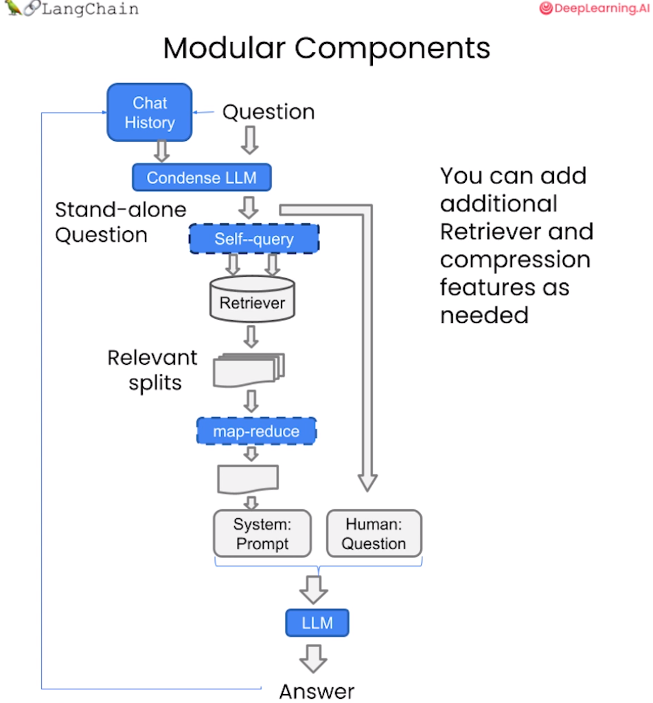

# Chapter 7, Chat

Recall the overall workflow of retrieval augmented generation (RAG):


<div align='center'> Figure 4.7.1 RAG </div>

We are getting close to having a functional chatbot. We discussed `Document loading`, `Segmentation`, `Storage`, and `Retrieval`. We showed how to use the `Retrieval QA` chain to generate output using `Retrieval` in Q+A.

Our bot can already answer questions, but it can't handle follow-up questions and can't have a real conversation. In this chapter, we will solve this problem.

We will now create a question-and-answer chatbot. It will be very similar to the previous one, but we will add the functionality of chat history. This is any previous conversations or messages you have had. This will enable the bot to take into account the context of the chat history when trying to answer questions. So, if you continue to ask questions, it will know what you want to talk about.

## 1. Reproduce previous code

The following code is for the openai LLM version record until it is deprecated (in September 2023). LLM responses will usually be different, but this difference may be different when using different model versions.It will be more obvious.

```python
import datetime
current_date = datetime.datetime.now().date()
if current_date < datetime.date(2023, 9, 2):
llm_name = "gpt-3.5-turbo-0301"
else:
llm_name = "gpt-3.5-turbo"
print(llm_name)
```

gpt-3.5-turbo-0301

If you want to experiment on the `Lang Chain plus` platform:

- Go to the langchain plus platform and register

- Create an api key from your account settings

- Use this api key in the code below

```python
#import os
#os.environ["LANGCHAIN_TRACING_V2"] = "true"
#os.environ["LANGCHAIN_ENDPOINT"] = "https://api.langchain.plus"
#os.environ["LANGCHAIN_API_KEY"] = "..."
```

First, we load the vector database created in the previous lessons and test it:

```python
# Load the vector library, which contains the embeddings of all course materials.
from langchain.vectorstores import Chroma
from langchain.embeddings.openai import OpenAIEmbeddings
import panel as pn # GUI
# pn.extension()

persist_directory = 'docs/chroma/matplotlib'
embedding = OpenAIEmbeddings()
vectordb = Chroma(persist_directory=persist_directory, embedding_function=embedding)

question = "What is the main content of this course?"
docs = vectordb.similarity_search(question,k=3)
print(len(docs))
```3

Next we create an LLM from OpenAI's API:

```python
from langchain.chat_models import ChatOpenAI
llm = ChatOpenAI(model_name=llm_name, temperature=0)
llm.predict("Hello")

```

'Hello! How can I help you? '

Create another template-based query chain:

```python
# Build prompt
from langchain.prompts import PromptTemplate
template = """Answer the last question using the following context. If you don't know the answer, just say you don't know, don't try to make up an answer. Use no more than three sentences. Try to make your answer short and to the point. Always say "Thanks for your question!" at the end of your answer.
{context}
Question: {question}
Useful answers:"""
QA_CHAIN_PROMPT = PromptTemplate(input_variables=["context", "question"],template=template,)# Run chain
from langchain.chains import RetrievalQA
question = "What is the topic of this course?"
qa_chain = RetrievalQA.from_chain_type(llm,
retriever=vectordb.as_retriever(),
return_source_documents=True,
chain_type_kwargs={"prompt": QA_CHAIN_PROMPT})

result = qa_chain({"query": question})
print(result["result"])
```

The topic of this course is a beginner's guide to the Matplotlib data visualization library.

## 2. Memory

Now let's go a step further and add some memory functionality.

We will useUse `ConversationBufferMemory`. It saves a list of chat message histories, which will be passed to the chatbot along with the questions when answering them, thus adding them to the context.

Note that the context retrieval methods we discussed earlier are also available here. 

```python
from langchain.memory import ConversationBufferMemory
memory = ConversationBufferMemory(
memory_key="chat_history", # Keep consistent with the input variable of prompt.
return_messages=True # Will return the chat history as a list of messages instead of a single string
)
```

## 3. Conversational Retrieval Chain

The Conversational Retrieval Chain adds the ability to process conversation history based on the retrieval QA chain.

Its workflow is:

1. Merge the previous conversation with the new question to generate a complete query statement.

2. Search the vector database for relevant documents for the query.

3. After getting the results, store all answers in the conversation memory area.

4. The user can view the complete conversation process in the UI.



<div align='center'> Figure 4.7.2 Conversation Retrieval Chain </div>

This chain method puts new questions in the context of previous conversations for retrieval, and can handle queries that rely on historical information. And keep all information in the conversation memory for easy tracking.

Next, let's test the effect of this conversation retrieval chain:

First, ask a question without history, "Will Python be learned in this course?" and check the answer.

```python
from langchain.chains import ConversationalRetrievalChain
retriever=vectordb.as_retriever()
qa = ConversationalRetrievalChain.from_llm(
llm,
retriever=retriever,
memory=memory
)
question = "Will I learn Python in this course?"
result = qa({"question": question})
print(result['answer'])
```

Yes, this course involves the use of Python programming language, especially in data visualization. Therefore, learning Python is one of the prerequisites for this course.

Then based on the answer, the next question "Why does this course require this prerequisite?":

```python
question = "Why does this course require this prerequisite?"
result = qa({"question": question})
print(result['answer'])
```

The prerequisite for learning Python is to have certain basic computer knowledge, including but not limited to computer operating systems, programming language basics, data structures and algorithms, etc. In addition, for the study of data science, a certain foundation in mathematics and statistics is also required, such as linear algebra, calculus, probability theory and mathematical statistics, etc.

As you can see, although LLM's answer is a bit wrong, it accurately judges that the reference content of this premise is to learn Python, that is, we have successfully passed it historical information. This ability to continuously learn and associate previous and subsequent questions can greatly enhance the continuity and intelligence level of the question-answering system.

## 4. Define a chatbot for your documentWith what we have learned above, we can define a chatbot suitable for private documents through the following code:

```python
from langchain.embeddings.openai import OpenAIEmbeddings
from langchain.text_splitter import CharacterTextSplitter, RecursiveCharacterTextSplitter
from langchain.vectorstores import DocArrayInMemorySearch
from langchain.document_loaders import TextLoader
from langchain.chains import RetrievalQA, ConversationalRetrievalChain
from langchain.memory import ConversationBufferMemory
from langchain.chat_models import ChatOpenAI
from langchain.document_loaders import TextLoader
from langchain.document_loaders import PyPDFLoader

def load_db(file, chain_type, k):
"""
This function is used to load PDF files, split documents, generate document embedding vectors, create vector databases, define retrievers, and create chatbot instances.

Parameters:
file (str): The path of the PDF file to be loaded.
chain_type (str): Chain type, used to specify the type of chatbot.
k (int): During the retrieval process, the most similar k results are returned.

Returns:
qa (ConversationalRetrievalChain): The chatbot instance created.
"""
# Load documents
loader = PyPDFLoader(file)
documents = loader.load()
# Split documents
text_splitter = RecursiveCharacterTextSplitter(chunk_size=1000, chunk_overlap=150)
docs = text_splitter.split_documents(documents)
# Define Embeddings
embeddings = OpenAIEmbeddings()
# Create a vector database based on data
db = DocArrayInMemorySearch.from_documents(docs, embeddings)
# Define retriever
retriever = db.as_retriever(search_type="similarity", search_kwargs={"k": k})
# Create a chatbot chain, Memory is managed externally
qa = ConversationalRetrievalChain.from_llm(
llm=ChatOpenAI(model_name=llm_name, temperature=0), 
chain_type=chain_type, 
retriever=retriever, 
return_source_documents=True,
return_generated_question=True,
)
return qa 

import panel as pn
import param

# Used to store chat history, answers, database queries and replies
class cbfs(param.Parameterized):
chat_history = param.List([])
answer = param.String("")
db_query = param.String("")
db_response = param.List([])

def __init__(self, **params):
super(cbfs, self).__init__( **params)
self.panels = []
self.loaded_file = "docs/matplotlib/First round: Matplotlib first acquaintance.pdf"
self.qa = load_db(self.loaded_file,"stuff", 4)

# Load the document into the chatbot
def call_load_db(self, count):
"""
count: quantity
"""
if count == 0 or file_input.value is None: # Initialization or no file specified:
return pn.pane.Markdown(f"Loaded File: {self.loaded_file}")
else:
file_input.save("temp.pdf") # Local copy
self.loaded_file = file_input.filename
button_load.button_style="outline"
self.qa = load_db("temp.pdf", "stuff", 4)
button_load.button_style="solid"
self.clr_history()
return pn.pane.Markdown(f"Loaded File: {self.loaded_file}")

# Processing dialogue chain
def convchain(self, query):
"""
query: User's query
"""
if not query:
return pn.WidgetBox(pn.Row('User:', pn.pane.Markdown("", width=600)), scroll=True)
result = self.qa({"question": query, "chat_history": self.chat_history})
self.chat_history.extend([(query, result)lt["answer"])])
self.db_query = result["generated_question"]
self.db_response = result["source_documents"]
self.answer = result['answer']
self.panels.extend([
pn.Row('User:', pn.pane.Markdown(query, width=600)),
pn.Row('ChatBot:', pn.pane.Markdown(self.answer, width=600, style={'background-color': '#F6F6F6'}))
])
inp.value = '' # Clear loading indicator when clearing
return pn.WidgetBox(*self.panels,scroll=True)

# Get the last question sent to the database@param.depends('db_query ', )
def get_lquest(self):
if not self.db_query :
return pn.Column(
pn.Row(pn.pane.Markdown(f"Last question to DB:", styles={'background-color': '#F6F6F6'})),
pn.Row(pn.pane.Str("no DB accesses so far"))
)
return pn.Column(
pn.Row(pn.pane.Markdown(f"DB query:", styles={'background-color': '#F6F6F6'})),
pn.pane.Str(self.db_query )
)

# Get the source file returned by the database
@param.depends('db_response', )
def get_sources(self):
if not self.db_response:
return 
rlist=[pn.Row(pn.pane.Markdown(f"Result of DB lookup:", styles={'background-color': '#F6F6F6'}))]
for doc in self.db_response:
rlist.append(pn.Row(pn.pane.Str(doc)))
return pn.WidgetBox(*rlist, width=600, scroll=True)

# Get the current chat history
@param.depends('convchain', 'clr_history') 
def get_chats(self):
if not self.chat_history:
returnn pn.WidgetBox(pn.Row(pn.pane.Str("No History Yet")), width=600, scroll=True)
rlist=[pn.Row(pn.pane.Markdown(f"Current Chat History variable", styles={'background-color': '#F6F6F6'}))]
for exchange in self.chat_history:
rlist.append(pn.Row(pn.pane.Str(exchange)))
return pn.WidgetBox(*rlist, width=600, scroll=True)

# Clear chat history
def clr_history(self,count=0):
self.chat_history = []
return 

```

Then you can run this chatbot:

```python
# Initialize chatbot
cb =cbfs() 

# Define widgets for the interface
file_input = pn.widgets.FileInput(accept='.pdf') # File input widget for PDF files
button_load = pn.widgets.Button(name="Load DB", button_type='primary') # Button for loading database
button_clearhistory = pn.widgets.Button(name="Clear History", button_type='warning') # Button for clearing chat history
button_clearhistory.on_click(cb.clr_history) # Bind the clear history function to the button
inp = pn.widgets.TextInput( placeholder='Enter text here…') # Text input widget for user query

# Bind the functions for loading database and dialogue to the corresponding components
bound_button_load = pn.bind(cb.call_load_db, button_load.param.clicks)
conversation = pn.bind(cb.convchain, inp)
jpg_pane = pn.pane.Image( './img/convchain.jpg')
# Use Panel to define interface layout
tab1 = pn.Column(
pn.Row(inp),
pn.layout.Divider(),
pn.panel(conversation, loading_indicator=True, height=300),
pn.layout.Divider(),
)
tab2= pn.Column(
pn.panel(cb.get_lquest),
pn.layout.Divider(),
pn.panel(cb.get_sources ),
)
tab3= pn.Column(
pn.panel(cb.get_chats),
pn.layout.Divider(),
)
tab4=pn.Column(
pn.Row( file_input, button_load, bound_button_load),
pn.Row( button_clearhistory, pn.pane.Markdown("Clears chat history. Can use to start a new topic" )),
pn.layout.Divider(),
pn.Row(jpg_pane.clone(width=400))
)
# Merge all tabs into one dashboard
dashboard = pn.Column(
pn.Row(pn.pane.Markdown('# ChatWithYourData_Bot')),
pn.Tabs(('Conversation', tab1), ('Database', tab2), ('Chat History', tab3),('Configure', tab4))
)
dashboard
```

The following screenshot shows the bot in action:


<div align='center'> Figure 4.7.3 Chatbot </div>

You are free to useAnd modify the above code to add custom features. For example, you can modify the configuration in the `load_db` function and the `convchain` method to try different memory modules and retriever models.

In addition, the two libraries [panel](https://panel.holoviz.org/) and [Param](https://param.holoviz.org/) provide a rich set of components and widgets that can be used to extend and enhance the graphical user interface. Panel can create interactive control panels, and Param can declare input parameters and generate controls. Combined use can build powerful configurable GUIs.

You can develop more feature-rich dialogue systems and interfaces by creatively applying these tools. Custom controls can implement advanced features such as parameter configuration and visualization. You are welcome to modify and extend the sample code to develop more powerful and better intelligent dialogue applications.

## Five, English version

**1.1 Review**

```python
# Load the vector library, which contains all the course materials Embedding.
from langchain.vectorstores import Chroma
from langchain.embeddings.openai import OpenAIEmbeddings
import panel as pn # GUI
# pn.extension()

persist_directory = 'docs/chroma/cs229_lectures'
embedding = OpenAIEmbeddings()
vectordb = Chroma(persist_directory=persist_directory, embedding_function=embedding)

# Basic similarity search on the vector database
question = "What are major topics for this class?"
docs = vectordb.similarity_search(question,k=3)
print(len(docs))
```

3

Create an LLM

```python
from langchain.chat_models import ChatOpenAI
llm = ChatOpenAI(model_name=llm_name, temperature=0)
llm.predict("Hello world!")
```

'Hello there! How can I assist you today?'

Create a template-based search chain

```python
# Initialize a prompt template, create a search QA chain, then pass in a question and get a result.
# Build prompt
from langchain.prompts import PromptTemplate
template = """Use the following pieces of context to answer the question at the end. If you don't know the answer, just say that you don't know, don't try to make up an answer. Use three sentences maximum. Keep the answer as concise as possible. Always say "thanks for asking!" at the end of the answer. 
{context}
Question: {question}
Helpful Answer:"""
QA_CHAIN_PROMPT = PromptTemplate(input_variables=["context", "question"],template=template,)

# Run chain
from langchain.chains import RetrievalQA
question = "Is probability a class topic?"
qa_chain = RetrievalQA.from_chain_type(llm,
retriever=vectordb.as_retriever(),
return_source_documents=True,
chain_type_kwargs={"prompt": QA_CHAIN_PROMPT})

result = qa_chain({"query": question})
print(result["result"])
```

Yes, probability is assumed to be a prerequisite for this class. The instructor assumes familiarity with basic probability and statistics, and will go over some of the prerequisites in the discussion sections as a refresher course. Thanks for asking!

**2.1 Memory**

```python
from langchain.memory import ConversationBufferMemory
memory = ConversationBufferMemory(
memory_key="chat_history", # Keep consistent with the input variable of prompt.return_messages=True # will return the chat history as a list of messages instead of a single string
)
```

**3.1 Conversational Retrieval Chain**

```python
from langchain.chains import ConversationalRetrievalChain
retriever=vectordb.as_retriever()
qa = ConversationalRetrievalChain.from_llm(
llm,
retriever=retriever,
memory=memory
)

question = "Is probability a class topic?"
result = qa({"question": question})
print("Q: ", question)
print("A: ", result['answer'])

question = "why are those prerequesites needed?"
result = qa({"question": question})
print("Q: ", question)
print("A: ", result['answer'])
```

Q: Is probability a class topic?
A: Yes, probability is a topic that will be assumed to be familiar to students in this class. The instructor assumes that students have familiarity with basic probability and statistics, and that most undergraduate statistics classes will be more than enough.
Q: why are those prerequisites needed?
A: The reason for requiring familiarity with basic probability and statistics as prerequisites for this class is that the class assumes that students already know what random variables are, what expectation is, what a variance or a random variable is. The class will not spend much time reviewing these concepts, so students are expected to have a basic understanding of them before taking the class.

**4.1 Define a chatbot**

```python
from langchain.embeddings.openai import OpenAIEmbeddings
from langchain.text_splitter import CharacterTextSplitter, RecursiveCharacterTextSplitter
from langchain.vectorstores import DocArrayInMemorySearch
from langchain.document_loaders import TextLoader
from langchain.chains import RetrievalQA, ConversationalRetrievalChain
from langchain.memory import ConversationBufferMemory
from langchain.chat_models import ChatOpenAI
from langchain.document_loaders import TextLoader
from langchain.document_loaders import PyPDFLoader

def load_db(file, chain_type, k):
"""
This function is used to load PDF files, split documents, generate document embedding vectors, create vector databases, define retrievers, and create chatbot instances.

Parameters:
file (str): the file to loadPDF file path.
chain_type (str): Chain type, used to specify the type of chatbot.
k (int): During the retrieval process, return the most similar k results.

Returns:
qa (ConversationalRetrievalChain): The chatbot instance created.
"""
# Load documents
loader = PyPDFLoader(file)
documents = loader.load()
# Split documents
text_splitter = RecursiveCharacterTextSplitter(chunk_size=1000, chunk_overlap=150)
docs = text_splitter.split_documents(documents)
# Define Embeddings
embeddings = OpenAIEmbeddings()
# Create a vector database based on data
db = DocArrayInMemorySearch.from_documents(docs,embeddings)
# Define retriever
retriever = db.as_retriever(search_type="similarity", search_kwargs={"k": k})
# Create a chatbot chain, Memory is managed externally
qa = ConversationalRetrievalChain.from_llm(
llm=ChatOpenAI(model_name=llm_name, temperature=0), 
chain_type=chain_type, 
retriever=retriever, 
return_source_documents=True,
return_generated_question=True,
)
return qa 

import panel as pn
import param

# Used to store chat records, answers, database queries and replies
class cbfs(param.Parameterized):chat_history = param.List([])
answer = param.String("")
db_query = param.String("")
db_response = param.List([])

def __init__(self, **params):
super(cbfs, self).__init__( **params)
self.panels = []
self.loaded_file = "docs/cs229_lectures/MachineLearning-Lecture01.pdf"
self.qa = load_db(self.loaded_file,"stuff", 4)

# Load the document into the chatbot
def call_load_db(self, count):
"""
count: number
"""
if count == 0 orfile_input.value is None: # Initialized or unspecified file:
return pn.pane.Markdown(f"Loaded File: {self.loaded_file}")
else:
file_input.save("temp.pdf") # Local copy
self.loaded_file = file_input.filename
button_load.button_style="outline"
self.qa = load_db("temp.pdf", "stuff", 4)
button_load.button_style="solid"
self.clr_history()
return pn.pane.Markdown(f"Loaded File: {self.loaded_file}")

# Handle the conversation chain
def convchain(self, query):
"""
query: User's query
"""
if not query:
return pn.WidgetBox(pn.Row('User:', pn.pane.Markdown("", width=600)), scroll=True)
result = self.qa({"question": query, "chat_history": self.chat_history})
self.chat_history.extend([(query, result["answer"])])
self.db_query = result["generated_question"]
self.db_response = result["source_documents"]
self.answer = result['answer']
self.panels.extend([pn.Row('User:', pn.pane.Markdown(query, width=600)),
pn.Row('ChatBot:', pn.pane.Markdown(self.answer, width=600, style={'background-color': '#F6F6F6'}))
])
inp.value = '' # Clear loading indicator when cleared
return pn.WidgetBox(*self.panels,scroll=True)

# Get the last question sent to the database
@param.depends('db_query ', )
def get_lquest(self):
if not self.db_query :
return pn.Column(
pn.Row(pn.pane.Markdown(f"Last question to DB:", styles={'background-color': '#F6F6F6'})),
pn.Row(pn.pane.Str("no DB accesses so far"))
)
return pn.Column(
pn.Row(pn.pane.Markdown(f"DB query:", styles={'background-color': '#F6F6F6'})),
pn.pane.Str(self.db_query )
)
# Get the source file returned by the database
@param.depends('db_response', )
def get_sources(self):
if not self.db_response:
return 
rlist=[pn.Row(pn.pane.Markdown(f"Result of DB lookup:", styles={'background-color': '#F6F6F6'}))]
for doc in self.db_response:
rlist.append(pn.Row(pn.pane.Str(doc)))
return pn.WidgetBox(*rlist, width=600, scroll=True)

# Get the current chat history
@param.depends('convchain', 'clr_history')
def get_chats(self):
if not self.chat_history:
return pn.WidgetBox(pn.Row(pn.pane.Str("No History Yet")), width=600, scroll=True)
rlist=[pn.Row(pn.pane.Markdown(f"Current Chat History variable", styles={'background-color': '#F6F6F6'}))]for exchange in self.chat_history:
rlist.append(pn.Row(pn.pane.Str(exchange)))
return pn.WidgetBox(*rlist, width=600, scroll=True)

# Clear chat history
def clr_history(self,count=0):
self.chat_history = []
return 

```

**4.2 Create a chatbot**

```python
# Initialize the chatbot
cb = cbfs()

# Define widgets for the interface
file_input = pn.widgets.FileInput(accept='.pdf') # File input widget for PDF files
button_load = pn.widgets.Button(name="Load DB", button_type='primary') # Button to load the database
button_clearhistory = pn.widgetets.Button(name="Clear History", button_type='warning') # Button to clear chat history
button_clearhistory.on_click(cb.clr_history) # Bind the clear history function to the button
inp = pn.widgets.TextInput( placeholder='Enter text here…') # Text input widget for user query

# Bind the functions for loading database and conversation to the corresponding components
bound_button_load = pn.bind(cb.call_load_db, button_load.param.clicks)
conversation = pn.bind(cb.convchain, inp)

jpg_pane = pn.pane.Image( './img/convchain.jpg')

# Define the interface layout using Panel
tab1 = pn.Column(
pn.Row(inp),
pn.layout.Divider(),
pn.panel(conversation, loading_indicator=True, height=300),
pn.layout.Divider(),
)
tab2= pn.Column(
pn.panel(cb.get_lquest),
pn.layout.Divider(),
pn.panel(cb.get_sources ),
)
tab3= pn.Column(
pn.panel(cb.get_chats),
pn.layout.Divider(),
)
tab4=pn.Column(
pn.Row( file_input, button_load, bound_button_load),
pn.Row( button_clearhistory, pn.pane.Markdown("Clears chat history. Can use to start a new topic" )),
pn.layout.Divider(),
pn.Row(jpg_pane.clone(width=400))
)
# Merge all tabs into oneDashboards
dashboard = pn.Column(
pn.Row(pn.pane.Markdown('# ChatWithYourData_Bot')),
pn.Tabs(('Conversation', tab1), ('Database', tab2), ('Chat History', tab3),('Configure', tab4))
)
dashboard
```