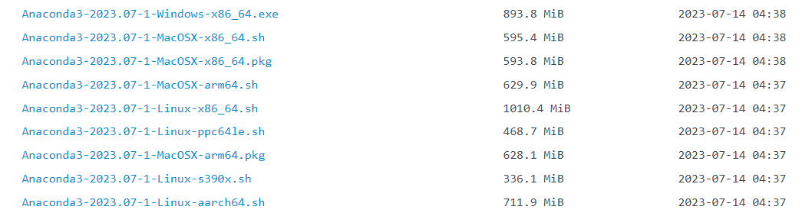
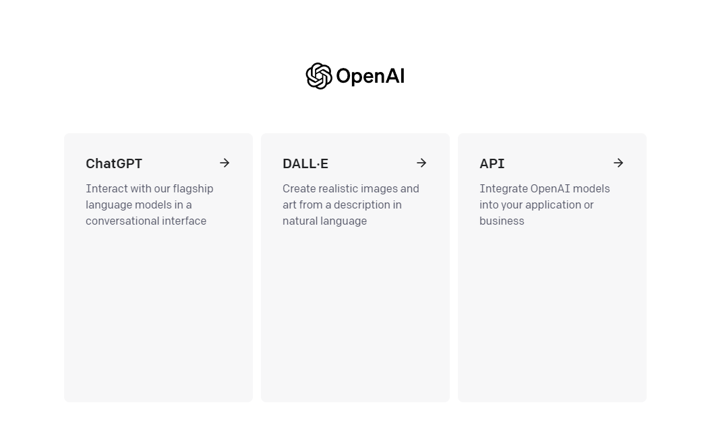

# Environment Configuration

This chapter introduces how to configure the environment required to read this tutorial, including Python, Jupyter Notebook, OpenAI API key, and related libraries to run the code required by this book.

Please note that some of the following environment configurations only need to be configured once (such as Python, Jupyter Notebook, etc.), while others need to be configured every time the code is reproduced (such as the configuration of the OpenAI API key, etc.).

## 1. Install Anaconda

Since the official website installation is slow, we can install [Anaconda](https://mirrors.tuna.tsinghua.edu.cn/anaconda/archive) through the Tsinghua source mirror

<p align="center">

</p>

Select the corresponding version to download and install.

If Anaconda is already installed, you can skip the following steps.

- If we use the Window system, we can download the `Anaconda3-2023.07-1-Windows-x86_64.exe` installation package and install it directly.

-If we use MacOS system
1. Intel chip: you can download `Anaconda3-2023.07-1-MacOSX-x86_64.sh`
2. Apple chip: you can download `Anaconda3-2023.07-1-MacOSX-arm64.sh`
and do the following:

```python
# Taking Intel processor as an example, the file name may change
sh Anaconda3-2023.07-1-MacOSX-x86_64.sh -b
```

Next, initialize the terminal shell so that we can run conda directly.

```python
~/anaconda3/bin/conda init
```

Now close and reopen the current shell, we will find that there is an additional `(base)` in front of the command line, which is a basic `python` environment of anaconda. Let's use the following command to create a new environment:

```python
# Create an environment named chatgpt with Python version 3.9
conda create --name chatgpt python=3.9 -y
```
After the creation is complete, now let's activate chatgpttgpt environment:

```python
conda activate chatgpt
```

## 2. Install the python libraries needed for this book

```python
!pip install -q python-dotenv
!pip install -q openai
## And more python packages
```

## 3. Obtain and configure the OpenAI API key

Before obtaining the OpenAI API key, we need to register an account on the [openai official website](https://openai.com/). Here we assume that we already have an openai account. First log in to the [openai official website](https://openai.com/). After logging in, the following figure is shown:

<p align="center">

</p>

We select `API`, then click the avatar in the upper right corner and select `View API keys`, as shown in the following figure:

<p align="center">

</p>

Click the `Create new secret key` button to create the OpenAI API key. We will copy the created OpenAI API key in this form `OPENAI_API_KEY="sk-..."` and save it to the `.env` file, and save the `.env` file in the project root directory. # TODO: Which fixed location to put it in to be confirmed

The following is the code to read the `.env` file

```python
import os
import openai
from dotenv import load_dotenv, find_dotenv

# Read the local/project environment variables.

# find_dotenv() finds and locates the path of the .env file
# load_dotenv() reads the .env file and loads the environment variables in it into the current running environment
# If you set the global environment variables, this line of code has no effect.
_ = load_dotenv(find_dotenv())

# Get environment variables OPENAI_API_KEY
openai.api_key = os.environ['OPENAI_API_KEY']
```

Encapsulate the code for reading the `.env` file into a function for each chapter to directly call to obtain the OpenAI API key.

```python
import os
from dotenv import load_dotenv, find_dotenv
def get_openai_key():
_ = load_dotenv(find_dotenv())
return os.environ['OPENAI_API_KEY']

openai.api_key = get_openai_key()
```