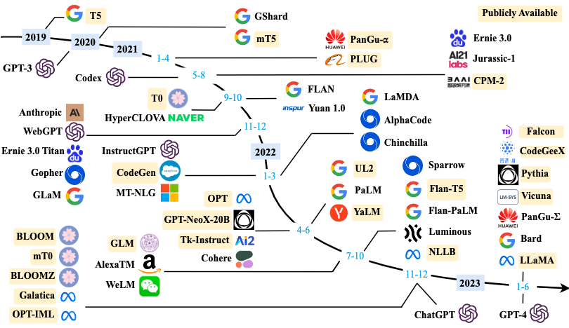
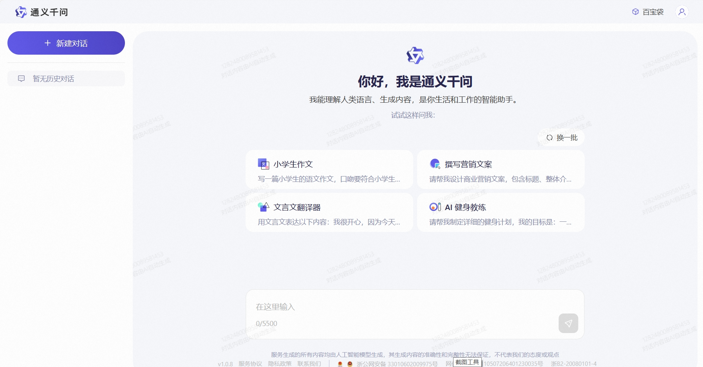
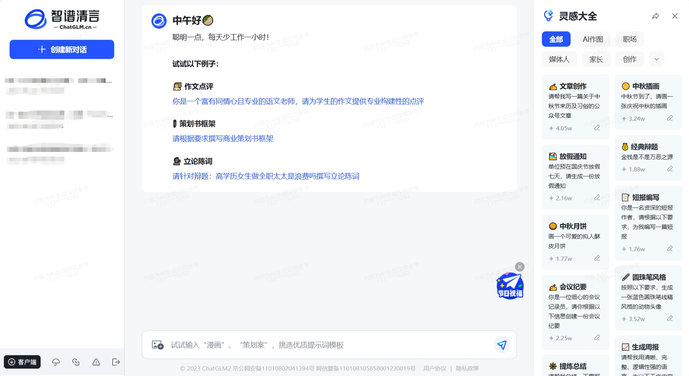

# Introduction to Large Language Model (LLM) Theory

## 1. What is Large Language Model (LLM)

### 1.1 Concept of Large Language Model (LLM)

**Large Language Model (LLM), also known as Large Language Model, is an artificial intelligence model designed to understand and generate human language**.

LLM usually refers to language models containing **tens of billions (or more) parameters**, which are trained on massive amounts of text data to gain a deep understanding of language. At present, well-known foreign LLMs include GPT-3.5, GPT-4, PaLM, Claude and LLaMA, and domestic ones include Wenxin Yiyan, iFlytek Spark, Tongyi Qianwen, ChatGLM, Baichuan, etc.

In order to explore the limits of performance, many researchers began to train increasingly large language models, such as `GPT-3` with `175 billion` parameters and `PaLM` with `540 billion` parameters. Although these large language models use similar architectures and pre-training tasks as small language models (such as BERT with 330 million parameters and GPT-2 with 1.5 billion parameters), they exhibit very different capabilities, especially showing amazing potential in solving complex tasks, which is called "emergent capabilities". Taking GPT-3 and GPT-2 as examples, GPT-3Few-shot tasks can be solved by learning context, and GPT-2 performs poorly in this regard. Therefore, the research community has given these huge language models a name, calling them "large language models (LLM)". An outstanding application of LLM is **ChatGPT**, which is a bold attempt by the GPT series LLM to use it for conversational applications with humans, showing a very smooth and natural performance.

### 1.2 Development of LLM

The study of language modeling can be traced back to the `1990s`, when the research focused on using **statistical learning methods** to predict vocabulary and predict the next vocabulary by analyzing the previous vocabulary. However, there are certain limitations in understanding complex language rules.

Subsequently, researchers continued to try to improve it. In `2003, `deep learning pioneer **Bengio** incorporated the idea of ​​deep learning into the language model for the first time in his classic paper `A Neural Probabilistic Language Model`. The powerful **neural network model** is equivalent to providing a powerful "brain" for computers to understand language, allowing the model to better capture and understand the complex relationships in language.

Around 2018, the Transformer neural network model began to emerge. These models are trained with large amounts of text data, enabling them to read large amounts of text.By reading a large amount of text to deeply understand language rules and patterns, just like letting computers read the entire Internet, we have a deeper understanding of language, which greatly improves the performance of the model on various natural language processing tasks.

At the same time, researchers have found that as the size of the language model increases (increasing the model size or using more data), the model has shown some amazing capabilities and its performance in various tasks has been significantly improved. This discovery marks the beginning of the era of large language models (LLMs).

### 1.3 Common LLM models

Although the development of large language models has only been less than five years, the development speed is quite amazing. As of June 2023, more than 100 large models have been released at home and abroad. The following figure shows the influential large language models with more than 10 billion model parameters from 2019 to June 2023 in a timeline:

(This figure comes from the reference content [[1](https://arxiv.org/abs/2303.18223)])

Next, we will mainly introduce several common large models at home and abroad (including open source and closed source)

#### 1.3.1 Closed source LLM (undisclosed source code)

<!--  -->

##### 1.3.1.1 GPT series

> [OpenAI model introduction](https://platform.openai.com/docs/models)

The **GPT (Generative Pre-Training)** model proposed by **OpenAI** in `2018` is one of the typical `generative pre-training language models`.

The basic principle of the GPT model is **to compress world knowledge into a decoder-only Transformer model** through language modeling, so that it can recover (or remember) the semantics of world knowledge and act as a general task solver. There are two key points to its success:

- Training a decoder-only Transformer language model that can accurately predict the next word
- Expanding the size of the language model

OpenAI's research on LLM can be roughly divided into the following stages:

Next, we will introduce the model scale, characteristics, etc.Well-known ChatGPT and GPT4:

###### 1.3.1.1.1 ChatGPT

> [ChatGPT usage address](https://chat.openai.com)

`In November 2022`, **OpenAI** released the **conversational application ChatGPT** based on the GPT model (GPT-3.5 and GPT-4). ChatGPT has aroused excitement in the artificial intelligence community since its release due to its excellent ability to communicate with humans. ChatGPT is developed based on the powerful GPT model and has specially optimized conversational capabilities.

ChatGPT is essentially an LLM application, which is developed based on the base model and is fundamentally different from the base model. It supports two versions, GPT-3.5 and GPT-4.

The current ChatGPT supports up to 32,000 characters, and the knowledge deadline is September 2021. It can perform various tasks, including **code writing, math problem solving, writing suggestions**, etc. ChatGPT has shown excellent ability to communicate with humans: it has a rich knowledge reserve, the ability to reason about math problems, and can communicate in multiple rounds.The context is accurately tracked in the conversation and is very consistent with the values ​​of safe human use. Later, ChatGPT supported a plug-in mechanism, which further expanded the capabilities of ChatGPT with existing tools or applications. So far, it seems to be the most powerful chatbot in the history of artificial intelligence. The launch of ChatGPT has a significant impact on future artificial intelligence research, and it provides inspiration for exploring human-like artificial intelligence systems.

###### 1.3.1.1.2 GPT-4

GPT-4, released in `March 2023`, will expand **text input to multimodal signals**. GPT3.5 has 175 billion parameters, and the number of parameters of GPT4 has not been officially announced, but relevant personnel speculate that GPT-4 contains a total of 1.8 trillion parameters in 120 layers, that is, the scale of GPT-4 is more than 10 times that of GPT-3. Therefore, GPT-4 is more capable of solving complex tasks than GPT-3.5, and shows a significant performance improvement on many evaluation tasks**.

A recent study investigated the capabilities of GPT-4 by qualitatively testing it on artificially generated problems covering a wide variety of difficult tasks and showed that GPT-4 can achieve superior performance than previous GPT models such as GPT3.5. In addition, thanks to six months of iterative calibration (on RLHFThere are additional safety reward signals in training), GPT-4 responds more safely to malicious or provocative queries, and applies some intervention strategies to mitigate possible problems with LLM, such as hallucinations, privacy, and over-dependence.

> Note: On November 7, 2023, OpenAI held its first developer conference, at which the latest large language model GPT-4 Turbo was launched. Turbo is equivalent to the advanced version. It extends the context length to 128k, equivalent to 300 pages of text, and the training knowledge is updated to April 2023

GPT3.5 is free, while GPT-4 is charged. You need to open a plus membership of $20/month.

`May 14, 2024`, the new generation flagship generation model **GPT-4o** was officially released. GPT-4o has the ability to deeply understand the three modalities of text, voice, and image, and is quick to respond and emotional, which is very humane. And GPT-4o is completely free, although the number of free uses per day is limited.

Usually we can call the model API to develop our own applications. The mainstream model [API comparison](https://openai.com/pricing) is as follows:

| Language model name | Context length | Features |input fee ($/million tokens) | output fee ($/ 1M tokens) | knowledge deadline |
| :--------------------: | :--------: | :----------------: | :--------------------------: | :-----------------------: | :-----------: |
| GPT-3.5-turbo-0125 | 16k | Economics, specialized conversations | 0.5 | 1.5 | Sep 2021 |
| GPT-3.5-turbo-instruct | 4k | Instruction model | 1.5 | 2 | Sep 2021 |
| GPT-4 | 8k |Better performance | 30 | 60 | September 2021 |
| GPT-4-32k | 32k | Strong performance, long context | 60 | 120 | September 2021 |
| GPT-4-turbo | 128k | Better performance | 10 | 30 | December 2023 |
| GPT-4o | 128k | Strongest performance, faster | 5 | 15 | October 2023 |

| Embedding model name | Dimensions| Features | Fee ($/ 1M tokens) |
| :--------------------: | :-----------: | :--: | :----------------: |
| text-embedding-3-small | 512/1536 | Small | 0.02 |
| text-embedding-3-large | 256/1024/3072 | Large | 0.13 |
| ada v2 | 1536 | Traditional | 0.1 |

##### 1.3.1.2 Claude series

The Claude series of models are large closed-source language models developed by **Anthropic**, a company created by former OpenAI employees.

> [Claude usage address](https://claude.ai/chats)

The earliest **Claude** was released on `March 15, 2023`, and was updated to **Clau on July 11, 2023de-2**, and updated to **Claude-3** on `March 4, 2024`.

The Claude 3 series includes three different models, namely Claude 3 Haiku, Claude 3 Sonnet, and Claude 3 Opus, with increasing capabilities to meet the needs of different users and application scenarios.

| Model Name | Context Length | Features | Input Fee ($/1M tokens) | Output Fee ($/1M tokens) |
| :-------------: | :--------: | :------: | :---------------------: | :----------------------: |
| Claude 3 Haiku | 200k | Fastest | 0.25 | 1.25 |
| Claude 3 Sonnet | 200k | Balanced | 3 | 15|
| Claude 3 Opus | 200k | Most powerful | 15 | 75 |

##### 1.3.1.1.3 PaLM/Gemini series

**PaLM series** language large models are developed by **Google**. Its initial version was released in `April 2022`, and the API was made public in March 2023. In May 2023, Google released **PaLM 2**, and on `February 1, 2024`, Google changed the underlying large model driver of Bard (the previously released conversational application) from PaLM2 to **Gemini**, and also renamed the original Bard to **Gemini**.

> [PaLM official address](https://ai.google/discover/palm2/)

> [Gemini usage address](https://gemini.google.com/)

Currently Gemini isThe first version, Gemini 1.0, is divided into three versions: Ultra, Pro and Nano according to the number of parameters.

The following window is the interface of Gemini:

##### 1.3.1.1.4 Wenxin Yiyan

> [Wenxin Yiyan usage address](https://yiyan.baidu.com)

**Wenxin Yiyan is a knowledge-enhanced language big model based on Baidu Wenxin big model**, which was first launched in China in March 2023. Wenxin big model, the basic model of Wenxin Yiyan, was released in version 1.0 in 2019 and has now been updated to version **4.0**. Further classification, Wenxin big model includes NLP big model, CV big model, cross-modal big model, biocomputing big model, and industry big model. A closed-source model with relatively good Chinese capabilities.

The web version of Wenxin Yiyan is divided into **free version** and **professional version**.

- The free version uses Wenxin version 3.5, which can already meet most of the needs of individual users or small businesses.
- The professional version uses Wenxin version 4.0. The price is 59.9 yuan/month, and the continuous monthly subscription discount price is 49.9 yuan/month

You can also use the API to make calls ([billing details](https://console.bce.baidu.com/qianfan/chargemanage/list)).

The following is the user interface of Wenxin Yiyan:

##### 1.3.1.1.5 Spark Big Model

> [Spark Big Model Usage Address](https://xinghuo.xfyun.cn)

**iFlytek Spark Cognitive Big Model** is a language big model released by **iFlytek**, which supports a variety of natural language processing tasks. The model was first released in `May 2023` and has been upgraded many times. `October 2023`, iFlytek released **iFlytek Spark Cognitive Big Model V3.0**. `January 2024`, iFlytek released **iFlytek Spark Cognitive Big Model V3.5**, which has been upgraded in seven aspects including language understanding, text generation, knowledge question and answer, and supports multiple functions such as system instructions and plug-in calls.

The following is the user interface of iFlytek Spark:

#### 1.3.2. Open source LLM

<!--  -->

##### 1.3.2.1 LLaMA series

> [LLaMA official address](https://llama.meta.com)

> [LLaMA open source address](https://github.com/facebookresearch/llama)

The **LLaMA series of models** is a set of basic language models with parameter sizes **ranging from 7B to 70B** that **Meta** open sourced. LLaMA was released in `February 2023`, LLaMA2 model was released in July 2023, and **LLaMA3** model was released on `April 18, 2024`. They are all trained on trillions of characters, showing how **state-of-the-art models can be trained** using only publicly available datasets, without relying on proprietary or inaccessible datasets. These datasets include Common Crawl, Wikipedia, OpenWebText2, RealNews, Books, etc. The LLaMA model uses **large-scale data filtering and cleaning techniques** to improve data quality and diversity and reduce noise and bias. The LLaMA model also uses efficient **dataData parallelism** and **pipeline parallelism** techniques are used to accelerate model training and expansion. In particular, LLaMA 13B surpasses GPT-3 (175B) on 9 benchmarks including CommonsenseQA, while **LLaMA 65B is comparable to the best models Chinchilla-70B and PaLM-540B**. LLaMA has advantages under various inference budgets by using fewer characters to achieve the best performance.

Like the GPT series, the LLaMA model also uses a **decoder-only** architecture, while combining some improvements from previous work:

- `Pre-normalization regularization`: In order to improve training stability, LLaMA performs RMSNorm normalization on the input of each Transformer sublayer. This normalization method can avoid the problems of gradient explosion and vanishing, and improve the convergence speed and performance of the model;

- `SwiGLU activation function`: ReLU nonlinearity is replaced by SwiGLU activation function, which increases the network's expressive power and nonlinearity while reducing the number of parameters and computation;

- `Rotary Position Embedding (RoPE)`: The model's input no longer uses position encoding, but adds position encoding to each layer of the network, RoPE position encoding can effectively capture the relative position information in the input sequence and has better generalization ability.

**LLaMA3** has improved on the LLaMA series model, improving the performance and efficiency of the model:

- `More training data`: LLaMA3 is pre-trained on 15 trillion tokens of data, which is 7 times more training data and 4 times more code data than LLaMA2. LLaMA3 is able to access more text information, thereby improving its ability to understand and generate text.

- `Longer context length`: LLaMA3 doubles the context length from 4096 tokens in LLaMA2 to 8192. This enables LLaMA3 to process longer text sequences and improves its ability to understand and generate long texts.

- `Grouped-Query Attention (GQA)`: By grouping queries and sharing keys and values ​​within the groups, the amount of computation is reduced while maintaining model performance and improving the inference efficiency of large models (LLaMA2 only uses 70B).

- `Larger vocabulary`: LLaMA3 has been upgraded to a 128K tokenizer, which is 4 times the 32K of the previous two generations.This greatly enhances its semantic encoding ability, thereby significantly improving the performance of the model.

##### 1.3.2.2 Tongyi Qianwen

> [Tongyi Qianwen usage address](https://tongyi.aliyun.com)

> [Tongyi Qianwen open source address](https://github.com/QwenLM/Qwen2)

**Tongyi Qianwen was developed by Alibaba based on the "Tongyi" large model** and officially released in `April 2023`. In September 2023, Alibaba Cloud open-sourced the Qwen (Tongyi Qianwen) series of work. On February 5, 2024, **Qwen1.5** (beta version of Qwen2) was open-sourced. And on `June 6, 2024`, **Qwen2** was officially open-sourced. Qwen2 is a **decoder-only** model that uses the architecture of `SwiGLU activation`, `RoPE`, and `GQA`. An open source model with relatively good Chinese capabilities.

Currently, 5 model sizes have been open sourced: **0.5B, 1.5B, 7B, 72B Dense models and 57B (A14B) MoE models**; all models support contexts with a length of **32768 tokens**. And Qwen2-7B-Instruct and Qwen2-72B-Instruct, the context length is extended to **128K token**.

The following is the user interface of Tongyi Qianwen:

##### 1.3.2.3 GLM series

> [ChatGLM usage address](https://chatglm.cn/)

> [ChatGLM open source address](https://github.com/THUDM/GLM-4)

**GLM series models** are large language models jointly developed by **Tsinghua University and Zhipu AI, etc. **ChatGLM** was released in March 2023. **ChatGLM 2** was released in June. **ChatGLM3** was launched in October. **GLM4** was released on January 16, 2024, and officially open sourced on `June 6, 2024`.

**GLM-4-9B-Chat** supports multi-round dialogues, web browsing, code execution, custom tool calls (Function Call) and long text reasoning (supports up to **128K** context).

Open source `dialogue model` **GLM-4-9B-Chat**, `baseBasic model ` **GLM-4-9B**, `Long text dialogue model` **GLM-4-9B-Chat-1M** (supporting 1M context length), `Multimodal model` **GLM-4V-9B**, etc. are fully benchmarked against OpenAI:

The following is the user interface of Zhipu Qingyan:

##### 1.3.2.4 Baichuan series

> [Baichuan usage address](https://www.baichuan-ai.com/chat)

> [Baichuan open source address](https://github.com/baichuan-inc)

**Baichuan** is an **open source commercial** language large model developed by **Baichuan Intelligence**. It is based on the **Transformer decoder architecture (decoder-only)**.

**Baichuan-7B** and **Baichuan-13B** were released on June 15, 2023. Baichuan also open-sourced **pre-trained** and **aligned** models. The `pre-trained model isThe "base" for developers, while the alignment model is for ordinary users who need conversational functions.

**Baichuan2** was launched on September 6, 2023. **Base** and **Chat** versions of **7B and 13B** were released, and **4bits quantization** of the Chat version was provided.

**Baichuan 3** was released on January 29, 2024. However, **it is not open source yet**.

The following is the user interface of the Baichuan large model:

## 2. LLM capabilities and features

### 2.1 LLM capabilities

#### 2.1.1 Emergent abilities

One of the most notable features that distinguishes large language models (LLMs) from previous pre-trained language models (PLMs) is their `emergent abilities`. Emergent capabilities are surprising capabilities that are not obvious in small models but are particularly prominent in large models. Similar to the phase transition phenomenon in physics, emergent capabilities are like the rapid improvement of model performance as the scale increases, exceeding the random level, which is what we often call **quantitative change leads to qualitative change**.

Emergent capabilities can be related to certain complex tasks, but we are more concerned with its general capabilities.Next, we briefly introduce three typical emergent capabilities of LLM:

1. **Contextual learning**: The contextual learning capability was first introduced by GPT-3. This capability allows the language model to perform tasks by understanding the context and generating corresponding outputs when provided with natural language instructions or multiple task examples, without the need for additional training or parameter updates.

2. **Instruction following**: Fine-tuning is performed using multi-task data described in natural language, also known as `instruction fine-tuning`. LLM is shown to perform well on unseen tasks formally described using instructions. This means that LLM is able to perform tasks based on task instructions without having seen specific examples in advance, demonstrating its strong generalization ability.

3. **Step-by-step reasoning**: Small language models usually have difficulty solving complex tasks involving multiple reasoning steps, such as mathematical problems. However, LLM solves these tasks by adopting a `Chain of Thought (CoT)` reasoning strategy, using a prompt mechanism that includes intermediate reasoning steps to arrive at the final answer. It is speculated that this ability may be acquired through training on code.

These emergent capabilities allow LLMs to excel in a variety of tasks, making them powerful tools for solving complex problems and applying them to multiple fields.

#### 2.1.2 Ability to support multiple applications as a base model

In 2021, Stanford University and othersResearchers from many universities have proposed the concept of foundation model, clarifying the role of pre-trained models. This is a new AI technology paradigm that uses training on massive unlabeled data to obtain large models (single or multimodal) that can be applied to a large number of downstream tasks. In this way, **multiple applications can rely on only one or a few large models for unified construction**.

Large language models are a typical example of this new model. Using a unified large model can greatly improve R&D efficiency. Compared with the way of developing a single model each time, this is an essential improvement. Large models can not only shorten the development cycle of each specific application and reduce the required manpower investment, but also achieve better application results based on the reasoning, common sense and writing ability of large models. Therefore, large models can become a unified foundation model for AI application development. This is a new paradigm that achieves multiple goals at one stroke and is worth promoting.

#### 2.1.3 The ability to support dialogue as a unified entry

The opportunity for large language models to become really popular is **ChatGPT** based on dialogue chat. The industry has long discovered users’ special preference for conversational interaction. When Lu Qi was at Microsoft, he promoted the “conversation as a platform” strategy in 2016. In addition, voice-based products such as Apple Siri and Amazon Echo are also very popular.This reflects the preference of Internet users for chat and dialogue as interaction modes. Although there were various problems with previous chatbots, the emergence of large language models has once again allowed chatbots as an interaction mode to re-emerge. Users are increasingly looking forward to artificial intelligence like "Jarvis" in Iron Man, who is omnipotent and omniscient. This has led us to think about the application prospects of the "agent" type. Projects such as Auto-GPT and Microsoft Jarvis have already appeared and attracted attention. I believe that many similar projects will emerge in the future that allow assistants to complete various specific tasks in the form of dialogue.

### 2.2 Characteristics of LLM

Large language models have many significant characteristics that have attracted widespread interest and research in natural language processing and other fields. Here are some of the main characteristics of large language models:

1. ** Huge scale: ** LLMs usually have a huge parameter scale, which can reach billions or even hundreds of billions of parameters. This allows them to capture more language knowledge and complex grammatical structures.

2. ** Pre-training and fine-tuning: ** LLMs use a learning method of pre-training and fine-tuning. First, it is pre-trained on large-scale text data (unlabeled data) to learn general language representation and knowledge. Then it is adapted to specific tasks through fine-tuning (labeled data), thus performing well in various NLP tasks.

3. **Context-aware:** LLM has strong context when processing textPerception ability, able to understand and generate text content that depends on the previous context. This makes them excellent in conversation, article generation, and context understanding.

4. **Multilingual support:** LLMs can be used in multiple languages, not just English. Their multilingual capabilities make cross-cultural and cross-lingual applications easier.

5. **Multimodal support:** Some LLMs have been extended to support multimodal data, including text, images, and sounds. This allows them to understand and generate content of different media types, enabling more diverse applications.

6. **Ethical and risk issues:** Despite the excellent capabilities of LLMs, they also raise ethical and risk issues, including the generation of harmful content, privacy issues, cognitive biases, etc. Therefore, research and application of LLMs require caution.

7. **High computing resource requirements:** LLM parameters are large in size and require a lot of computing resources for training and inference. It is usually necessary to use high-performance GPU or TPU clusters to implement it.

Large language models are a technology with powerful language processing capabilities that have demonstrated potential in multiple fields. They provide powerful tools for natural language understanding and generation tasks, but also raise concerns about their ethical and risk issues. These characteristics make LLM an important research and application direction in computer science and artificial intelligence today

## 3. Application and impact of LLM

LLM has had a profound impact in many fieldsInfluence. In the field of **natural language processing**, it can help computers better understand and generate text, including writing articles, answering questions, translating languages, etc. In the field of **information retrieval**, it can improve search engines and make it easier for us to find the information we need. In the field of **computer vision**, researchers are also working to make computers understand images and text to improve multimedia interactions.

Most importantly, the emergence of LLM has made people rethink the possibility of **general artificial intelligence (AGI)**. AGI is artificial intelligence that thinks and learns like humans. LLM is considered an early form of AGI, which has triggered many thoughts and plans for the future development of artificial intelligence.

In short, LLM is an exciting technology that allows computers to better understand and use language, which is changing the way we interact with technology and also triggering unlimited exploration of future artificial intelligence.

> In the next chapter, we will introduce RAG, an important technology in the LLM period.

【**References**】:

1. [A Survey of Large Language Models
](https://arxiv.org/abs/2303.18223)
2. [Zhou Feng: What new capabilities should we focus on when we talk about large models? ](https://xueqiu.com/1389978604/248392718)