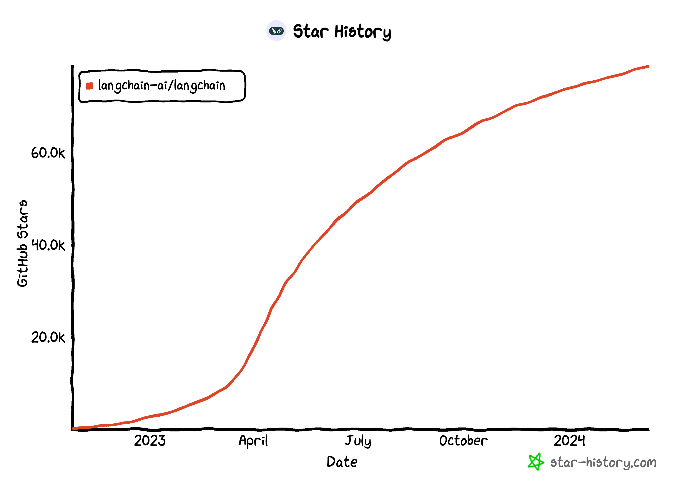

# LangChain

## 1. What is LangChain

The huge success of ChatGPT has inspired more and more developers to develop applications based on large language models using the API or privatized models provided by OpenAI. Although the call of large language models is relatively simple, creating a complete application still requires a lot of custom development work, including API integration, interactive logic, data storage, and so on.

To solve this problem, since 2022, many institutions and individuals have launched a number of open source projects to help developers quickly build end-to-end applications or workflows based on large language models. One of the projects that has attracted much attention is the LangChain framework.

**The LangChain framework is an open source tool that takes full advantage of the power of large language models to develop a variety of downstream applications. Its goal is to provide a common interface for a variety of large language model applications, thereby simplifying the application development process**. Specifically, the LangChain framework enables data awareness and environmental interaction, that is, it enables language models to be connected to other data sources and allows languageThe language model interacts with its environment.

Using the LangChain framework, we can easily build a RAG application as shown below ([Image source](https://github.com/chatchat-space/Langchain-Chatchat/blob/master/img/langchain+chatglm.png)). In the figure below, `each oval represents a module of LangChain`, such as a data collection module or a preprocessing module. `Each rectangle represents a data state`, such as raw data or preprocessed data. The arrow indicates the direction of data flow, from one module to another. At each step, LangChain can provide corresponding solutions to help us handle various tasks.

## 2. Core components of LangChain

LangChian, as a large language model development framework, can integrate LLM models (dialogue models, embedding models, etc.), vector databases, interactive layer prompts, external knowledge, and external proxy tools, and can freely build LLM applications. LangChain is mainly composed of the following 6 core components:Composition:

- **Model I/O**: Interface for interacting with language models

- **Data connection**: Interface for interacting with data of specific applications

- **Chains**: Combining components to realize end-to-end applications. For example, we will build a `search question and answer chain` to complete search question and answer later.

- **Memory**: Used to persist application status between multiple runs of the chain;

- **Agents**: Extend the reasoning ability of the model. Call sequences for complex applications;

- **Callbacks**: Extend the reasoning ability of the model. Call sequences for complex applications;

During the development process, we can flexibly combine according to our own needs.

## 3. Stable version of LangChain

In the rapid development of LLM technology, LangChain, as an evolving innovation platform, continues to promote the expansion of technology boundaries. On January 9, 2024, LangChain officially released its stable version **v0.1.0**. This milestone update brings comprehensive and powerful functional support to developers. It covers key components such as model input and output processing, data connection, chain operation, memory mechanism, proxy service and callback processing, providing LLM applications with a complete and powerful platform.It provides a solid foundation for the development and deployment of applications.
At the same time, LangChain's continuous optimization and functional iteration will bring more innovative features and performance improvements in the future.

- **Compatibility and Support**: LangChain v0.1.0 takes into account the support of `Python and JavaScript` while maintaining backward compatibility, ensuring that developers can seamlessly transition during the upgrade process and enjoy a more secure and stable development experience.

- **Architecture Improvement**: By effectively separating the core component langchain-core from the partner package, LangChain's architectural design has become more organized and stable, laying a solid foundation for future systematic expansion and security improvement.

- **Observability**: LangChain provides industry-leading debugging and observation capabilities through deep integration with LangSmith. This allows developers to have a clear understanding of each step of the operation and its input and output in the LLM application, greatly simplifying the debugging and troubleshooting process.

- **Extensive integration**: LangChain has nearly **700** integrations, covering multiple technical areas from LLM to vector storage, tools and agents, greatly reducing the complexity of building LLM applications on various technology stacks.

- **Composability**: With `LangChain Expression Language (LCEL) allows developers to easily build and customize chains, taking advantage of the data orchestration framework, including advanced features such as batch processing, parallel operations, and alternatives.

- **Streaming**: LangChain has deeply optimized streaming to ensure that all chains created with LCEL support streaming, including data streaming in intermediate steps, providing users with a smoother experience.

- **Output parsing**: LangChain provides a series of powerful output parsing tools to ensure that LLM can return information in a structured format, which is critical for LLM to execute specific action plans.

- **Retrieval capabilities**: LangChain introduces advanced retrieval technologies suitable for production environments, including text segmentation, retrieval mechanisms, and index pipelines, allowing developers to easily combine private data with LLM capabilities.

- **Tool Usage and Agents**: LangChain provides a rich collection of agents and tools, and provides a simple way to define tools, supports agent workloads, including allowing LLM to call functions or tools, and how to efficiently make multiple calls and inferences, greatly improving development efficiency and application performance.

## 4. LangChain Ecosystem

- **LangChain Community**: Focusing on third-party integration, it greatly enriches the LangChain ecosystem, making it easier for developers to build complex and powerful applications, while also promoting community cooperation and sharing.

- **LangChain Core**: The core library and core components of the LangChain framework, which provides basic abstractions and the LangChain Expression Language (LCEL), provides infrastructure and tools for building, running and interacting with LLM applications, and provides a solid foundation for the development of LangChain applications. The document processing, formatting prompt, output parsing, etc. that we will use later are all from this library.

- **LangChain CLI**: Command line tool that enables developers to interact with the LangChain framework through the terminal to perform tasks such as project initialization, testing, and deployment. Improve development efficiency and enable developers to manage the entire application life cycle with simple commands.

- **LangServe**: Deployment service for deploying LangChain applications to the cloud, providing scalable and highly available hosting solutions with monitoring and logging capabilities. Simplify the deployment process so that developers can focus on application development without having to worry about the underlying infrastructure and operations.

- **LangSmith**: DeveloperThe platform focuses on the development, debugging and testing of LangChain applications, provides a visual interface and performance analysis tools, and aims to help developers improve the quality of applications and ensure that they meet the expected performance and stability standards before deployment.

---

> In this chapter, we briefly introduced the development framework LangChain. In the next chapter, we will introduce the overall process of developing LLM applications.