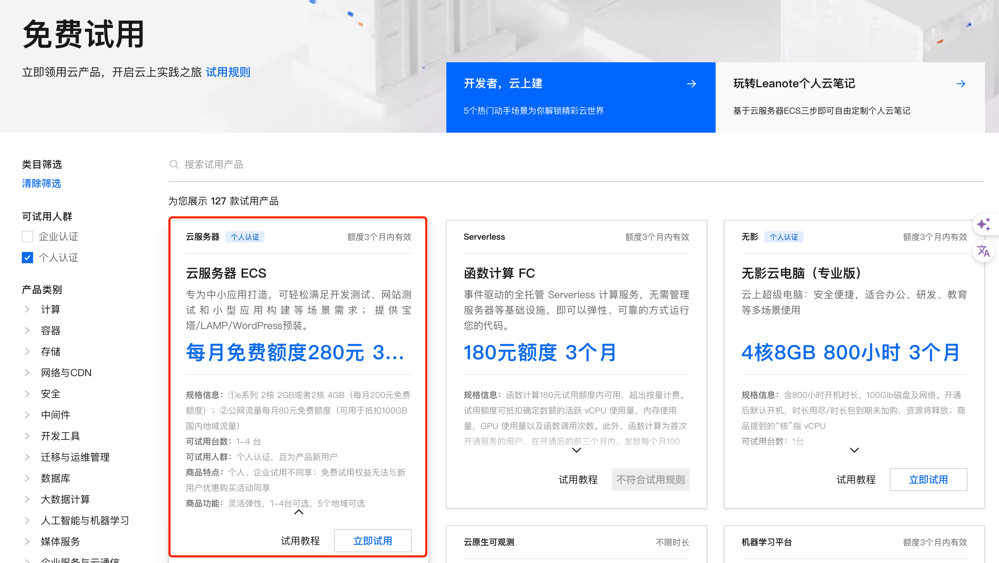
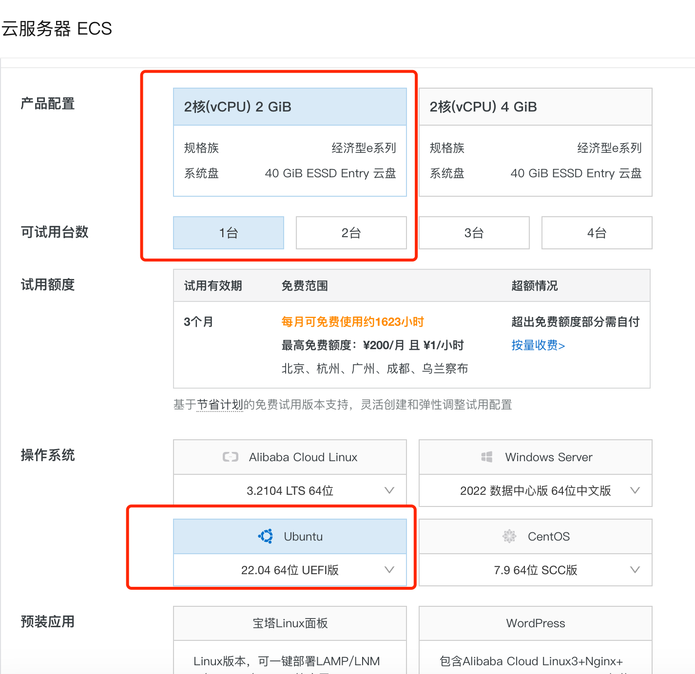
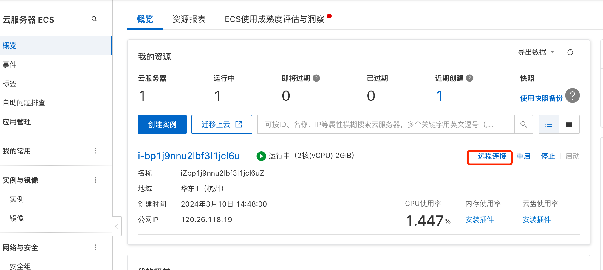
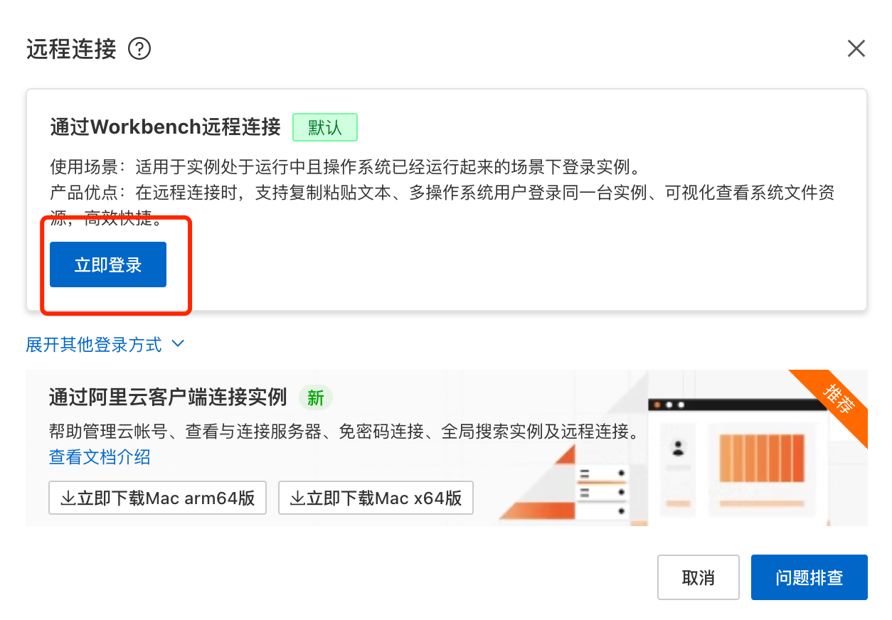
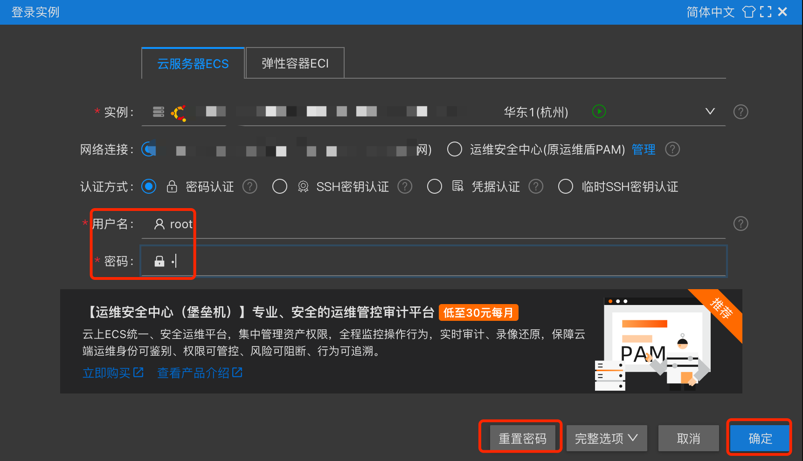
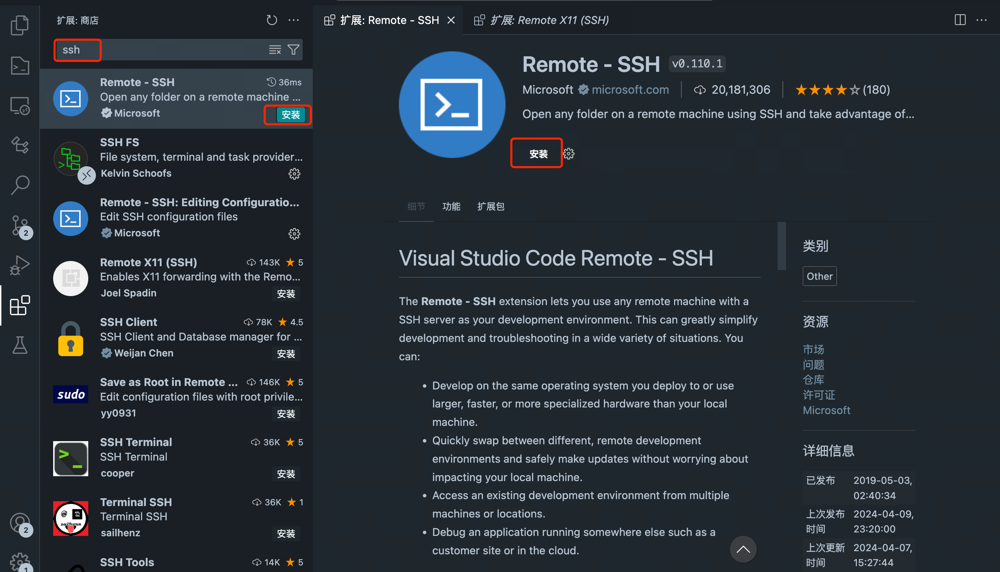
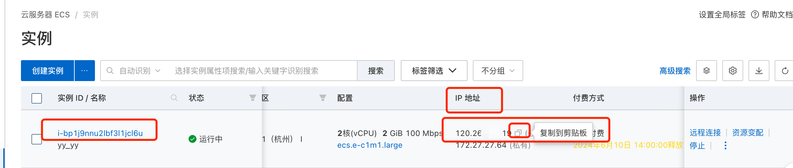
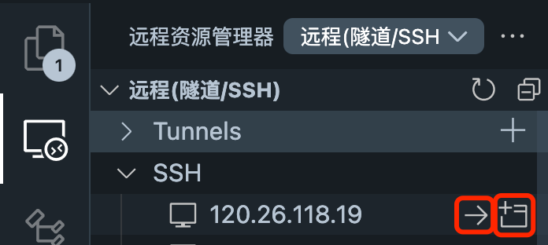
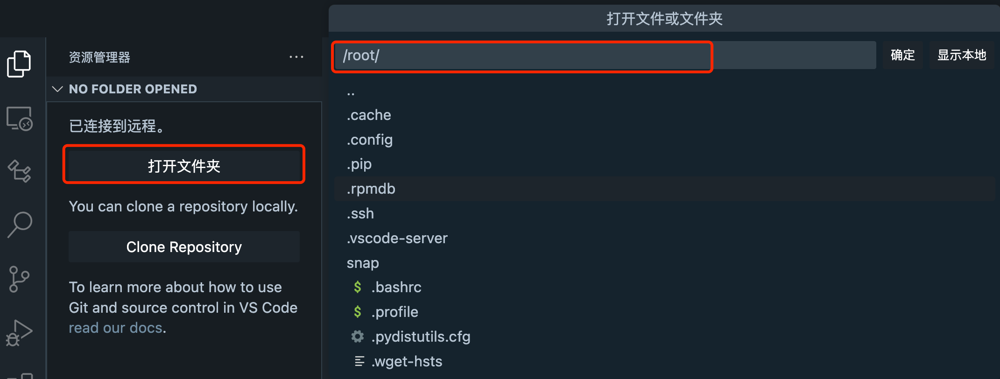

# Basic use of Alibaba Cloud server

## 1. Why choose Alibaba Cloud server

Alibaba Cloud is a world-leading cloud computing service provider, providing cloud computing, big data, artificial intelligence, security, enterprise applications, digital entertainment and other services to millions of customers in more than 200 countries and regions around the world. Alibaba Cloud's server has stable performance and low price, making it the first choice for many beginners. In particular, Alibaba Cloud's university plan allows you to get a cloud server for free, which is very suitable for students. For new users, Alibaba Cloud also provides a free trial opportunity, which allows you to use the cloud server for free for one year.

## 2. Get Alibaba Cloud University Plan

### 2.1. Introduction to the University Plan

The general benefits of college students are open to all Chinese college students, including college students with higher education status such as junior college, undergraduate, master, doctoral, and postgraduate students in mainland China, Hong Kong, Macao and Taiwan. On this basis, students of Alibaba Cloud partner universities can enjoy 30% off exclusive benefits.

### 2.2. Application for the College Student Program

Application link: https://university.aliyun.com/mobile?clubTaskBiz=subTask..11337012..10212..&userCode=1h9ofupt

1. Benefit 1: Chinese college students who have passed the student certification can receive a 300 yuan no-threshold coupon.

2. Benefit 2:Chinese college students, whose colleges are Alibaba Cloud partner colleges, can receive a 30% discount on Alibaba Cloud public cloud products (except special products) on top of a 300 yuan no-threshold coupon, with the original order price not exceeding 5,000 yuan.

Currently, the partner colleges are: Tsinghua University, Peking University, Zhejiang University, Shanghai Jiaotong University, University of Science and Technology of China, South China University of Technology, and Hong Kong University of Science and Technology (Guangzhou). More colleges are in negotiation, so stay tuned!

Click on the picture to receive it immediately, and scan the QR code with your real-name authenticated Alipay to log in and verify.

### 2.3. Benefits for College Student Teachers

The user is a teacher (including postdoctoral fellows) of a partner college, and has completed identity authentication in accordance with the activity requirements.

The current partner universities include: Tsinghua University, Peking University, Zhejiang University, Shanghai Jiaotong University, University of Science and Technology of China, South China University of Technology and Hong Kong University of Science and Technology (Guangzhou). More universities are in negotiation, so stay tuned! 

- Alibaba Cloud offers a 50% discount on all public cloud products (except special products), and sets up exclusive service channels to accelerate scientific research and teaching.

Note: It is best to purchase the product after confirming that the coupon has been received; the coupon information can be viewed in `User Center-Card Management-Coupon Management`.

https://developer.aliyun.com/plan/student

## 3. New users receive a trial of the cloud server

Application link: https://free.aliyun.com/?crowd=personal
Here we recommend you to apply for the `Cloud Server ECS`, with a free quota of 280 yuan per month and a validity period of 3 months. The configuration is as follows:

- e series 2 cores 2GB or 2 cores 4GB (200 yuan free quota per month);
- 80 yuan free quota per month for public network traffic (can be used to deduct 100GB domestic regional traffic)

## 4. Guide to creating cloud servers

Here, we take `Cloud Server ECS` as an example for configuration. If you choose the minimum configuration, select `Ubuntu` for the system.

During the trial, fill in "Automatically release the instance" in the expiration release setting, so that no fees will be incurred after the expiration.

After the creation is complete, click Tried or [link](https://ecs.console.aliyun.com/home#) to see the instance we just created.

Click Remote Connection and click Log In Now.

The default password is root;

If login is not allowed, follow [link](https://help.aliyun.com/zh/ecs/user-guide/use-the-password-can-t-login-the-linux-cloud-server-ecs-what-should-i-do) to modify the server configuration. 
[Simple solution: On the cloud server management console page, click the three dots near "Remote Connection" and select Reset Instance Password. Just log in again.]
After that, you can enter the environment to learn! ! ! 

## 5. VSCode connects to a remote server

`Visual Studio Code (VSCode)` is a free, open source, modern code editor developed by Microsoft. It is favored by developers for its lightweight, high performance and wide support for programming languages. The core features of VSCode include:

1. **Cross-platform**: Supports Windows, macOS and Linux operating systems.
2. **Extension Market**: Provides a wealth of extension plug-ins to meet different development needs.
3. **Built-in Git support**: Convenient for version control operations.
4. **Debugging tool**: Built-in powerful debugging function, supporting multiple programming languages.
5. **IntelliSense**: Provides intelligent prompt functions such as code completion and parameter information.
6. **Integrated terminal**: Built-in terminal, command line operations can be performed without switching.
7. **Customization**: Supports personalized settings such as themes and key bindings.

The flexibility and ease of use of VSCode make it one of the preferred code editing tools for developers.

Here we choose VSCode to connect to the remote server, which makes it convenient for us to directly operate the remote server in the local editor.

1. Install the SSH plug-in
Open the plug-in market of VSCODE, search for SSH, and find `Remote- SSH` plug-in and install

2. Get the server IP
Open the [Instance List](https://ecs.console.aliyun.com/server/region/) of the Alibaba Cloud server
Find the public IP address of the server we need to connect to and copy it.

Open the editor of the remote server that can be connected. Here we take VSCODE as an example.
3. Configure SSH
Open the `Remote Resource Manager` plugin you just downloaded, add the server's SSH,
`ssh -p port username@ip`
The port is usually configured as 22,
username can be root or a custom username
Replace IP with the server's IP
Select the local SSH configuration file

Click the link in the lower right corner to enter the server

4. ConnectWhen we connect later, we can continue to click on the `Remote Resource Manager` on the left to find our server. There are two options on the right.

- The arrow is the current window open
- The plus sign in the upper left corner is the new window open

5. Open the directory
Then click Open Folder and enter the required directory to open

Then you can have fun programming! ! !

## VI. Use of Jupyter Notebook

**Jupyter Notebook** is an open source `interactive computing environment` that allows users to create and share documents containing live code, equations, visualizations, and text. Its name comes from the three core programming languages ​​it supports: Julia, Python, and R, which is also the origin of the name "Ju-pyt-er". The suffix of files written in Jupyter Notebook is `.ipynb`

The main features of Jupyter Notebook include:

1. **Interactive programming**:Users can write code in separate cells and execute it, and `see the results of the code immediately`, which is very useful for data analysis, machine learning, scientific computing and other fields.

2. **Multi-language support**: Although originally designed for Julia, Python and R, Jupyter now supports more than 40 programming languages ​​by using the corresponding kernels.

3. **Rich display functions**: Jupyter Notebook supports Markdown, allowing users to add rich media content such as formatted text, images, videos, HTML, LaTeX, etc., making the document more vivid and informative.

4. **Data visualization**: Jupyter Notebook seamlessly integrates with many data visualization libraries (such as Matplotlib, Plotly, Bokeh, etc.), and can generate charts and visualize data directly in Notebook.

5. **Easy to share**: Notebook files can be easily shared through email, cloud services or Jupyter Notebook Viewer, and others can view the content and run the code, and even leave comments.

6. **Extensibility**: Jupyter has a large number of extension plug-ins that can enhance its functionality, such as interactive widgets, code auto-completion, theme changes, etc.

7. **Scientific computingTool integration**: Jupyter Notebook can be integrated with many scientific computing and data analysis tools, such as Python libraries such as NumPy, Pandas, and SciPy, making data processing and analysis more convenient.

Jupyter Notebook is a widely used tool for data scientists, researchers, educators, and students. It promotes the development of open science and education, making it easier for people to share and reproduce research results.

This tutorial uses Jupyter Notebook to write and run code, which makes it easier for us to write and debug code.

`VSCODE` currently opens Jupyter Notebook files directly without installing any plug-ins. (You can also follow the next chapter to install plug-ins)

Notebook documents consist of a series of cells, mainly in the following two forms.

- **Code cell**: Enter code in a code cell and press `Shift + Enter` to run the code in the cell and display the output below.

- **Markdown cell**: Use `Markdown` syntax to write text in a cell. You can create headings, lists, links, formatted text, etc., and use `Ctrl + Enter` to render the current Markdown cell.We often use code cells to write code and run it in time to view the results. And use the following shortcut keys to improve efficiency:

### Cell Editing

- `Enter`: Enter edit mode.

- `Esc`: Exit edit mode.

### Cell Operations

- `A`: Insert a new cell above the current cell.

- `B`: Insert a new cell below the current cell.

- `D` (press twice): Delete the current cell.

- `Z`: Undo the deletion operation.

- `C`: Copy the current cell.

- `V`: Paste the previously copied cell.

- `X`: Cut the current cell.

- `Y`: Convert the current cell to a code cell.

- `M`: Convert the current cell to a Markdown cell.

- `Shift + M`: Toggle the Markdown rendering state of the cell.

### Code Execution and Debugging

- `Shift + Enter`: Run the current cell and jump to the next cell.
- `Ctrl + Enter`: Run the current cell, but do not jump to the next cell.
- `Alt + Enter`: Run the current cell and insert a new cell below.
- `Esc`: Enter command mode.
- `Enter`: EnterEdit mode.
- `Ctrl + Shift + -`: Split the current cell into two cells.
- `Ctrl + Shift + P`: Open the command palette, where you can search and execute various commands.

### Navigation and window management

- `Up` / `Down` or `K` / `J`: Move up and down between cells.
- `Home` / `End`: Jump to the beginning or end of the Notebook.
- `Ctrl + Home` / `Ctrl + End`: Jump to the first or last cell of the current Notebook.
- `Tab`: Switch to the next panel in the Notebook view (for example, from the editor to the output or metadata panel).
- `Shift + Tab`: Switch to the previous panel in the Notebook view.

### Other useful shortcuts

- `H`: Show or hide the Notebook sidebar.
- `M`: Convert the current cell to a Markdown cell.
- `Y`: Convert the current cell to a code cell.

---

> Now we have the necessary foundation for development. Next, we can go directly to `7. Environment Configuration` to configure the environment.