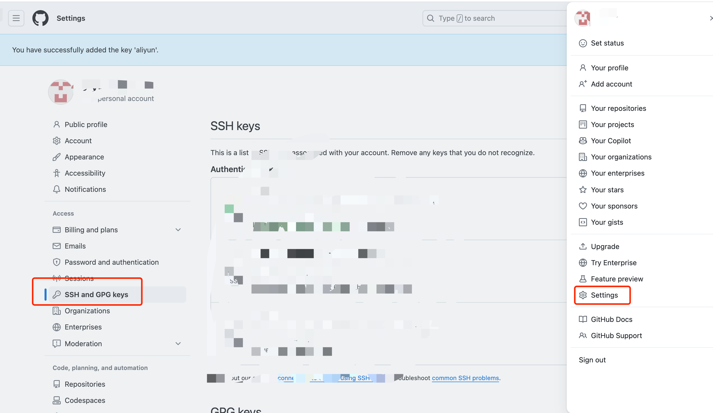
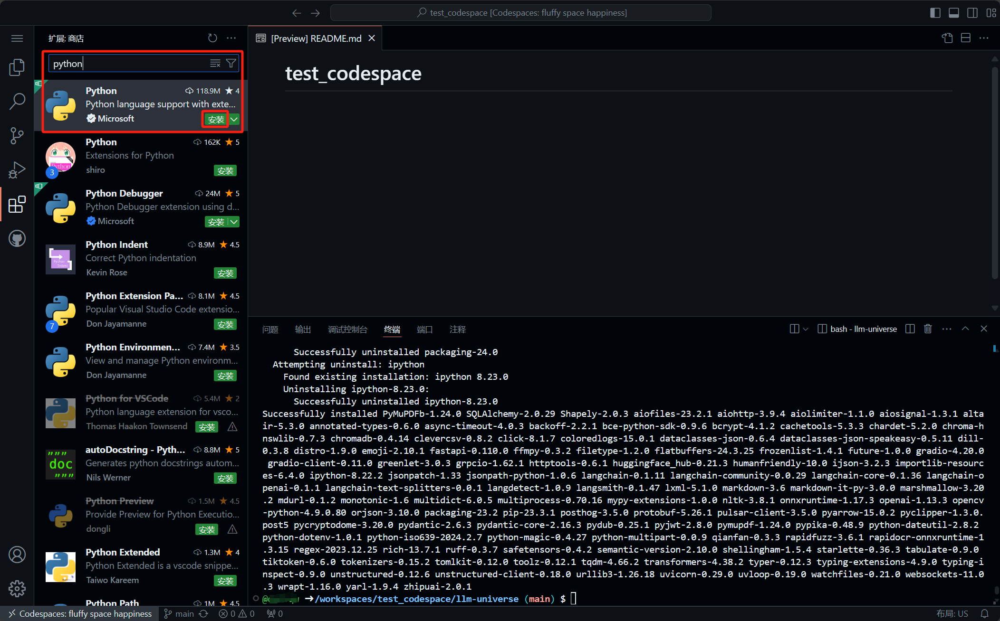
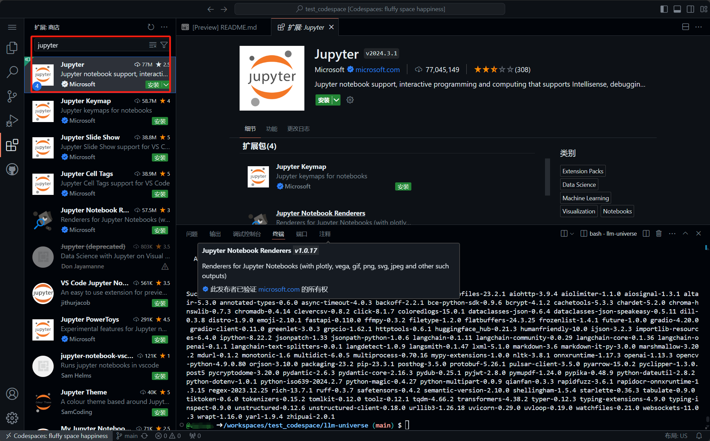
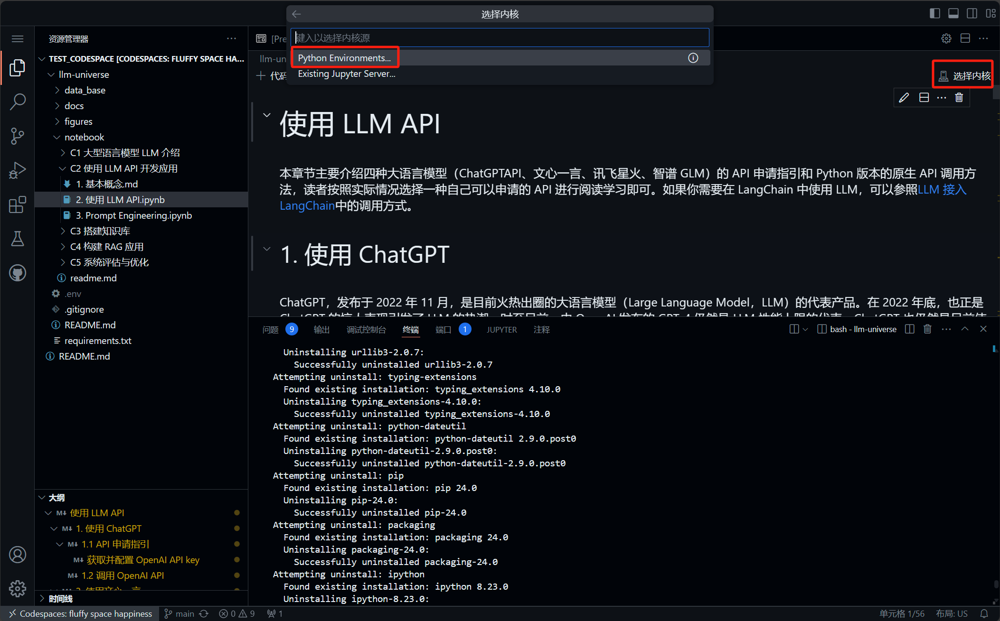
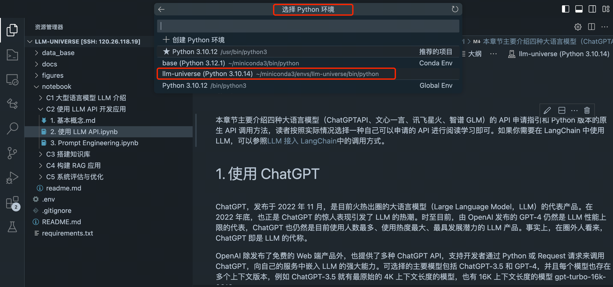

# Environment Configuration

This chapter mainly provides some necessary environment configuration guides, including code environment configuration, Python environment configuration of VSCODE code editor, and some other resource configurations used.

## 1. Code Environment Configuration Guide

Here we introduce each step of code environment configuration in detail, divided into two parts: basic environment configuration and general environment configuration, to meet the needs of different users and environments.

- **Basic environment configuration** part: suitable for environment configuration **beginners** or **new server environments (such as Alibaba Cloud)**. This part introduces how to generate SSH keys and add them to GitHub, as well as install and initialize conda environments.

- **General environment configuration** part: suitable for **users with some experience**, **local installations with existing environment foundation**, or **completely independent environments (such as GitHub Codespace)**. This part introduces how to create and activate conda virtual environments, clone project repositories, switch to project directories, and install required Python packages. To speed up the installation of Python packages, we also provide some domestic mirror sources. *For completely independent environments, you can skip the first two steps about virtual environment (conda) configuration*.

### 1.1 Basic environment configuration (configure git and conda)

1. Generate ssh keyy
`ssh-keygen -t rsa -C "youremail@example.com"`
2. Add the public key to github
`cat ~/.ssh/id_rsa.pub`
Copy the output, open github, click the avatar in the upper right corner, select `settings` -> `SSH and GPG keys` -> `New SSH key`, paste the copied content into the key, and click `Add SSH key`.


3. Install conda environment

1. Linux environment (usually Linux environment)

1. Installation:

```shell
mkdir -p ~/miniconda3
wget https://repo.anaconda.com/miniconda/Miniconda3-latest-Linux-x86_64.sh -O ~/miniconda3/miniconda.shbash ~/miniconda3/miniconda.sh -b -u -p ~/miniconda3
rm -rf ~/miniconda3/miniconda.sh
```

2. Initialization:

```shell
~/miniconda3/bin/conda init bash
~/miniconda3/bin/conda init zsh
```

3. Create a new terminal and check whether conda is installed successfully `conda --version`

2. macOS environment

1. Installation

```shell
mkdir -p ~/miniconda3
curl https://repo.anaconda.com/miniconda/Miniconda3-latest-MacOSX-arm64.sh -o ~/miniconda3/miniconda.sh
bash ~/miniconda3/miniconda.sh -b -u -p ~/miniconda3
rm -rf ~/miniconda3/miniconda.sh
```

2. Initialization:

```shell
~/miniconda3/bin/conda init bash
~/miniconda3/bin/conda init zsh
```

3. Create a new terminal and check whether conda is installed successfully `conda --version`

3. Windows environment
1. Download: `curl https://repo.anaconda.com/miniconda/Miniconda3-latest-Windows-x86_64.exe -o miniconda.exe`
2. Installation: Click the downloaded `miniconda.exe` and follow the installation guide to install
3. Open Anaconda Prompt in the menu and check whether conda is installed successfully `conda--version`
4. Delete the installation package: `del miniconda.exe`
4. Please refer to the `General Environment Configuration` section below for subsequent configuration

### 1.2 General Environment Configuration

1. Create a new virtual environment
`conda create -n llm-universe python=3.10`
2. Activate the virtual environment
`conda activate llm-universe`
3. Clone the current repository in the path where you want to store the project
`git clone git@github.com:datawhalechina/llm-universe.git`

4. Change the directory to llm-universe
`cd llm-universe`

5. Install the required packages
`pip install -r requirements.txt`
Usually you can speed up the installation through Tsinghua source
`pip install -r requirements.txt -i https://pypi.tuna.tsinghua.edu.cn/simple`

> Commonly used domestic mirror sources are listed here. When the mirror source is not stable, you can switch as needed:
> Tsinghua: https://pypi.tuna.tsinghua.edu.cn/simple/
> Alibaba Cloud: http://mirrors.aliyun.com/pypi/simple/
> University of Science and Technology of China: https://pypi.mirrors.ustc.edu.cn/simple/
> Huazhong University of Science and Technology: http://pypi.hustunique.com/simple/
> Shanghai Jiaotong University: https://mirror.sjtu.edu.cn/pypi/web/simple/
> Douban: http://pypi.douban.com/simple

## 2. VSCode configures Python environment

1. Install Python plug-in

This tutorial is based on Python language development. For a better development experience, we need to install Python InsertSearch for `Python` in the plugin market, find the `Python` plugin and install it.

At this time, when we execute Python code, our Python environment will be automatically recognized, and code completion and other functions will be provided to facilitate our development.

2. Install Jupyter plugin
In this tutorial, we use Jupyter Notebook for development, so we need to install the Jupyter plugin.
Search for `Jupyter` in the plugin market, find the `Jupyter` plugin and install it.


3. Configure Python environment for Jupyter Notebook

1. Open a Jupyter Notebook
2. Click `Select Python interpreter (the displayed content will change according to the name of the selected environment)` in the upper right corner to select the Python environment of the current Jupyter Notebook.
 3. Click `Select Python` to enter the environment list and select our configured environment `llm-universe`.


After that, we can use our Python environment for development in Jupyter Notebook.

## 3. Download other resources

### 3.1 Download NLTK related resources

When we use the open source word vector model to build open source word vectors, we need to use some resources of the third-party library nltk. Under normal circumstances, it will be automatically downloaded from the Internet, but the download may be interrupted due to network reasons. When we use nltk, an error will be reported. Here we download related resources from the domestic warehouse mirror address.

We use the following command to download and unzip the nltk resource:

```shell
cd /root
git clone https://gitee.com/yzy0612/nltk_data.git --branch gh-pages
cd nltk_data
mv packages/* ./
cd tokenizers
unzip punkt.zip
cd ../taggers
unzip averaged_perceptron_tagger.zip ```