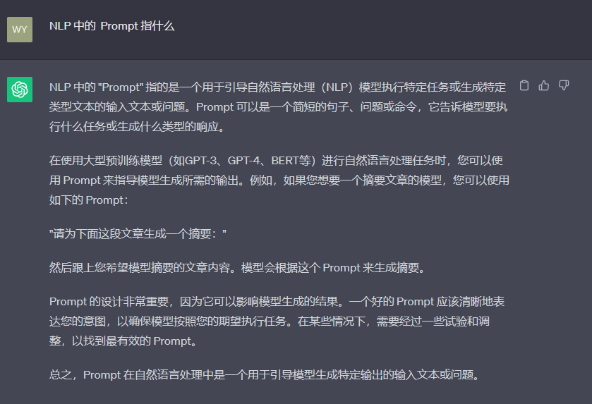

# Basic Concepts

## 1. Prompt

Prompt was originally designed by NLP (natural language processing) researchers as a task-specific input template for downstream tasks, similar to a task (such as classification, clustering, etc.) corresponding to a prompt. After ChatGPT was launched and widely used, Prompt began to be generalized to all inputs to the big model. That is, each time we access the big model, the input is a prompt, and the result returned by the big model is called completion.

For example, in the following example, the question we asked ChatGPT, "What does prompt mean in NLP?" is our question, which is actually our prompt this time; and the result returned by ChatGPT is the completion this time. That is, for the ChatGPT model, the completion corresponding to the prompt is shown in the figure below.



In the future, we will use Prompt to replace the input to LLM and use Completion to replace the output of LLM. At the same time, we will combine specific cases to introduce how to design Prompt toGive full play to the capabilities of LLM.

## 2. Temperature

LLM generation is random, and the final result is generated by selecting prediction results with different prediction probabilities at the top level of the model. We can generally control the randomness and creativity of LLM generation results by controlling the temperature parameter.

Temperature generally takes values ​​between 0 and 1. When the value is low and close to 0, the randomness of the prediction will be low, producing more conservative and predictable texts, and less likely to generate unexpected or unusual words. When the value is high and close to 1, the randomness of the prediction will be higher, and all words are more likely to be selected, which will produce more creative and diverse texts, and more likely to generate unusual or unexpected words.

For example, when we use ChatGPT to ask it to think of a master's thesis topic on cross-language models for us, when we set temperature to 0, the model responds:

Title: Research on machine translation performance optimization based on cross-language models

Abstract: With the development of globalization, the demand for cross-language communication is growing. Machine translation, as an automated translation technology, provides convenience for cross-language communication. However, due to the differences between languages, the performance of machine translation systems varies between different language pairs. This paper aims to explore how to optimize the performance of machine translation and improve translation performance by studying cross-language models.Translation quality and accuracy.

Keywords: cross-language model, machine translation, performance optimization, translation quality, accuracy

1. Introduction
1.1 Research background and significance
1.2 Current status of research at home and abroad
1.3 Research objectives and content

2. Principles and methods of cross-language models
2.1 Traditional machine translation methods
2.2 Basic principles of cross-language models
2.3 Common methods and techniques of cross-language models

3. Application of cross-language models in machine translation
3.1 Advantages and challenges of cross-language models in machine translation
3.2 Comparison of performance of cross-language models on different language pairs
3.3 Case analysis of cross-language models in machine translation in specific fields

4. Performance optimization methods of cross-language models
4.1 Data preprocessing and feature selection
4.2 Model parameter tuning and training strategy
4.3 Combination of cross-language models with other technologies

5. Experimental design and result analysis
5.1 Experimental design and data set introduction
5.2 Analysis and comparison of experimental results
5.3 Feasibility and reliability verification of experimental results

6. Conclusion and prospects
6.1 Research summary
6.2 Existing problems and deficiencies6.3 Further Research Directions and Prospects

References

Note: The above is only an example of a topic. The specific topic should be adjusted and modified according to personal interests and research background.

When we set temperature to 0.95, the model responds:

The following are several suggestions for master's thesis topics on cross-language models:

1. Comparison and optimization of cross-language text classification models - By comparing the performance of different cross-language models, analyze their adaptability and accuracy between different languages, and try to optimize existing models to improve the effect of cross-language text classification.

2. Machine translation performance analysis based on cross-language models - By comparing the performance of different cross-language models in machine translation tasks, study the shortcomings and advantages between different languages, and explore how to improve the performance of cross-language machine translation in a targeted manner.

3. Construction and application of cross-language sentiment analysis models - Use cross-language models to build sentiment analysis models, compare the accuracy and consistency of models in different languages, analyze the differences in sentiment expression in different languages, and explore the application of sentiment analysis in multilingual scenarios.

4. Cross-language model training under multi-task learning - explore the training methods and effects of cross-language models under multi-task learning, improve the generalization ability and performance of cross-language models by training multiple tasks at the same time, and verify the impact of multi-task learning on cross-language models.

5.Construction and evaluation of cross-language question-answering system - build a cross-language question-answering system, realize automatic parsing of questions and generation of answers through cross-language models, and evaluate the effectiveness and usability of the system in a multilingual environment.

6. Application of pre-trained cross-language models to speech recognition - apply pre-trained cross-language models to speech recognition tasks, study their impact on speech recognition accuracy and multilingual adaptability, and compare the processing capabilities of different models for multilingual speech data.

Choose a topic that suits your interests and research direction, and discuss and confirm it with your mentor in depth.

For different problems and application scenarios, we may need to set different temperatures. For example, in the personal knowledge base assistant project built in this tutorial, we generally set the temperature to 0 to ensure the stable use of the knowledge base content by the assistant, avoid erroneous content and model hallucinations; in scenarios such as product intelligent customer service and scientific research paper writing, we also need stability rather than creativity; but in scenarios such as personalized AI and creative marketing copywriting, we need more creativity and tend to set the temperature to a higher value.

## 3. System Prompt

System Prompt is a new concept that has been widely used as ChatGPT API is opened. In fact, it is not used in the training of the big model itself.It is not a reflection, but a strategy set by the large model service provider to improve the user experience**.

Specifically, when using the ChatGPT API, you can set two types of prompts: one is the System Prompt, which will have a lasting impact on the model's response throughout the conversation and is more important than the ordinary prompt; the other is the User Prompt, which is more like the prompt we usually mention, that is, the input that requires the model to respond.

We usually set the System Prompt to make some initial settings for the model. For example, we can set the personality we want the model to have in the System Prompt, such as a personal knowledge base assistant. There is usually only one System Prompt in a session. After setting the personality or initial settings of the model through the System Prompt, we can give the instructions that the model needs to follow through the User Prompt. For example, when we need a humorous personal knowledge base assistant and ask the assistant what I have to do today, we can construct the following prompt:

```json
{
"system prompt": "You are a humorous personal knowledge base assistant who can answer users' questions based on the given knowledge base content.", your answer style should be humorous",
"user prompt": "What do I have to do today?"
}
```

Through the above prompt construction, we can let the model answer the questions raised by users in a humorous style.