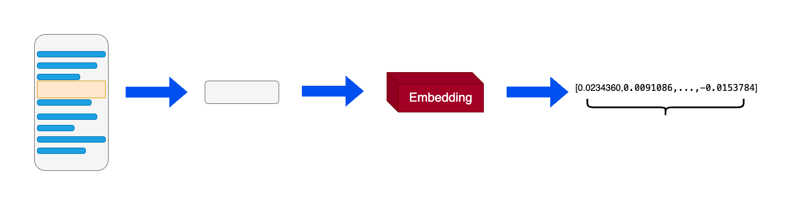
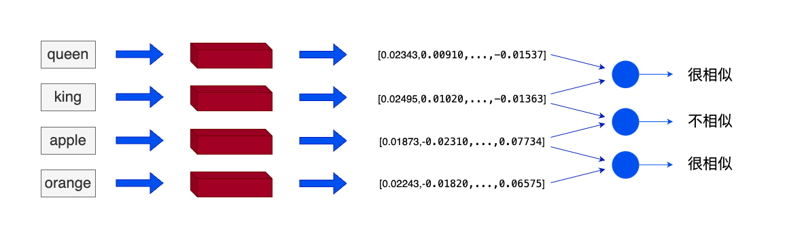

# Word embeddings and vector knowledge base

## 1. Word embeddings

### 1. What is word embeddings

In machine learning and natural language processing (NLP), word embeddings is a technique that converts unstructured data, such as words, sentences, or entire documents, into real vectors. These real vectors can be better understood and processed by computers.

The main idea behind embeddings is that similar or related objects should be close in the embedding space.

For example, we can use word embeddings to represent text data. In word embeddings, each word is converted into a vector that captures the semantic information of the word. For example, the words "king" and "queen" will be very close in the embedding space because they have similar meanings. And "apple" and "orange" will also be close because they are both fruits. The words "king" and "apple" are farther apart in the embedding space because they have different meanings.
### 2. Advantages of word embedding
In RAG (Retrieval Augmented GThere are two main advantages of word vectors in terms of search (enhanced search and retrieval generation): 
* Word vectors are more suitable for search than text. When we search in a database, if the database stores text, we mainly find relatively matching data by searching for keywords (lexical search) and other methods. The degree of matching depends on the number of keywords or whether the query sentence is completely matched; however, the word vector contains the semantic information of the original text, and the similarity between the question and the data in the database can be directly obtained by calculating the dot product, cosine distance, Euclidean distance and other indicators between the question and the data in the database; 
* Word vectors have stronger comprehensive information capabilities than other media. When traditional databases store multiple media such as text, sound, image, video, etc., it is difficult to build associations and cross-modal query methods for the above multiple media; however, word vectors can map multiple data into a unified vector form through multiple vector models. 
### 3. General methods for building word vectors

When building a RAG system, we can often use embedding models to build word vectors. We can choose: 
* Use the Embedding API of each company; 
* Use embedding models locally to build data into word vectors. 

## 2. Vector Database

### 1. What is a vector database?
A vector database is a solution for efficiently computing and managing large amounts of vector data. A vector database is a database specifically used to store and retrieve vector data (embedding).Database system. Unlike traditional databases based on relational models, it focuses on the characteristics and similarities of vector data.

In a vector database, data is represented in vector form, and each vector represents a data item. These vectors can be numbers, text, images, or other types of data. Vector databases use efficient indexing and query algorithms to accelerate the storage and retrieval process of vector data.
### 2. Principles and core advantages of vector databases
The data in vector databases uses vectors as the basic unit to store, process, and retrieve vectors. Vector databases obtain the similarity with the target vector by calculating the cosine distance, dot product, etc. with the target vector. When processing large or even massive amounts of vector data, the efficiency of vector database indexing and query algorithms is significantly higher than that of traditional databases.
### 3. Mainstream vector databases
* [Chroma](https://www.trychroma.com/): It is a lightweight vector database with rich functions and simple API. It has the advantages of being simple, easy to use, and lightweight, but its functions are relatively simple and it does not support GPU acceleration, so it is suitable for beginners.
* [Weaviate](https://weaviate.io/): is an open source vector database. In addition to similarity search and maximum marginal relevance (MMR) search, it can also support combining multiple search algorithms (based on* [Qdrant](https://qdrant.tech/): Qdrant is developed in Rust language, with extremely high retrieval efficiency and RPS (Requests Per Second). It supports three deployment modes: local operation, deployment on local server and Qdrant cloud. And data can be reused by setting different keys for page content and metadata.