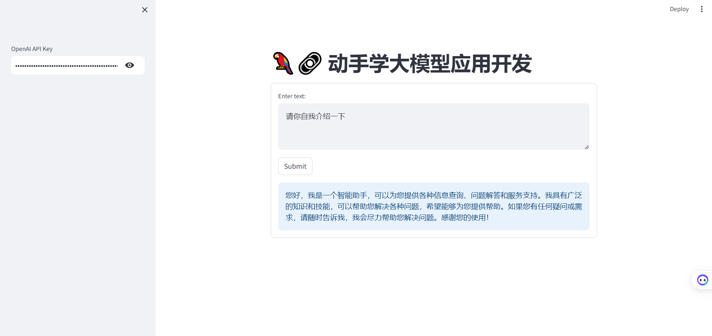
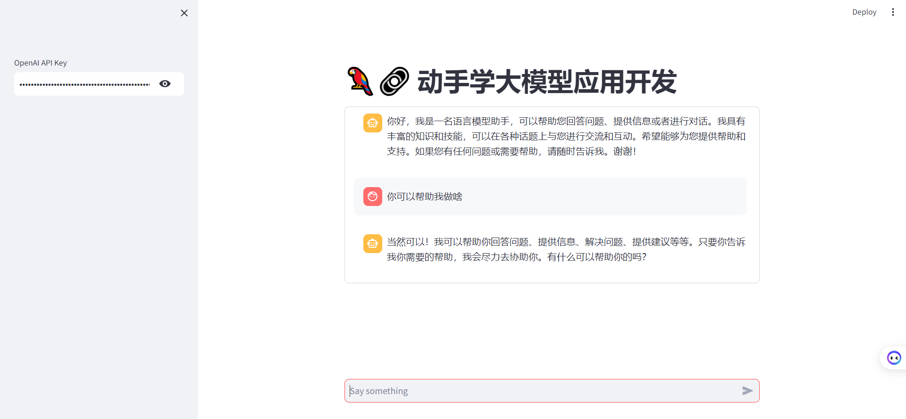
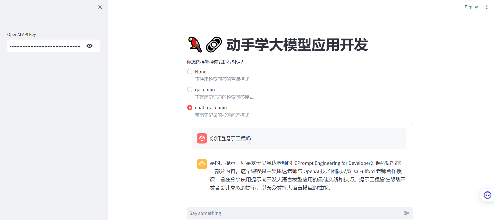

# 4.3 Deploy the knowledge base assistant

The source files involved in the text can be obtained from the following path:

> - [streamlit_app.py](https://github.com/datawhalechina/llm-universe/blob/main/notebook/C4%20%E6%9E%84%E5%BB%BA%20RAG%20%E5%BA%94%E7%94%A8/streamlit_app.py)

---

Now that we have a basic understanding of the knowledge base and LLM, it is time to combine them skillfully and create a visual interface. Such an interface is not only more convenient for operation, but also easy to share with others.

Streamlit is a quick and convenient way to demonstrate machine learning models directly in **Python through a friendly web interface**. In this course, we will learn *how to use it to build user interfaces for generative artificial intelligence applications*. After building a machine learning model, if you want to build a demo to show others, maybe to get feedback and drive improvements to the system, or just because you think the system is cool, you want to demonstrate it: Streamlit allows you to quickly achieve this goal through a Python interface program without having to write any front-end, web pages, or JavaScript.vaScript code.

## 1. Introduction to Streamlit

`Streamlit` is an open source Python library for quickly creating data applications. It is designed to allow data scientists to easily transform data analysis and machine learning models into interactive web applications without having to deeply understand web development. Unlike conventional web frameworks such as Flask/Django, it does not require you to write any client code (HTML/CSS/JS). You only need to write ordinary Python modules to create beautiful and highly interactive interfaces in a short time, thereby quickly generating data analysis or machine learning results; on the other hand, unlike those tools that can only be generated by dragging and dropping, you still have full control over the code.

Streamlit provides a set of simple and powerful basic modules for building data applications:

- st.write(): This is one of the most basic modules used to present text, images, tables, and other content in the application.

- st.title(), st.header(), st.subheader(): These modules are used to add titles, subtitles, and grouped titles to organize the layout of the application.

- st.text(), st.markdown(): used to add textThis content supports Markdown syntax.

- st.image(): used to add images to the application.

- st.dataframe(): used to render Pandas data frames.

- st.table(): used to render simple data tables.

- st.pyplot(), st.altair_chart(), st.plotly_chart(): used to render charts drawn by Matplotlib, Altair or Plotly.

- st.selectbox(), st.multiselect(), st.slider(), st.text_input(): used to add interactive widgets that allow users to select, enter or slide in the application.

- st.button(), st.checkbox(), st.radio(): used to add buttons, checkboxes and radio buttons to trigger specific actions.

These basic modules make it easy to build interactive data applications through Streamlit, and can be combined and customized as needed when used. For more information, please refer to the [official documentation](https://docs.streamlit.io/get-started)

## 2. Build an application

First, create a newPython file and save it streamlit_app.py in the root of your working directory

1. Import the necessary Python libraries.

```python
import streamlit as st
from langchain_openai import ChatOpenAI
```

2. Create a title for the app `st.title`

```python
st.title('🦜🔗 Hands-on learning of large model application development')
```

3. Add a text input box for users to enter their OpenAI API key

```python
openai_api_key = st.sidebar.text_input('OpenAI API Key', type='password')
```

4. Define a function to authenticate to the OpenAI API using the user's key, send a prompt, and get an AI-generated response. This function accepts the user's prompt as an argument and uses `st.info` to display the AI-generated response in a blue box

```python
def generate_response(input_text):
llm = ChatOpenAI(temperature=0.7, openai_api_key=openai_api_key)
st.info(llm(input_text))
```

5. Finally, use `st.form()` to create a text box (st.text_area()) for the user to enter. When the user clicks `Submit`, `generate-response()` will call the function with the user's input as a parameter

```python
with st.form('my_form'):
text = st.text_area('Enter text:', 'What are the three key pieces of advice for learning how to code?')
submitted = st.form_submit_button('Submit')
if not openai_api_key.startswith('sk-'):
st.warning('Please enter your OpenAI API key!', icon='⚠')
if submittted and openai_api_key.startswith('sk-'):
generate_response(text)
```

6. Save the current file `streamlit_app.py`!

7. Return to the terminal of your computer to run the application

```python
streamlit run streamlit_app.py
```

The result is shown below: 



However, only a single round of dialogue can be carried out at present. We make some modifications to the above. By using `st.session_state` to store the dialogue history, the context of the entire dialogue can be retained when the user interacts with the application.



Specific code is as follows:

```python
# Streamlit application interface
def main():
st.title('🦜🔗 Learn how to develop large-scale applications')
openai_api_key = st.sidebar.text_input('OpenAI API Key',type='password')

# Used to track conversation history
if 'messages' not in st.session_state:
st.session_state.messages = []

messages = st.container(height=300)
if prompt := st.chat_input("Say something"):
# Add user input to the conversation history
st.session_state.messages.append({"role": "user", "text": prompt})

# Call the respond function to get the answer
answer = generate_response(prompt, openai_api_key)
# Check if the answer is None
if answer is not None:
# Add LLM's answer to the conversation history
st.session_state.messages.append({"role": "assistant", "text": answer})

# Display the entire conversation history
for message in st.session_state.messages:
if message["role"] == "user":
messages.chat_message("user").write(message["text"])
elif message["role"] == "assistant":
messages.chat_message("assistant").write(message["text"]) 
```

## 3. Add retrieval questions and answers

First, encapsulate the code in `2. Build a retrieval question and answer chain`:
- get_vectordb function returns the vector knowledge base after the persistence of the C3 part
- get_chat_qa_chain function returns the result after calling the retrieval question and answer chain with historical records
- get_qa_chain functionReturns the result of calling the search question and answer chain without history

```python
def get_vectordb():
# Define Embeddings
embedding = ZhipuAIEmbeddings()
# Vector database persistence path
persist_directory = '../C3 Build Knowledge Base/data_base/vector_db/chroma'
# Load database
vectordb = Chroma(
persist_directory=persist_directory, # Allows us to save the persist_directory directory to disk
embedding_function=embedding
)
return vectordb

# Question and answer chain with history
def get_chat_qa_chain(question:str,openai_api_key:str):
vectordb = get_vectordb()
llm = ChatOpenAI(model_name= "gpt-3.5-turbo", temperature = 0,openai_api_key = openai_api_key)
memory = ConversationBufferMemory(
memory_key="chat_history", # Keep consistent with the input variable of prompt.
return_messages=True # Chat history will be returned as a list of messages instead of a single string
)
retriever=vectordb.as_retriever()
qa = ConversationalRetrievalChain.from_llm(
llm,
retriever=retriever,
memory=memory
)
result = qa({"question": question})
return result['answer']

# Question and answer chain without history
def get_qa_chain(question:str,openai_api_key:str):
vectordb = get_vectordb()
llm = ChatOpenAI(model_name = "gpt-3.5-turbo", temperature = 0,openai_api_key = openai_api_key)
template = """Use the following context to answer the last question. If you don't know the answer, say you don't know, don't try to make up an answer. Use no more than three sentences. Try to make your answer short and to the point. Always say "Thanks for your question!" at the end of your answer.
{context}
Question: {question}
"""
QA_CHAIN_PROMPT = PromptTemplate(input_variables=["context","question"],
template=template)
qa_chain = RetrievalQA.from_chain_type(llm,retriever=vectordb.as_retriever(),
return_source_documents=True,
chain_type_kwargs={"prompt":QA_CHAIN_PROMPT})
result = qa_chain({"query": question})
return result["result"]
```

Then, add a radio button component `st.radio` to select the mode for question and answer:
- None: Normal mode without retrieval question and answer
- qa_chain: Retrieval question and answer mode without history record
- chat_qa_chain: Retrieval question and answer mode with history record

```python
selected_method = st.radio(
"Which mode do you want to choose for conversation?",
["None", "qa_chain", "chat_qa_chain"],
captions = ["Normal mode without retrieval Q&A", "Retrieval Q&A mode without history", "Retrieval Q&A mode with history"])
```

The final effect is as follows: 



Enter the page, first enter OPEN_API_KEY (default), then click the radio button to select the Q&A mode, and finally enter your question in the input box and press Enter! 

> Full code reference [streamlit_app.py](./streamlit_app.py)

## 4. Deploy the application 

To deploy the application to Streamlit Cloud, follow these steps: 

1. Create a GitHub repository for the application. Your repository should contain two files: 

your-repository/ 
├── streamlit_app.py 
└── requirements.txt 

2. Go to [Streamlit Community Cloud](http://share.streamlit.io/), click `Newapp` button, then specify the repository, branch, and main file path. Optionally, you can customize the URL of the app by selecting a custom subdomain

3. Click the `Deploy!` button 

Your app will now be deployed to the Streamlit Community Cloud and can be accessed from all over the world! 🌎 

Our project deployment is basically complete here. It has been simplified for the convenience of demonstration. There are still many places that can be further optimized. I look forward to learners making various magic changes!

Optimization direction:
- Add the function of uploading local documents and establishing vector database in the interface
- Add buttons for selecting multiple LLM and embedding methods
- Add buttons for modifying parameters
- More......

---

#### The path to obtain the source files involved above:

> - [streamlit_app.py](https://github.com/datawhalechina/llm-universe/blob/main/notebook/C4%20%E6%9E%84%E5%BB%BA%20RAG%20%E5%BA%94%E7%94%A8/streamlit_app.py)