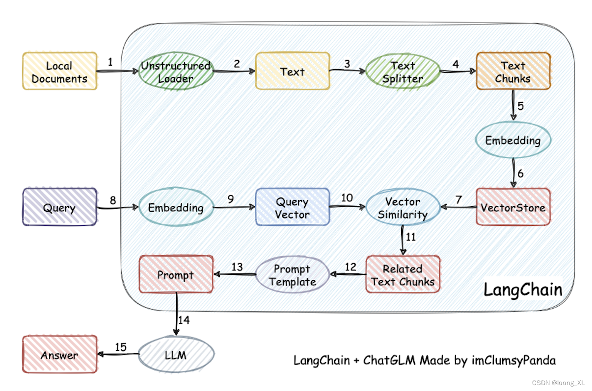

# Evaluate and optimize the retrieval part

In the previous chapter, we explained how to evaluate and optimize Prompt Engineering for the generation part to improve the generation quality of the large model. However, the premise of generation is retrieval. Only when the retrieval part of our application can retrieve the correct answer document according to the user query, the generation result of the large model can be correct. Therefore, the retrieval precision and recall rate of the retrieval part actually affect the overall performance of the application to a greater extent. However, the optimization of the retrieval part is a more engineering and in-depth proposition. We often need to use many advanced, advanced techniques derived from search and explore more practical tools, or even write some tools by hand for optimization. Therefore, in this chapter, we only discuss the ideas of evaluation and optimization of the retrieval part in general, without in-depth code practice. If readers feel unsatisfied after reading this part and want to learn more advanced techniques to further optimize their own applications, welcome to read our upcoming tutorial part 2 "LLM Development Skills".

## 1. Evaluate the retrieval effect

First, let's review the functions of the entire RAG system.

For a query entered by a user, the system will convert it into a vector and match the most relevant text segment in the vector database. Then, according to our settings, 3 to 5 text segments will be selected and sent to the big model together with the user's query.The model answers the questions raised in the user query based on the retrieved text paragraphs. In this whole system, we call the part where the vector database retrieves the relevant text paragraphs the retrieval part, and the part where the large model generates answers based on the retrieved text paragraphs the generation part.

Therefore, the core function of the retrieval part is to find text paragraphs that exist in the knowledge base and can correctly answer the questions in the user query. Therefore, we can define the most intuitive accuracy to evaluate the retrieval effect: for N given queries, we ensure that the correct answer corresponding to each query exists in the knowledge base. Assume that for each query, the system finds K text fragments. If the correct answer is in one of the K text fragments, then we consider the retrieval to be successful; if the correct answer is not in one of the K text fragments, we task the retrieval to fail. Then, the retrieval accuracy of the system can be simply calculated as:

$$accuracy = \frac{M}{N}$$

Where M is the number of successfully retrieved queries.

Through the above accuracy, we can measure the retrieval ability of the system. For the queries that the system can successfully retrieve, we can further optimize Prompt to improve the system performance. For queries that the system fails to retrieve, we must improve the retrieval system to optimize the retrieval effect. But please note that when we calculate the accuracy defined above, we must ensure thatThe correct answer to each of our verification queries does exist in the knowledge base; if the correct answer does not exist, then we should attribute the bad case to the knowledge base construction part, indicating that the breadth and processing accuracy of the knowledge base construction need to be improved.

Of course, this is just the simplest evaluation method. In fact, this evaluation method has many shortcomings. For example:

- Some queries may require the combination of multiple knowledge fragments to answer. For such queries, how do we evaluate?

- The order of the retrieved knowledge fragments actually affects the generation of the large model. Should we take the order of the retrieved fragments into consideration?

- In addition to retrieving the correct knowledge fragments, our system should also try to avoid retrieving wrong and misleading knowledge fragments, otherwise the generation result of the large model is likely to be misled by the wrong fragments. Should we include the retrieved wrong fragments in the indicator calculation?

There is no standard answer to the above questions, which needs to be considered comprehensively based on the actual business of the project and the cost of evaluation.

In addition to evaluating the retrieval effect through the above methods, we can also model the retrieval part as a classic search task. Let's take a look at the classic search scenario. The task of the search scenario is to find and sort relevant content from a given range of content (usually web pages) for the search query given by the user, and try to make the top-ranked content meet the user's needs.

In fact, our search partThe task is very similar to the search scenario. It is also aimed at user queries, but we emphasize recall rather than ranking, and the content we retrieve is not web pages but knowledge fragments. Therefore, we can similarly model our retrieval task as a search task. Then, we can introduce classic evaluation ideas (such as accuracy, recall, etc.) and optimization ideas (such as index building, re-ranking, etc.) in search algorithms to more fully evaluate and optimize our retrieval effect. This part will not be repeated. Interested readers are welcome to conduct in-depth research and share.

## 2. Ideas for optimizing retrieval

The above statement is a few general ideas for evaluating retrieval effects. When we make a reasonable evaluation of the system's retrieval effect and find the corresponding Bad Case, we can break down the Bad Case into multiple dimensions to optimize the retrieval part in a targeted manner. Note that although in the evaluation part above, we emphasized that the verification query for evaluating the retrieval effect must ensure that its correct answer exists in the knowledge base, here, we assume that the knowledge base construction is also part of the retrieval part. Therefore, we also need to solve the Bad Case caused by incorrect knowledge base construction in this part. Here, we share some common Bad Case attribution and feasible optimization ideas.

### 1. Knowledge fragments are fragmented, resulting in lost answers

This problem generally manifests itself as, for a user query, we can be sure that the question must existIn the knowledge base, we found that the retrieved knowledge fragments separated the correct answer, resulting in an inability to form a complete and reasonable answer. This type of problem is more common in queries that require longer answers.

The general optimization idea for this type of problem is to optimize the text segmentation method. The most primitive segmentation method we used in "C3 Building Knowledge Base" is segmentation based on specific characters and chunk size, but this type of segmentation method often fails to take into account the text semantics, and easily causes the strongly related context of the same topic to be segmented into two chunks. For some knowledge documents with unified format and clear organization, we can build more appropriate segmentation rules in a targeted manner; for documents with chaotic format and unable to form unified segmentation rules, we can consider incorporating a certain amount of manpower for segmentation. We can also consider training a model dedicated to text segmentation to achieve chunk segmentation based on semantics and themes.

### 2. Query questions require long context summary answers

This problem is also a problem in knowledge base construction. That is, some questions raised by queries require the retrieval of a long context to make a summary answer, that is, it is necessary to span multiple chunks to comprehensively answer the questions. However, due to model context limitations, it is often difficult for us to provide enough chunks.

The general optimization idea for this type of problem is to optimize the knowledge base construction method. For documents that may require such answers, weWe can add a step to solve this problem to a certain extent by using LLM to summarize long documents, or by setting questions for LLM to answer, so as to pre-fill the possible answers to such questions into the knowledge base as a separate chunk.

### 3. Keyword misleading

This problem is generally manifested as follows: for a user query, the knowledge fragments retrieved by the system have many keywords that are strongly related to the query, but the knowledge fragments themselves are not answers to the query. This situation generally stems from the fact that there are multiple keywords in the query, among which the matching effect of the secondary keywords affects the main keywords.

The general optimization idea for this type of problem is to rewrite the user query, which is also a common idea for many large model applications. That is, for the user input query, we first use LLM to rewrite the user query into a reasonable form, removing the influence of secondary keywords and possible typos and omissions. The specific form of rewriting depends on the specific business. You can ask LLM to refine the query to form a Json object, or you can ask LLM to expand the query, etc.

### 4. Unreasonable matching relationship

This problem is quite common, that is, the strongly related text segment matched does not contain the answer text. The core problem of this problem is that the vector model we use does not match our initial assumption.When we talked about the framework of RAG, we mentioned that RAG works on a core assumption, that is, we assume that the strongly related text segment we match is the answer text segment corresponding to the question. However, many vector models actually build "pairing" semantic similarity rather than "causal" semantic similarity. For example, for the query "how is the weather today", it is considered that "I want to know the weather today" is more relevant than "the weather is good".

The general optimization idea for this type of problem is to optimize the vector model or build an inverted index. We can choose a vector model with better performance, or collect some data and fine-tune a vector model that is more suitable for our business. We can also consider building an inverted index, that is, for each knowledge segment of the knowledge base, build an index that can represent the content of the segment but has a more accurate relative relevance to the query, and match the relevance of the index and the query instead of the full text during retrieval, thereby improving the accuracy of the matching relationship.

There are many ideas for optimizing the retrieval part. In fact, the optimization of the retrieval part is often the core engineering part of RAG application development. Due to space limitations, we will not go into more details on the techniques and methods here. Interested readers are welcome to read our upcoming second part, "LLM Development Techniques".