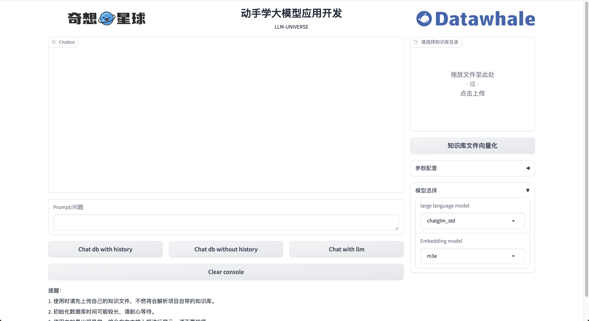
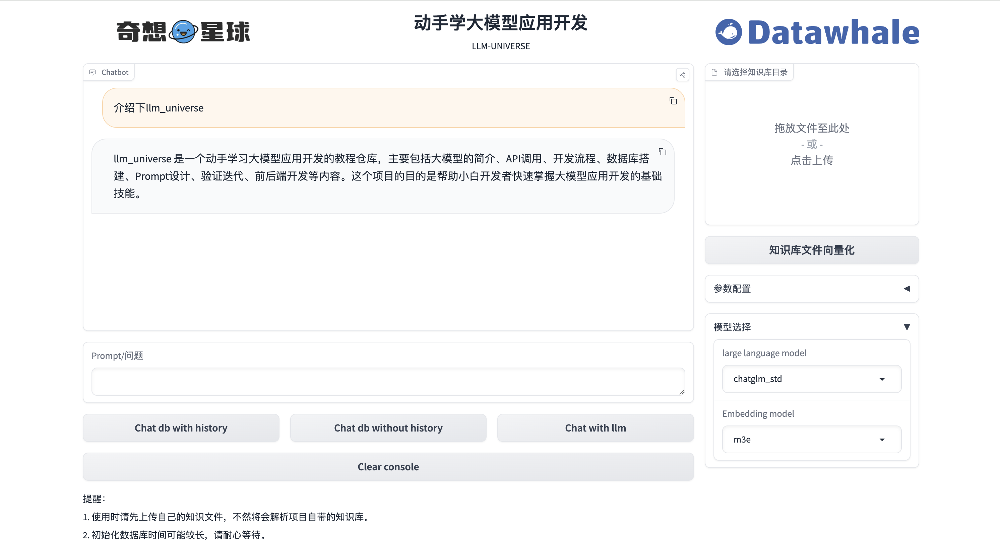

# Personal Knowledge Base Assistant Project

## I. Introduction

### 1. Project Background

In today's society where the amount of data is surging, effectively managing and retrieving information has become a key skill. In response to this challenge, this project came into being, aiming to build a personal knowledge base assistant based on Langchain. The assistant provides users with a reliable information acquisition platform through an efficient information management system and powerful retrieval functions.

The core goal of this project is to give full play to the advantages of large language models in processing natural language queries, while customizing development according to user needs to achieve intelligent understanding and accurate response to complex information. During the project development process, the team deeply analyzed the potential and limitations of large language models, especially their tendency to generate hallucinatory information. To solve this problem, the project integrated RAG technology, a method that combines retrieval and generation, which can retrieve relevant information from a large amount of data before generating answers, thereby significantly improving the accuracy and reliability of answers.

Through the introduction of RAG technology, this project not only improves the retrieval accuracy of information, but also effectively suppresses the misleading information that Langchain may generate. This combined retrieval and generation method ensures the accuracy and authority of the intelligent assistant in providing information, making it a powerful assistant for users when faced with massive amounts of data.

### 2. Objectives and Significance

This project is dedicated to developing an efficient and intelligent personal knowledge base system, which aims to optimize the user's knowledge acquisition process in the information flood. By integrating Langchain and natural language processing technology, the system realizes rapid access and integration of decentralized data sources, enabling users to efficiently retrieve and use information through intuitive natural language interaction.

The core value of the project is reflected in the following aspects:

1. **Optimize information retrieval efficiency**: Using the Langchain-based framework, the system can retrieve relevant information from a wide range of data sets before generating answers, thereby accelerating the information location and extraction process.

2. **Strengthen knowledge organization and management**: Support users to build personalized knowledge bases, promote knowledge accumulation and effective management through structured storage and classification, and thus enhance users' mastery and application of professional knowledge.

3. **Assist decision making**: Through accurate information provision and analysis, the system enhances users' decision-making ability in complex situations, especially in situations where quick judgment and response are required.

4. **Personalized information services**: The system allows users to customize the knowledge base according to their specific needs, realize personalized information retrieval and services, and ensure that users can obtain the most relevant and valuable knowledge.

5. **Technology Innovation Demonstration**: The project demonstrates the advantages of RAG technology in solving the Langchain illusion problem. By combining retrieval and generation, the accuracy and reliability of information are improved, providing new ideas for technological innovation in the field of intelligent information management.Road.

6. **Promote the application of intelligent assistant**: Through user-friendly interface design and convenient deployment options, the project makes intelligent assistant technology easier to understand and use, and promotes the application and popularization of this technology in a wider range of fields

### 3. Main functions

This project can implement knowledge questions and answers based on Datawhale's existing project README, so that users can quickly understand the existing projects of Datawhale.

**Project start interface**


**Q&A demonstration interface**


**Example demonstration interface**
1. ***Introduce joyrl demonstration***

2. ***What is the relationship between joyrl-book and joyrl demonstration***


## 2. Technical implementation

### 1. Environmental dependence

#### 1.1 Technical resource requirements

- **CPU**: Intel 5th generation processor(For cloud CPU, it is recommended to choose a cloud CPU service with more than 2 cores)

- **Memory (RAM)**: at least 4 GB

- **Operating system**: Windows, macOS, Linux

#### 1.2 Project setup

**Clone repository**

```shell
git clone https://github.com/logan-zou/Chat_with_Datawhale_langchain.git
cd Chat_with_Datawhale_langchain
```

**Create Conda environment and install dependencies**

- python>=3.9
- pytorch>=2.0.0

```shell
# Create Conda environment
conda create -n llm-universe python==3.9.0
# Activate Conda environment
conda activate llm-universe
# Install dependencies
pip install -r requirements.txt
```

#### 1.3 Project run

- Start service as local API
```shell
# Linux system
cd project/serve
uvicorn api:app --reload 
```

```shell
# Windows system
cd project/serve
python api.py
```
- Run the project
```shell
cd llm-universe/project/serve
python run_gradio.py -model_name='chatglm_std' -embedding_model='m3e' -db_path='../../data_base/knowledge_db' -persist_path='../../data_base/vector_db'
```
### 2. Brief description of the development process

#### 2.1 Current project version and future plans

- **Current version**: 0.2.0 (updated on 2024.3.17)
- **Update content**
- [√] Added m3e embedding
- [√] Added knowledge base content
- [√] Added Datawhale Summary of all Md
- [√] Fix gradio display error

-**Currently supported models**
- OpenAi
- [√] gpt-3.5-turbo
- [√] gpt-3.5-turbo-16k-0613
- [√] gpt-3.5-turbo-0613
- [√] gpt-4
- [√] gpt-4-32k
- Wenxinyiyan
- [√] ERNIE-Bot
- [√] ERNIE-Bot-4
- [√] ERNIE-Bot-turbo
- iFlytek Spark
- [√] Spark-1.5
- [√] Spark-2.0
- Zhipu AI
- [√] chatglm_pro
- [√] chatglm_std
- [√] chatglm_lite

- **Future plans**
- [ ] Update Zhipu Ai embedding

#### 2.2 Core Idea

The core is for four large model APIs The underlying encapsulation is realized, and a scalableThe retrieval question-answering chain of the replacement model is implemented, and the API and Gradio deployed personal lightweight large model applications are implemented.

#### 2.3 Technology stack used

This project is a personal knowledge base assistant based on a large model, built on the LangChain framework. The core technologies include LLM API calls, vector databases, retrieval question-answering chains, etc. The overall architecture of the project is as follows:


As mentioned above, this project is divided into LLM layer, data layer, database layer, application layer and service layer from bottom to top.

① The LLM layer mainly encapsulates LLM calls based on four popular LLM APIs, supports users to access different models with a unified entrance and method, and supports model switching at any time;

② The data layer mainly includes the source data of the personal knowledge base and the Embedding API. The source data can be used by the vector database after Embedding processing;

③ The database layer is mainly a vector database built based on the source data of the personal knowledge base. In this project, we chose Chroma;

④ The application layer is the top-level encapsulation of the core functions. We further encapsulate it based on the retrieval question and answer chain base class provided by LangChain, so as to support the switching of different models and conveniently realize the retrieval question and answer based on the database;

⑤ The top layer is the service layer, which we divide intoIn addition, Gradio builds Demo and FastAPI builds API to support service access for this project.

## 3. Application Detail

### 1. Core Architecture

llm-universe Personal Knowledge Base Assistant Address:

https://github.com/datawhalechina/llm-universe/tree/main

This project is a typical RAG project. It implements local knowledge base question and answer through langchain+LLM, and establishes a local knowledge base dialogue application that can be implemented using open source models throughout the process. Currently, it supports the access of large language models such as ***ChatGPT***, ***Spark Model***, ***Wenxin Large Model***, and ***Zhipu GLM***. The implementation principle of this project is the same as that of the general RAG project, as shown in the previous text and the figure below: 

The entire RAG process includes the following operations:

1. The user asks a question Query

2. Load and read the knowledge base document

3. Segment the knowledge base document

4. Vectorize the segmented knowledge base text and store it in the vector library to create an index

5. For the question Query vectorization 

6. Match the top k most similar to the query vector in the knowledge base document vector

7. The matched knowledge base text is added to the prompt as context together with the question

8. Submit to LLM to generate the answer

It can be roughly divided into three stages: indexing, retrieval and generation. These three stages will be disassembled in the following sections with the llm-universe knowledge base assistant project.

### 2. Indexing-indexing

This section describes the project llm-universe personal knowledge base assistant: creating a knowledge base and loading files-reading files-**text segmentation**(Text splitter), knowledge base**text vectorization**(embedding) and storage in **vector database**.

Among them, **Loading files**: This is the step of reading the knowledge base files stored locally. **Reading files**: Read the contents of the loaded file, usually converting it into text format. **Text segmentation(Text splitter)**: Segment the text according to certain rules (such as paragraphs, sentences, words, etc.). **Text vectorization: **This usually involves feature extraction of NLP. This project uses local m3e text embedding model, openai, zhipuai open source api and other methods to vectorize text.The segmented text is converted into numerical vectors and stored in the vector database

#### 2.1 Knowledge base construction - loading and reading

The project llm-universe personal knowledge base assistant uses some classic open source courses and videos (parts) of Datawhale as examples, including:

- [《Machine Learning Formula Detailed Explanation》PDF version](https://github.com/datawhalechina/pumpkin-book/releases)
- [《LLM Getting Started Tutorial for Developers Part 1 Prompt Engineering》md version](https://github.com/datawhalechina/prompt-engineering-for-developers)
- [《Introduction to Reinforcement Learning》MP4 version](https://www.bilibili.com/video/BV1HZ4y1v7eX/?spm_id_from=333.999.0.0&vd_source=4922e78f7a24c5981f1ddb6a8ee55ab9)
- And the readme of all open source projects in the datawhale general warehouse https://github.com/datawhalechinaThese knowledge base source data are placed in the **../../data_base/knowledge_db** directory. Users can also store their own other files.

**1**. Let's talk about how to get the readme of all open source projects in the DataWhale general warehouse. Users can first run the **project/database/test_get_all_repo.py** file to get the readme of all open source projects in the Datawhale general warehouse. The code is as follows:

```python
import json
import requests
import os
import base64
import loguru
from dotenv import load_dotenv
# Load environment variables
load_dotenv()
# Get TOKEN from environment variables
TOKEN = os.getenv('TOKEN')
# Define a function to get the organization warehouse
def get_repos(org_name, token, export_dir):
headers = {
'Authorization': f'token {token}',}
url = f'https://api.github.com/orgs/{org_name}/repos'
response = requests.get(url, headers=headers, params={'per_page': 200, 'page': 0})
if response.status_code == 200:
repos = response.json()
loguru.logger.info(f'Fetched {len(repos)} repositories for {org_name}.')
# Use export_dir to determine the file path to save the repository name
repositories_path = os.path.join(export_dir, 'repositories.txt')
with open(repositories_path, 'w', encoding='utf-8') as file:
for repoin repos: file.write(repo['name'] + '\n') return repos else: loguru.logger.error(f"Error fetching repositories: {response.status_code}") loguru.logger.error(response. text) return [] # Define the function to pull the warehouse README file def fetch_repo_readme(org_name, repo_name, token, export_dir): headers = { 'Authorization': f'token {token}', } url = f'https:// api.github.com/repos/{org_name}/{repo_name}/readme' response = requests.get(url, headers=headers)
if response.status_code == 200:
readme_content = response.json()['content']
# Decode base64 content
readme_content = base64.b64decode(readme_content).decode('utf-8')
# Use export_dir to determine the file path to save README
repo_dir = os.path.join(export_dir, repo_name)
if not os.path.exists(repo_dir):
os.makedirs(repo_dir)
readme_path = os.path.join(repo_dir, 'README.md')
with open(readme_path, 'w', encoding='utf-8') as file:
file.write(readme_content)
else:
loguru.logger.error(f"Error fetching README for {repo_name}: {response.status_code}")
loguru.logger.error(response.text)
# Main function
if __name__ == '__main__':
# Configure organization name
org_name = 'datawhalechina'
# Configure export_dir
export_dir = "../../database/readme_db" # Replace with the actual directory path
# Get repository list
repos = get_repos(org_name, TOKEN, export_dir)
# Print repository name
if repos:
for repo in repos:
repo_name = repo['name']
# Pull each repository'sREADME
fetch_repo_readme(org_name, repo_name, TOKEN, export_dir)
# Clean up temporary folders
# if os.path.exists('temp'):
# shutil.rmtree('temp')
```

By default, these readme files will be placed in the readme_db file in the same directory as database. These readme files contain a lot of irrelevant information, that is, run the **project/database/text_summary_readme.py file** to call the large model to generate a summary of each readme file and save it to the above knowledge base directory ../../data_base/knowledge_db /readme_summary folder, ****. The code is as follows:

```python
import os
from dotenv import load_dotenv
import openai
from test_get_all_repo import get_repos
from bs4 import BeautifulSoupimport markdown
import re
import time
# Load environment variables
load_dotenv()
TOKEN = os.getenv('TOKEN')
# Set up the OpenAI API client
openai_api_key = os.environ["OPENAI_API_KEY"]

# Filter links in text to prevent risk control of large language models
def remove_urls(text):
# Regular expression pattern for matching URLs
url_pattern = re.compile(r'https?://[^\s]*')
# Replace all matching URLs with empty strings
text = re.sub(url_pattern, '', text)
# Regular expression pattern for matching specific text
specific_text_pattern = re.compile(r'Scan the QR code below to follow the public account|Extract code|Follow|Science Internet|Reply to keywords|Infringement|Copyright|Thanks|Citation|LICENSE'r'|Team punch card|Task punch card|Team learning things|Learning cycle|Open source content|Punch card|Team learning|Link')
# Replace all matching specific text with empty string
text = re.sub(specific_text_pattern, '', text)
return text

# Extract text from md
def extract_text_from_md(md_content):
# Convert Markdown to HTML
html = markdown.markdown(md_content)
# Use BeautifulSoup to extract text
soup = BeautifulSoup(html, 'html.parser')

return remove_urls(soup.get_text())

def generate_llm_summary(repo_name, readme_content,model):
prompt = f"1: The name of this repository is {repo_name}.The full content of the readme of this repository is: {readme_content}\
2: Please summarize the content of the readme of this repository in Chinese within about 200 words. The returned summary format requires: the name of this repository is..., the content of this repository is mainly..."
openai.api_key = openai_api_key
# Specific call
messages = [{"role": "system", "content": "You are an artificial intelligence assistant"},
{"role": "user", "content": prompt}]
response = openai.ChatCompletion.create(
model=model,
messages=messages,
)
return response.choices[0].message["content"]

def main(org_name,export_dir,summary_dir,model):
repos = get_repos(org_nameme, TOKEN, export_dir) # Create a directory to save summaries os.makedirs(summary_dir, exist_ok=True) for id, repo in enumerate(repos): repo_name = repo['name'] readme_path = os.path.join(export_dir , repo_name, 'README.md') print(repo_name) if os.path.exists(readme_path): with open(readme_path, 'r', encoding='utf-8') as file: readme_content = file.read() # Extract text from the README readme_text =extract_text_from_md(readme_content) # Generate a summary for the README # Access is limited, once every minute time.sleep(60) print('th' + str(id) + 'article' + 'summary begins') try: summary = generate_llm_summary (repo_name, readme_text,model) print(summary) # Write summary to a Markdown file in the summary directory summary_file_path = os.path.join(summary_dir, f"{repo_name}_summary.md") with open(summary_file_path, 'w', encoding='utf-8') as summary_file: summary_file.write(f"# {repo_name} Summary\n\n") summary_file.write(summary) except openai.OpenAIError as e: summary_file_path = os.path.join(summary_dir, f"{repo_name}_summary risk control.md") with open(summary_file_path, 'w', encoding='utf-8') as summary_file: summary_file.write(f"# { repo_name} SummaryRisk Control\n\n") summaryy_file.write("README content risk control.\n") print(f"Error generating summary for {repo_name}: {e}") # print(readme_text) else: print(f"File does not exist: {readme_path}" ) # If README doesn't exist, create an empty Markdown file summary_file_path = os.path.join(summary_dir, f"{repo_name}_summary does not exist.md") with open(summary_file_path, 'w', encoding='utf- 8') as summary_file: summary_file.write(f"# {repo_name} Summary does not exist\n\n")
summary_file.write("README file does not exist.\n")
if __name__ == '__main__':
# Configure organization name
org_name = 'datawhalechina'
# Configure export_dir
export_dir = "../database/readme_db" # Please replace with the actual readme directory path
summary_dir="../../data_base/knowledge_db/readme_summary"# Please replace with the actual readme summary directory path
model="gpt-3.5-turbo" #deepseek-chat,gpt-3.5-turbo,moonshot-v1-8k
main(org_name,export_dir,summary_dir,model)

```

Among them, the **extract_text_from_md()** function is used to extract text from the md file, and the **remove_urls()** function filters the readme textSome web links are filtered out and some words that may cause risk control of the big model are filtered out. Then generate_llm_summary() is called to let the big model generate a summary of each readme.

**2**. After the above knowledge base is built, the directory **../../data_base/knowledge_db** will contain the md files of the readme summary of all Datawhale open source projects, as well as [PDF version of "Detailed Explanation of Machine Learning Formulas"](https://github.com/datawhalechina/pumpkin-book/releases), [MD version of "LLM Getting Started Tutorial for Developers Part 1 Prompt Engineering"](https://github.com/datawhalechina/prompt-engineering-for-developers), [MP4 version of "Getting Started with Reinforcement Learning"](https://www.bilibili.com/video/BV1HZ4y1v7eX/?spm_id_from=333.999.0.0&vd_source=4922e78f7a24c5981f1ddb6a8ee55ab9) and other files.There are mp4 format, md format, and pdf format. For the loading methods of these files, the project puts the code in **project/database/create_db.py file**. Some of the code is as follows. The pdf format file uses PyMuPDFLoader loader, and the md format file uses UnstructuredMarkdownLoader loader. It should be noted that data processing is actually a very complex and business-specific matter. For example, pdf files contain charts, pictures, text, and different levels of titles, which all need to be processed in detail according to the business. For specific operations, you can follow **the second part of the advanced RAG tutorial technology** to explore it yourself:

```python
from langchain.document_loaders import UnstructuredFileLoader
from langchain.document_loaders import UnstructuredMarkdownLoader
from langchain.text_splitter import RecursiveCharacterTextSplitter
from langchain.document_loaders import PyMuPDFLoader from langchain.vectorstores import Chroma # First implement the basic configuration DEFAULT_DB_PATH = "../../data_base/knowledge_db" DEFAULT_PERSIST_PATH = "../../data_base/vector_db" ... ... ... def file_loader(file, loaders): if isinstance(file, tempfile._TemporaryFileWrapper): file = file.name if not os.path.isfile(file): [file_loader(os.path.join(file, f), loaders) for f in os.listdir(file)] return file_type = file.split('.')[-1] if file_type == 'pdf':loaders.append(PyMuPDFLoader(file))
elif file_type == 'md':
pattern = r"does not exist|risk control"
match = re.search(pattern, file)
if not match:
loaders.append(UnstructuredMarkdownLoader(file))
elif file_type == 'txt':
loaders.append(UnstructuredFileLoader(file))
return
...
...

```

#### 2.2 Text segmentation and vectorization

Text segmentation and vectorization operations are essential in the entire RAG process. The above-loaded knowledge base needs to be divided into books or token lengths, or semantic models are used for segmentation. This project uses the text segmenter in Langchain to segment according to chunk_size (block size) and chunk_overlap (the overlap size between blocks).

- chunk_size refers to the number of characters or tokens (such as words, sentences, etc.) contained in each chunk
- chunk_overlap refers to the number of characters shared between two chunks, which is used to maintain the coherence of the context and avoid losing context information during segmentation

**1.** You can set a maximum token length, and then segment the document according to this maximum token length. The document segments segmented in this way are document segments of uniform length. The overlapping content between segments can ensure that relevant document segments can be retrieved during retrieval. This part of the text segmentation code is also in the **project/database/create_db.py** file. This project uses the RecursiveCharacterTextSplitter text segmenter in langchain for segmentation. The code is as follows:

```python
......
def create_db(files=DEFAULT_DB_PATH, persist_directory=DEFAULT_PERSIST_PATH, embeddings="openai"):
"""
This function is used to load PDF files, segment documents, generate document embedding vectors, and create vector databases.

Parameters:file: path to store files.
embeddings: model for producing embeddings

return:
vectordb: created database.
"""
if files == None:
return "can't load empty file"
if type(files) != list:
files = [files]
loaders = []
[file_loader(file, loaders) for file in files]
docs = []
for loader in loaders:
if loader is not None:
docs.extend(loader.load())
# split documents
text_splitter = RecursiveCharacterTextSplitter(
chunk_size=500, chunk_overlap=150)
split_docs = text_splitter.split_documents(docs)
....
....
....Other codes are omitted here
....
return vectordb
........... 
```

**2.** After the knowledge base text is segmented, the text needs to be **vectorized** . The project is in **project/embedding/call_embedding.py** . The text embedding method can choose the local m3e model, as well as the method of calling the openai and zhipuai APIs for text embedding. The code is as follows:

```python
import os
import sys

sys.path.append(os.path.dirname(os.path.dirname(__file__)))
sys.path.append(r"../../")
from embedding.zhipuai_embedding import ZhipuAIEmbeddings
from langchain.embeddings.huggingface import HuggingFaceEmbeddings from langchain.embeddings.openai import OpenAIEmbeddings from llm.call_llm import parse_llm_api_key def get_embedding(embedding: str, embedding_key: str = None, env_file: str = None): if embedding == 'm3e': return HuggingFaceEmbeddings(model_name="moka -ai/m3e-base") if embedding_key == None: embedding_key = parse_llm_api_key(embedding) if embedding == "openai": return OpenAIEmbeddings(openai_api_key=embedding_key) elif embedding == "zhipuai":return ZhipuAIEmbeddings(zhipuai_api_key=embedding_key)
else:
raise ValueError(f"embedding {embedding} not support ")
```

#### **2.3** Vector database

After segmenting and vectorizing the knowledge base text, you need to define a vector database to store document fragments and corresponding vector representations. In the vector database, data is represented in vector form, and each vector represents a data item. These vectors can be numbers, text, images, or other types of data.

The vector database uses efficient indexing and query algorithms to speed up the storage and retrieval process of vector data. This project chooses the chromadb vector database (similar vector databases include faiss, etc.). The code corresponding to defining the vector library is also in the **project/database/create_db.py** file. persist_directory is the local persistence address. The vectordb.persist() operation can persist the vector database to the local, and the local existing vector library can be loaded again later. The complete text segmentation, vectorization, and vector database definition code are as follows:

```python
def create_db(files=DEFAULT_DB_PATH, persist_directory=DEFAULT_PERSIST_PATH, embeddings="openai"):
"""
This function is used to load PDF files, split documents, generate document embedding vectors, and create vector databases.

Parameters:
file: the path to store the file.
embeddings: the model used to produce Embedding

Returns:
vectordb: the created database.
"""
if files == None:
return "can't load empty file"
if type(files) != list:
files = [files]
loaders = []
[file_loader(file, loaders) for file in files]
docs = []
for loader in loaders:
if loader isnot None:
docs.extend(loader.load())
# Split documents
text_splitter = RecursiveCharacterTextSplitter(
chunk_size=500, chunk_overlap=150)
split_docs = text_splitter.split_documents(docs)
if type(embeddings) == str:
embeddings = get_embedding(embedding=embeddings)
# Define persistence path
persist_directory = '../../data_base/vector_db/chroma'
# Load database
vectordb = Chroma.from_documents(
documents=split_docs,
embedding=embeddings,
persist_directory=persist_directory # allows us to save the persist_directory directory to disk
) 

vectordb.persist()
return vectordb
```

### 3. Retrieval-Retriver and **Generation**-Generator

This section enters the retrieval and generation phase of RAG, that is, after the question Query is vectorized, the top k fragments that are most similar to the question Query vector are matched in the knowledge base document vector. The matched knowledge base text is added to the prompt together with the question as the context Context, and then submitted to LLM to generate the answer Answer. The following will be explained based on the llm_universe personal knowledge base assistant.

#### 3.1 Vector database retrieval

Through the segmentation and vectorization of the text in the previous section and the construction of the vector database index, the vector database can be used for efficient retrieval next. The vector database is a library for effectively searching for similarities in large-scale high-dimensional vector spaces, which can quickly find the vector most similar to the given query vector in a large-scale data set. As shown in the following example:

```python
question="What is machine learning"
Copy to clipboardErrorCopied
sim_docs = vectordb.similarity_search(question,k=3)
print(f"Number of retrieved contents: {len(sim_docs)}")
```

```

Number of retrieved contents: 3
```

```
for i, sim_doc in enumerate(sim_docs):
print(f"The {i}th content retrieved: \n{sim_doc.page_content[:200]}", end="\n--------------\n")
```

```
The 0th content retrieved: 
Guide, and at the same time, you can also experience the "beauty of mathematics" produced by the collision of these three mathematics courses in machine learning.
1.1
Introduction
This section focuses on conceptual understanding, and here we will supplement the explanation of "algorithms" and "models". "Algorithms" refer to the specific methods of learning "models" from data, such as linear regression, logarithmic probability regression, decision trees, etc., which will be described in subsequent chapters. The result of the "algorithm" is called a "model", which is usually a specific function or can be abstractly viewed as a function. For example, the model produced by the univariate linear regression algorithm is a univariate linear function of the form f(x) = wx + b.
--------------

The first content retrieved: 
Model：The general process of machine learning is as follows: first collect a number of samples (assuming there are 100 at this time), then divide them into training samples
(80) and test samples (20), where the set consisting of 80 training samples is called the "training set", and the set consisting of 20 test samples
is called the "test set", then select a machine learning algorithm, let it "learn" (or "train") on the training set, and then output

get a "model" (or "learner"), and finally use the test set to test the effect of the model. When executing the above process, it means that we have implicitly
--------------

The second content retrieved: 
→_→
Welcome to major e-commerce platforms to purchase the paper version of Pumpkin Book "Detailed Explanation of Machine Learning Formulas"
←_←
Chapter 1
Introduction
This chapter, as the opening chapter of "Watermelon Book", mainly explains what machine learning is and the related mathematical symbols of machine learning, paving the way for subsequent content, and does not involve complex algorithm theory, so when reading this chapter, you only need to patiently sort out all the concepts and mathematical symbols. In addition, before reading this chapter, it is recommended to read the "Main Symbols Table" on the first page of the Watermelon Book Catalog, which can answer most of the doubts about mathematical symbols generated during the reading of "Watermelon Book". This chapter is also used as a reference for the following examples:

```

#### 3.2 Calling the Large Model llm

Here, the project **project/qa_chain/model_to_llm.py**Taking the code as an example, the encapsulation of open source model API calls such as ***Spark***, ***GLM***, and ***Wenxin*** are defined in the directory folder of **project/llm/**, and these modules are imported in the file **project/qa_chain/model_to_llm.py**, and llm can be called according to the model name passed in by the user. The code is as follows:

```python
def model_to_llm(model:str=None, temperature:float=0.0, appid:str=None, api_key:str=None,Spark_api_secret:str=None,Wenxin_secret_key:str=None):
"""
Spark: model,temperature,appid,api_key,api_secret
Baidu Wenxin: model,temperature,api_key,api_secret
GLM: model,temperature,api_key
OpenAI: model,tempperature,api_key """ if model in ["gpt-3.5-turbo", "gpt-3.5-turbo-16k-0613", "gpt-3.5-turbo-0613", "gpt-4", "gpt-4 -32k"]: if api_key == None: api_key = parse_llm_api_key("openai") llm = ChatOpenAI(model_name = model, temperature = temperature , openai_api_key = api_key) elif model in ["ERNIE-Bot", "ERNIE-Bot- 4", "ERNIE-Bot-turbo"]: if api_key == None or Wenxin_secret_key == None: api_key, Wenxin_secret_key = parse_llm_api_key("wenxin") llm = Wenxin_LLM(model=model, temperature = temperature, api_key=api_key, secret_key=Wenxin_secret_key) elif model in ["Spark-1.5", "Spark-2.0"]: if api_key == None or appid == None and Spark_api_secret == None: api_key, appid, Spark_api_secret = parse_llm_api_key("spark") llm = Spark_LLM(model=model, temperature = temperature, appid=appid, api_secret=Spark_api_secret, api_key=api_key) elif modelin ["chatglm_pro", "chatglm_std", "chatglm_lite"]:
if api_key == None:
api_key = parse_llm_api_key("zhipuai")
llm = ZhipuAILLM(model=model, zhipuai_api_key=api_key, temperature = temperature)
else:
raise ValueError(f"model{model} not support!!!")
return llm
```

#### 3.3 prompt and build Q&A chain

Next, we come to the last step. After designing the prompt based on knowledge base Q&A, we can combine the above retrieval and large model call to generate answers. The format of constructing prompt is as follows, which can be modified according to your business needs:

```python
from langchain.prompts import PromptTemplate

#template = """Answer the user's question concisely and professionally based on the following known information.
# If you can't get the answer from it, please say "Cannot answer this question based on the known information" or "Not enough relevant information is provided". Do not add fabricated elements to the answer.
# Please use Chinese for answers.
# Always say "Thank you for your question!" at the end of the answer.
# Known information: {context}
# Question: {question}"""
template = """Use the following context to answer the last question. If you don't know the answer, say you don't know, don't try to make up an answer. Use no more than three sentences. Try to make your answer concise. Always say "Thank you for your question!" at the end of the answer. ”.
{context}
Question: {question}
Useful answers: """

QA_CHAIN_PROMPT = PromptTemplate(input_variables=["context","question"],
template=template)

# Run chain
```

And build the QA chain: Create a method to retrieve the QA chainThe method RetrievalQA.from_chain_type() has the following parameters:

- llm: specify the LLM to be used
- Specify chain type: RetrievalQA.from_chain_type(chain_type="map_reduce"), or use the load_qa_chain() method to specify the chain type.
- Custom prompt: By specifying the chain_type_kwargs parameter in the RetrievalQA.from_chain_type() method, the parameter: chain_type_kwargs = {"prompt": PROMPT}
- Return source documents: By specifying the return_source_documents=True parameter in the RetrievalQA.from_chain_type() method; you can also use the RetrievalQAWithSourceChain() method to return the reference (coordinate or primary key, index) of the source document

```python

# Custom QA chain
self.qa_chain = RetrievalQA.from_chain_type(llm=self.llm,retriever=self.retriever,
return_source_documents=True,
chain_type_kwargs={"prompt":self.QA_CHAIN_PROMPT})
```

The Q&A chain effect is as follows: prompt effect based on recall results and query

```python
question_1 = "What is Pumpkin Book?"
question_2 = "Who is Wang Yangming?"Copy to clipboardErrorCopied
```

```
result = qa_chain({"query": question_1})
print("The result of answering question_1 after the big model + knowledge base:")
print(result["result"])
```

```
The result of answering question_1 after the big model + knowledge base:
Pumpkin Book isA book that parses and supplements the incomprehensible formulas in "Machine Learning" (Xiguashu). Thank you for your question! 
```

```
result = qa_chain({"query": question_2})
print("The result of answering question_2 after the large model + knowledge base:")
print(result["result"])
```

```
The result of answering question_2 after the large model + knowledge base:
I don't know who Wang Yangming is, thank you for your question! 
```

The above detailed retrieval question-answering chain code without memory is in the project: **project/qa_chain/QA_chain_self.py**. In addition, the project also implements a retrieval question-answering chain with memory. The internal implementation details of the two custom retrieval question-answering chains are similar, except that different LangChain chains are called. The complete code of the retrieval QA chain with memory **project/qa_chain/Chat_QA_chain_self.py** is as follows:

```python
from langchain.prompts import PromptTemplate
from langchain.chains import RetrievalQA
from langchain.vectorstores import Chroma
from langchain.chains import ConversationalRetrievalChain
from langchain.memory import ConversationBufferMemory
from langchain.chat_models import ChatOpenAI

from qa_chain.model_to_llm import model_to_llm
from qa_chain.get_vectordb import get_vectordb

class Chat_QA_chain_self:
""""
Q&A chain with history
- model: the name of the model to be called
- temperature: temperature coefficient, controls the randomness of the generation
- top_k: returns the top k similar documents retrieved
- chat_history: history, input a list, the default is an empty list
- history_len: controls the number of recent history_len conversations retained- file_path: path to the library file
- persist_path: vector database persistence path
- appid: Spark
- api_key: parameters that need to be passed to Spark, Baidu Wenxin, OpenAI, and Zhipu
- Spark_api_secret: Spark secret key
- Wenxin_secret_key: Wenxin secret key
- embeddings: embedding model used
- embedding_key: secret key of the embedding model used (Zhipu or OpenAI)
"""
def __init__(self, model:str, temperature:float=0.0, top_k:int=4, chat_history:list=[], file_path:str=None, persist_path:str=None, appid:str=None, api_key:str=None, Spark_api_secret:str=None, Wenxin_secret_key:str=None, embedding = "openai",embedding_key:str=None): self.model = model self.temperature = temperature self.top_k = top_k self.chat_history = chat_history #self.history_len = history_len self.file_path = file_path self.persist_path = persist_path self.appid = appid self. api_key = api_key self.Spark_api_secret = Spark_api_secret self.Wenxin_secret_key = Wenxin_secret_key self.embedding = embedding self.embedding_key = embedding_key

self.vectordb = get_vectordb(self.file_path, self.persist_path, self.embedding,self.embedding_key)

def clear_history(self):
"Clear history"
return self.chat_history.clear()

def change_history_length(self,history_len:int=1):
"""
Save the history of the specified conversation round
Input parameters:
- history_len: Control the last history_len conversations to be retained
- chat_history: Current history conversation record
Output: Return the last history_len conversations
"""
n = len(self.chat_history)
return self.chat_history[n-history_len:] def answer(self, question:str=None,temperature = None, top_k = 4): """" Core method, calling the question and answer chain arguments: - question: user asks a question""" if len(question) == 0: return "", self.chat_history if len(question) == 0: return "" if temperature == None: temperature = self.temperature llm = model_to_llm(self.model, temperature, self .appid, self.api_key, self.Spark_api_secret,self.Wenxin_secret_key) #self.memory = ConversationBufferMemory(memory_key="chat_history", return_messages=True) retriever = self.vectordb.as_retriever(search_type="similarity", search_kwargs={'k': top_k} ) #Default similarity, k=4 qa = ConversationalRetrievalChain.from_llm( llm = llm, retriever = retriever ) #print(self.llm) result = qa({"question": question,"chat_history": self.chat_history}) #result contains question, chat_history, answer
answer = result['answer']
self.chat_history.append((question,answer)) #update history

return self.chat_history #return this answer and updated history
```

# 3. Summary and Outlook

## 3.1 Summary of Key Points of Personal Knowledge Base
This example is a personal knowledge base assistant project based on a large language model (LLM). Through intelligent retrieval and question-answering system, it helps users quickly locate and obtain knowledge related to DATa whale. The following are the key points of the project:

**Key Point 1**

1. The project uses multiple methods to complete the extraction and summarization of all md files in Datawhale and generate the corresponding knowledge base. While completing the extraction and summarization of md files, the corresponding methods are used to complete the filtering of web links in the readme text and words that may cause risk control in large models;

2. The project uses the text cutter in Langchain to complete the text segmentation before the knowledge base vectorization operation.The database uses efficient indexing and query algorithms to accelerate the storage and retrieval process of vector data, and quickly complete the establishment and use of personal knowledge base data.

**Key Point 2**

The project encapsulates different APIs at the bottom level, so users can avoid complex encapsulation details and directly call the corresponding large language model.

## 3.2 Future Development Direction

1. User experience upgrade: support users to upload and establish personal knowledge bases independently, and build their own exclusive personal knowledge base assistants;

2. Model architecture upgrade: upgrade from REG's general architecture to Multi-Agent's multi-agent framework;

3. Function optimization upgrade: optimize the retrieval function in the existing structure to improve the retrieval accuracy of the personal knowledge base.

# 4. Acknowledgements
I would like to thank Mr. San for the crawler and summary part of his [project](https://github.com/sanbuphy/ChatWithDataWhale).