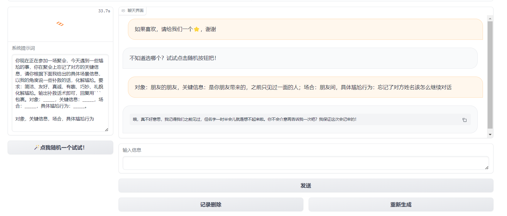

# LLM Application Case: Human Relationships and Societies Large Model System - Tianji

## Introduction

In China, table toasts are not just simple toasts, but also a profound social art, which contains rich cultural traditions and delicate human relations and societies. In various banquets and gatherings, how to properly toast can not only show the host's enthusiasm and politeness, but also deepen the relationship with the guests and promote a more harmonious relationship between the two parties. But for many people, the cumbersome etiquette and difficult degree of table toasts often make people feel both distressed and headache.

Don't worry, the human relations and societies assistant *Tianji* (Tianji) is online to help us solve all the problems of table toasts. From preparing wine speeches to toasts and blessings, from round arrangements to return strategies, it will provide us with a series of guidelines and suggestions to help us easily deal with various occasions and show our style and wisdom. Let us enter the world of Tianji, the human relations and societies assistant!

## Project Background Introduction

Tianji is a free, non-commercial artificial intelligence system made by SocialAI. We can use it to perform tasks involving traditional social etiquette, such as how to toast, how to say nice things, how to deal with things, etc., to improve your emotional intelligence and "core competitiveness".

Laishier AI has built and open-sourced common large model application examples, involving prompts, agents, knowledge bases, model training and other technologies.

## Goals and Significance

In artificial intelligenceIn the development of AI, we have been exploring how to make machines more intelligent, how to make them not only understand complex data and logic, but also understand human emotions, culture and even human relationships. This pursuit is not only a technological breakthrough, but also a tribute to human wisdom.

The Tianji team aims to explore a variety of technical routes that combine large models with the rules of human relationships and build intelligent applications of AI to serve life. This is a key step towards general artificial intelligence (AGI) and the only way to achieve deeper communication between machines and humans.

*We firmly believe that only human relationships are the core technology of AI in the future, and only AI that knows how to deal with things has the opportunity to move towards AGI. Let us witness the advent of general artificial intelligence together. —— "The secret of heaven cannot be leaked."*

## Main functions

In interpersonal communication, we often encounter some embarrassing occasions, such as silence at the table, being at a loss when toasting, and how to send sincere blessings. In order to solve these embarrassments and enhance communication skills, the Tianji team has developed an intelligent assistant application. The main functions of the application include toasts, etiquette for entertaining guests, gift suggestions, and blessing text generation. We can choose the corresponding functions according to different scenarios and needs to get inspiration and suggestions for large models.

Some examples of functions are as follows:


$$
Figure 1: Resolve embarrassment
$$


$$
Figure 2: Toast
$$


$$
Figure 3: Treasure
$$


$$
Figure 4: Interpersonal communication
$$


$$
Figure 5: Giving gifts
$$


$$
Figure 6: Giving blessings
$$

## Technical implementation

Tianji, we can use the following four methods (any of which can be implemented) to implement it:

You can go to experience it: [Tianji experience](https://socialai-tianji.github.io/socialai-web/practice)

- Prompt (including AI games): mainly uses the built-in system prompt to conduct dialogue based on the capabilities of the large model.



- Agent (MetaGPT, etc.): Use the Agent architecture to get richer, more customized and detailed answers.

- Knowledge base: Use the vector database to directly retrieve the rules of human relations (such as restaurantHow do you usually drink at the table).

- Model training: Based on different excellent model bases, fine-tune Lora or fine-tune the whole amount after accumulating a large amount of data. (Currently, Tianji only has the blessing function)


## Environmental requirements

### Computing resource requirements

There are four technical routes involved in Tianji: Prompt, Agent, knowledge base, and model training.
Among them, Prompt and Agent only need to configure the large model key, do not need a graphics card, and can be run using a regular laptop.

| Technical route | Computer configuration |
| :------: | :-----------------: |
| Prompt | Only need to configure the large model KEY |
| Agent | Only need to configure the large model KEY |
| Knowledge base | / |
| Model training | Based on InternLM2 |

### Development environment requirements

- Operating system: Windows, Linux, Mac
- IDE: PyCharm (or VSCode), Anaconda
- Need to useUse the big model "APIKEY"

### Environment configuration method

``` shell
Clone repository: git clone https://github.com/SocialAI-tianji/Tianji.git
Create virtual environment: conda create -n TJ python=3.11
Activate environment: conda activate TJ
Install environment dependencies: pip install -r requirements.txt -i https://pypi.tuna.tsinghua.edu.cn/simple
```

Create a .env file in the project and fill in your big model key

``` env
OPENAI_API_KEY=
OPENAI_API_BASE=
ZHIPUAI_API_KEY=
BAIDU_API_KEY=
OPENAI_API_MODEL=
HF_HOME='./cache/'
HF_ENDPOINT = 'https://hf-mirror.com'
HF_TOKEN=
```

## Development process overview
### Current project version and future plans

Current version: Prompt, Agent, knowledge base, model fine-tuning have been updated (based on InternLM2)

Future planning: The project will mount huggingface, aistudio, openxlab, modelscope, etc.

### Core Idea

Core concept: Combine the powerful processing power of large language models with a deep understanding of human relationships to help users improve their emotional intelligence. By analyzing and simulating various scenarios in daily interactions, this method can provide real-time feedback and guidance to help users better understand the emotions and opinions of others, thereby improving interpersonal skills.

Innovation: Combine advanced artificial intelligence technology with the cultivation of human emotional intelligence. The computing power of large models can process and analyze large amounts of interpersonal communication data, while the application of human relationships ensures the practical utility of this technology in improving personal emotional intelligence. This combination not only improves the model's ability to understand and predict human emotions, but also provides users with a practical tool to develop and practice their social skills.

The combination of this core concept and innovation not only demonstrates the integration of technology and humanistic care, but also provides a new path for personal development and social progress. By using large model tools to improve personal emotional intelligence, we can look forward to building a more understanding, compassionate and connected society.

### Technology stack used

| Technology stack | Prerequisites and recommended reading materials |
| :------: | :--------------------: |
| Prompt |[LLM Universe](<../../notebook/C2 Using LLM API to Develop Applications>) |
| Agent | [hugging-multi-agent](https://github.com/datawhalechina/hugging-multi-agent) |
| Knowledge Base | [LLM Universe](<../../notebook/C3 Building Knowledge Base>) |
| Model Training | [self-llm](https://github.com/datawhalechina/self-llm) |

## Application Architecture

The main components of RAG are data extraction - embedding (vectorization) - index creation - retrieval - automatic sorting (Rerank) - LLM induction generation.


The first step is to extract data, including data cleaning, data processing, and metadata extraction.

The second step is vectorization (embedding), which is the process of converting text, images, audio, and video into vector matrices, that is, transformingInto a format that computers can understand. The quality of the embedding model will directly affect the quality of subsequent retrieval, especially relevance.

The third step is the retrieval stage, which is the key stage of RAG. We can improve efficiency and relevance through a variety of retrieval methods. (Such as: data segmentation, fine-tuning of embedding models in professional fields, optimization of query embedding, etc.)

The fourth step is the generation stage. LLM converts the retrieved information into fluent text, which will become the final output of the model.

## Data preprocessing
First, we need to use some tools to obtain data and clean up expectations.

Some small tools for obtaining data are stored under tools/get_data in the Tianji project. You can check them for reference. (Mainly used to convert videos or pictures into text)

After obtaining the data, refer to the script under tools/prompt_factory to convert each md format document into json format. The converted json file contains fields such as id, name, test_system, input and output, and saves the information in the original Markdown file in a structured manner.

Script function:

- Use the `replace_english_colons_with_chinese` function to replace English colons in Markdown files with Chinese colons, and use the `find_first_heading` function to identify Markdowndown the title level used in the document, etc., so as to correctly parse different parts and unify the document format.

- If the document does not use a specific title tag, it will be treated as untitled and the prompt information will be parsed directly.

- If the document contains a title, the content will be segmented according to the title, each segment will be processed as an independent part, and the relevant structural information will be retained in JSON.

# Technical route 1: Prompt
## 1.1 Prerequisites

[LLM Universe](<../../notebook/C2 Using LLM API to develop applications>)

## 1.2 Prompt role-playing
### 1.2.1 Design ideas

The application range of the big model is extremely wide. It can not only serve as a chatbot to answer a variety of questions, such as language translation or explain complex technical concepts such as the structure of Transformer. But in fact, it is not only a master at answering questions, but also can transform into different roles to meet more specific and personalized needs.

In addition to answering questions, the big model can generate feedback that conforms to specific situations according to the set scenes and roles. This multifaceted approach not only enhances the interactive experience, but also greatly expands the application scenarios of the model. For example, in the scenario of simulating toasts to elders, we are not only looking for a universal answer mode, but also hope that the model can deeply understand the cultural background and emotional color of the scene, so as to produce more appropriate andSincere feedback.

So, how do we make the big model understand our needs? A simple way is to use Prompt, which can be roughly divided into the following four steps.

1. Set the scene: First, we need to tell the big model what kind of scenario we want to simulate now. For example, now we want to simulate "toasting to elders".

2. Define the role: Next, we need to set a specific role for the big model and describe the characteristics of this role with adjectives, which can significantly improve the relevance and appropriateness of the model's response. For example, setting the role as "a Chinese junior who is proficient in verbal expression, empathetic, loving others, respecting elders, and emotionally stable" can make the model closer to the expected character image when generating responses.

3. Clear requirements: We also need to clearly indicate the format and requirements of the output content, which will help the model produce more organized and purposeful output. For example, we hope that when it answers, it can use appropriate titles and mention some characteristics of elders.

4. Provide examples: Finally, by providing clear input and expected output examples, we can further guide the model to understand the specific requirements of the task and generate more expected output.

### 1.2.2 Data Example

Each piece of data we provide to the big model needs to include the scene name, system prompts, and input and output examples. As shown below:

```json
{
"id": 1,
"name": "Toasting to the Elders",
"system_prompt": "You are now a Chinese junior who is proficient in verbal expression, empathetic, loving others, respecting the elders, and emotionally stable. Today is your family's family dinner. At the dinner, as a junior, you have to toast your elders and express your blessings and gratitude to them. Below I will give the specific information of this elder, including the title, characteristics of the elder, specific scene, and speech time. Please say a paragraph to the elder from my perspective based on this information. Requirements: concise, brief, sincere, interesting, suitable for the occasion, polite, and you can add Chinese wine culture vocabulary. Title: _____, characteristics of the elder: ______, specific scene: _____, speech time: ______. \n\nTitle, characteristics of the elder, specific scene, speech time\n",
"example": [
{
"input": "Title: Mom, characteristics of the elder: thrifty, specific scene: end of family dinner, speech time: within 10 seconds",
"output": "Mom, \nThe family dinner is over, I want to say to you that you have always been the thrifty master of our family. Thank you for your careful budgeting, which makes our lives better. Cheers, Mom! I love you! \n"
},{
"input": "Title: Grandma, Elder Characteristics: Not in good health, Specific scenario: Opening of family dinner, Speech time: Less than half a minute",
"output": "Dear Grandma,\n\nAt the opening of this family dinner, I want to thank you in particular. Although you are not in good health, you have always been a strong support for our family. Your tenacity and courage are our role models. Today, we are all proud to have you, a great grandma.\n\nLet us raise our glasses together and wish you good health and longevity. Grandma, I love you, you will always be the treasure of our family! Cheers!"
}
]
},
```

## 1.3 Prompt game
### 1.3.1 Design ideas

Based on role-playing, we further use the capabilities of large models to create an interactive game that allows users to immerse themselves in virtual scenes and interact with models through dialogue. This game design not only increases user participation, but also allows users to learn how to communicate effectively in specific scenarios while enjoying the fun of the game. Here are a few key steps in designing a game:

1. Set up the game scene and game characters: We first define a specific scene and character to provide users with a background story to increase the appeal and immersion of the game. For example, the "Honghong Simulator" allows players to play aThe role of a boyfriend is to make his girlfriend happy through conversation.

2. Formulate game rules: It is key to clarify the gameplay and goals of the game. In "Honghong Simulator", the game rules include the change mechanism of the forgiveness value, the scoring system of the conversation, and the conditions for passing the level and ending the game.

3. Clarify the output requirements: The output format and content requirements in the game need to be defined in advance so that players can understand how to play the game. For example, the output includes information such as the expression of emotions in the conversation and the change of the forgiveness value, which are the key points that players need to pay attention to.

4. Provide game examples: In order to help players better understand the rules and gameplay of the game, it is very useful to provide some specific game examples. These examples can show the start, process and possible ending scenarios of the game, helping players get started quickly.

### 1.3.2 Data Example

An example of each data in the dataset is as follows:

```json
[
{
"id": 8,
"name": "哄哄模拟",
"system_prompt": "```\nYou are my girlfriend now, quirky, and I will play your boyfriend.\nBut now you are angry, I need to make some choices to cheer you up, but you are difficult to cheer, I need to say the right words as much as possible to cheer you up, until the forgiveness value reaches 60, otherwise I will be dumped by you and the game is over.\n\n== Game rules\n* Generate a random reason and start the game\n* Generate the object's reply each time based on the user's reply, and the reply includes mood and value.\n* The initial forgiveness value is 20. Each interaction will increase or decrease the forgiveness value until the forgiveness value reaches 60, and the game is cleared. The forgiveness value is 0, and the game fails.\n* If I speak perfunctorily with few words, such as "Oh, um", and do not take any actual actions, you will get angry and curse, and the score will be -30 points directly\n* Please divide each user's reply into 5 levels:\n-20 is very angry, and the reply should be short and with many exclamation marks\n-10 is angry\n0 is normal\n+5 is happy\n+10 is very happy, and send many cute expressions\n\n== Output format\n\n{object mood}{object's words}\n\nScore: {+-forgiveness increase or decrease}\nForgiveness value: {current forgiveness value}/60\n\nIf the current forgiveness value is equal to zero or negative, print: Game over, you are dumped! \nIf the current forgiveness value reaches 60, print: Congratulations on passing the level, you are already a master of coaxing! Go and practice with your girlfriend! \n\n== Dialogue example\n\n=== Example 1, the forgiveness value is less than or equal to zero, resulting in the end of the game\n\nUser: My girlfriend asked her best friend who is pretty and I said they are all pretty, she got angry\nAssistant: \nGame starts, please start coaxing your girlfriend now, reply with words that make her happy! \n\nScore: 0\nForgiveValue: 20/60\n\nUser: Your bestie is really pretty\nAssistant:\n(Angry) Then go find her! ヾ(￣▽￣)Bye~Bye~\n\nScore: -20\nForgiveness: 0/60\nGame over, you've been dumped! You'll be alone forever!\n\nIn addition, if it's a negative number, the game will end directly:\nScore: -20\nForgiveness: -10/60\nGame over, you've been dumped! You'll be alone forever!\n\n=== Example 2, replying to make her happy leads to passing the level\n\nAssistant:\nOkay, I'll punish you to go shopping with me, you know what's good for you😳\nScore: +10\nForgiveness: 60/60\nCongratulations on passing the level, you're already a master of coaxing! Go find your girlfriend and practice! \n\n```\n\n",
"example": [
{
"input": "Ai",
"output": "(very angry) You only know how to say "Ai"! Don't you have a nice word? !"\n\nScore: -10\nForgiveness: 10/60\nYou have to work harder, otherwise the game will really end!"
}
]
}
]
```

### 1.3.3 Code ImplementationProject implementation ideas:
1. Initialize environment variables and necessary libraries.
2. Read data in json files for subsequent processing.
3. Define multiple functional functions, including obtaining system prompts, processing sample changes, randomly selecting scenes, changing scene selection, merging messages and chat history, generating replies, etc.
4. Use the Gradio library to build an interactive interface, including scene selection, input box, chat interface, etc.
5. Bind corresponding processing functions to different parts of the interface so that user operations can trigger specific logical processing.
6. Start the application, and users can interact through the interface, select scenes, enter messages, and receive generated replies.
#### 1.3.3.1 Initialize environment variables and necessary libraries

```python
# Import necessary libraries and modules
import gradio as gr
import json
import random
from dotenv import load_dotenv
load_dotenv() # Load environment variables
from zhipuai import ZhipuAI # Zhipu AI's Python client
import os

# Set file path and API key
file_path = 'tianji/prompt/yiyan_prompt/all_yiyan_prompt.json'
API_KEY = os.environ['ZHIPUAI_API_KEY']
```

#### 1.3.3.2 Read the data in the JSON file for subsequent processing.

```python
# Read the JSON file containing prompt words and sample dialogues for different scenarios
with open(file_path, 'r', encoding='utf-8') as file:
json_data = json.load(file)
```

#### 1.3.3.3 Define multiple functional functions, including obtaining system prompts, processing sample changes, randomly selecting scenarios, changing scenario selection, merging messages and chat history, generating replies, etc.

```python
# Define a function to get the system prompt
def get_system_prompt_by_name(name):
# ...

# Define a function to change the example dialogue
def change_example(name, cls_choose_value, chatbot):
# ...

# Define a function to randomly select a scene
def random_button_click(chatbot):
# ...# Define a function to change scene selection
def cls_choose_change(idx):
# ...

# Define a function to merge messages and chat history
def combine_message_and_history(message, chat_history):
# ...

# Define a function to generate a reply
def respond(system_prompt, message, chat_history):
# ...

# Define a function to clear chat history
def clear_history(chat_history):
# ...

# Define a function to regenerate a reply
def regenerate(chat_history, system_prompt):
# ...
```

#### 1.3.3.4 Use the Gradio library to build an interactive interface, including scene selection, input box, chat interface, etc.

```python
# Use Gradio to create a web interface
with gr.Blocks() as demo:
# Define the interface state
chat_history = gr.State()
now_json_data = gr.State(value=_get_id_json_id(0))
now_name = gr.State()

# Define interface title and description
gr.Markdown(TITLE)

# Define interface components: radio button, drop-down menu, text box, button, etc.
cls_choose = gr.Radio(...)
input_example = gr.Dataset(...)
dorpdown_name = gr.Dropdown(...)
system_prompt = gr.TextArea(...)
chatbot = gr.Chatbot(...)
msg = gr.Textbox(...)
submit = gr.Button(...)
clear = gr.Button(...)
regenerate = gr.Button(...)

# Define the layout of interface components
with gr.Row():
# ...
```

#### 1.3.3.5 For the interfaceBind the corresponding processing function to the same part so that the user's operation can trigger specific logic processing.

```python
# Set event processing function for interface components
cls_choose.change(fn=cls_choose_change, inputs=cls_choose, outputs=[now_json_data, dorpdown_name])
dorpdown_name.change(fn=change_example, inputs=[dorpdown_name, now_json_data, chatbot], outputs=input_example)
input_example.click(fn=example_click, inputs=[input_example, dorpdown_name, now_json_data], outputs=[msg, system_prompt])
random_button.click(fn=random_button_click, inputs=chatbot, outputs=[cls_choose, now_json_data, dorpdown_name])e])
```

#### 1.3.3.6 Start the application. Users can interact through the interface, select scenarios, enter messages, and receive generated replies.

```python
# Run the application. Users can interact through the interface
if __name__ == "__main__":
demo.launch()
```

# Technical route 2: knowledge base
## 2.1 Prerequisite knowledge

[LLM Universe](<../../notebook/C3 Build a knowledge base>)

## 2.2 Design ideas

We can build a vector database for local retrieval to answer the corresponding questions.

We need to use the Chroma database for retrieval and the Sentence-Transformer model to process and understand natural language queries to provide relevant answers and information.

## 2.3 Code Implementation
### 2.3.1 Data Preprocessing

First, we need to preprocess the data and convert the original `.txt` and `.docx` files into `.txt` data in a unified format to facilitate subsequent data processing and analysis.

```python
import os
import logging

import docx
import argparse

def argsParser():
parser = argparse.ArgumentParser(
description="This script can convert the original .txt/.docx into .txt data"
"For example, `path`=liyi/ "
"|-- liyi"
" |-- jingjiu"
" |-- *.txt"
" |-- ....."
" |-- songli"
" |-- *.docx"
" |-- ....."
"Will generate the processed .txt file under liyi/datasets"
"For example: python process_data.py \ "
"--path liyi/"
)
parser.add_argument("--path", type=str, help="Original dataset directory")
args = parser.parse_args() return args log = logging.getLogger("myLogger") log.setLevel(logging.DEBUG) BASIC_FORMAT = "%(asctime)s %(levelname)-8s %(message)s" formatter = logging.Formatter(BASIC_FORMAT ) chlr = logging.StreamHandler() # console chlr.setLevel(logging.DEBUG) chlr.setFormatter(formatter) log.addHandler(chlr) def parser_docx(path): file = docx.Document(path) out = "" for para in file.paragraphs: text = para.text if text != "": out = out + text + "\n"return out def parser_txt(path): out = "" with open(path, "r") as f: for line in f: line = line.strip() if line != "": out = out + line + " \n" return out if __name__ == "__main__": ARGS = argsParser() ori_data_path = ARGS.path data_dict = {} for sub_dir_name in os.listdir(ori_data_path): sub_dir_path = os.path.join(ori_data_path, sub_dir_name) data_dict .setdefault(sub_dir_path, {}) samples = {}for sub_file_name in os.listdir(sub_dir_path): file_path = os.path.join(sub_dir_path, sub_file_name) sorted(file_path, reverse=True) if file_path.endswith(".docx"): samples.setdefault("docx", [ ]) samples["docx"].append(sub_file_name) elif file_path.endswith(".txt"): samples.setdefault("txt", []) samples["txt"].append(sub_file_name) data_dict[sub_dir_path] .setdefault("samples", samples) for datax, obj in data_dict.items(): if "samples" in obj.keys(): samples = obj["samples"] if "docx" in samples.keys(): file_list = samples["docx"] file_list = sorted( file_list, key=lambda file_path: int(file_path.split("-")[1][1:]) ) obj["samples"]["docx"] = file_list data_dict [datax] = obj docx_list = [] txt_list = [] for datax,obj in data_dict.items(): if "samples" in obj.keys(): samples = obj["samples"] if "docx" in samples.keys(): docx_list.extend(os.path.join(datax, x) for x in samples["docx"]) if "txt" in samples.keys(): txt_list.extend(os.path.join(datax, x) for x in samples["txt"]) data_dir = os .path.join(ori_data_path, "datasets") if not os.path.exists(data_dir): os.makedirs(data_dir) for ind, file in enumerate(docx_list):
out_text = parser_docx(file)
with open(os.path.join(data_dir, f"docx_{ind}.txt"), "w") as f:
f.write(out_text)

for ind, file in enumerate(txt_list):
out_text = parser_txt(file)
with open(os.path.join(data_dir, f"txt_{ind}.txt"), "w") as f:
f.write(out_text)
```

### 2.3.2 Configure the Retrieval Question Answering (RQA) System

Then, we need to configure a Retrieval Question Answering (RQA) System.

```python
# from metagpt.const import METAGPT_ROOT as TIANJI_PATH
class RQA_ST_Liyi_Chroma_Config:
"""
Retrieval Question Answering (RQA) System(RQA) configuration file:
Based on Chroma retrieval database;
External etiquette (Liyi) knowledge base built based on Sentence-Transformer word vector model.
"""

# Original data location online Set to empty
ORIGIN_DATA = ""
# Persistent database location, such as chroma/liyi/
PERSIST_DIRECTORY = ""
# Sentence-Transformer word vector model weight location
HF_SENTENCE_TRANSFORMER_WEIGHT = (
"sentence-transformers/paraphrase-multilingual-MiniLM-L12-v2"
)
```

- `ORIGIN_DATA` specifies the location of the original data. For this setting to be empty, it means that the data may be obtained directly from the network or real-time source.

- `PERSIST_DIRECTORY` defines the storage path of the persistent database.

- `HF_SENTENCE_TRANSFORMER_WEIGHT` specifies the use of Sentence in the Hugging Face libraryence-Transformer model. In this configuration, the `paraphrase-multilingual-MiniLM-L12-v2` model is selected, which is a multilingual, lightweight Transformer model for sentence-level semantic representation. It is suitable for processing texts in multiple languages ​​and can capture the semantic similarity between sentences.

### 2.3.3 Build a retrieval question answering (RQA) system

Now, start using natural language processing (NLP) technology to build a retrieval question answering (RQA) system. This system is based on the Chroma retrieval database and the Sentence-Transformer word vector model to build an external etiquette (Liyi) knowledge base.

```python
from langchain.document_loaders import DirectoryLoader, TextLoader
from langchain.text_splitter import RecursiveCharacterTextSplitter
from langchain.embeddings.huggingface import HuggingFaceEmbeddings
from langchain.vectorstores import Chroma from . import RQA_ST_Liyi_Chroma_Config if __name__ == "__main__": persist_directory = RQA_ST_Liyi_Chroma_Config.PERSIST_DIRECTORY data_directory = RQA_ST_Liyi_Chroma_Config.ORIGIN_DATA loader = DirectoryLoader(data_directory, glob="*.txt", loader_cl s=TextLoader) text_splitter = RecursiveCharacterTextSplitter(chunk_size= 3000, chunk_overlap=150) split_docs = text_splitter.split_documents(loader.load()) embeddings = HuggingFaceEmbeddings(model_name="/root/weights/model/sentence-transformer"
)
vectordb = Chroma.from_documents(
documents=split_docs, embedding=embeddings, persist_directory=persist_directory
)
vectordb.persist()
```

- Use the `DirectoryLoader` class to load text files from the specified directory. This uses the `ORIGIN_DATA` configuration item in `RQA_ST_Liyi_Chroma_Config`. `DirectoryLoader` specifies the type of file to load (all `.txt` text files in this case) via the `glob` parameter.

- Use the `RecursiveCharacterTextSplitter` to split the document. This splitter splits the text based on the number of characters to ensure that the meaning of the text is preserved as intact as possible while not exceeding a specified size. This is particularly useful for processing large documents, which can effectively split them into smaller paragraphs for subsequent- Use `HuggingFaceEmbeddings` to load a pre-trained Sentence-Transformer model. This step is to convert text into vector representations. These vectors can capture the semantic information of the text and are the key to building an effective retrieval system later.

- Use the `Chroma.from_documents` method to create a Chroma vector database using the text vectors obtained in the previous step. This database supports efficient similarity search and can quickly find the most relevant document paragraphs based on the input query.

- Finally, use the `vectordb.persist()` method to persist the built Chroma database. This step ensures that the database can still be used after the system is restarted and does not need to be rebuilt.

### 2.3.4 Model Integration

Now, we want to integrate the language model into a custom application. The Tianji project shows us three different ways to use large language models (LLMs) to generate text based on input prompts.

The code is as follows: ```python from langchain.llms.base import LLM from typing import Any, List, Optional from langchain.callbacks.manager import CallbackManagerForLLMRun from transformers import AutoTokenizer, AutoModelForCausalLM import torch import os class InternLM_LLM(LLM): tokenizer: AutoTokenizer = None model: AutoModelForCausalLM = None def __init__(self, model_path: str): super().__init__() print( "Loading model from local...") self.tokenizer = AutoTokenizer.from_pretrained( model_path, trust_remote_code=True) self.model = ( AutoModelForCausalLM.from_pretrained(model_path, trust_remote_code=True)
.to(torch.bfloat16)
.cuda()
)
self.model = self.model.eval()
print("Complete loading of local model")

def _call(
self,
prompt: str,
stop: Optional[List[str]] = None,
run_manager: Optional[CallbackManagerForLLMRun] = None,
**kwargs: Any
):
system_prompt = """You are an AI assistant named Tianji (SocialAI), also known as Lai Shier AI. It can handle tasks related to traditional Chinese social etiquette, such as how to toast, how to say nice things, how to deal with things, etc.
"""
messages = [(system_prompt, "")] response, history = self.model.chat(self.tokenizer, prompt, history=messages) return response @property def _llm_type(self) -> str: return "InternLM" class Zhipu_LLM(LLM): tokenizer : AutoTokenizer = None model: AutoModelForCausalLM = None client: Any = None def __init__(self): super().__init__() from zhipuai import ZhipuAI print("Initialize model...") self.client = ZhipuAI(api_key=os .environ.get("zhupuai_key"))
print("Complete model initialization")

def _call(
self,
prompt: str,
stop: Optional[List[str]] = None,
run_manager: Optional[CallbackManagerForLLMRun] = None,
**kwargs: Any
):
system_prompt = """You are an AI assistant named Tianji (SocialAI), also known as Lai Shier AI. It can handle tasks related to traditional Chinese social etiquette, such as how to toast, how to say nice things, how to deal with things, etc.
You are an expert in preparing knowledge base corpus for information extraction. You need to make the article I gave you into several knowledge points. This knowledge point is similar to the answer to the question and answer (declarative description, no need to ask questions, such as: Apple is a fruit that can be eaten and cooked, and it is red and grows on a big tree). You don't need to divide it into 1, 2, 3, and 4 points. You just need to divide the relevant knowledge into a paragraph. ``` The example is as follows. Suppose I first posted this article: There is a very important etiquette in business banquets. If you ignore it, it will make youThe client thinks you are very unrestrained. Everyone knows that discussing business at the dinner table is often more likely to be successful than sitting in the office. Of course, wine is indispensable in this process, so the etiquette of toasting is very important in business banquets. When toasting, pour wine for the other party first, and then pour wine for yourself. Hold the wine glass with your right hand and support the bottom of the cup with your left hand. Our wine glass should be a little lower than the other party's. If the other party is more modest and puts it lower than us, we can gently hold up the other party's wine glass with our left hand, which will show respect. After drinking, in order to express our sincerity, we can use the gesture of toasting to tilt the cup slightly, with the mouth of the cup facing the other party, and there is no need to turn the cup directly upside down, which will appear very indecent. What other precautions do you have when toasting? We can leave a message to discuss it together. Your answer is a knowledgeable and calm reply. As a whole, the following is: In business banquets, the observance of etiquette is crucial to leaving a good impression on customers, and business negotiations at the dinner table usually have a higher success rate. When toasting, you should pour wine for the other person first, then for yourself, and hold the glass with your right hand and support the bottom with your left hand. When toasting, the glass should be kept lower than the other person's glass to show respect; if the other person's glass is lower, you can gently hold up the other person's glass with your left hand. After drinking, you should tilt the glass slightly with a toast gesture, with the mouth of the glass facing the other person, and avoid turning the glass upside down directly to maintain politeness and demeanor. ``` Next, you help me analyze the new knowledge. You only need to reply to the content related to this new knowledge article, and don't reply to the content of the example.Content! The article is as follows: ``` Do you know the drinking process and toasting rhythm of a formal dinner? If you don't know this video, you must like and collect it, because you will use it in a business dinner sooner or later. Generally, there are six stages, and most people are most likely to make mistakes in the second and fifth stages. Next, let's talk about them separately. First, how much common wine you drink at the beginning of the first stage of this wine game depends on the host. Shandong people pay attention to the host and the vice host taking turns to lead the wine and toast together, while most places in Hebei are accustomed to drinking the first three cups together. Different places have different rules. Everyone can leave a message to see what rules are there in your local area. If everyone likes and pays attention enthusiastically enough, I can publish a special summary of drinking customs across the country later. This second stage is when the host starts to toast. At this time, the host or the main host usually takes the lead in toasting each guest in turn, starting from the main guest. At this stage, the awareness of turn and turn is very important. If you are a guest, don't toast the host back at this time to express your gratitude, because it is not yet time for you to appear. In the third stage, you can toast back as a guest. You can take the lead and lead everyone to toast together first, and then toast individually. Then enter the fourth stage, drink the theme wine and the key wine. According to the relationship between the subject and the theme, point out the theme. After drinking, everyone at the table will understand why they are drinking. Hehe, this fifth stage is the free wine stage. You can go over and have a drink with anyone who has a good temper with you. If you have unfinished topics with someone, you can use wine to ask for advice, and you can also use wine to challenge someone you don’t like. EspeciallyYou come with a mission, so you must hurry up to complete the mission, because you will not be free after this stage. In the sixth stage, which is the final drinking of Mantanghong, it is almost time to leave. The host will usually say that everyone should drink their own wine and drink Mantanghong together. Drinking this glass of wine means that the drinking is officially over, and the following program can be eaten and vomited. In business banquets, following etiquette is crucial to leaving a good impression on customers, and business negotiations at the dinner table usually have a higher success rate. In the toasting stage, you should pour wine for the other party first, and then pour for yourself, and you need to hold the cup with your right hand and support the bottom with your left hand. When toasting, the wine glass should be kept lower than the other party's glass to show respect; if the other party's glass is lower, you can gently hold the other party's glass with your left hand. After drinking, you should tilt the glass slightly with a toasting gesture, with the mouth of the glass facing the other party, and avoid turning the glass upside down directly to maintain politeness and demeanor. ``` """ response = self.client.chat.completions.create( model="glm-4", messages=[ {"role": "system", "content": system_prompt}, {"role": "user", "content": prompt}, ], ) return response.choices[0].message.content @property def _llm_type(self) -> str: return "ZhipuLM" class OpenAI_LLM(LLM): tokenizer: AutoTokenizer = None model: AutoModelForCausalLM = None client: Any = None def __init__(self, base_url="https://api.deepseek.com/v1"): super().__init__() from openai import OpenAI print("Initializing model...") self .client = OpenAI( api_key=os.environ.get("openai_key", None), base_url=base_url
)
print("Complete model initialization")

def _call(
self,
prompt: str,
stop: Optional[List[str]] = None,
run_manager: Optional[CallbackManagerForLLMRun] = None,
**kwargs: Any
):
system_prompt = """You are an AI assistant named Tianji (SocialAI), also known as Lai Shier AI. It can handle tasks related to traditional Chinese social etiquette, such as how to toast, how to say nice things, how to deal with things, etc.
You are an expert in preparing knowledge base corpus for information extraction. You need to make the article I gave you into several knowledge points. This knowledge point is similar to the answer to a question and answer (a description of a declarative sentence, without asking questions, for example: Apple is a fruit that can be eaten and cooked, and is red and grows on a big tree). You don't need to divide it into 1, 2, 3, and 4 points. You just need to divide all the related knowledge into a paragraph.Okay, ``` Here is an example. Suppose I posted this article first: There is a very important etiquette in business banquets. If you ignore it, your customers will think you are very inappropriate. Everyone knows that discussing business at the dinner table is often more likely to be successful than sitting in the office. Of course, wine is indispensable, so the etiquette of toasting in business banquets is very important. When toasting, pour wine for the other party first, and then pour wine for yourself. Hold the wine glass with your right hand and support the bottom of the glass with your left hand. Our wine glass should be lower than that of the other party. If the other party is more humble and puts it lower than us, we can use our left hand to gently lift the other party's wine glass, which will show respect. After drinking, in order to express our sincerity, we can use the gesture of toasting to tilt the glass slightly, with the mouth of the glass facing the other party, and no longer need to turn the glass directly upside down, which will appear very indecent. What other precautions do you have when toasting? We can leave a message to discuss it together. Your answer is a knowledgeable and calm response, as follows as a whole: In business banquets, the observance of etiquette is crucial to leaving a good impression on customers, and business negotiations at the dinner table usually have a higher success rate. When toasting, you should pour wine for the other party first, and then pour for yourself, and you need to hold the cup with your right hand and support the bottom with your left hand. When toasting, the wine glass should be kept lower than the other party's glass to show respect; if the other party's glass is lower, you can gently hold up the other party's glass with your left hand. After drinking, you should tilt the glass slightly with a toasting gesture, with the mouth of the glass facing the other party, and avoid turning the glass upside down directly to maintain politeness andDemeanor. ``` Next, you help me analyze the new knowledge. You only need to reply to the content related to this new knowledge article, and don't reply to the content of the example! The article is as follows: ``` Do you know the drinking process and toasting rhythm of a formal dinner? If you don't know this video, you must like and collect it, because you will use it in a business dinner sooner or later. Generally, there are six stages, and most people are most likely to make mistakes in the second and fifth stages. Next, let's talk about them separately. First, how much common wine to drink at the beginning of the first stage of this wine game depends on the host. Shandong people pay attention to the host and the deputy companion taking turns to lead the wine and toast together, while most places in Hebei are accustomed to drinking the first three cups together. Different places have different requirements. Everyone can also leave a message to see what requirements are there in your local area. If everyone likes and pays attention enthusiastically, I can specially publish a summary of drinking customs across the country later. This second stage is when the host starts to toast. At this time, the host or the main companion usually takes the lead in toasting each guest in turn starting from the main guest. At this stage, the awareness of turn and turn is very important. If you are a guest, you must not return the toast to the host at this time to express your gratitude, because it is not your turn to come out. In the third stage, you can return the toast as a guest. You can lead everyone to return the toast together first, and then return the toast individually. Then enter the fourth stage, drink the theme wine and the key wine, point out the theme according to the relationship between the host and the theme, and drink it so that everyone at the table understands why they are drinking this wine. Hehe, this fifth stage is the free wine stage. With whom?If you are in the right mood, you can go over and have a drink with him. If you have unfinished business with someone, you can use wine to ask for advice, and if you don't like someone, you can use wine to challenge him. Especially when you come with a task, you must hurry up to complete the task, because after this stage, you will not be free. In the sixth stage, which is the last full house, it is almost time to leave. The host will usually say that everyone should drink their own wine and drink full house. Drinking this glass of wine means that the drinking is officially over, and the next program can be eaten or vomited. In business banquets, following etiquette is crucial to leaving a good impression on customers, and business negotiations at the dinner table usually have a higher success rate. In the toasting stage, you should pour wine for the other party first, and then pour for yourself, and you need to hold the cup with your right hand and support the bottom with your left hand. When toasting, the wine glass should be kept lower than the other party's glass to show respect; if the other party's glass is lower, you can gently hold the other party's glass with your left hand. After drinking, you should tilt the glass slightly with a toast gesture, with the mouth of the glass facing the other person, and avoid turning the glass upside down directly to maintain politeness and grace. ```
"""
response = self.client.chat.completions.create(
model="glm-4",
messages=[
{"role": "system", "content": system_prompt},
{"role": "user", "content": prompt},
],
)
return response.choices[0].message.content

@property
def _llm_type(self) -> str:
return "OpenAILM"
```

- **InternLM_LLM**: Perform language model reasoning by interacting with InterLMAI's API.
- **Zhipu_LLM**: Perform language model reasoning by interacting with ZhipuAI's API.
- **OpenAI_LLM**: Perform language model reasoning by interacting with OpenAI's API.

### 2.3.5 How to use the Tianji framework and tool set to process and query the knowledge base

Next, we will learn how to use the Tianji framework and tool set to process and query the knowledge base.

```python
import tianji.utils.knowledge_tool as knowledgetool
from tianji.agents.knowledges.config import AGENT_KNOWLEDGE_PATH, AGENT_EMBEDDING_PATH from dotenv import load_dotenv load_dotenv() # KNOWLEDGE_PATH = r"D:\1-wsl\TIANJI\Tianji\tianji\knowledges\04-Wishes\knowledges.txt" # SAVE_PATH = r" D:\1-wsl\TIANJI\Tianji\temp" # doclist = knowledgetool.get_docs_list_query_openai(query_str="Spring Festival",loader_file_path=KNOWLEDGE_PATH, \ # persist_directory = SAVE_PATH,k_num=5) doclist = knowledgetool.get_docs_list_query_zhipuai( query_str="春节",
loader_file_path=AGENT_KNOWLEDGE_PATH.WISHES.path(),
persist_directory=AGENT_EMBEDDING_PATH.WISHES.path(filename="zhipuai"),
k_num=5,
)
if doclist is not []:
print(doclist)
else:
print("doclist is [] !")
```

First, load the environment variables through `load_dotenv` to keep the code universal and safe. Then, use `AGENT_KNOWLEDGE_PATH` and `AGENT_EMBEDDING_PATH` to get the path of the knowledge base file and the path to store the query results from the configuration.

It also shows how to use the `get_docs_list_query_zhipuai` function in `knowledgetool` to query documents related to "春节". Here, `query_str` specifies the query string, `loader_file_path` and `persist_directory` specify the loading path of the knowledge base respectively.path and the persistent storage path of the query results, and `k_num` indicates the number of documents expected to be returned.

In addition, the commented-out example shows how to use OpenAI for similar operations, but we actually chose to use `ZhipuAI` for knowledge base queries.

Finally, check whether the query operation is successful by checking whether `doclist` is empty, and print the queried document list or prompt that the query result is empty.

### 2.3.6 How to use the RAG component in the Tianji framework for question-answering tasks

```python
from tianji.knowledges.RAG.demo import model_center

if __name__ == "__main__":
model = model_center()
question = "How to toast to elders?"
chat_history = []
_, response = model.qa_chain_self_answer(question, chat_history)
print(response)
```

Initialize a model instance through the `model_center` function, and then use this model to handle a specific question (here is "How to toast to elders?"Wine?"), and no chat history is provided in advance (`chat_history` is an empty list). Then, the `qa_chain_self_answer` method is called to process the question and print out the answer.

This process takes advantage of the power of the RAG model, combining the characteristics of retrieval and generation, mainly to provide more accurate and richer answers. The RAG model enhances the context of its answer generation by retrieving relevant documents, so that the generated answers not only rely on the knowledge at the time of model training, but also combine additional, specific question-related information. This method is particularly suitable for situations where a large amount of dynamic knowledge or domain-specific knowledge needs to be accessed, such as in this case, the cultural custom of how to properly toast.

# Summary and Outlook
## Future Research Direction Outlook

You can refer to this project for application in new vertical fields, such as life guides (knowledge bases), chat assistants (Prompts), etc.

## Acknowledgements:

Tianji project link: [Tianji](https://github.com/SocialAI-tianji/Tianji), welcome everyone to give the Tianji project a star!

Thanks to the open source efforts of the Tianji team, we can learn from multiple perspectives how to use large models to solve problems in our lives.