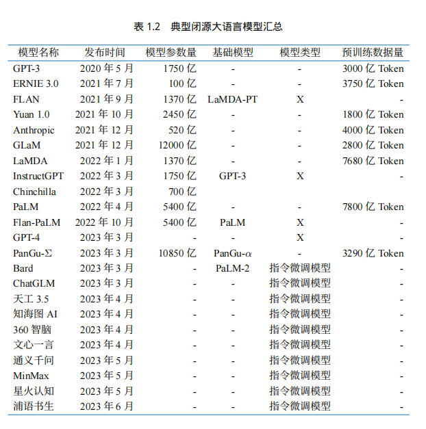
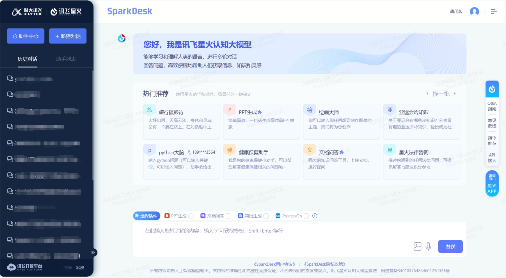
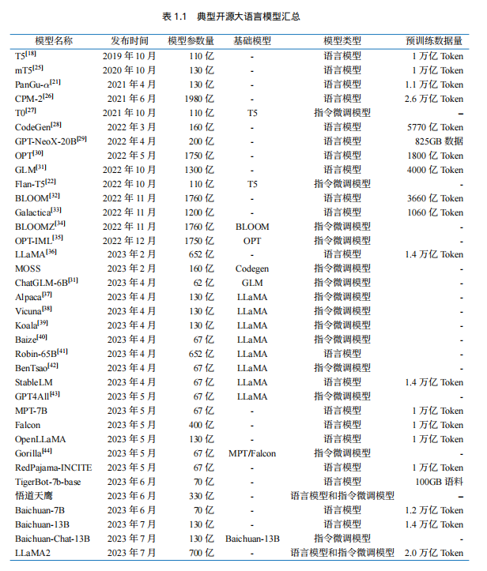
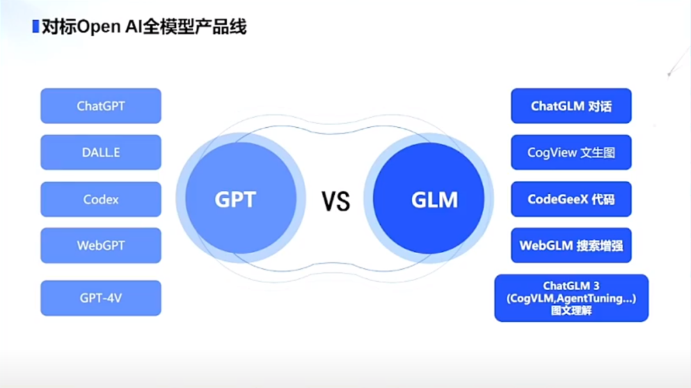

# Introduction to Large Language Model (LLM) Theory

[toc]

## 1. What is Large Language Model (LLM)

### 1.1 Concept of Large Language Model (LLM)

Large Language Model (LLM), also known as Large Language Model, is an artificial intelligence model designed to understand and generate human language.

LLM usually refers to language models containing tens of billions (or more) parameters, which are trained on massive amounts of text data to gain a deep understanding of language. At present, well-known LLMs abroad include GPT-3.5, GPT-4, PaLM, Claude and LLaMA, and domestic ones include Wenxin Yiyan, iFlytek Spark, Tongyi Qianwen, ChatGLM, Baichuan, etc.

In order to explore the limits of performance, many researchers have begun to train increasingly large language models, such as GPT-3 with 175 billion parameters and PaLM with 540 billion parameters. Although these large language models use similar architectures and pre-training tasks as small language models (such as the 330 million parameter BERT and the 1.5 billion parameter GPT-2), they exhibit very different capabilities, especially showing surprising potential in solving complex tasks, which is called "emergent capabilities".For example, GPT-3 can solve few-sample tasks by learning context, while GPT-2 performs poorly in this regard. Therefore, the research community has given these huge language models a name, calling them "large language models (LLM)". An outstanding application of LLM is **ChatGPT**, which is a bold attempt to use the GPT series LLM for conversational applications with humans, showing a very smooth and natural performance.

### 1.2 Development of LLM

The study of language modeling can be traced back to the `1990s`, when the research focused on using **statistical learning methods** to predict vocabulary and predict the next vocabulary by analyzing the previous vocabulary. However, there are certain limitations in understanding complex language rules.

Subsequently, researchers continued to try to improve it. In `2003, the pioneer of deep learning **Bengio** incorporated the idea of ​​deep learning into the language model for the first time in his classic paper `A Neural Probabilistic Language Model`. The powerful **neural network model** is equivalent to providing a powerful "brain" for computers to understand language, allowing the model to better capture and understand the complex relationships in language.

Around 2018, the Transformer neural network model began to emerge. These models were trained with large amounts of text data to make themBeing able to deeply understand language rules and patterns by reading a large amount of text is like letting a computer read the entire Internet, which has a deeper understanding of language and greatly improves the performance of the model on various natural language processing tasks.

At the same time, researchers have found that as the size of the language model increases (increasing the model size or using more data), the model has shown some amazing capabilities and its performance in various tasks has been significantly improved. This discovery marks the beginning of the era of large language models (LLMs).

### 1.3 Common LLM models

Although the development of large language models has only been less than five years, the development speed is quite amazing. As of June 2023, more than 100 large models have been released at home and abroad. The following figure shows the influential large language models with more than 10 billion model parameters from 2019 to June 2023 in timeline:

(This figure comes from the reference content [[1](https://arxiv.org/abs/2303.18223)])

Next, we will mainly introduce several common large models at home and abroad (including open source and closed source)

#### 1.3.1 Closed source LLM (Undisclosed source code)

<!--  -->

##### 1.3.1.1 GPT series

> [OpenAI model introduction](https://platform.openai.com/docs/models)

The **GPT (Generative Pre-Training)** model proposed by **OpenAI** in `2018` is one of the typical `generative pre-training language models`.

The basic principle of the GPT model is **to compress world knowledge into a decoder-only Transformer model** through language modeling, so that it can recover (or remember) the semantics of world knowledge and act as a general task solver. There are two key points to its success:

- Training a decoder-only Transformer language model that can accurately predict the next word
- Expanding the size of the language model

OpenAI's research on LLM can be roughly divided into the following stages:

Next, IWe will introduce the well-known ChatGPT and GPT4 from the aspects of model scale and characteristics:

###### 1.3.1.1.1 ChatGPT

> [ChatGPT usage address](https://chat.openai.com)

`In November 2022`, **OpenAI** released the **conversational application ChatGPT** based on the GPT model (GPT-3.5 and GPT-4). Due to its excellent ability to communicate with humans, ChatGPT has aroused excitement in the artificial intelligence community since its release. ChatGPT is developed based on the powerful GPT model and has specially optimized conversational capabilities.

ChatGPT is essentially an LLM application developed based on the base model and is essentially different from the base model. It supports two versions, GPT-3.5 and GPT-4.

The current ChatGPT supports up to 32,000 characters, and the knowledge deadline is September 2021. It can perform a variety of tasks, including **code writing, math problem solving, writing suggestions**, etc. ChatGPT has demonstrated excellent ability to communicate with humans: it has a rich knowledge storage, the skill of reasoning about mathematical problems, accurately tracking context in multi-turn dialogues, and being very consistent with the values ​​of safe human use. Later, ChatGPT supported a plug-in mechanism, which further expanded the capabilities of ChatGPT with existing tools or applications. So far, it seems to be the most powerful chatbot in the history of artificial intelligence. The launch of ChatGPT has a significant impact on future artificial intelligence research, and it provides inspiration for exploring human-like artificial intelligence systems.

###### 1.3.1.1.2 GPT-4

GPT-4, released in `March 2023`, expands **text input to multimodal signals**. GPT3.5 has 175 billion parameters, and the number of parameters of GPT4 has not been officially announced, but relevant personnel speculate that GPT-4 contains a total of 1.8 trillion parameters in 120 layers, that is, the scale of GPT-4 is more than 10 times that of GPT-3. As a result, GPT-4 is more capable of solving complex tasks than GPT-3.5, showing significant performance improvements on many evaluation tasks.

A recent study investigated the capabilities of GPT-4 by qualitatively testing it on artificially generated problems that covered a wide variety of difficult tasks and showed that GPT-4 can achieve superior performance than previous GPT models such as GPT3.5. In addition, thanks to six months of iterative calibration (with additional safety reward signals in RLHF training), GPT-4 responds more safely to malicious or provocative queries, and applies some intervention strategies to mitigate possible problems with LLM, such as hallucinations, privacy, and over-dependence.

> Note: On November 7, 2023, OpenAI held its first developer conference, at which the latest large language model GPT-4 Turbo was launched. Turbo is equivalent to the advanced version. It extends the context length to 128k, equivalent to 300 pages of text, and the training knowledge is updated to April 2023

GPT3.5 is free, while GPT-4 is charged. You need to open a plus membership of $20/month.

`May 14, 2024`, the new generation flagship generative model **GPT-4o** was officially released. GPT-4o has the ability to deeply understand the three modalities of text, voice, and image, and is quick to respond and emotional, which is very humane. And GPT-4o is completely free, although the number of free uses per day is limited.

Usually we can call the model API to develop our own applications. The mainstream model [API comparison](https://openai.com/pricing) is as follows:

| Language model name | Context length |Features | Input Fee ($/million tokens) | Output Fee ($/ 1M tokens) | Knowledge Deadline |
| :--------------------: | :--------: | :----------------: | :--------------------------: | :-----------------------: | :-----------: |
| GPT-3.5-turbo-0125 | 16k | Economy, Specialized Conversation | 0.5 | 1.5 | Sep 2021 |
| GPT-3.5-turbo-instruct | 4k | Instruction Model | 1.5 | 2 | Sep 2021 |
| GPT-4| 8k | Better performance | 30 | 60 | September 2021 |
| GPT-4-32k | 32k | Better performance, long context | 60 | 120 | September 2021 |
| GPT-4-turbo | 128k | Better performance | 10 | 30 | December 2023 |
| GPT-4o | 128k | Strongest performance, faster | 5 | 15 | October 2023 |
| Embedding Model Name | Dimensions | Features | Cost ($/ 1M tokens) |
| :--------------------: | :-----------: | :--: | :----------------: |
| text-embedding-3-small | 512/1536 | Small | 0.02 |
| text-embedding-3-large | 256/1024/3072 | Large | 0.13 |
| ada v2 | 1536 | Traditional | 0.1 |

##### 1.3.1.2 Claude Series

The Claude series of models are large closed-source language models developed by **Anthropic**, a company created by former OpenAI employees.

> [Claude usage address](https://claude.ai/chats)

The earliest **Claude** was released on `March 15, 2023`.On July 11, it was updated to **Claude-2**, and on March 4, 2024, it was updated to **Claude-3**.

The Claude 3 series includes three different models, namely Claude 3 Haiku, Claude 3 Sonnet, and Claude 3 Opus, with increasing capabilities to meet the needs of different users and application scenarios.

| Model Name | Context Length | Features | Input Fee ($/1M tokens) | Output Fee ($/1M tokens) |
| :-------------: | :--------: | :------: | :---------------------: | :----------------------: |
| Claude 3 Haiku | 200k | Fastest | 0.25 | 1.25 |
| Claude 3 Sonnet | 200k | Balanced | 3| 15 |
| Claude 3 Opus | 200k | Highest performance | 15 | 75 |

##### 1.3.1.1.3 PaLM/Gemini series

**PaLM series** language large models are developed by **Google**. Its initial version was released in `April 2022`, and the API was made public in March 2023. In May 2023, Google released **PaLM 2**, and on `February 1, 2024`, Google changed the underlying large model driver of Bard (the previously released conversational application) from PaLM2 to **Gemini**, and also renamed the original Bard to **Gemini**.

> [PaLM official address](https://ai.google/discover/palm2/)

> [Gemini usage address](https://gemini.google.com/)

The current Gemini is the first version, Gemini 1.0, which is divided into three versions: Ultra, Pro and Nano according to the different parameter quantities.

The following window is the interface of Gemini:

##### 1.3.1.1.4 Wenxin Yiyan

> [Wenxin Yiyan usage address](https://yiyan.baidu.com)

**Wenxin Yiyan is a knowledge-enhanced language big model based on Baidu Wenxin big model**, which was first launched in China in March 2023. Wenxin big model, the basic model of Wenxin Yiyan, was released in version 1.0 in 2019 and has now been updated to version **4.0**. Further classification, Wenxin big model includes NLP big model, CV big model, cross-modal big model, biological computing big model, and industry big model. A closed-source model with relatively good Chinese language capabilities.

The web version of Wenxin Yiyan is divided into **free version** and **professional version**.

- The free version uses Wenxin version 3.5, which can already meet most of the needs of individual users or small businesses.
- The professional version uses Wenxin version 4.0. The price is 59.9 yuan/month, and the continuous monthly subscription discount price is 49.9 yuan/month

You can also use the APIMake a call ([Billing details](https://console.bce.baidu.com/qianfan/chargemanage/list)).

The following is the user interface of Wenxin Yiyan:

##### 1.3.1.1.5 Spark Big Model

> [Spark Big Model Usage Address](https://xinghuo.xfyun.cn)

**iFlytek Spark Cognitive Big Model** is a language big model released by **iFlytek**, which supports a variety of natural language processing tasks. The model was first released in `May 2023` and has been upgraded many times. In `October 2023`, iFlytek released **iFlytek Spark Cognitive Big Model V3.0**. In January 2024, iFlytek released the iFlytek Spark Cognitive Model V3.5, which has been upgraded in seven aspects, including language understanding, text generation, and knowledge questions and answers, and supports multiple functions such as system instructions and plug-in calls.

The following is the user interface of iFlytek Spark:

####1.3.2. Open Source LLM

<!--  -->

##### 1.3.2.1 LLaMA Series

> [LLaMA Official Address](https://llama.meta.com)

> [LLaMA Open Source Address](https://github.com/facebookresearch/llama)

**LLaMA Series Model** is a set of basic language models with parameter sizes **ranging from 7B to 70B** open sourced by **Meta**. LLaMA was released in `February 2023`, LLaMA2 model was released in July 2023, and **LLaMA3** model was released on `April 18, 2024`. They are all trained on trillions of characters, showing how to **train state-of-the-art models** using only publicly available datasets, without relying on proprietary or inaccessible datasets. These datasets include Common Crawl, Wikipedia, OpenWebText2, RealNews, Books, etc. The LLaMA model uses **large-scale data filtering and cleaning techniques**,To improve data quality and diversity, and reduce noise and bias. The LLaMA model also uses efficient **data parallel** and **pipeline parallel** techniques to accelerate model training and expansion. In particular, LLaMA 13B surpasses GPT-3 (175B) in 9 benchmarks such as CommonsenseQA, while **LLaMA 65B is comparable to the best models Chinchilla-70B and PaLM-540B**. LLaMA has advantages under various inference budgets by using fewer characters to achieve the best performance.

Like the GPT series, the LLaMA model also uses a **decoder-only** architecture, while combining some improvements from previous work:

- `Pre-normalization regularization`: In order to improve training stability, LLaMA performs RMSNorm normalization on the input of each Transformer sublayer. This normalization method can avoid the problem of gradient explosion and vanishing, and improve the convergence speed and performance of the model;

- `SwiGLU activation function`: ReLU nonlinearity is replaced by SwiGLU activation function, which increases the expressive power and nonlinearity of the network while reducing the number of parameters and calculations;

- `Rotary Position Encoding (RoPE, Rotary Position Embedding)`: The model's input no longer uses positional encoding, but adds positional encoding to each layer of the network. RoPE positional encoding can effectively capture the relative position information in the input sequence and has better generalization ability.

**LLaMA3** has improved on the basis of the LLaMA series model, improving the performance and efficiency of the model:

- `More training data`: LLaMA3 is pre-trained on 15 trillion tokens of data, which is 7 times more training data than LLaMA2, and 4 times more code data. LLaMA3 is able to access more text information, thereby improving its ability to understand and generate text.

- `Longer context length`: The context length of LLaMA3 has doubled from 4096 tokens in LLaMA2 to 8192. This allows LLaMA3 to process longer text sequences and improves its ability to understand and generate long texts.

- `Grouped-Query Attention (GQA)`: By grouping queries and sharing keys and values ​​within the groups, the computation is reduced while maintaining model performance and improving the inference efficiency of large models (LLaMA2 only uses 70B).

- `Larger vocabulary`: LLaMA3The tokenizer has been upgraded to 128K, which is 4 times the 32K of the previous two generations. This greatly enhances its semantic encoding ability, thereby significantly improving the performance of the model.

##### 1.3.2.2 Tongyi Qianwen

> [Tongyi Qianwen usage address](https://tongyi.aliyun.com)

> [Tongyi Qianwen open source address](https://github.com/QwenLM/Qwen2)

**Tongyi Qianwen was developed by Alibaba based on the "Tongyi" large model** and officially released in `April 2023`. In September 2023, Alibaba Cloud open-sourced the Qwen (Tongyi Qianwen) series of work. On February 5, 2024, **Qwen1.5** (beta version of Qwen2) was open-sourced. And on `June 6, 2024`, **Qwen2** was officially open-sourced. Qwen2 is a **decoder-only** model that uses the `SwiGLU activation`, `RoPE`, and `GQA` architecture. An open source model with relatively good Chinese capabilities.

Currently, 5 model sizes have been open sourced: **0.5B, 1.5B, 7B, 72B Dense models and 57B (A14B) MoE models**; all models support lengths of **32768 token** context. And the context length of Qwen2-7B-Instruct and Qwen2-72B-Instruct is extended to **128K token**.

The following is the user interface of Tongyi Qianwen:

##### 1.3.2.3 GLM series

> [ChatGLM usage address](https://chatglm.cn/)

> [ChatGLM open source address](https://github.com/THUDM/GLM-4)

**GLM series model** is a large language model jointly developed by **Tsinghua University and Zhipu AI. **ChatGLM** was released in March 2023. **ChatGLM 2** was released in June. **ChatGLM3** was launched in October. **GLM4** was released on January 16, 2024, and officially open sourced on June 6, 2024.

**GLM-4-9B-Chat** supports multi-round conversations, web browsing, code execution, custom tool calls (Function Call) and long text reasoning (supports up to **128K**Context) and other functions.

Open source `dialogue model` **GLM-4-9B-Chat**, `basic model` **GLM-4-9B**, `long text dialogue model` **GLM-4-9B-Chat-1M** (supports 1M context length), `multimodal model` **GLM-4V-9B**, etc. are fully benchmarked against OpenAI:

`January 16, 2024` released **ChatGLM4**, but **it is not open source yet**.

The following is the user interface of Zhipu Qingyan:

##### 1.3.2.4 Baichuan series

> [Baichuan user address](https://www.baichuan-ai.com/chat)

> [Baichuan open source address](https://github.com/baichuan-inc)

**Baichuan** is an **open source commercial** language model developed by **Baichuan Intelligence**. It is based on **Transformer decoder architecture (decoder-only).

**Baichuan-7B** and **Baichuan-13B** were released on June 15, 2023. Baichuan also open-sourced **pre-trained** and **aligned** models. The `pre-trained model is the "base" for developers`, while the `aligned model is for ordinary users who need conversation functions`.

**Baichuan2** was launched on `September 6, 2023`. **Base** and **Chat** versions of **7B, 13B** were released, and **4bits quantization** of the Chat version was provided.

**Baichuan 3** was released on `January 29, 2024`. But **it is not open source yet**.

The following is the user interface of Baichuan Large Model:

## 2. LLM Capabilities and Features

### 2.1 LLM Capabilities

#### 2.1.1 Emergent Abilities

One of the most notable features that distinguishes Large Language Models (LLMs) from previous pre-trained language models (PLMs) is their `emergent abilities`. Emergent abilities are surprising abilities that are not obvious in small models but are very noticeable in large models.Particularly outstanding. Similar to the phase transition phenomenon in physics, the emergent ability is like the model performance rapidly improving with the increase of scale, exceeding the random level, which is what we often call **quantitative change leads to qualitative change**.

The emergent ability can be related to certain complex tasks, but we are more concerned about its general ability. Next, we briefly introduce three typical emergent abilities of LLM:

1. **Contextual learning**: The contextual learning ability was first introduced by GPT-3. This ability allows language models to perform tasks by understanding the context and generating corresponding outputs when provided with natural language instructions or multiple task examples, without additional training or parameter updates.

2. **Instruction following**: Fine-tuning by using multi-task data described in natural language, also known as `instruction fine-tuning`. LLM has been shown to perform well on unseen tasks described in the form of instructions. This means that LLM is able to perform tasks according to task instructions without having seen specific examples in advance, demonstrating its strong generalization ability.

3. **Step-by-step reasoning**: Small language models often have difficulty solving complex tasks involving multiple reasoning steps, such as mathematical problems. However, LLM solves these tasks by adopting a `Chain of Thought (CoT)` reasoning strategy, using a prompting mechanism that includes intermediate reasoning steps to arrive at the final answer. It is speculated that this ability may be acquired through training on the code.

These emergent capabilities allow LLMs to perform well in a variety of tasks, making them powerful tools for solving complex problems and applying them to multiple fields.

#### 2.1.2 Ability to support multiple applications as a foundation model

In 2021, researchers from Stanford University and other universities proposed the concept of foundation model, clarifying the role of pre-trained models. This is a new AI technology paradigm that uses training on massive amounts of unlabeled data to obtain large models (single or multimodal) that can be applied to a large number of downstream tasks. In this way, **multiple applications can rely on only one or a few large models for unified construction**.

Large language models are a typical example of this new model. Using a unified large model can greatly improve R&D efficiency. This is an essential improvement compared to developing a single model each time. Large models can not only shorten the development cycle of each specific application and reduce the required manpower investment, but also achieve better application results based on the reasoning, common sense and writing capabilities of large models. Therefore, the big model can become a unified foundation model for AI application development. This is a new paradigm that achieves multiple goals at once and is worth promoting.

#### 2.1.3 Supporting the ability to use dialogue as a unified entry

The opportunity that made the big language model really popular was **ChatGPT** based on dialogue chat. The industry discovered users’ special preference for dialogue interaction very early on.During his time at Microsoft, Lu Qi promoted the "conversation as a platform" strategy in 2016. In addition, voice-based products such as Apple Siri and Amazon Echo are also very popular, reflecting the preference of Internet users for chat and conversation as an interaction mode. Although there were various problems with previous chatbots, the emergence of large language models has once again allowed chatbots as an interaction mode to emerge again. Users are increasingly looking forward to artificial intelligence like "Jarvis" in Iron Man, who is omnipotent and omniscient. This has led us to think about the application prospects of the "agent" type. Projects such as Auto-GPT and Microsoft Jarvis have appeared and attracted attention. I believe that many similar projects will emerge in the future that allow assistants to complete various specific tasks in the form of conversation.

### 2.2 Characteristics of LLM

Large language models have many significant characteristics that have attracted widespread interest and research in natural language processing and other fields. The following are some of the main characteristics of large language models:

1. ** Huge scale: ** LLMs usually have a huge parameter scale, which can reach billions or even hundreds of billions of parameters. This enables them to capture more language knowledge and complex grammatical structures.

2. **Pre-training and fine-tuning:** LLM adopts a learning method of pre-training and fine-tuning. First, on large-scale text dataPre-training on (unlabeled data) to learn general language representation and knowledge. Then fine-tuning (labeled data) to adapt to specific tasks, so that they perform well in various NLP tasks.

3. **Context-awareness:** LLMs have strong context-awareness when processing text, and can understand and generate text content that depends on the previous text. This makes them excel in dialogue, article generation, and situational understanding.

4. **Multilingual support:** LLMs can be used in multiple languages, not just English. Their multilingual capabilities make cross-cultural and cross-lingual applications easier.

5. **Multimodal support:** Some LLMs have been extended to support multimodal data, including text, images, and sounds. This allows them to understand and generate content of different media types and achieve more diverse applications.

6. **Ethical and risk issues:** Although LLMs have excellent capabilities, they also raise ethical and risk issues, including the generation of harmful content, privacy issues, cognitive biases, etc. Therefore, research and application of LLMs need to be cautious.

7. **High computing resource requirements:** LLM parameters are large in size and require a lot of computing resources for training and inference. Usually, it is necessary to use a high-performance GPU or TPU cluster to implement it.

Large language models are a technology with powerful language processing capabilities that have demonstrated potential in many fields. They provide a lot of advantages for natural language understanding and generation tasks.It has become a powerful tool, but it has also raised concerns about its ethical and risk issues. These characteristics make LLM an important research and application direction in computer science and artificial intelligence today

## III. Application and impact of LLM

LLM has had a profound impact in many fields. In the field of **natural language processing**, it can help computers better understand and generate text, including writing articles, answering questions, translating languages, etc. In the field of **information retrieval**, it can improve search engines and make it easier for us to find the information we need. In the field of **computer vision**, researchers are also working to make computers understand images and text to improve multimedia interaction.

Most importantly, the emergence of LLM has made people rethink the possibility of **general artificial intelligence (AGI)**. AGI is artificial intelligence that thinks and learns like humans. LLM is considered an early form of AGI, which has triggered many thoughts and plans for the future development of artificial intelligence.

In short, LLM is an exciting technology that allows computers to better understand and use language, which is changing the way we interact with technology and also triggering unlimited exploration of future artificial intelligence.

> In the next chapter, we will introduce RAG, an important technology in the LLM period.

[**Reference content**]: 1. [A Survey of Large Language Models](https://arxiv.org/abs/2303.18223)
2. [Zhou Feng: When we talk about big models, what new capabilities should we focus on? ](https://xueqiu.com/1389978604/248392718)