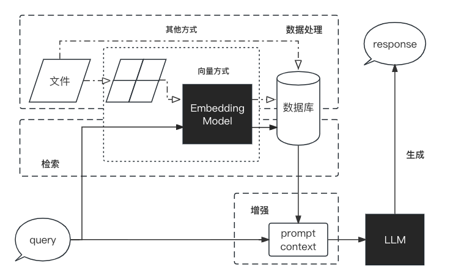

# Introduction to Retrieval-Augmented Generation (RAG)

[toc]

## 1. What is RAG

Large-scale language models (LLMs) are more powerful than traditional language models, but in some cases they may still fail to provide accurate answers. In order to address a series of challenges faced by large-scale language models when generating text and improve the performance and output quality of the models, researchers proposed a new model architecture: **Retrieval-Augmented Generation (RAG)**. This architecture cleverly **integrates relevant information retrieved from a large knowledge base, and based on this, guides large-scale language models to generate more accurate answers**, thereby significantly improving the accuracy and depth of answers.

The main problems currently faced by LLM are:

- **Information bias/hallucination:** LLM sometimes generates information that is inconsistent with objective facts, resulting in inaccurate information received by users. RAG retrieves data sources and assists the model generation process to ensure the accuracy and credibility of the output content and reduce information bias.

- **Knowledge update lag:** LLM is trained based on static data sets, which may cause the model's knowledge update to lag and fail to reflect the latest information dynamics in a timely manner. RAG keeps the content up-to-date by retrieving the latest data in real time, ensuring the continuous updating and accuracy of information.

- **Content is not traceable:** Content generated by LLMThe content often lacks a clear source of information, which affects the credibility of the content. RAG links the generated content with the retrieved original materials, enhancing the traceability of the content, thereby increasing the user's trust in the generated content.

- **Lack of domain expertise:** LLM may not be very effective in dealing with expertise in a specific field, which may affect the quality of its answers in related fields. RAG provides the model with rich contextual information by retrieving relevant documents in a specific field, thereby improving the quality and depth of question answers in professional fields.

- **Limited reasoning ability:** When faced with complex questions, LLM may lack the necessary reasoning ability, which affects its understanding and answering of questions. RAG combines the retrieved information with the model's generation ability, and enhances the model's reasoning and understanding ability by providing additional background knowledge and data support.

- **Limited adaptability to application scenarios:** LLM needs to be efficient and accurate in a variety of application scenarios, but a single model may not be able to fully adapt to all scenarios. RAG enables LLM to flexibly adapt to a variety of application scenarios such as question-answering systems and recommendation systems by retrieving data for the corresponding application scenarios.

- **Weak ability to process long texts:** LLM is limited to a limited context window when understanding and generating long content, and must process the content sequentially, which becomes slower as the input becomes longer. RAG strengthens the model’s ability to process long texts by retrieving and integrating information from long texts.The understanding and generation of long contexts effectively breaks through the limitation of input length, reduces the call cost, and improves the overall processing efficiency.

## 2. RAG workflow

RAG is a complete system, and its workflow can be simply divided into four stages: data processing, retrieval, enhancement, and generation:

1. **Data processing stage**
1. Clean and process the original data.
2. Convert the processed data into a format that can be used by the retrieval model.
3. Store the processed data in the corresponding database.
2. **Retrieval stage**
1. Input the user's question into the retrieval system and retrieve relevant information from the database.
3. **Enhancement stage**
1. Process and enhance the retrieved information so that the generation model can better understand and use it.
4. **Generation stage**
1. Input the enhanced information into the generation model, and the generation model generates answers based on this information.

## 3. RAG VS Finetune

RAG and Finetune are two mainstream methods for improving the performance of large language models.

**Finetune**: Further training of large language models on specific datasetsto improve the performance of the model on a specific task.

For a comparison between RAG and fine-tuning, please refer to the following table (table source [[1](https://arxiv.org/abs/2312.10997)][[2](https://baoyu.io/translations/ai-paper/2312.10997-retrieval-augmented-generation-for-large-language-models-a-survey)])

| Feature comparison | RAG | Fine-tuning |
| -------- | ---------------------------------------------------------------------- | -------------------------------------------------------------------------- |
| Knowledge Update | Directly update the retrieval knowledge base without retraining. The cost of information update is low, suitable for dynamically changing data. | Retraining is usually required to keep knowledge and data updated. The update cost is high, suitable for static data. |
| External Knowledge | Good at using external resources, especially suitable for processing documents or other structured/unstructured databases. | Learn external knowledge into LLM. |
| Data Processing | Very low requirements for data processing and operation. | Relying on building high-quality datasets, limited datasets may not significantly improve performance. |
| Model Customization | Focuses on information retrieval and integrating external knowledge, but may not fully customize model behavior or writing style. | LLM behavior, writing style, or specific domain knowledge can be adjusted according to specific styles or terminology. |
| Explainability | Can be traced back to specific data sources, with good explainability and traceability. |Black box, relatively low interpretability. |
| Computational resources | Additional resources are required to support the maintenance of the retrieval mechanism and database. | Relying on high-quality training datasets and fine-tuning targets, the requirements for computing resources are high. |
| Inference latency | Increases the time consumption of the retrieval step | Time consumption of simple LLM generation |
| Reduce hallucinations | Generate answers through retrieved real information, reducing the probability of hallucinations. | Model learning data in specific fields helps reduce hallucinations, but hallucinations may still occur when facing unseen inputs. |
| Ethical privacy | Retrieving and using external data may raise ethical and privacy issues. | Sensitive information in training data needs to be properly handled to prevent leakage.|

## IV. Successful Cases of RAG

RAG has achieved success in many fields, including question-answering systems, dialogue systems, document summarization, document generation, etc.

We will introduce the application of RAG in detail in the third part. We will disassemble the existing mature RAG cases and have a deeper understanding of RAG with everyone.

1. [Datawhale Knowledge Base Assistant](https://github.com/logan-zou/Chat_with_Datawhale_langchain) is based on the content of this course and [ChatWithDatawhale](https://github.com/sanbuphy/ChatWithDatawhale) - Datawhale content learning assistant created by [Sanbuphy](https://github.com/sanbuphy). The architecture is adjusted to the LangChain architecture that is easy for beginners to learn, and the LLM application that encapsulates the API of different source models with reference to the content of Chapter 2 can help users communicate smoothly with DataWhale's existing warehouse and learning content, so as to help users quickly find what they want to learn and what they can contribute.
2. [Tianji](https://github.com/SocialAI-tianji/Tianji) is a free-to-use, non-commercial artificial intelligence system made by **SocialAI** (Laishier AI). You can use it to perform tasks involving traditional social skills, such as how to toast, how to say nice things, how to deal with things, etc., to improve your emotional intelligence and core competitiveness. We firmly believe that only social skills are the core technology of future AI, and only AI that can deal with things has the opportunity to move towards AGI. Let us work together to witness the advent of general artificial intelligence. —— "The secret of heaven cannot be leaked."

---

> In this chapter, we have a brief understanding of RAG. In the next chapter, we will introduce a commonly used RAG development framework LangChain.

**References**:

1. [Retrieval-Augmented Generation for Large Language Models: A Survey](https://arxiv.org/abs/2312.10997)
2. [Retrieval-augmented generation for large language models: a survey](https://baoyu.io/translations/ai-paper/2312.10997-retrieval-augmented-generation-for-large-language-models-a-survey)