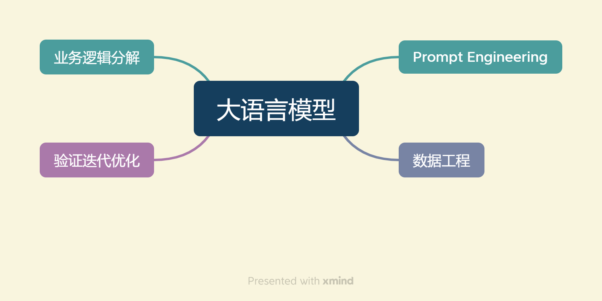
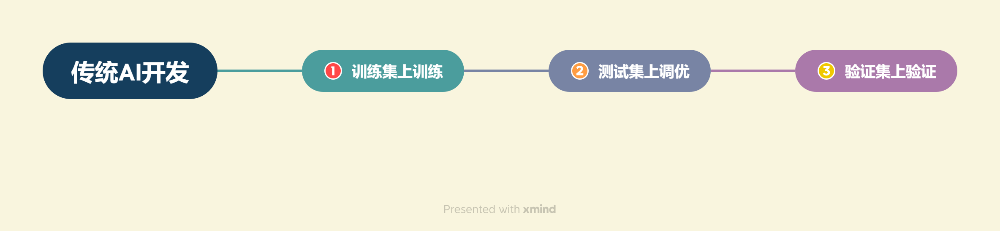
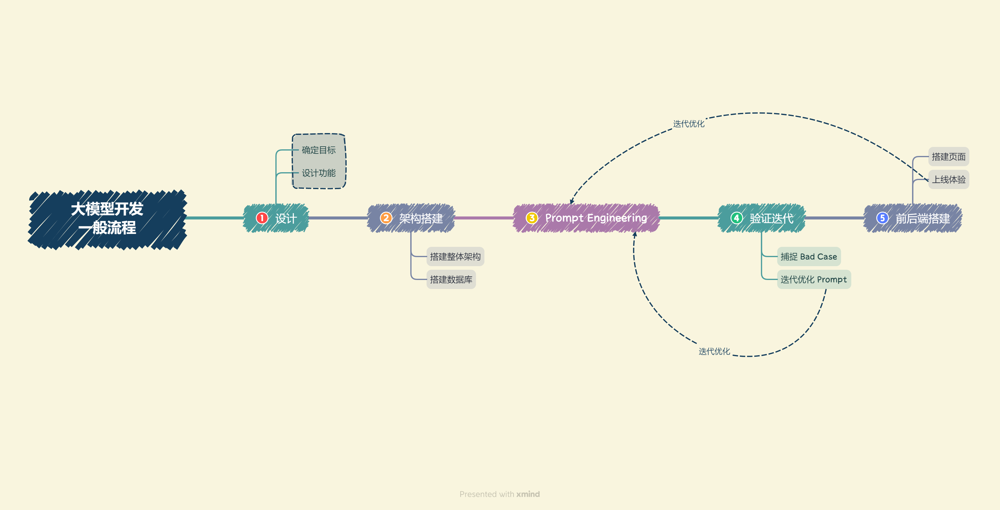

# Overall process of developing LLM applications

[toc]

## 1. What is big model development

We call the development of applications that use big language models as the core functions, use the powerful understanding and generation capabilities of big language models, and combine special data or business logic to provide unique functions as big model development. Although the core technology of developing big model-related applications is on big language models, the core understanding and generation are generally achieved by calling APIs or open source models, and the control of big language models is achieved through prompt engineering. Therefore, although big models are the culmination of deep learning, big model development is more of an engineering problem.

In big model development, we generally do not make major changes to the model, but use the big model as a calling tool to fully utilize the big model capabilities and adapt to application tasks through prompt engineering, data engineering, business logic decomposition, etc., instead of focusing on optimizing the model itself. Therefore, as beginners in big model development, we do not need to deeply study the internal principles of big models, but need to master the practical skills of using big models.

Large Model Development Elements

At the same time,The development of large models with large models as the core is quite different from traditional AI development in terms of **overall thinking**. The two core capabilities of large language models: `instruction following` and `text generation` provide simple alternatives for complex business logic.

- `Traditional AI development`: First, it is necessary to disassemble the very complex business logic in sequence, construct training data and verification data for each sub-business, train and optimize the model for each sub-business, and finally form a complete model link to solve the entire business logic.
- `Large model development`: Use prompt engineering to replace the training and tuning of sub-models, implement business logic through prompt link combination, and use a general large model + several business prompts to solve tasks, thereby transforming traditional model training and tuning into simpler, easier, and lower-cost prompt design and tuning.

At the same time, in terms of **evaluation ideas**, large model development and traditional AI development are also qualitatively different.

- `Traditional AI development`: You need to construct training sets, test sets, and validation sets first, and then evaluate the performance by training the model on the training set, fine-tuning the model on the test set, and finally verifying the model effect on the validation set.
- `Large model development`: The process is more flexible and agile. Construct a small batch validation set based on actual business needs, and design a reasonable prompt to meet the validation set effect. Then, continuously extract the model from the business logic.Collect the Bad Cases of the current Prompt, add the Bad Cases to the verification set, optimize the Prompt in a targeted manner, and finally achieve a better generalization effect.

Traditional AI Evaluation

LLM Evaluation

In this chapter, we will briefly describe the general process of large model development, and combine the actual needs of the project to gradually analyze the work and steps to complete the project development.

## 2. General process of large model development

Combined with the above analysis, we can generally break down large model development into the following processes:

1. **Determine the goal**. Before development, we first need to determine the development goal, that is, the application scenario, target population, and core value of the application to be developed. For individual developers or small development teams, they should generally set a minimum goal first, starting from building an MVP (minimum viable product).Start with the development goals and gradually improve and optimize.

2. **Design functions**. After determining the development goals, it is necessary to design the functions that this application will provide and the general implementation logic of each function. Although we have simplified the decomposition of business logic by using large models, the clearer and deeper understanding of business logic can often bring better prompt effects. Similarly, for individual developers or small development teams, we must first determine the core functions of the application, and then extend the design of the upstream and downstream functions of the core functions; for example, if we want to build a personal knowledge base assistant, then the core function is to answer questions based on the content of the personal knowledge base, then the upstream function of users uploading knowledge bases and the downstream function of users manually correcting model answers are sub-functions that we must also design and implement.

3. **Build an overall architecture**. At present, most large model applications use the architecture of specific database + prompt + general large model. We need to build the overall architecture of the project for the functions we designed to achieve the whole process from user input to application output. Generally speaking, we recommend development based on the LangChain framework. LangChain provides the implementation of Chain, Tool and other architectures. We can customize it based on LangChain to achieve the overall architecture connection from user input to database to large model and final output.

4. **Build a database**. Personalized largeModel applications need to be supported by a personalized database. Since large model applications require vector semantic retrieval, vector databases such as Chroma are generally used. In this step, we need to collect data and preprocess it, and then vectorize and store it in the database. Data preprocessing generally includes conversion from multiple formats to plain text, such as PDF, MarkDown, HTML, audio and video, as well as cleaning of erroneous data, abnormal data, and dirty data. After preprocessing, it is necessary to slice and vectorize to build a personalized database.

5. **Prompt Engineering**. High-quality prompts have a great impact on the capabilities of large models. We need to gradually iterate to build high-quality prompt engineering to improve application performance. In this step, we should first clarify the general principles and techniques of prompt design, build a small verification set from actual business, and design a prompt that meets basic requirements and has basic capabilities based on the small verification set.

6. **Verification iteration**. Verification iteration is an extremely important step in large model development. It generally refers to improving system effects and dealing with boundary conditions by continuously discovering bad cases and improving prompt engineering in a targeted manner. After completing the initialization prompt design in the previous step, we should conduct actual business tests to explore boundary conditions and findBad Case, and analyze the problems of Prompt in a targeted manner, so as to continuously iterate and optimize until a relatively stable Prompt version that can basically achieve the goal is reached.

7. **Front-end and back-end construction**. After completing Prompt Engineering and its iterative optimization, we have completed the core functions of the application and can give full play to the powerful capabilities of the large language model. Next, we need to build the front-end and back-end, design the product page, and let our application go online as a product. Front-end and back-end development is a very classic and mature field, so I will not go into details here. We use Gradio and Streamlit to help individual developers quickly build visual pages to realize Demo online.

8. **Experience optimization**. After completing the front-end and back-end construction, the application can be put online for experience. Next, you need to conduct long-term user experience tracking, record Bad Cases and user negative feedback, and then optimize it in a targeted manner.

## 3. Brief analysis of the process of building an LLM project (taking the knowledge base assistant as an example)

Below, we will combine this practical project with the overall process introduction above to briefly analyze the development process of the [Knowledge Base Assistant Project](https://github.com/logan-zou/Chat_with_Datawhale_langchain):

### Step 1: Project planning and demand analysis

#### 1.**Project goal**: Question-answering assistant based on personal knowledge base

#### 2.**Core functions**

1. Vectorize the crawled and summarized MarkDown files and user-uploaded documents, and create a knowledge base;

2. Select the knowledge base and retrieve the knowledge fragments asked by the user;

3. Provide knowledge fragments and questions to obtain large model answers;

4. Streaming reply;

5. Historical conversation records

#### 3.**Determine the technical architecture and tools**

1. **Framework**: LangChain

2. **Embedding model**: GPT, Zhipu, [M3E](https://huggingface.co/moka-ai/m3e-base)

3. **Database**: Chroma

4. **Large model**: GPT, iFlytek Spark, Wenxin Yiyan, GLM, etc.

5. **Front-end and back-end**: Gradio and Streamlit

### Step 2: Data preparation and vector knowledge base construction

The implementation principle of this project is shown in the figure below ([Image source](https://github.com/chatchat-space/Langchain-Chatchat/blob/master/img/langchain+chatglm.png)): Load local document -> Read text -> TextThis segmentation -> text vectorization -> question vectorization -> match the top k most similar to the question vector in the text vector -> add the matched text as context and question to the prompt -> submit to LLM to generate answers.

#### 1. Collect and organize documents provided by users

Users often use PDF, TXT, MD, etc. First, we can use LangChain's document loader module to easily load user-provided documents, or use some mature Python packages to read.

Due to the current limitation of using tokens in large models, we need to segment the read text and segment longer text into smaller texts. At this time, a piece of text is a unit of knowledge.

#### 2. Vectorize document words

Use `text embedding technology` to vectorize the segmented documents so that semantically similar text fragments have close vector representations. Then, store it in the vector database to complete the creation of the `index`.

Using the vector database to index each document fragment can achieve fast retrieval.

#### 3. Import the vectorized document into the Chroma knowledge base and create a knowledge base index

Langchain integrates more than 30 different vector databases. Chroma database is lightweight and data is stored in memory, which makes it very easy to start and use.

The user knowledge base content is stored in the vector database through Embedding, and then each user question will also go through Embedding, using vector relevance algorithms (such as cosine algorithm) to find the most matching knowledge base fragments, and these knowledge base fragments are used as context and submitted to LLM as prompts together with user questions.

### Step 3: Large model integration and API connection

1. Integrate large models such as GPT, Spark, Wenxin, GLM, etc., and configure API connection.
2. Write code to interact with the large model API to obtain answers to questions.

### Step 4: Core function implementation

1. Build Prompt Engineering to implement the large model answer function and generate answers based on user questions and knowledge base content.
2. Implement streaming replies to allow users to have multiple rounds of conversations.
3. Add the historical conversation record function to save the interaction history between the user and the assistant.

### Step 5: Iterative optimization of core functions

1. Perform verification and evaluation and collect bad cases.
2. Iteratively optimize the core function implementation based on the bad cases.

### Step 6: Front-end and user interaction interface development

1.Use Gradio and Streamlit to build the front-end interface.
2. Implement the functions of users uploading documents and creating knowledge bases.
3. Design the user interface, including question input, knowledge base selection, history display, etc.

### Step 7: Deployment testing and launch

1. Deploy the Q&A assistant to the server or cloud platform to ensure that it is accessible on the Internet.
2. Perform production environment testing to ensure system stability.
3. Launch and release to users.

### Step 8: Maintenance and continuous improvement

1. Monitor system performance and user feedback, and handle problems in a timely manner.
2. Update the knowledge base regularly, add new documents and information.
3. Collect user needs, make system improvements and expand functions.

The entire process will ensure that the project can proceed smoothly from planning, development, testing to launch and maintenance, and provide users with high-quality Q&A assistants based on personal knowledge bases.

---

> Now that we have a preliminary understanding of the general process of large model development, we will introduce the entire development environment to ensure that everyone can smoothly carry out project development.
>
> - If you are an experienced user, you can skip the following content of this chapter and go directly to the second part.
> - The following two chapters mainly introduce the construction of two development environments for students who do not have a suitable development environment. You can read them as needed.
> - Chapter 5 mainly introduces `Basic use of Alibaba Cloud Server`, `Remote connection to the service through SSH`, `Use of jupyter notebook`.
> - Chapter 6 mainly introduces the use of `GitHub CodeSpace` and how to build a development environment in `GitHub CodeSpace`. (First, make sure you have a network environment that can smoothly access GitHub, otherwise it is recommended to use Alibaba Cloud)
> - If you already have a suitable development machine, you can jump directly to the `7. Environment Configuration` section to start configuring the development environment.