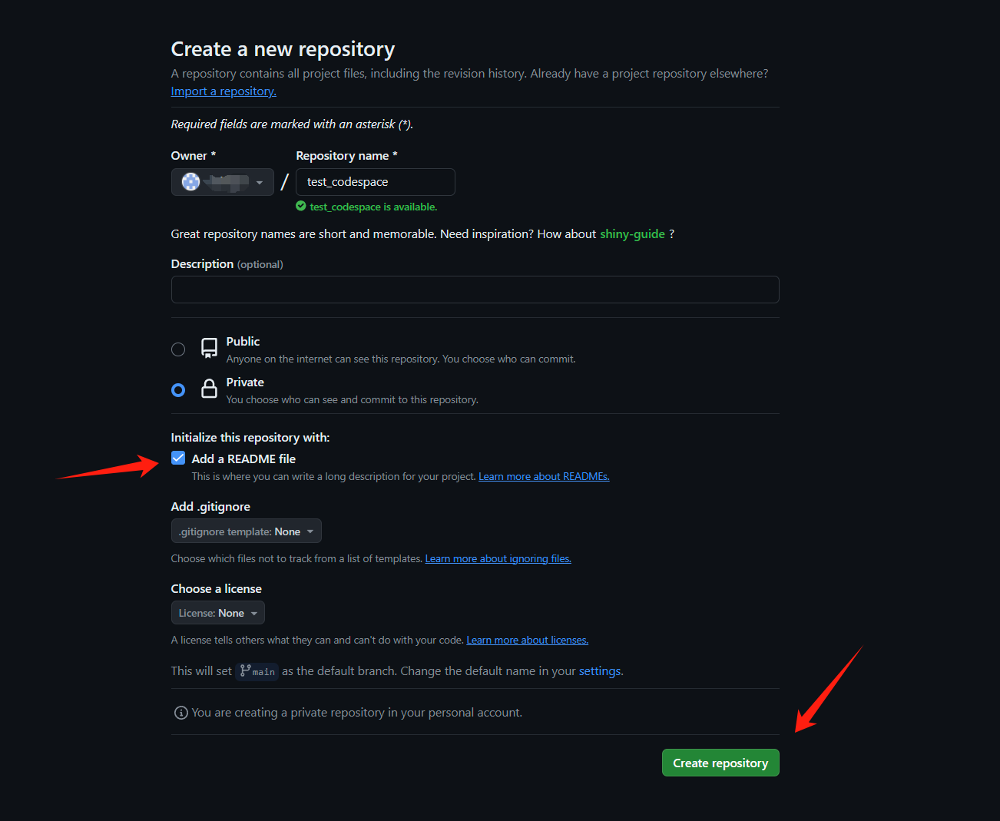

# GitHub Codespaces Overview & Environment Configuration (Optional)

[toc]

> **First, make sure you have a network environment that can access GitHub smoothly**

** Otherwise, it is still recommended to use Alibaba Cloud**

## 1. What is a codespace?

A codespace is a development environment hosted in the cloud. You can customize your project for GitHub Codespaces by submitting configuration files to a repository (commonly known as "configuration as code"), which will create a repeatable codespace configuration for all users of the project. For more information, see "[Introduction to Development Containers](https://docs.github.com/zh/codespaces/setting-up-your-project-for-codespaces/adding-a-dev-container-configuration/introduction-to-dev-containers)".

[Official Documentation](https://docs.github.com/en/codespaces/overview)

## 2. Create your first codespace

1. Open the URL: https://github.com/features/codespaces
2. Log in to your GitHub account
3. Click the icon **Your repositories**

4. After entering your own repository list, click the icon **New** to create a new repository

5. You can set it up according to your needs. For convenience and security, it is recommended to check **Add a README file** and select **Private** (because the API key is used in the course, pay attention to privacy protection). After setting, click **Create repository**

6. After creating the repository, click **code** Select **Codespaces**, click the icon**Create codespace on main**

7. After waiting for a while, the following interface will appear. The following operations are the same as VSCode. You can install plug-ins and adjust settings as needed

## 3. Environment Configuration

Refer to `1.2 General Environment Configuration` in `7. Environment Configuration` to configure the environment. You can skip the first two steps.

> Since each repository can set up an independent codespace, we do not need to install the conda environment here. And because the GitHub server is abroad, there is no need to configure the domestic mirror source.

## 4. VSCode configures Python environment

Refer to `2. VSCode configures Python environment in `7. Environment configuration` to configure the environment

> Note: After installing all configurations for the first time, you need to restart the codespace

## 5. Local VSCode connects to Codespace (optional)

1. Open VSCode and search for codespace install plugin

2. In the activity bar of VSCode, click the **Remote Explorer** icon

3. Log in to GitHub and follow the prompts to log in

4. You can see the codespace we just created here, click the red box connection icon

5. Successfully connected to the codespace

6. [VSCode Official configuration document](https://docs.github.com/en/codespaces/developing-in-a-codespace/using-github-codespaces-in-visual-studio-code)

## 6. Others1. After closing the webpage, find the newly created repository, click the red box to select the content to re-enter the codespace

2. Free quota
After finding the GitHub account settings, you can see the remaining free quota in **Plans and usage**

3. Codespace settings, it is recommended to adjust the suspension time (too long time will waste the quota)

4. Because codespace can be accessed through the web, the most important thing is of course that you can **carry a tablet to access the web for programming learning**

---

> At present, we have the necessary foundation for development. In the next chapter, we will introduce the required environment configuration in detail.