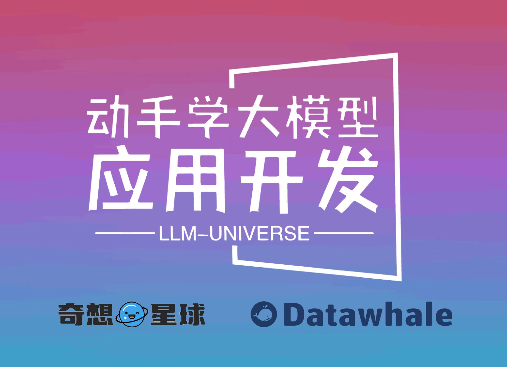

# Learn how to develop large model applications

## Project Introduction

This project is a tutorial on how to develop large model applications for novice developers. It aims to complete the key points of large model development through a course based on Alibaba Cloud Server and combined with the personal knowledge base assistant project. The main contents include:

1. **Introduction to large models**, what is a large model, what are the characteristics of a large model, what is LangChain, how to develop an LLM application, a simple introduction for novice developers;

2. **How ​​to call the large model API**, this section introduces various ways to call the API of well-known large model products at home and abroad, including calling native APIs, encapsulating as LangChain LLM, encapsulating as Fastapi, etc. At the same time, multiple large model APIs including Baidu Wenxin, iFlytek Spark, Zhipu AI, etc. are encapsulated in a unified form;

3. **Knowledge base construction**, loading and processing of different types of knowledge base documents, and building a vector database;

4. **Build RAG Application**, including connecting LLM to LangChain to build a retrieval question-answering chain, and using Streamlit for application deployment
5. **Verification iteration**, large modelHow to implement verification iteration in development, and what are the general evaluation methods;

This project mainly includes three parts:

1. **LLM development introduction**. A simplified version of V1, designed to help beginners get started with LLM development as quickly and conveniently as possible, understand the general process of LLM development, and build a simple Demo.

2. **LLM development skills**. More advanced skills for LLM development, including but not limited to: prompt engineering, processing of multiple types of source data, optimized retrieval, recall sorting, agent framework, etc.

3. **LLM application examples**. Introduce some successful open source cases, analyze the ideas, core ideas, and implementation frameworks of these application examples from the perspective of this course, and help beginners understand what kind of applications they can develop through LLM.

At present, the first part has been completed, and everyone is welcome to read and learn; the second and third parts are being created.

**Directory structure description:**

requirements.txt: installation dependencies in the official environment
notebook: Notebook source code file
docs: Markdown document file
figures: pictures
data_base: the knowledge base source file used

## Project significance

LLM is gradually becoming the information worldThe new revolutionary force in the world, through its powerful natural language understanding and natural language generation capabilities, provides developers with new and more powerful application development options. With the explosive opening of LLM API services at home and abroad, how to quickly and conveniently develop applications with stronger capabilities and integrated LLM based on LLM API has begun to become an important skill for developers.

At present, there are many introductions to LLM and scattered LLM development skills courses, but the quality is uneven and not well integrated. Developers need to search for a large number of tutorials and read a lot of content that is not very relevant and necessary to initially master the necessary skills for large model development. The learning efficiency is low and the learning threshold is also high.

Starting from practice, this project combines the most common and general personal knowledge base assistant project to gradually dismantle the general process and steps of LLM development in a simple and easy-to-understand way, aiming to help novices without algorithm foundation complete the basic introduction of large model development through a course. At the same time, we will also add advanced RAG development skills and interpretation of some successful LLM application cases to help readers who have completed the first part of the study to further master more advanced RAG development skills and develop their own and fun applications by learning from existing successful projects.

## Project audience

All developers who have basic Python skills and want to master LLM application development skills.

**This project is for learners with basic artificial intelligence and algorithm foundationsThere are no requirements. You only need to master basic Python syntax and basic Python development skills. **

Considering the environment construction problem, this project provides a free way for students to get Alibaba Cloud Server. Students can get Alibaba Cloud Server for free and complete the study of this course through Alibaba Cloud Server. This project also provides a guide to setting up the environment for personal computers and non-Alibaba Cloud servers. This project has basically no requirements for local hardware and does not require a GPU environment. Both personal computers and servers can be used for learning.

**Note: This project mainly uses the APIs provided by major model manufacturers for application development. If you want to learn to deploy and apply local open source LLM, you are welcome to learn [Self LLM | Open Source Large Model Eating Guide] (https://github.com/datawhalechina/self-llm), which is also produced by Datawhale. This project will teach you how to quickly pass the full link of open source LLM deployment and fine-tuning! **

**Note: Considering the difficulty of learning, this project is mainly for beginners and introduces how to use LLM to build applications. If you want to further study the theoretical basis of LLM and further understand and apply LLM based on the theory, you are welcome to study [So Large LM | Big Model Foundation](https://github.ub.com/datawhalechina/so-large-lm), this project will provide you with comprehensive and in-depth LLM theoretical knowledge and practical methods! **

## Project highlights

1. Fully oriented to practice, hands-on learning of large model development. Compared with other similar tutorials that start from theory and have a large gap with practice, this tutorial is based on the universal personal knowledge base assistant project, integrating the universal large model development concept into project practice, helping learners to master large model development skills by building personal projects.

2. Starting from scratch, a comprehensive and short large model tutorial. This project is aimed at the personal knowledge base assistant project, and has carried out project-led reconstruction of the relevant large model development theories, concepts and basic skills, deleting the underlying principles and algorithm details that do not need to be understood, and covering all the core skills of large model development. The overall duration of the tutorial is within a few hours, but after completing this tutorial, you can master all the core skills of basic large model development.

3. Both unified and extensible. This project has unified the encapsulation of major LLM APIs at home and abroad, such as GPT, Baidu Wenxin, iFlytek Spark, and Zhipu GLM, and supports one-click calling of different LLMs, helping developers to focus more on learning applications and optimizing the model itself, without spending time on tedious calling details; at the same time, this tutorial is planned to be launched on [Qiming Planet | AIGC Co-creation Community Platform](https://1aigc.cn/), supportingLearners can customize their own projects to add extended content to this tutorial, which is fully extensible.

## Online reading address

[https://datawhalechina.github.io/llm-universe/](https://datawhalechina.github.io/llm-universe/)

## PDF address

[https://github.com/datawhalechina/llm-universe/releases/tag/v1](https://github.com/datawhalechina/llm-universe/releases/tag/v1)

## Content outline

### Part 1 Introduction to LLM development

Leader: Zou Yuheng

1. [LLM introduction](./notebook/C1%20Large Language Model%20LLM%20Introduction/) @Gao Liye

1. [LLM theoretical introduction](./notebook/C1%20Large Language Model%20LLM%20Introduction/1.Large Language Model%20LLM%20Theoretical Introduction.md)

2. [What is RAG, RAG Core advantages of](./notebook/C1%20Large language model%20LLM%20Introduction/2. Retrieval Enhanced Generation%20RAG%20Introduction.md)
3. [What is LangChain](./notebook/C1%20Large Language Model%20LLM%20Introduction/3.LangChain%20Introduction.md)
4. [Overall process of developing LLM applications](./notebook/C1%20Large Language Model%20LLM%20Introduction/4.Overall process of developing%20LLM%20 applications.md)
5. [Basic use of Alibaba Cloud servers](./notebook/C1%20Large Language Model%20LLM%20Introduction/5.Basic use of Alibaba Cloud servers.md)
6. [Basic use of GitHub Codespaces (optional)](./notebook/C1%20Large Language Model%20LLM%20Introduction/6.Basic use of GitHub%20Codespaces%20 (optional).md)
7. [Environment Configuration](./notebook/C1%20Large Language Model%20LLM%20Introduction/7.Environment Configuration.md)
2. [Use LLM API to Develop Applications](./notebook/C2%20Use%20LLM%20API%20 to Develop Applications/) @毛雨
1.[Basic concepts](./notebook/C2%20Use%20LLM%20API%20Develop applications/1.%20Basic concepts.md)
2. [Use LLM API](./notebook/C2%20Use%20LLM%20API%20Develop applications/2.%20Use%20LLM%20API.ipynb)
- ChatGPT
- Wenxinyiyan
- iFlytek Spark
- Zhipu GLM
3. [Prompt Engineering](./notebook/C2%20Use%20LLM%20API%20Develop applications/3.%20Prompt%20Engineering.ipynb)
3. [Build a knowledge base](./notebook/C3%20Build a knowledge base/) @娄天奥
1. [Introduction to word vectors and vector knowledge base](./notebook/C3%20Building knowledge base/1.Introduction to word vectors and vector knowledge base.md)
2. [Using Embedding API](./notebook/C3%20Building knowledge base/2.Using %20Embedding%20API.ipynb)
3. [Data processing: reading, clearingWashing and slicing](./notebook/C3%20Building knowledge base/3.Data processing.ipynb)
4. [Building and using vector database](./notebook/C3%20Building knowledge base/4.Building and using vector database.ipynb)
4. [Building RAG application](./notebook/C4%20Building%20RAG%20Application/) @Xu Hu
1. [Connecting LLM to LangChain](./notebook/C4%20Building%20RAG%20Application/1.LLM%20Connecting%20LangChain.ipynb)
- ChatGPT
- Wenxinyiyan
- iFlytek Spark
- Zhipu GLM
2. [Building search question and answer chain based on LangChain](./notebook/C4%20Building%20RAG%20Application/2.Building search question and answer chain.ipynb)
3. [Based on Streamlit Deploy Knowledge Base Assistant](./notebook/C4%20Build%20RAG%20Application/3.Deploy Knowledge Base Assistant.ipynb)
5. [System Evaluation and Optimization](./notebook/C5%20System Evaluation and Optimization/) @邹雨=Heng
1. [How to evaluate LLM applications](./notebook/C5%20System Evaluation and Optimization/1. How to evaluate%20LLM%20 applications.ipynb)
2. [Evaluate and optimize the generation part](./notebook/C5%20System Evaluation and Optimization/2.Evaluate and optimize the generation part.ipynb)
3. [Evaluate and optimize the retrieval part](./notebook/C5%20System Evaluation and Optimization/3.Evaluate and optimize the retrieval part.md)

### Part 2 Advanced RAG skills (under creation)

Leader: Gao Liye

1. Background
1. Architecture overview
2. Existing problems
3. Solutions
2. Data processing
1. Multi-type document processing
2. Block optimization
3. Selection of vector models
4. Fine-tuning vector models (advanced)
3. Index level
1. Index structure
2. Hybrid retrieval
3. Hypothetical question
4. Retrieval stage
1. Query filtering
2. Align query and document
3. Align retrieval and LLM
5. Generation stage
1. Post-processing
2. Fine-tune LLM (advanced)
3. Reference citation
6. Enhancement stage
1. Context enhancement2. Enhanced process
7. RAG engineering evaluation
### Part III Interpretation of open source LLM application

Leader: Xu Hu

1. Interpretation of ChatWithDatawhale - Personal Knowledge Base Assistant
2. Tianji - Interpretation of the human relations and worldly wisdom model

## Acknowledgements

**Core Contributors**

- [Zou Yuheng - Project Leader](https://github.com/logan-zou) (Datawhale member - Graduate student of University of International Business and Economics)
- [Gao Liye - Head of the second part](https://github.com/0-yy-0) (Datawhale member - Algorithm Engineer)
- [Xu Hu - Head of the third part](https://github.com/xuhu0115) (Datawhale member - Algorithm Engineer)

**Main Contributors**

- [Mao Yu - Content Creator](https://github.com/Myoungs ) (Backend Development Engineer)
- [Lou Tianao - Content Creator](https://github.com/lta155) (Datawhale Jingying Teaching Assistant - Graduate Student of University of Chinese Academy of Sciences)
- [Cui Tengsong - Project Supporter](https://github.com/2951121599) (Datawhale Member-Joint founder of Qixiang Planet)
- [June-Project Supporter](https://github.com/JuneYaooo) (Datawhale member-Joint founder of Qixiang Planet)

**Other**

1. Special thanks to [@Sm1les](https://github.com/Sm1les) and [@LSGOMYP](https://github.com/LSGOMYP) for their help and support for this project;

2. Special thanks to [Qixiang Planet | AIGC Co-creation Community Platform](https://1aigc.cn/) for its support, welcome everyone to follow;

3. If you have any ideas, please contact us DataWhale also welcomes everyone to raise issues;

4. Special thanks to the following students who contributed to the tutorial!

 Made with [contrib.rocks](https://contrib.rocks). ## Star History 