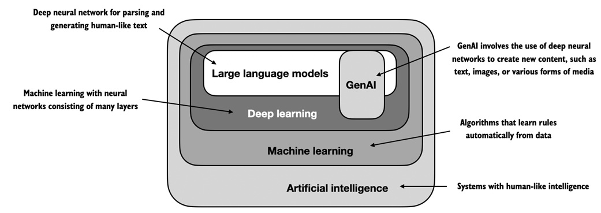

### 1.1 What is an LLM?

An LLM, a large language model, is a neural network designed to understand, generate, and respond to human-like text. These models are deep neural networks trained on massive amounts of text data, sometimes encompassing large portions of the entire publicly available text on the internet.

> The annotations and explanations for this sentence are as follows:

1. **Neural network**: This is a computational model that mimics the way the neural network of the human brain is connected, and can perform a variety of tasks, including language processing, by learning patterns in data.

2. **Aimed to understand, generate, and respond to human-like textHuman text: This indicates that the main function of LLM is to process natural language text, not only to "understand" the meaning of text, but also to generate new text content and respond appropriately to user input text.
3. **Trained on massive text data**: The training of LLM involves a large amount of text data, which provides the model with rich language information and usage patterns, enabling it to learn various characteristics of language.
4. **Deep neural network**: This is a type of neural network that contains multiple hidden layers and can learn and represent complex relationships and patterns in data.
5. **Contains a large part of all public text on the Internet**: This shows the large scale of the datasets used to train LLM. They include a large amount of public text available on the Internet, such as books, articles, forum posts, etc.
6. **Understanding**: In the context of LLM, understanding usually refers to the model's ability to recognize and interpret semantic content and contextual information in text.
7. **Generation**: It refers to the LLM's ability to autonomously create new text content that is similar in structure and semantics to human-generated text.
8. **Response**: This means that LLM can generate appropriate responses or outputs based on the input text or query, which may include answering questions, executing instructions, or providing information.

*This sentence describes the core features of LLM: they are deep neural network models trained on large amounts of text data, capable of performing understanding, generation, and response tasks.Human text tasks. These capabilities make LLM have broad application potential in the field of natural language processing. 」*

The "large" in large language model refers to both the model's size in terms of parameters and the immense dataset on which it's trained. Models like this often have tens or even hundreds of billions of parameters, which are the adjustable weights in the The network that is optimized during training to predict the next word in a sequence. Next-word prediction is sensible because it harnesses the inherent sequential nature of language to train models on underlyinganding context, structure, and relationships within text. Yet, it is a very simple task and so it is surprising to many researchers that it can produce such capable models. We will discuss and implement the next-word training procedure in later chapters step by step.

The "large" in large language models refers to the parameter scale of the model and the huge dataset on which it is trained. Such models typically have tens or even hundreds of billions of parameters, which are adjustable weights in the network that are optimized during training to predict the next word in a sequence. Such a strategy for next-word prediction is sensible because it exploits the inherent sequentiality of language to train models that understand context, structure, and relationships within text. Yet, it is a very simple task and so it is surprising to many researchers that it can produce such capable models. We will discuss and implement the "next-word training procedure" in later chapters step by step.

> Annotations andThe explanation is as follows: 
1. **The "large" in large language models**: The "large" here refers to the two main characteristics of the model: the scale of parameters and the volume of training data. Generally speaking, the parameter scale of the model reaches the order of 1B (that is, 1 billion parameters) to become a large model. The reason for this definition is that only when the model reaches a large scale will there be an emergent phenomenon based on the Scaling law. The emergence of this large model's ability to understand, process and transfer text (including many small samples or zero samples) is the charm of the large model as the base model. It realizes the unification of multiple tasks, "although it feels a bit like a miracle".
2. **Parameter scale**: In deep learning, the parameters of the model refer to the weights and biases that can be learned and adjusted in the network. In large language models (LLMs), the number of these parameters is very large, usually reaching billions or even hundreds of billions.
3. **Large data sets for training the model**: In order to train these models, a large amount of text data is required, which forms the basis of model learning. The size and diversity of the dataset have a significant impact on the performance of the model. For example, the commonly used Wikipedia and Common Crawl, C4, and Github datasets have a training corpus size of TB level.
4. **Adjustable weights in the network**: Weights are numerical values ​​used in neural networks to process input data and generate output. During the training process, by optimizing the algorithm(such as gradient descent) to adjust these weights to reduce prediction error.
5. **Optimization during training**: The training process involves using specific algorithms to adjust the parameters of the model with the goal of minimizing the prediction error, that is, the difference between the model output and the true value.
6. **Predict the next word in the sequence**: This is a common method used in LLM training, that is, to predict the next most likely word given a series of words. This method takes advantage of the sequential nature of language.
7. **Take advantage of the inherent sequentiality of language**: Language is a serialized entity, and the order in which words are arranged is crucial to the meaning of the sentence. LLM learns this sequentiality of language by predicting the next word.
8. **Training models to understand context, structure, and relationships in text**: Through the prediction task, LLM learns not only the prediction of individual words, but also the meaning of words in a specific context, and how they are combined into meaningful sentences and paragraphs.
9. **Very simple task**: It means that technically, predicting the next word is a relatively simple machine learning problem because it only involves predicting an output based on the given context information.
10. **Many researchers were surprised to find such a powerful model**: Although the task of predicting the next word is simple in itself, the LLM trained in this way has shown amazing ability to handle complex language tasks such as text generation, translation, question answering, etc.

*「This sentence explainsThis article explains why LLMs are called "large", emphasizing the number of model parameters and the size of training data, as well as how these models learn complex language processing capabilities from simple prediction tasks. At the same time, it also foreshadows that our subsequent content will explore the training process of LLMs in depth. "*

LLMs utilize an architecture called the transformer (covered in more detail in section 1.4), which allows them to pay selective attention to different parts of the input when making predictions, making them especially adept at handling the nuances and complexities of human language.

LLMs utilize an architecture called the transformer (covered in more detail in section 1.4), which allows them to pay selective attention to different parts of the input when making predictions, making them especially adept at handling the nuances and complexities of human language.

> The annotations and explanations for this sentence are as follows:
1.**This structure allows the LLM to selectively focus on different parts of the input when making predictions**: A key feature of the Transformer model is its self-attention mechanism, which enables the model to evaluate the relevance of different parts of the input sequence and give them different weights when generating the output.
2. **This makes the LLM particularly good at handling the nuances and complexities of human language**: Due to the self-attention mechanism, the LLM is able to capture long-range dependencies and contextual clues in the language, which is crucial for understanding the complexity of language and generating natural, coherent text.
3. **Selective attention**: This means that instead of treating every element in the input sequence equally, the model is able to identify the most important information for the current task and give it more attention, which is very similar to the attention mechanism of people receiving information. The selective attention mechanism here is achieved through the "self-attention mechanism".
4. **Prediction**: In the context of LLM, prediction usually refers to generating the next most likely word or sequence based on a given input sequence (such as a series of words).
5. **Dealing with the nuances of human language**: This involves a deep understanding of language, including word meaning, grammar, pragmatics, and how language changes in different contexts.
6. **Complexity**: The complexity of human languageThe LLM is not only characterized by its structure, but also by the diversity and ambiguity of its expressions. LLM needs to be able to handle these complexities to generate and understand natural language.

*"This sentence emphasizes the importance of the Transformer architecture in LLM and how it enables the model to flexibly handle the complexity of language, which is one of the key factors for the success of LLM in NLP tasks." *

Since LLMs are capable of generating text, LLMs are also often referred to as a form of generative artificial intelligence (AI), often abbreviated as generative AI or GenAI. As illustrated in Figure 1.1, AI encompasses the broader field of creating machines that can perform tasks requiring human like intelligence, including understanding language, recognizing language, and understanding language.tterns, and making decisions, and includes subfields like machine learning and deep learning.

Because LLMs can generate text, LLMs are often referred to as a form of generative artificial intelligence (AI), often abbreviated as generative AI or GenAI. As shown in Figure 1.1, artificial intelligence covers a broader field of creating machines that can perform tasks that require human intelligence (including understanding language, recognizing patterns, and making decisions), and includes subfields such as machine learning and deep learning.

> The annotations and explanations for this sentence are as follows:
1. **Generate text**: This ability of LLMs means that they can not only recognize and understand input text, but also create completely new text content that is similar in structure and semantics to human-written text.
2. **Generative artificial intelligence (AI)**: This is a type of AI that is able to create or generate new information, images, music, or text that did not exist before. Here, it specifically refers to AI models that generate text.
3. **Create machines that can perform tasks that require human intelligence**: This means that AI systems are designed to mimic human cognitive abilities and perform tasks that usually require human intelligence.

* This sentence illustrates LLM as a practical example of generative AI.For example, its ability is not limited to text generation, but also reflects the broad potential of AI in simulating human intelligent behavior. At the same time, it also points out that the field of AI contains multiple subfields, such as machine learning and deep learning, which jointly promote the development and application of AI technology. "*

Figure 1.1 As this hierarchical depiction of the relationship between the different fields suggests, LLMs represent a specific application of deep learning techniques, leveraging their ability to process and generate human-like text. Deep learning is a specialized branch of machine learning that focuses on using multi-layer neural networks. And machine learning and deep learning are fields aimed at implementing algorithms that enable computers to learn from data and perform tasks that typically require human intelligence.

Figure 1.1 As shown in the hierarchical description of the relationship between different fields, LLM represents a specific application of deep learning techniques that exploits their ability to process and generate human-like text. Deep learning is a specialized branch of machine learning that focuses on the use of multi-layer neural networks. Both machine learning and deep learning are fields aimed at implementing algorithms that enable computers to learn from data and perform tasks that typically require human intelligence.

The algorithms used to implement AI are the focus of the field of machine learning. Specifically, machine learning involves the development of algorithms that can learn from and makepredictions or decisions based on data without being explicitly programmed. To illustrate this, imagine a spam filter as a practical application of machine learning. Instead of manually writing rules to identify spam emails, a machine learning algorithm is fed examples of emails labeled as spam and legitimate emails. By minimizing the error in its predictions on a training dataset, the model then learns to recognize patterns and characteristics indicative of spam, enabling it to classify new emails.ils as either spam or legitimate.

Algorithms used to implement artificial intelligence are the focus of the field of machine learning. Specifically, machine learning involves the development of algorithms that can learn from data and make predictions or decisions without being explicitly programmed. To illustrate this, think of a spam filter as a practical application of machine learning. Instead of manually writing rules to identify spam, a machine learning algorithm is fed with examples of messages that are labeled as spam and legitimate. By minimizing the prediction error on the training data set, the model learns to recognize the patterns and characteristics of spam, thereby classifying new messages as spam or legitimate.

> The annotations and explanations for this sentence are as follows:
1. **Algorithms used to implement artificial intelligence**: Here, it refers to those computational algorithms designed to simulate human intelligent behavior. They are the basis of artificial intelligence (AI) systems. Since the last century, relevant researchers have begun to explore the realization of intelligence, including connectionism, behaviorism and logicism.
2. **Focus of the field of machine learning**: Machine learning is a core subfield of AI that focuses on developing algorithms that can learn from data and make intelligent decisions.
3. Learning from data without explicit programming: Machine learning algorithms are different from traditional programming in that they do not follow a fixed set of instructions to perform tasks, but instead automatically improve their performance by analyzing data..
4. **Making predictions or decisions**: Common applications of machine learning algorithms include predicting future events (such as predictions) and making choices (such as decisions).
5. **No need to manually write rules**: Compared with traditional programming methods, machine learning algorithms do not require human experts to manually write detailed rule sets.
6. **Minimizing prediction errors on training data sets**: The goal of machine learning algorithms is to improve the accuracy of their predictions, which is usually achieved by adjusting the parameters of the algorithm to reduce the difference between predicted values ​​and actual values.
7. **Learning to recognize patterns and characteristics of spam**: Through training, machine learning models are able to discover and understand common patterns and characteristics in spam.
8. **Classifying new emails as spam or legitimate emails**: This is the ultimate goal of machine learning algorithms in spam filtering tasks, that is, to be able to accurately classify new emails as spam or non-spam.

*「This sentence explains the use of machine learning algorithms in AI and how they make predictions and decisions by learning from data. Spam filters are an example of how machine learning algorithms can learn to recognize specific types of data patterns by analyzing labeled data.」*

As illustrated in Figure 1.1, deep learning is a subset of machine learning thatfocuses on utilizing neural networks with three or more layers (also called deep neural networks) to model complex patterns and abstractions in data. In contrast to deep learning, traditional machine learning requires manual feature extraction. This means that human experts need to identify and select the most relevant features for the model. While the field of AI is nowadays dominated by machine learning and deep learning, it also includes other approaches, for example, using rule-based systems, genetic algorithms, expert systems, fuzzy logic, or symbolic reasoning.

As shown in Figure 1.1, deep learning is a subset of machine learning that mainly uses neural networks with three or more layers (also called deep neural networks) to model complex patterns and abstract concepts in data. Compared with deep learning, traditional machine learning requires manual feature extraction. This means that human experts need to identify and select the most relevant features for the model. Although the field of artificial intelligence today is mainly machine learning and deep learning, it also includes other methods, such as using rule-based systems, genetic algorithms, expert systems, fuzzy logic, or symbolic reasoning.

> The annotations and explanations of this sentence are as follows:
1. **Deep learning is a subset of machine learning**: This sentence explains that deep learning is a specific branch within the field of machine learning that focuses on using deep neural networks to solve complex problems.
2. **Modeling complex patterns and abstract concepts in data**: Deep neural networks are able to identify and represent complex relationships and high-level features in data that may be difficult for humans to directly perceive or describe.
3. **Compared with deep learning, traditional machine learning requires manual feature extraction**: This sentence compares the differences between deep learning and traditional machine learning in feature extraction. In traditional machine learning, human experts are required to select and extract information that is relevant to the model.Features used.
4. **Human experts need to identify and select the most relevant features for the model**: In traditional machine learning, feature extraction is a process that requires expertise, and experts must determine which features are most useful for prediction or classification tasks.
5. **Rule-based system**: A system that uses a series of rules to process information and make decisions.
6. **Genetic algorithm**: A search algorithm inspired by the natural selection process that optimizes problem solutions by simulating genetic and evolutionary mechanisms.
7. **Expert system**: A computer system that simulates the decision-making ability of human experts, often used for complex problems in a specific field.
8. **Fuzzy logic**: A mathematical framework for dealing with uncertainty and ambiguity that simulates human fuzzy thinking by using fuzzy sets and fuzzy rules.
9. **Symbolic reasoning**: A reasoning method that uses symbols to represent and manipulate knowledge, common in the fields of logic and computing.

*"This sentence emphasizes the place of deep learning in machine learning and how it models complex patterns in data by using deep neural networks. At the same time, it also points out that machine learning is a diverse field that includes a variety of techniques and methods, not just deep learning." *

Returning to the spam classification example, in traditional machine learning, humanExperts might manually extract features from email text such as the frequency of certain trigger words ("prize," "win," "free"), the number of exclamation marks, use of all uppercase words, or the presence of suspicious links. This dataset, created based on these expert-defined features, would then be used to train the model. In contrast to traditional machine learning, deep learning does not require manual feature extraction. This means that human experts do not need to identify and select themost relevant features for a deep learning model. (However, in both traditional machine learning and deep learning for spam classification, you still require the collection of labels, such as spam or non-spam, which need to be gathered either by an expert or users.) The upcoming sections will cover some of the problems LLMs can solve today, the challenges that LLMs address, and the general LLM architecture, which we will implement in this book.

Going back to the spam classification example, in traditional machine learning, a human expert might manually extract features from the email text, such as certain triggersThe frequency of words ("prize", "win", "free"), the number of exclamation marks, the use of all capitalized words, or the presence of suspicious links. The dataset created based on these expert-defined features will be used to train the model. In contrast to traditional machine learning, deep learning does not require manual feature extraction. This means that human experts do not need to identify and select the most relevant features for deep learning models. (However, in spam classification for both traditional machine learning and deep learning, labels such as spam or non-spam still need to be collected, and these labels need to be collected by experts or users). The following chapters will introduce some of the problems that LLM can currently solve, the challenges that LLM has to address, and the general form of LLM architecture that we will implement in this book.

> The notes and explanations for this sentence are as follows:
1. **Traditional machine learning**: refers to those early techniques and methods in the field of machine learning that do not rely on deep neural networks.
2. **Human experts may manually extract features from email text**: In traditional machine learning, domain experts are usually required to manually select and extract features from the data, which are the inputs used by the model to make predictions.
3. Frequency of trigger words ("prize", "win", "free"): These are common keywords in spam. Their frequency can be used as one of the features to determine whether an email is spam. It is a standard word library for traditional spam filtering. Therefore, you can find that in some subsequent spam emails,, will use alternative words to escape the detection of the machine.
4. **Compared with traditional machine learning, deep learning does not require manual feature extraction**: Deep learning models can automatically learn features from raw data, which is in contrast to traditional machine learning, which requires human experts to intervene to extract features.
5. **Labels still need to be collected**: Whether it is traditional machine learning or deep learning, data needs to be labeled, that is, given the correct output label (such as spam or non-spam) in order to train the model.

*"This sentence illustrates the difference between traditional machine learning and deep learning in feature extraction in the spam classification task, and the potential of deep learning in reducing human intervention. At the same time, it also foreshadows that this book will explore the functions, challenges, and architecture of LLM in depth."*