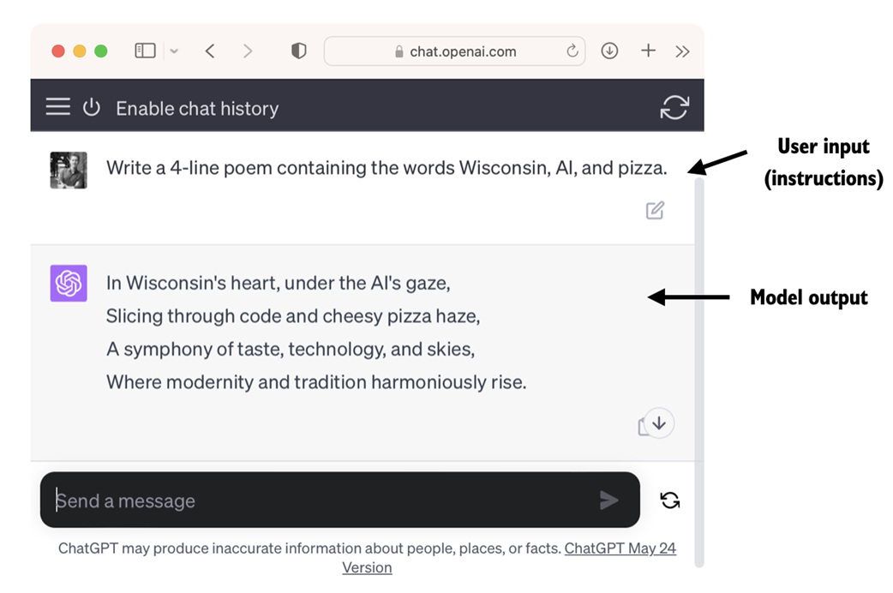

### 1.2 Applications of LLMs

Owing to their advanced capabilities to parse and understand unstructured text data, LLMs have a broad range of applications across various domains. Today, LLMs are employed for machine translation, generation of novel texts (see Figure 1.2), sentiment analysis, text summarization, and many other tasks. LLMs have recently been used for content creation, such as writing fiction, articles, and even computer code.

Due to their advanced capabilities to parse and understand unstructured text data, LLMs have a broad range of applications across various domains. Today, LLMs are employed for machine translation, generation of novel texts (see Figure 1.2), sentiment analysis, text summarization, and many other tasks. LLMs have recently been used for content creation, such as writing fiction, articles, and even computer code., LLM has been used for machine translation, generating new text (see Figure 1.2), sentiment analysis, text summarization, and many other tasks. Recently, LLM has also been used for content creation, such as writing novels, articles, and even computer code.

> The annotations and explanations for this sentence are as follows:
1. **Advanced ability to parse and understand unstructured text data**: Unstructured text data refers to text that has no fixed format or structure, such as ordinary text files, email content, web page text, etc. LLM uses deep learning technology to identify and process complex language structures and meanings in such data.
2. **Machine translation**: refers to the technology of automatically translating text in one language into another language. LLM is used to improve the quality and fluency of machine translation due to its powerful language understanding ability.
3. **Generate new text**: LLM can not only understand existing text, but also create new text content, which is widely used in automatic manuscript writing, chatbot response generation, etc.
4. **Sentiment analysis**: This is a technology that analyzes text to determine the emotional tendency of the author or speaker. LLM can identify and interpret the emotional color in the text.
5. **Text summarization**: refers to compressing long articles or documents into short and concise summaries. LLM can extract key information and generate summaries.

*This sentence emphasizes the advanced capabilities of LLM in natural language processing and their wide application potential in many different fields, especially in contentIn terms of creation, LLM has begun to demonstrate the ability to generate various types of text. 」*

Figure 1.2 LLM interfaces enable natural language communication between users and AI systems. This screenshot shows ChatGPT writing a poem according to a user's specifications. LLMs can also power sophisticated chatbots and virtual assistants, such as OpenAI's ChatGPT or Google's Gemini (formerly called Bard), which can answer user queries and augment traditional search engines such as Google Search or Microsoft Bing.

Figure 1.2 LLM interfaces enable natural language communication between users and AI systems. This screenshot shows ChatGPT writing a poem in response to a user's request. LLMs can also power sophisticated chatbots and virtual assistants, such as OpenAI's ChatGPT or Google's Gemini (formerly Bard), which can answer user queries and enhance the capabilities of traditional search engines such as Google Search or Microsoft Bing.

Moreover, LLMs may be used for effective knowledge retrieval from vast volumes of text in specialized areas such as medicine or law. This includes sifting through documents, summarizing lengthy passages, and answering technical questions.

Moreover, LLMs may be used for effective knowledge retrieval from vast volumes of text in specialized areas such as medicine or law. This includes sifting through documents, summarizing lengthy passages, and answering technical questions.

> Notes and explanations for this sentence are as follows:
1. ** Can be used to retrieve knowledge from vast volumes of text in specialized areas such as medicine or law.Effective knowledge retrieval in a large amount of text**: This sentence shows that LLM is not only suitable for general language processing, but also can process text data in professional fields. Knowledge retrieval refers to the process of finding and extracting required information in a large amount of text, and this actually involves the use of *RAG* related technologies in order to answer relevant questions more professionally. This is one of the two hot application research directions of large models, and the other is *Agent* related technologies.

In short, LLMs are invaluable for automating almost any task that involves parsing and generating text. Their applications are virtually endless, and as we continue to innovate and explore new ways to use these models, it's clear that LLMs have the potential to redefine our relationship with technology, making it more conversational, intuitive,In short, LLMs are invaluable for automating almost any task involving parsing and generating text. Their applications are nearly endless, and as we continue to innovate and explore new ways to use these models, it’s clear that LLMs have the potential to redefine our relationship with technology, making it more conversational, intuitive, and accessible.

In this book, we will focus on understanding how LLMs work from the ground up, coding an LLM that can generate texts. We will also learn about techniques that allow LLMs to carry out queries, ranging from answering questions to summarizing text, translating text into different languages, and more. In other words, in this book, we will learn how complex LLM assistants such as ChatGPT work by building one step by step.

In this book, we will focus on understanding how LLM works from scratch, coding an LLM that can generate text. We will also learn techniques for letting LLM perform queries, including answering questions, summarizing text, translating text into different languages, etc. In other words, in this book, we will understand how complex LLM assistants such as ChatGPT work by building one step by step.