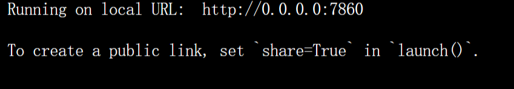
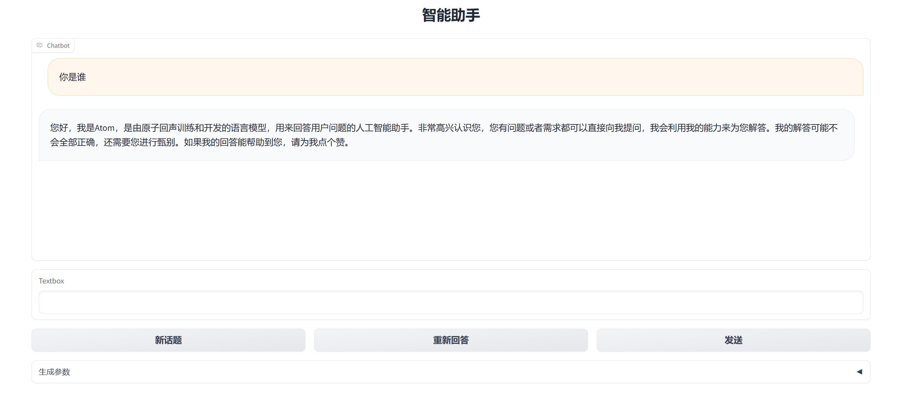

# Atom-7B-chat

## Environment preparation

Rent a 3090 or other 24G video memory graphics card machine on the [autodl](https://www.autodl.com/) platform. As shown in the figure below, select `PyTorch`-->`2.0.0`-->`3.8(ubuntu20.04)`-->`11.8`


Next, open the `JupyterLab` of the server you just rented, and open the terminal in it to start environment configuration, model download and run `demo`.

pip change source and install dependent packages

```shell
# Upgrade pip
python -m pip install --upgrade pip
# Change pypi source to accelerate library installation
pip config set global.index-url https://pypi.tuna.tsinghua.edu.cn/simple
#Install project-related dependent packages
pip install modelscope==1.9.5 transformers==4.35.2 gradio==4.4.1 SentencePiece==0.1.99 accelerate==0.24.1 bitsandbytes==0.41.2.post2
```

## Model download

Use the `snapshot_download` function in `modelscope` to download the model. The first parameter is the model name, and the parameter `cache_dir` is the download path of the model.

Create a new `download.py` file in the `/root/autodl-tmp` path and enter the following content in it. Remember to save the file after pasting the code, as shown in the figure below. And run `python /root/autodl-tmp/download.py` to download. The model size is 13 GB. It takes about 10 to 20 minutes to download the model.

```python
import torch
from modelscope import snapshot_download, AutoModel, AutoTokenizer
import os
model_dir = snapshot_download('FlagAlpha/Atom-7B-Chat', cache_dir='/root/autodl-tmp', revision='master')
```
## Code preparation

First, `clonee` code, open the academic image acceleration that comes with the autodl platform. For detailed usage of academic image acceleration, please see: https://www.autodl.com/docs/network_turbo/

```shell
source /etc/network_turbo
```

Then switch the path and clone the code.

```shell
cd /root/autodl-tmp
git clone https://github.com/FlagAlpha/Llama2-Chinese.git
```
Switch the commit version to keep it consistent with the tutorial commit version, so that everyone can reproduce it better.
```shell
cd Llama2-Chinese
git checkout 0a2b588c5716f26f1e37affa308283354b3612be
```
Finally, cancel the image acceleration, because the acceleration may have a certain impact on the normal network, avoiding trouble in the subsequent download of other models.

```shell
unset http_proxy && unset https_proxy
```
## Demo run
Enter the code directory and run the demo startup script. In --model_name_or_path parameter and fill in the downloaded model directory
```shell
cd /root/autodl-tmp/Llama2-Chinese/
python examples/chat_gradio.py --model_name_or_path /root/autodl-tmp/FlagAlpha/Atom-7B-Chat/
```
After successful startup, the terminal displays as follows:

## Set up proxy access
Find the custom service on the Autodl container instance page and download the corresponding proxy tool


Start the proxy tool, copy the corresponding ssh command and password, set the proxy port to 7860, and click Start Proxy

After the proxy is successful, click the link below to access web-demo
