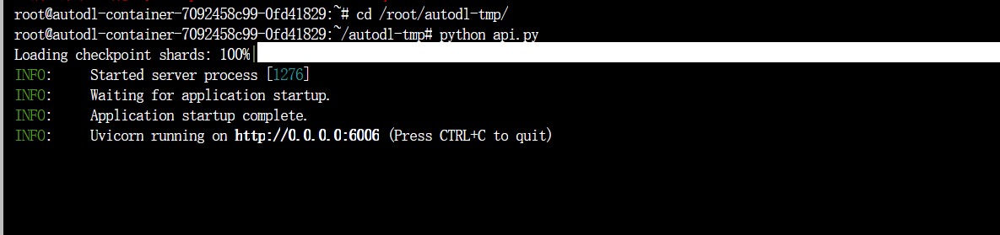
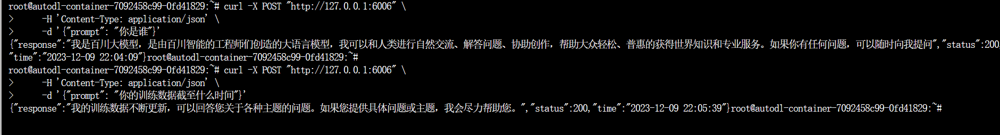
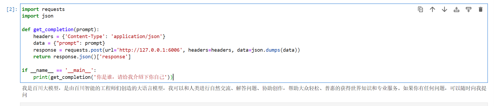

# Baichuan2-7B-chat FastApi deployment call

## Baichuan2 introduction

Baichuan 2 is a new generation of open source large language model launched by Baichuan Intelligence, which is trained with 2.6 trillion tokens of high-quality corpus. It achieves the best results of the same size on multiple authoritative Chinese, English and multi-language general and field benchmarks.

## Environment preparation

Rent a 3090 or other 24G graphics card machine on the autodl platform. As shown in the figure below, select PyTorch-->2.0.0-->3.8(ubuntu20.04)-->11.8 (versions above 11.3 are acceptable) Next, open the JupyterLab of the server you just rented, image and open the terminal in it to start environment configuration, model download and run demonstration.


Pip source change and installation of dependent packages

```shell
# Upgrade pip
python -m pip install --upgrade pip
# Change pypi source to accelerate library installation
pip config set global.index-url https://pypi.tuna.tsinghua.edu.cn/simple

pip install fastapi==0.104.1
pip install uvicorn==0.24.0.post1
pip install requests==2.25.1
pip install modelscope==1.9.5
pip install transformers==4.35.2
pip install streamlit==1.24.0
pip install sentencepiece==0.1.99
pip install accelerate==0.24.1
pip install transformers_stream_generator==0.0.4
pip install xformers==0.0.23 
```

## Model download:

Use the snapshot_download function in modelscope to download the model. The first parameter is the model name, and the parameter cache_dir is the download path of the model.

Create a new download.py file in the /root/autodl-tmp path and enter the following content in it. Remember to save the file after pasting the code, as shown in the figure below. And run python/root/autodl-tmp/download.py executes the download. The model size is 15 GB. It takes about 10 to 20 minutes to download the model.

```Python
import torch
from modelscope import snapshot_download, AutoModel, AutoTokenizer
import os
model_dir = snapshot_download('baichuan-inc/Baichuan2-7B-Chat',cache_dir='/root/autodl-tmp', revision='v1.0.4')
```

## Code preparation:

Create a new api.py file in the /root/autodl-tmp path and enter the following content in it. Remember to save the file after pasting the code. The following code has very detailed comments. If you have any questions, please raise an issue.

```Python
from fastapi import FastAPI, Request
from transformers import AutoTokenizer, AutoModelForCausalLM
from transformers.generation.utils import GenerationConfig
import uvicorn
import json
import datetime
import torch

# Set device parameters
DEVICE = "cuda" # Use CUDA
DEVICE_ID = "0" # CUDA device ID, empty if not set
CUDA_DEVICE = f"{DEVICE}:{DEVICE_ID}" if DEVICE_ID else DEVICE # Combine CUDA device information

# Clean up GPU memory function
def torch_gc():
if torch.cuda.is_available(): # Check if CUDA is available
with torch.cuda.device(CUDA_DEVICE): # Specify CUDA device
torch.cuda.empty_cache() # Clear CUDA cache
torch.cuda.ipc_collect() # Collect CUDA memory fragments

# Create FastAPI applicationapp = FastAPI()

# Endpoint for handling POST requests
@app.post("/")
async def create_item(request: Request):
global model, tokenizer # Declare global variables for use of models and tokenizers inside functions
json_post_raw = await request.json() # Get JSON data for POST request
json_post = json.dumps(json_post_raw) # Convert JSON data to a string
json_post_list = json.loads(json_post) # Convert a string to a Python object
prompt = json_post_list.get('prompt') # Get the prompt in the request

# Build messages
messages = [
{"role": "user", "content": prompt}
]
result= model.chat(tokenizer, messages)

now = datetime.datetime.now() # Get the current time
time = now.strftime("%Y-%m-%d %H:%M:%S") # Format the time as a string
# Build the response JSON
answer = {
"response": result,
"status": 200,
"time": time
}
# Build log information
log = "[" + time + "] " + '", prompt:"' + prompt + '", response:"' + repr(result) + '"'
print(log) # Print log
torch_gc() # Perform GPU memory cleanup
return answer # Return response

# Main function entry
if __name__ == '__main__':
# Load pre-trained tokenizer and model
tokenizer = AutoTokenizer.from_pretrained("/root/autodl-tmp/baichuan-inc/Baichuan2-7B-Chat", trust_remote_code=True)
model = AutoModelForCausalLM.from_pretrained("/root/autodl-tmp/baichuan-inc/Baichuan2-7B-Chat", trust_remote_code=True).to(torch.bfloat16).cuda()
g_config = GenerationConfig.from_pretrained("/root/autodl-tmp/baichuan-inc/Baichuan2-7B-Chat")

g_config.temperature = 0.3 # Modifiable parameter: The temperature parameter controls the randomness of the generated text. Lower values ​​make the output more deterministic and consistent.
g_config.top_p = 0.85 # Modifiable parameter: top-p (or nucleus sampling) truncation, only considering the highest probability vocabulary with cumulative probability reaching this value.
g_config.top_k = 5 # Modifiable parameters: top-k truncation, only consider the k words with the highest probability.
g_config.max_new_tokens = 2048 # Modifiable parameters: set the maximum length of generated text (in tokens).
model.generation_config = g_config

model.eval() # Set the model to evaluation mode
# Start FastAPI application
# Use port 6006 to map the autodl port to the local, so that the api can be used locally
uvicorn.run(app, host='0.0.0.0', port=6006, workers=1) # Start the application on the specified port and host
```

## Api deployment:

Enter the following command in the terminal to start the api service

```Python
cd /root/autodl-tmp
python api.py
```

After loading, the following information appears, indicating success.



By default, it is deployed on port 6006 and can be called via the POST method. You can use curl to call it, as shown below:

```Python
curl -X POST "http://127.0.0.1:6006" 
-H 'Content-Type: application/json' 
-d '{"prompt": "Who are you"}'
```

The return value is as follows:

```Python
{
'response': 'I am Baichuan Big Model, a big language model created by Baichuan Intelligent engineers', 
'status': 200, 
'time': '2023-12-01 17:06:10'
}
```

Running display:



You can also use the requests library in Python to call, as shown below:

```Python
import requests
import json

def get_completion(prompt):
headers = {'Content-Type': 'application/json'}
data = {"prompt": prompt} response = requests.post(url='http://127.0.0.1:6006', headers=headers, data=json.dumps(data))
return response.json()['response']

if __name__ == '__main__':
print(get_completion('Who are you? Please introduce yourself to me'))
```

Running display:

