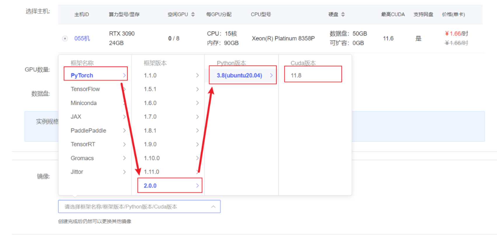
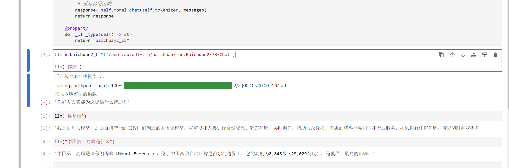
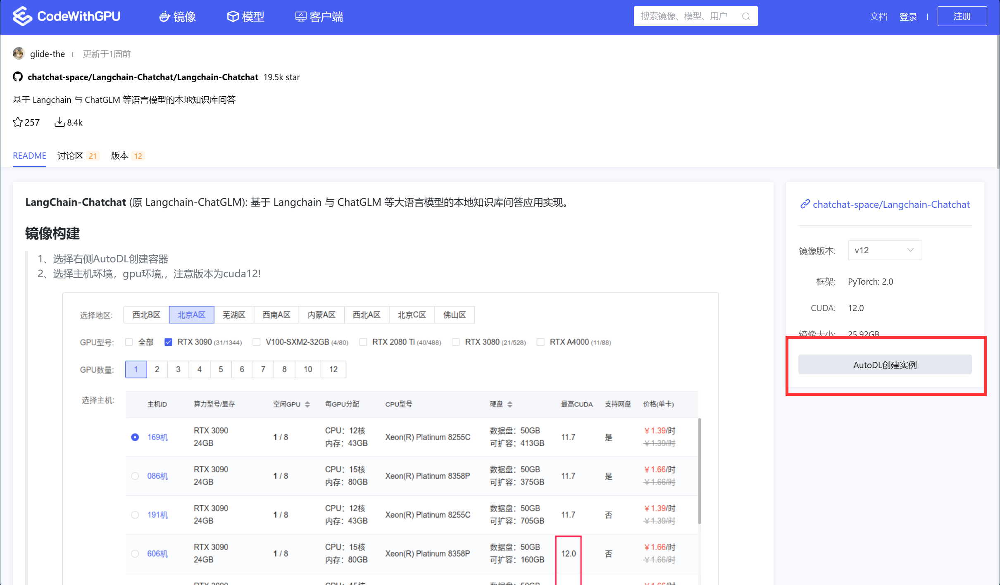
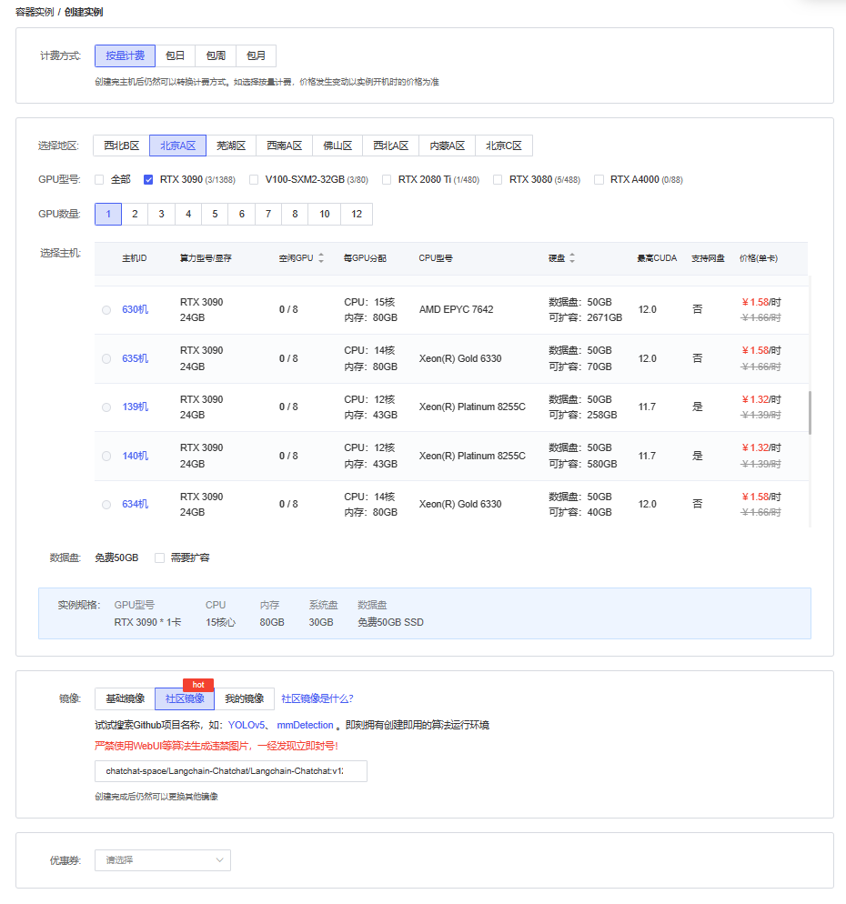
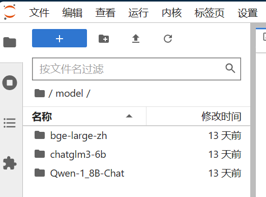
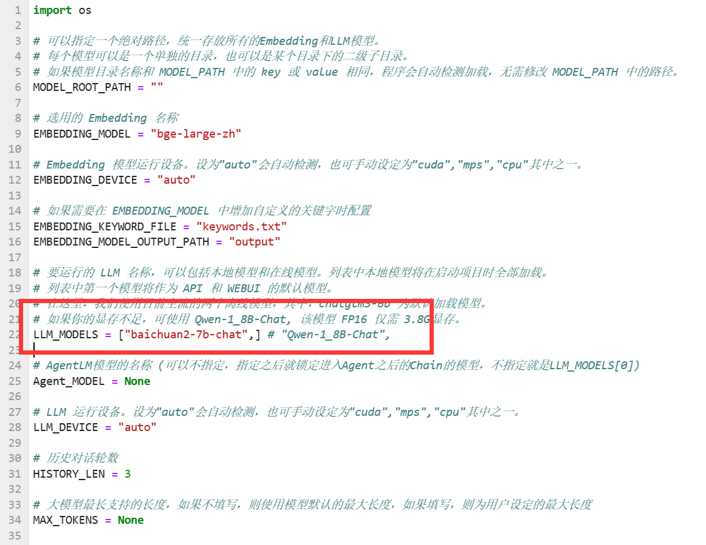
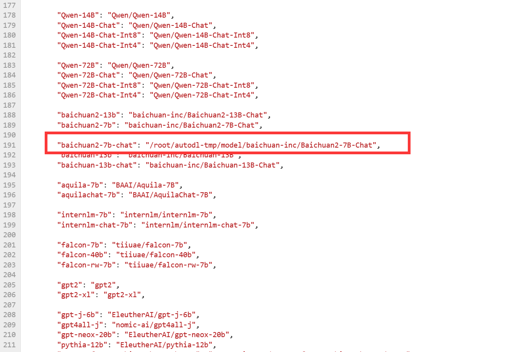
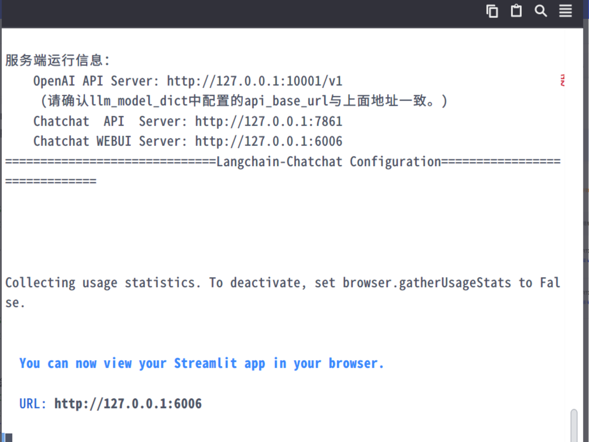
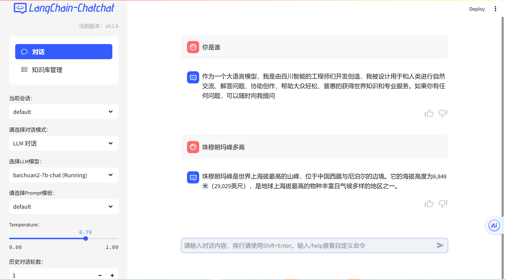
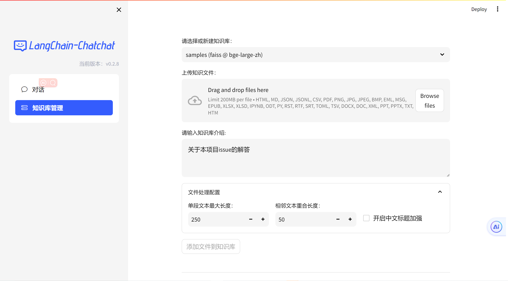

# Baichuan2-7B-chat langchain access

This article mainly talks about how to connect `Baichuan2-7B-chat` to the `LLM` module of `langchain.llms.base` in `Langchain`, and provides a deployment solution for quickly building multi-functional Langchain applications such as vector database and Agent; for the specific connection of vector database and `gradio`, please refer to the [internLM langchain](https://github.com/datawhalechina/self-llm/blob/master/InternLM/06-InternLM%E6%8E%A5%E5%85%A5LangChain%E6%90%AD%E5%BB%BA%E7%9F%A5%E8%AF%86%E5%BA%93%E5%8A%A9%E6%89%8B.md) module.

## Environment preparation

Rent a 3090 or other 24G graphics card machine on the autodl platform. As shown in the figure below, select PyTorch-->2.0.0-->3.8 (ubuntu20.04)-->11.8 (versions above 11.3 are acceptable) Next, open the JupyterLab, image and open the terminal to start environment configuration, model download and run the demonstration.



## Install dependencies

```shell
# Upgrade pip
python -m pip install --upgrade pip
# Change the installation of the pypi source acceleration library
pip config set global.index-url https://pypi.tuna.tsinghua.edu.cn/simple

pip install modelscope==1.9.5
pip install transformers==4.35.2
pip install streamlit==1.24.0
pip install sentencepiece==0.1.99
pip install accelerate==0.24.1

pip install langchain==0.0.292
```

## Model download:

Use the snapshot_download function in modelscope to download the model. The first parameter is the model name and the parameter cache_dir is the download path of the model.

existCreate a new download.py file in the /root/autodl-tmp path and enter the following content in it. Remember to save the file after pasting the code, as shown in the figure below. And run python /root/autodl-tmp/download.py to download. The model size is 15 GB, and it takes about 10 to 20 minutes to download the model.

```Python
import torch
from modelscope import snapshot_download, AutoModel, AutoTokenizer
import os
model_dir = snapshot_download('baichuan-inc/Baichuan2-7B-Chat',cache_dir='/root/autodl-tmp', revision='v1.0.4')
```

## Baichuan2-7B-chat access to LangChain

To build LLM applications conveniently, we need to customize an LLM class based on the locally deployed Baichuan2-7B-chat and connect Baichuan2-7B-chat to the LangChain framework. After completing the customized LLM class, you canTo call LangChain's interface in a completely consistent way without considering the inconsistency of the underlying model call.

It is not complicated to customize the LLM class based on the local deployment of Baichuan2-7B-chat. We only need to inherit a subclass from the LangChain.llms.base.LLM class and rewrite the constructor and the `_call` function:

```Python
from langchain.llms.base import LLM
from typing import Any, List, Optional
from langchain.callbacks.manager import CallbackManagerForLLMRun
from transformers import AutoTokenizer, AutoModelForCausalLM, GenerationConfig
import torch

class baichuan2_LLM(LLM):
# Customize LLM class based on local Baichuan
tokenizer : AutoTokenizer = None
model: AutoModelForCausalLM = None

def __init__(self, model_path :str):
# model_path: Baichuan-7B-chat model path
# Initialize the model from local
super().__init__()
print("Loading model from local...")
self.tokenizer = AutoTokenizer.from_pretrained(model_path, trust_remote_code=True)
self.model = AutoModelForCausalLM.from_pretrained(model_path, trust_remote_code=True,torch_dtype=torch.bfloat16, device_map="auto")
self.model.generation_config = GenerationConfig.from_pretrained(model_path)self.model = self.model.eval()
print("Complete loading of local model")

def _call(self, prompt : str, stop: Optional[List[str]] = None,
run_manager: Optional[CallbackManagerForLLMRun] = None,
**kwargs: Any):
# Rewrite the call function
messages = [
{"role": "user", "content": prompt}
]
# Rewrite the call function
response= self.model.chat(self.tokenizer, messages)
return response

@property
def _llm_type(self) -> str:
return "baichuan2_LLM"
```

## Call

Then you can use it like any other langchain large model function.

```Python
llm = baichuan2_LLM('/root/autodl-tmp/baichuan-inc/Baichuan2-7B-Chat')
llm('Who are you')
```



## Additional case: Use Langchain-Chatchat to quickly build a multi-functional question-and-answer platform based on Baichuan 2

Reference project link: [Langchain-Chatchat](https://github.com/chatchat-space/Langchain-Chatchat)

Reference project AutoDL mirror: [https://www.codewithgpu.com/i/chatchat-space/Langchain-Chatchat/Langchain-Chatchat](https://www.codewithgpu.com/i/chatchat-space/Langchain-Chatchat/Langchain-Chatchat)

### Specific deployment process:

Enter the AutoDL image of this project: [https://www.codewithgpu.com/i/chatchat-space/Langchain-Chatchat/Langchain-Chatchat](https://www.codewithgpu.com/i/chatchat-space/Langchain-Chatchat/Langchain-Chatchat)

### Create an instance:



## Environment preparation

Rent a 3090 or other 24G graphics card machine in the autodl platform



## Default model:



## Model download:

Use the snapshot_download function in modelscope to download the model. The first parameter is the model name, and the parameter cache_dir is the download path of the model.

Create a new download.py file in the /root/autodl-tmp path and enter the following content:Remember to save the file after pasting the code as shown below. And run python /root/autodl-tmp/download.py to download. The model size is 15 GB. It takes about 10 to 20 minutes to download the model.

```Python
import torch
from modelscope import snapshot_download, AutoModel, AutoTokenizer
import os
model_dir = snapshot_download('baichuan-inc/Baichuan2-7B-Chat',cache_dir='/root/autodl-tmp', revision='v1.0.4')
```

## Modify model configuration:

Enter the Langchain-Chatchat/configs/model_config.py file, modify the following configurations, and adjust it to Baichuan 2 model

Multiple models can be selected:



Add local model address:



## Call:

Select a new terminal

```Python
cd /root/Langchain-Chatchat/
conda activate /root/pyenv
python startup.py -a
```



You can consider the port vsc port forwarding function of vsc, forward the port, and run locally

## Usage effect:

Multi-model selection dialogue:



Knowledge base management:



There are other functions, you can try them yourself