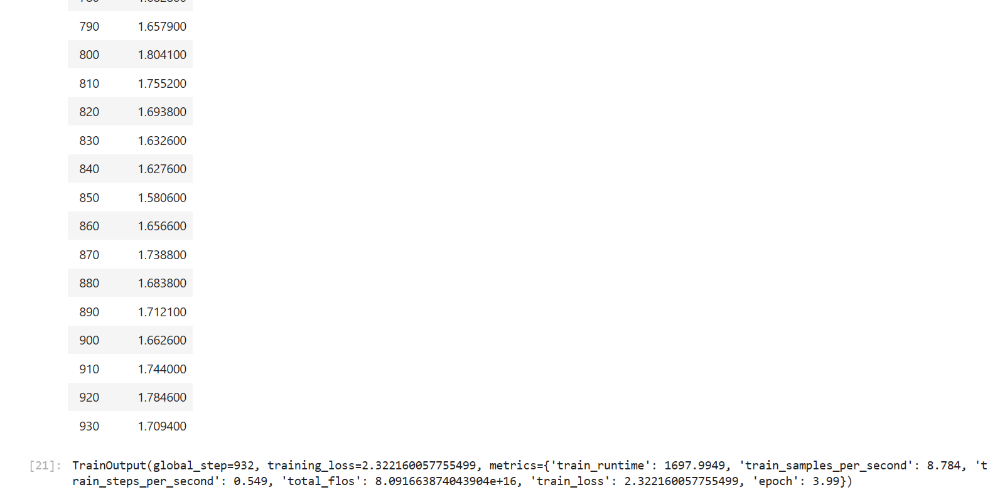
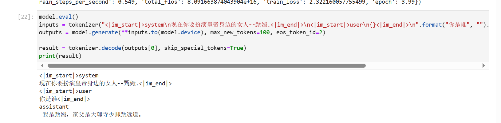
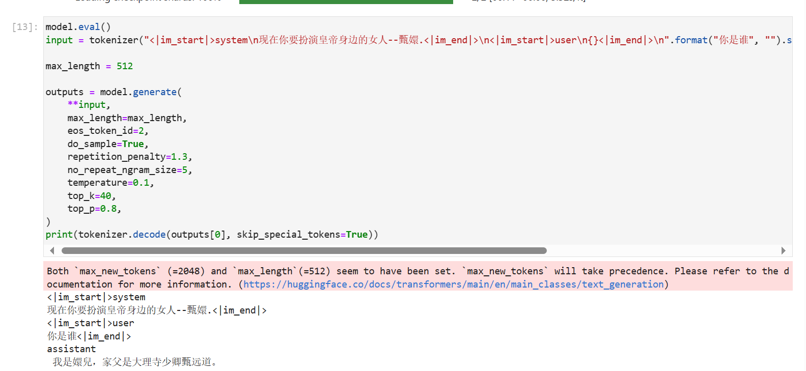

# Baichuan2-7B-chat lora fine-tuning

## Overview:

In this section, we briefly introduce how to fine-tune the Baichuan2-7B-chat model with Lora based on frameworks such as transformers and peft. Lora is an efficient fine-tuning method. For a deeper understanding of its principles, please refer to the blog: [Zhihu | Lora in a Simple Way](https://zhuanlan.zhihu.com/p/650197598).

This tutorial will provide you with a [nodebook](https://github.com/datawhalechina/self-llm/blob/master/DeepSeek/04-DeepSeek-7B-chat%20Lora%20%E5%BE%AE%E8%B0%83.ipynb) file in the same directory to help you learn better.

## Install dependencies

```shell
# Upgrade pip
python -m pip install --upgrade pip
# Replace the pypi source to accelerate the installation of the library
pip config set global.index-url https://pypi.tuna.tsinghua.edu.cn/simple

pip install modelscope==1.9.5
pip install streamlit==1.24.0
pip install sentencepiece==0.1.99
pip install accelerate==0.24.1
pip install transformers_stream_generator==0.0.4
pip install transformers==4.33.1
pip install peft==0.4.0
pip install datasets==2.10.1
pip install accelerate==0.20.3
pip install tiktoken
pip install transformers_stream_generator
```

## Model download:

Use the snapshot_download function in modelscope to download the model. The first parameter is the model name, and the parameter cache_dir is the download path of the model.

Create a new download.py file in the /root/autodl-tmp path and enter the following content in it, paste the codeRemember to save the file after the code, as shown in the figure below. And run python /root/autodl-tmp/download.py to download. The model size is 15 GB, and it takes about 10 to 20 minutes to download the model.

```Python
import torch
from modelscope import snapshot_download, AutoModel, AutoTokenizer
import os
model_dir = snapshot_download('baichuan-inc/Baichuan2-7B-Chat',cache_dir='/root/autodl-tmp', revision='v1.0.4')
```

## Instruction set construction:

LLM fine-tuning generally refers to the instruction fine-tuning process. The so-called instruction fine-tuning means that the fine-tuning data we use is in the form of:

```Python
{
"instrution":"Answer the following user question and only output the answer.",
"input":"What is 1+1?",
"output":"2"
}
```

Among them, `instruction` is the user instruction, telling the model the task it needs to complete; `input` is the user input, is the input content required to complete the user's instructions; `output` is the output that the model should give.

That is, our core training goal is to enable the model to understand and follow user instructions. Therefore, when constructing the instruction set, we should build a task instruction set specifically for our target task. For example, in this section, we use the [Chat-甄嬛](https://github.com/KMnO4-zx/huanhuan-chat) project co-opened by the author as an example. Our goal is to build a personalized LLM that can simulate the conversation style of 甄嬛, so the instructions we construct are as follows:

```Python
{
"instruction": "Now you have to play the role of the woman next to the emperor--甄嬛",
"input":"Who are you?",
"output":"My father is 敦义寺少卿贞远道."

}
```

All the instruction data sets we constructed are in the root directory.

## Data formatting:

The data trained by `Lora` needs to be formatted and encoded before being input to the model for training. Students who are familiar with the `Pytorch` model training process will know that we generally need to encode the input text as input_ids and the output text as `labels`. The results after encoding are all multi-dimensional vectors. We first define a preprocessing functionThis function is used to encode the input and output text of each sample and return an encoded dictionary:

```Python
def process_func(example):
MAX_LENGTH = 256 
input_ids, attention_mask, labels = [], [], []
instruction = tokenizer("\n".join(["<|im_start|>system", "Now you have to play the woman beside the emperor--Zhen Huan.<|im_end|>" + "\n<|im_start|>user\n" + example["instruction"] + example["input"] + "<|im_end|>\n"]).strip()+"\n\nAssistant: ",add_special_tokens=False) # add_special_tokens does not add special_tokens at the beginning
response = tokenizer(example["output"]+tokenizer.eos_token, add_special_tokens=False) input_ids = instruction["input_ids"] + response["input_ids"] attention_mask = instruction["attention_mask"] + response["attention_mask"] labels = [-100] * len(instruction["input_ids"]) + response["input_ids"] if len(input_ids) > MAX_LENGTH: # Make a truncation input_ids = input_ids[:MAX_LENGTH] attention_mask = attention_mask[:MAX_LENGTH] labels = labels[:MAX_LENGTH] return { "input_ids": input_ids, "attention_mask ": attention_mask,
"labels": labels
}
```

## Load tokenizer and half-precision model:

```Python
import torch

model = AutoModelForCausalLM.from_pretrained('baichuan-inc/Baichuan2-7B-Chat', trust_remote_code=True, torch_dtype=torch.half, device_map="auto")

model.generation_config = GenerationConfig.from_pretrained('baichuan-inc/Baichuan2-7B-Chat/')
model
```

## Define LoraConfig:

Many parameters can be set in the `LoraConfig` class, but there are not many main parameters. I will briefly talk about them. Interested students can directly read the source code.

- `task_type`: model type

- `target_modules`: the name of the model layer to be trained, mainly the layer of the `attention` part. Different models have different corresponding layer names., you can pass in an array, a string, or a regular expression.

- `r`: the rank of `lora`, see `Lora` principle for details

- `lora_alpha`: `Lora alaph`, see `Lora` principle for specific functions

```Python
from peft import LoraConfig, TaskType, get_peft_model

config = LoraConfig(
task_type=TaskType.CAUSAL_LM, 
target_modules=["W_pack", "o_proj", "gate_proj", "up_proj", "down_proj"],
inference_mode=False, # training mode
r=8, # Lora rank
lora_alpha=32, # Lora alaph, see Lora principle for specific functions
lora_dropout=0.1# Dropout ratio
)
config
```

## Custom TrainingArguments parameters:

Source of the `TrainingArguments` classThe code also introduces the specific role of each parameter. Of course, you can explore it yourself. Here are a few common ones.

- `output_dir`: output path of the model

- `per_device_train_batch_size`: As the name suggests, `batch_size`

- `gradient_accumulation_steps`: gradient accumulation. If your video memory is small, you can set `batch_size` to a smaller value to increase the gradient accumulation.

- `logging_steps`: how many steps to output a `log`

- `num_train_epochs`: As the name suggests, `epoch`

- `gradient_checkpointing`: gradient check. Once this is turned on, the model must execute `model.enable_input_require_grads()`. You can explore this principle by yourself, so I won’t go into details here.

```Python args = TrainingArguments( output_dir="./output/Baichuan2", per_device_train_batch_size=8, gradient_accumulation_steps=2,
logging_steps=10,
num_train_epochs=3,
save_steps=100,
learning_rate=5e-5,
save_on_each_node=True,
gradient_checkpointing=True
)
```

## Training with Trainer

```Python
trainer = Trainer(
model=model,
args=args,
train_dataset=tokenized_id,
data_collator=DataCollatorForSeq2Seq(tokenizer=tokenizer, padding=True),
)
```



## Model Reasoning

You can use this more classic way to reason:

```Python
model.eval()
inputs = tokenizer("<|im_start|>system\nNow you have to play the role of the emperorWoman--Zhen Huan.<|im_end|>\n<|im_start|>user\n{}<|im_end|>\n".format("Who are you", "").strip() + "\nassistant\n ", return_tensors="pt")
outputs = model.generate(**inputs.to(model.device), max_new_tokens=100, eos_token_id=2)
result = tokenizer.decode(outputs[0], skip_special_tokens=True)
print(result)
```



Or reload the model:

```Python
from transformers import AutoModelForSeq2SeqLM
from peft import PeftModel, PeftConfig

peft_model_id = "output/Baichuan3/checkpoint-600" # Here I trained the best versionIt is checkpoint-600, so this is called. You can choose according to your own situation
config = PeftConfig.from_pretrained(peft_model_id)
model = AutoModelForCausalLM.from_pretrained("baichuan-inc/Baichuan2-7B-Chat", use_fast=False, trust_remote_code=True)
model = PeftModel.from_pretrained(model, peft_model_id)

model.eval()
input = tokenizer("<|im_start|>system\nNow you have to play the role of the woman next to the emperor--Zhen Huan.<|im_end|>\n<|im_start|>user\n{}<|im_end|>\n".format("Who are you", "").strip() + "\nassistant\n ", return_tensors="pt").to(model.device)

max_length = 512

outputs = model.generate( **input, max_length=max_length, eos_token_id=2, do_sample=True, repetition_penalty=1.3, no_repeat_ngram_size=5, temperature=0.1, top_k=40, top_p=0.8, ) print(tokenizer.decode(outputs[0], skip_special_tokens=True)) ``` 