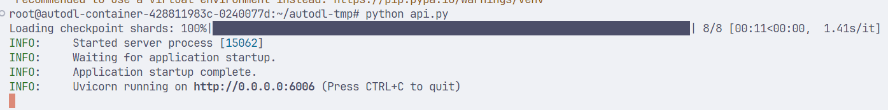
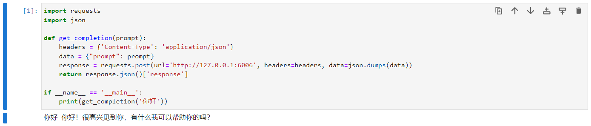

# BlueLM-7B-Chat FastApi deployment

## Model introduction

BlueLM-7B is a large-scale pre-trained language model independently developed by vivo AI Global Research Institute, with a parameter scale of 7 billion. BlueLM-7B has achieved leading results in [C-Eval](https://cevalbenchmark.com/index.html) and [CMMLU](https://github.com/haonan-li/CMMLU), and is highly competitive compared with open source models of the same size (as of November 1). This release includes two versions of the 7B model, Base and Chat.

Model download link:

| Base model | Alignment model |
| :----------------------------------------------------------: | :-----------------------------------------------------------: | | 🤗 [BlueLM-7B-Base](https://huggingface.co/vivo-ai/BlueLM-7B- Base) | 🤗 [BlueLM-7B-Chat](https://huggingface.co/vivo-ai/BlueLM-7B-Chat) | | 🤗 [BlueLM-7B-Base-32K](https://huggingface.co /vivo-ai/BlueLM-7B-Base-32K) | 🤗 [BlueLM-7B-Chat-32K](https://huggingface.co/vivo-ai/BlueLM-7B-Chat-32K) | | | 🤗 [ BlueLM-7B-Chat-4bits](https://huggingface.co/vivo-ai/BlueLM-7B-Chat-4bits) | ## Environment preparation is here [Autodl](https://www.auTodl.com/) platform, rent a 3090 or other 24G graphics card machine. As shown in the figure below, select PyTorch-->1.11.0-->3.8(ubuntu20.04)-->11.3. Cuda version 11.3 or above is OK.


Next, open JupyterLab of the server you just rented (you can also use vscode ssh to remotely connect to the server), and open the terminal to start environment configuration, model download and run demo.

pip changes the source to speed up downloading and installing dependent packages

```bash
# Upgrade pip
python -m pip install --upgrade pip
# Set the pip mirror source
pip config set global.index-url https://pypi.tuna.tsinghua.edu.cn/simple
# Install software dependencies
pip install fastapi==0.104.1
pip install uvicorn==0.24.0.post1
pip install requests==2.25.1
pip install modelscope==1.11.0
pip install transformers==4.37.0
pip install streamlit==1.24.0
pip install sentencepiece==0.1.99
pip install accelerate==0.24.1
pip install transformers_stream_generator==0.0.4
```

## Model download

Use `Modelscope API` to download `BlueLM-7B-Chat` model, the model path is `/root/autodl-tmp`. Create the model_download.py file under /root/autodl-tmp with the following content: 

```python
from modelscope import snapshot_download
model_dir = snapshot_download("vivo-ai/BlueLM-7B-Chat", cache_dir='/root/autodl-tmp', revision="master")
```

##Code preparation

Create a new api.py file in the /root/autodl-tmp path with the following content: 

```python
from fastapi import FastAPI, Request
from transformers import AutoTokenizer, AutoModelForCausalLM, GenerationConfig
import uvicorn
import json
import datetime
import torch

# Set device parameters
DEVICE = "cuda" # Use CUDA
DEVICE_ID = "0" # CUDA device ID, empty if not set
CUDA_DEVICE = f"{DEVICE}:{DEVICE_ID}" if DEVICE_ID else DEVICE # Combine CUDA device information

# Clear GPU memory function
def torch_gc():
if torch.cuda.is_available(): # Check if CUDA is available
with torch.cuda.device(CUDA_DEVICE): # Specify CUDA device
torch.cuda.empty_cache() # Clear CUDA cache
torch.cuda.ipc_collect() # Collect CUDA memory fragments

# Create FastAPI application
app = FastAPI()

# Endpoint for handling POST requests
@app.post("/")
async def create_item(request: Request):
global model, tokenizer # Declare global variables to use models and tokenizers inside functions
json_post_raw = await request.json() # Get JSON data for POST request
json_post = json.dumps(json_post_raw) # Convert JSON data to string
json_post_list = json.loads(json_post) # Convert string to Python object
prompt = json_post_list.get('prompt') # Get requestprompt in
max_length = json_post_list.get('max_length') # Get the maximum length in the request

# Build messages
messages = f"[|Human|]:{prompt}[|AI|]:"
# Build input
inputs = tokenizer(messages, return_tensors="pt")
inputs = inputs.to("cuda:0")
# Get output through the model
outputs = model.generate(**inputs, max_new_tokens=max_length)
result = tokenizer.decode(outputs.cpu()[0], skip_special_tokens=True)

now = datetime.datetime.now() # Get the current time
time = now.strftime("%Y-%m-%d %H:%M:%S") # Format time as charactersstring
# Build response JSON
answer = {
"response": result,
"status": 200,
"time": time
}
# Build log information
log = "[" + time + "] " + '", prompt:"' + prompt + '", response:"' + repr(result) + '"'
print(log) # Print log
torch_gc() # Perform GPU memory cleanup
return answer # Return response

# Main function entry
if __name__ == '__main__':
mode_name_or_path="vivo-ai/BlueLM-7B-Chat"
# Load pre-trained tokenizer and model
tokenizer = AutoTokenizer.from_pretrained(mode_name_or_path, trust_remote_code=True)
model = AutoModelForCausalLM.from_pretrained(mode_name_or_path, trust_remote_code=True,torch_dtype=torch.bfloat16, device_map="auto")
model.generation_config = GenerationConfig.from_pretrained(mode_name_or_path)
model.generation_config.pad_token_id = model.generation_config.eos_token_id
model.eval() # Set the model to evaluation mode
# Start FastAPI application
# Use port 6006 to map the autodl port to the local, so that the api can be used locally
uvicorn.run(app, host='127.0.0.1', port=6006, workers=1) # Start the application on the specified port and host
```

## Api deployment

Enter the following command in the bash terminal to run the api service: 

```bash
cd /root/autodl-tmp
python api.py
```

The following output appears in the terminal, indicating that the service is running



The default service port is 6006. You can use curl to call it through the POST method. Create a new terminal and enter the following content in it: 

```bash
curl -X POST "http://127.0.0.1:6006" \
-H 'Content-Type: application/json' \
-d '{"prompt": "你好"}'
```

You can also use the requests library in python to call it, as shown below:

```python
import requests
import json

def get_completion(prompt):
headers = {'Content-Type': 'application/json'} data = {"prompt": prompt} response = requests.post(url='http://127.0.0.1:6006', headers=headers, data=json.dumps(data))
return response.json()['response']

if __name__ == '__main__':
print(get_completion('Hello'))
```

The return value after running is as follows:

```json
{"response":"Hello Hello! Nice to meet you, is there anything I can help you with?","status":200,"time":"2024-03-20 12:09:29"}
```

