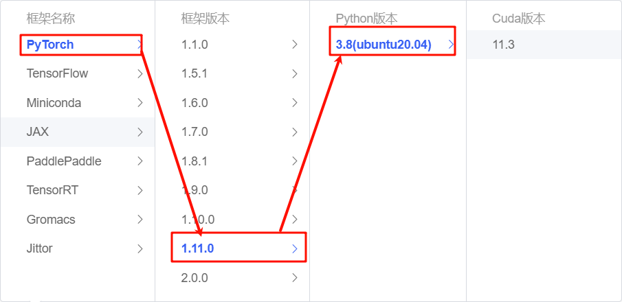

# BlueLM-7B-Chat langchain access

## Model introduction

BlueLM-7B is a large-scale pre-trained language model independently developed by vivo AI Global Research Institute, with a parameter scale of 7 billion. BlueLM-7B has achieved leading results in [C-Eval](https://cevalbenchmark.com/index.html) and [CMMLU](https://github.com/haonan-li/CMMLU), and is highly competitive compared with open source models of the same size (as of November 1). This release includes two versions of the 7B model, Base and Chat.

Model download link:

| Base model | Alignment model |
| :----------------------------------------------------------: | :------------------------------------------------------------: | | 🤗 [BlueLM-7B-Base](https://huggingface.co/vivo-ai/BlueLM- 7B-Base) | 🤗 [BlueLM-7B-Chat](https://huggingface.co/vivo-ai/BlueLM-7B-Chat) | | 🤗 [BlueLM-7B-Base-32K](https://huggingface .co/vivo-ai/BlueLM-7B-Base-32K) | 🤗 [BlueLM-7B-Chat-32K](https://huggingface.co/vivo-ai/BlueLM-7B-Chat-32K) | | 🤗 [BlueLM-7B-Chat-4bits](https://huggingface.co/vivo-ai/BlueLM-7B-Chat-4bits) |## Environment preparation

Rent a 3090 or other 24G graphics card machine on the autodl platform. As shown in the figure below, select PyTorch-->1.11.0-->3.8(ubuntu20.04)-->11.3. Cuda version 11.3 or above is OK.



Next, open JupyterLab on the server you just rented (you can also use vscode ssh to remotely connect to the server), and open the terminal to start environment configuration, model download and run demo.

pip changes the source to speed up downloading and installing dependent packages

```bash
# Upgrade pip
python -m pip install --upgrade pip
# Set the pip mirror source
pip config set global.index-url https://pypi.tuna.tsinghua.edu.cn/simple
# Install software dependencies
pip install langchain==0.1.12
pip install modelscope==1.11.0
pip install transformers==4.37.0
pip installl sentencepiece==0.1.99
pip install accelerate==0.24.1
pip install transformers_stream_generator==0.0.4
```

## Model download

Use `Modelscope API` to download the `BlueLM-7B-Chat` model. The model path is `/root/autodl-tmp`. Create the model_download.py file under /root/autodl-tmp with the following content: 

```python
from modelscope import snapshot_download
model_dir = snapshot_download("vivo-ai/BlueLM-7B-Chat", cache_dir='/root/autodl-tmp', revision="master")
```

## Code preparation

To build LLM applications conveniently, we need to customize an LLM class based on the locally deployed BlueLM and connect BlueLM to the LangChain framework. After completing the customized LLM class, LLM can be called in exactly the same way.angChain interface, without considering the inconsistency of the underlying model call.

Customizing the LLM class based on the locally deployed BlueLM is not complicated. We only need to inherit a subclass from the `LangChain.llms.base.LLM` class and rewrite the constructor and the `_call` function. Create an LLM.py file with the following content:

```bash
from langchain.llms.base import LLM
from typing import Any, List, Optional
from langchain.callbacks.manager import CallbackManagerForLLMRun
from transformers import AutoTokenizer, AutoModelForCausalLM, GenerationConfig, LlamaTokenizerFast
import torch

class BlueLM(LLM):
# Customize the LLM class based on the local BlueLM
tokenizer: AutoTokenizer = None
model: AutoModelForCausalLM = None

def __init__(self, mode_name_or_path :str):

super().__init__()
print("Loading model from local...")
self.tokenizer = AutoTokenizer.from_pretrained(mode_name_or_path, trust_remote_code=True)
self.model = AutoModelForCausalLM.from_pretrained(mode_name_or_path, torch_dtype=torch.float16, trust_remote_code=True).cuda()
self.model = self.model.eval()
print("Complete loading of local model")

def _call(self, prompt : str, stop: Optional[List[str]] = None,
run_manager: Optional[CallbackManagerForLLMRun] = None,
**kwargs: Any):

# Rewrite the call function
messages = f"[|Human|]:{prompt}[|AI|]:"
# Build input
inputs_tensor = self.tokenizer(messages, return_tensors="pt")
inputs_tensor = inputs_tensor.to("cuda:0")
# Get output through the model
outputs = self.model.generate(**inputs_tensor, max_new_tokens=100)
response = self.tokenizer.decode(outputs.cpu()[0], skip_special_tokens=True)return response
@property
def _llm_type(self) -> str:
return "BlueLM"

```

## Call

Then you can use it like any other langchain large model function.

```python
from LLM import BlueLM
llm = BlueLM('/root/autodl-tmp/vivo-ai/BlueLM-7B-Chat')

llm('Hello')
```

As shown below:

