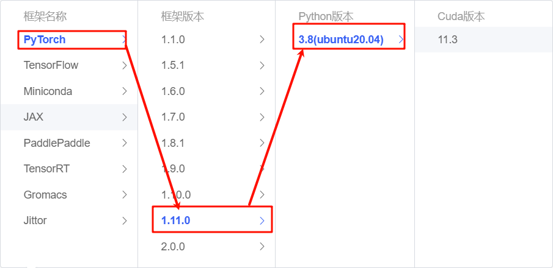
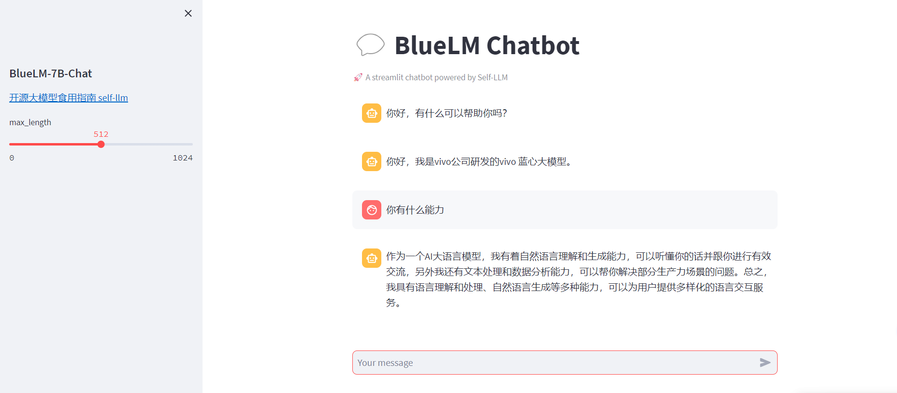

# BlueLM-7B-Chat WebDemo deployment

## Model introduction

BlueLM-7B is a large-scale pre-trained language model independently developed by vivo AI Global Research Institute, with a parameter scale of 7 billion. BlueLM-7B has achieved leading results in [C-Eval](https://cevalbenchmark.com/index.html) and [CMMLU](https://github.com/haonan-li/CMMLU), and is highly competitive compared with open source models of the same size (as of November 1). This release includes two versions of the 7B model, Base and Chat.

Model download link:

| Base model | Alignment model |
| :----------------------------------------------------------: | :-----------------------------------------------------------: | | 🤗 [BlueLM-7B-Base](https://huggingface.co/vivo-ai/BlueLM-7B- Base) | 🤗 [BlueLM-7B-Chat](https://huggingface.co/vivo-ai/BlueLM-7B-Chat) | | 🤗 [BlueLM-7B-Base-32K](https://huggingface.co /vivo-ai/BlueLM-7B-Base-32K) | 🤗 [BlueLM-7B-Chat-32K](https://huggingface.co/vivo-ai/BlueLM-7B-Chat-32K) | | | 🤗 [ BlueLM-7B-Chat-4bits](https://huggingface.co/vivo-ai/BlueLM-7B-Chat-4bits) | ## Environment preparation

Rent a 3090 or other 24G graphics card machine on the autodl platform. As shown in the figure below, select PyTorch-->1.11.0-->3.8(ubuntu20.04)-->11.3. Cuda version 11.3 or above is OK.



Next, open JupyterLab on the server you just rented (you can also use vscode ssh to remotely connect to the server), and open the terminal to start environment configuration, model download and run demo.

pip changes the source to speed up downloading and installing dependent packages

```bash
# Upgrade pip
python -m pip install --upgrade pip
# Set the pip mirror source
pip config set global.index-url https://pypi.tuna.tsinghua.edu.cn/simple
# Install software dependencies
pip install modelscope==1.11.0
pip install transformers==4.37.0
pip install streamlit==1.24.0
pip installsentencepiece==0.1.99
pip install accelerate==0.24.1
pip install transformers_stream_generator==0.0.4
```

## Model download

Use `Modelscope API` to download the `BlueLM-7B-Chat` model. The model path is `/root/autodl-tmp`. Create a model_download.py file under /root/autodl-tmp with the following content: 

```python
from modelscope import snapshot_download
model_dir = snapshot_download("vivo-ai/BlueLM-7B-Chat", cache_dir='/root/autodl-tmp', revision="master")
```

## Code preparation

Create a `chatBot.py` file under the `/root/autodl-tmp` path and enter the following content in it:

```python
# Import the required libraries
from transformers import AutoTokenizer, AutoModelForCausalLM, GenerationConfig, TextStreamer
import torch
import streamlit as st

# Create a title and a link in the sidebar
with st.sidebar:
st.markdown("## BlueLM-7B-Chat")
"[Open Source Large Model Eating Guide self-llm](https://github.com/datawhalechina/self-llm.git)"
# Create a slider to select the maximum length, ranging from 0 to 1024, with a default value of 512
max_length = st.slider("max_length", 0, 1024, 512, step=1)

# Create a title and a subtitle
st.title("💬 BlueLM Chatbot")
st.caption("🚀 A streamlit chatbot powered by Self-LLM")

# Define the model path
mode_name_or_path = '/root/autodl-tvivo-ai/BlueLM-7B-Chat'

# Define a function to get the model and tokenizer
@st.cache_resource
def get_model():
# Get the tokenizer from the pre-trained model
tokenizer = AutoTokenizer.from_pretrained(mode_name_or_path, trust_remote_code=True)
# Get the model from the pre-trained model and set the model parameters
model = AutoModelForCausalLM.from_pretrained(mode_name_or_path, trust_remote_code=True,torch_dtype=torch.bfloat16, device_map="auto")
# Get the generation configuration from the pre-trained model
model.generation_config = GenerationConfig.from_pretrained(mode_name_or_path)
# Set the pad_token_id of the generation configuration to the generation configurationeos_token_id
model.generation_config.pad_token_id = model.generation_config.eos_token_id
# Set the model to evaluation mode
model.eval() 
return tokenizer, model

# Load BlueLM model and tokenizer
tokenizer, model = get_model()

def build_prompt(messages, prompt):
"""
Build session prompt information.

Parameters:
messages - a list of tuples containing session history, each tuple is (user query, AI response).
prompt - the text entered by the current user.

Return value:
res - a constructed string containing session history and current user prompt.
"""
res = ""
# Traverse historical messages and build session history string
for query, response in messages:
res += f"[|Human|]:{query}[|AI|]:{response}</s>"
# Add prompt for current user
res += f"[|Human|]:{prompt}[|AI|]:"
return res

class BlueLMStreamer(TextStreamer):
"""
BlueLM streaming class for processing the input and output streams of the model.

Parameters:
tokenizer - tokenizer instance for tokenization and anti-tokenization.
"""
def __init__(self, tokenizer: "AutoTokenizer"):
self.tokenizer = tokenizer
self.tokenIds = []
self.prompt = ""
self.response = ""
self.first = True

def put(self, value):
"""
Add token id to the stream.:
value - the token id to append.
"""
if self.first:
self.first = False
return
self.tokenIds.append(value.item())
# Decode token ids to text
text = tokenizer.decode(self.tokenIds, skip_special_tokens=True)

def end(self):
"""
End stream processing, respond with the text in the current stream, and reset the stream state.
"""
self.first = True
# Decode token ids to text
text = tokenizer.decode(self.tokenIds, skip_special_tokens=True)
self.response = textself.tokenIds = []

# Initialize the session state. If messages does not exist, initialize it to empty and add a welcome message
if "messages" not in st.session_state:
st.session_state.messages = []
st.session_state.messages.append(("", "Hello, how can I help you?"))

# Traverse and display historical messages
for msg in st.session_state.messages:
st.chat_message("assistant").write(msg[1])

# Process user input
if prompt_text := st.chat_input():
prompt_text = prompt_text.strip()
st.chat_message("user").write(prompt_text)
messages = st.session_state.messages
# Use BlueLMStreamer to process streaming model inputInput
streamer = BlueLMStreamer(tokenizer=tokenizer)
# Build the prompt information for the current session
prompt = build_prompt(messages=messages, prompt=prompt_text)
# Encode the prompt information as model input
inputs_tensor = tokenizer(prompt, return_tensors="pt")
inputs_tensor = inputs_tensor.to("cuda:0")
input_ids = inputs_tensor["input_ids"]
# Generate responses through the model
outputs = model.generate(input_ids=input_ids, max_new_tokens=max_length, streamer=streamer)
# Display the model's response to the user
st.chat_message("assistant").write(streamer.response)
# Update the meetingTalk history
st.session_state.messages.append((prompt_text, streamer.response))

```

## Run demo

Run the following command in the terminal to start the streamlit service, and map the port to the local according to the instructions of `autodl`, then open the link http://localhost:6006/ in the browser to see the chat interface.

```bash
streamlit run /root/autodl-tmp/chatBot.py --server.address 127.0.0.1 --server.port 6006
```

As shown below:

