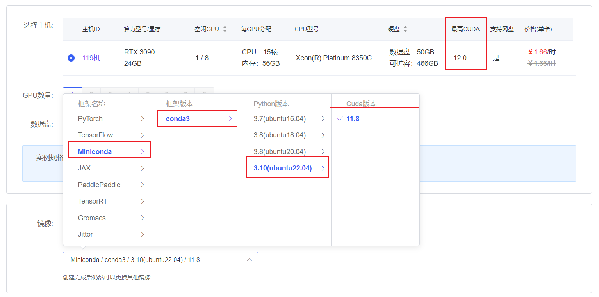

# ChatGLM3-6B Code Interpreter

> 请注意，本项目需要 Python 3.10 或更高版本。

## 环境准备

由于项目需要`python 3.10`或更高版本，所以我们在在[autodl](https://www.autodl.com/)平台中租一个3090等24G显存的显卡机器，如下图所示镜像选择`Miniconda`-->`conda3`-->`3.10(ubuntu20.04)`-->`11.8`。



接下来打开刚刚租用服务器的`JupyterLab`，并且打开其中的终端开始环境配置、模型下载和运行`demo`。

pip换源和安装依赖包

```bash
# 更换 pypi 源加速库的安装
# 升级pip
python -m pip install --upgrade pip

pip config set global.index-url https://pypi.tuna.tsinghua.edu.cn/simple

pip install modelscope==1.9.5
pip install transformers==4.35.2

pip install torch==2.0.1+cu117 torchvision==0.15.2+cu117 torchaudio==2.0.2 --index-url https://download.pytorch.org/whl/cu117
```

## 模型下载

使用 `modelscope` 中的`snapshot_download`函数下载模型，第一个参数为模型名称，参数`cache_dir`为模型的下载路径。

在 `/root/autodl-tmp` 路径下新建 `download.py` 文件并在其中输入以下内容，粘贴代码后记得保存文件，如下图所示。并运行 `python /root/autodl-tmp/download.py`执行下载，模型大小为 14 GB，下载模型大概需要 10~20 分钟

```python
import torch
from modelscope import snapshot_download, AutoModel, AutoTokenizer
import os
model_dir = snapshot_download('ZhipuAI/chatglm3-6b', cache_dir='/root/autodl-tmp', revision='master')
```

## 代码准备

首先`clone`代码，打开autodl平台自带的学术镜像加速。学术镜像加速详细使用请看：https://www.autodl.com/docs/network_turbo/

```shell
source /etc/network_turbo
```

然后切换路径, clone代码.

```shell
cd /root/autodl-tmp
git clone https://github.com/THUDM/ChatGLM3.git
```

切换commit版本，与教程commit版本保持一致，可以让大家更好的复现。

```shell
cd ChatGLM3
git checkout f823b4a3be9666b9b2a9daa43b29659e876a040d
```

最后取消镜像加速，因为该加速可能对正常网络造成一定影响，避免对后续下载其他模型造成困扰。

```shell
unset http_proxy && unset https_proxy
```

然后切换路径到`composite_demo`目录，并安装相关依赖
```bash
cd /root/autodl-tmp/ChatGLM3/composite_demo
pip install -r requirements.txt
```

## demo 运行

在终端运行以下代码，导入模型路径和Jupyter内核：

```shell
export MODEL_PATH=/root/autodl-tmp/ZhipuAI/chatglm3-6b
export IPYKERNEL=python3
```

然后运行以下代码，运行demo：

```shell
streamlit run /root/autodl-tmp/ChatGLM3/composite_demo/main.py --server.address 127.0.0.1 --server.port 6006
```

如下图所示，可以愉快的玩耍代码解释器了~

