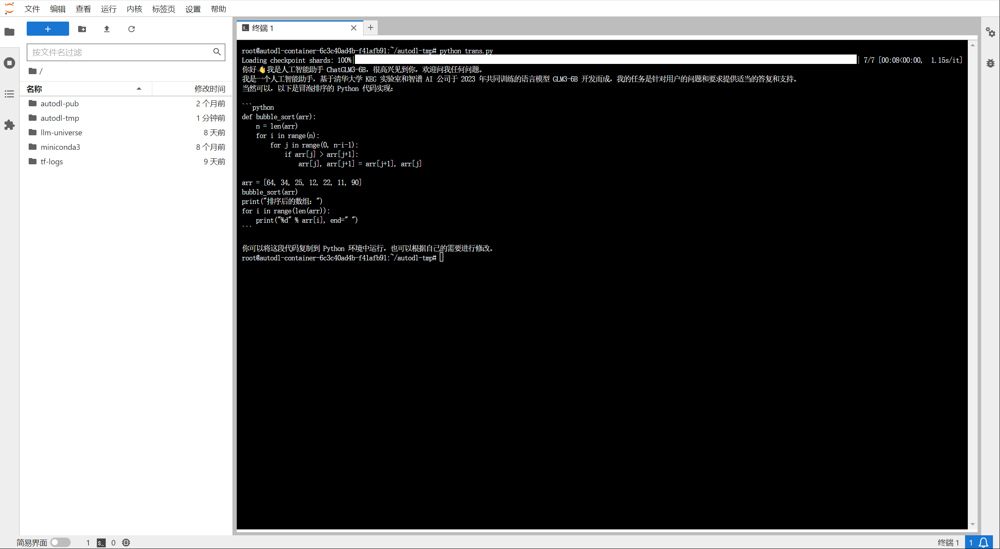

# ChatGLM3-6B Transformers deployment call

## Environment preparation

Rent a 3090 or other 24G video memory graphics card machine on the [autodl](https://www.autodl.com/) platform. As shown in the figure below, select `PyTorch`-->`2.0.0`-->`3.8(ubuntu20.04)`-->`11.8`


Next, open the `JupyterLab` of the server you just rented, and open the terminal in it to start environment configuration, model download and run `demo`.

pip change source and install dependent packages

```shell
# Upgrade pip
python -m pip install --upgrade pip
# Change pypi source to accelerate library installation
pip config set global.index-url https://pypi.tuna.tsinghua.edu.cn/simple

pip install modelscope
pip install transformers
pip install sentencepiece
```

## Model download

Use `modelscope` in the `snapshot_download` function to download the model. The first parameter is the model name, and the parameter `cache_dir` is the model download path.

Create a new `download.py` file in the `/root/autodl-tmp` path and enter the following content in it. Remember to save the file after pasting the code, as shown in the figure below. And run `python /root/autodl-tmp/download.py` to download. The model size is 14 GB. It takes about 10~20 minutes to download the model.

```python
import torch
from modelscope import snapshot_download, AutoModel, AutoTokenizer
import os
model_dir = snapshot_download('ZhipuAI/chatglm3-6b', cache_dir='/root/autodl-tmp', revision='master')
```

## Code preparation

Create a new trans.py file in the /root/autodl-tmp path and enter the following content in it
```python
# Use Hugging Face's 'transformer' library's AutoTokenizer and AutoModelForCausalLM to load the tokenizer and conversation model
from transformers import AutoTokenizer, AutoModelForCausalLM
import torch
# Use the local path where the model is downloaded to load
model_dir = '/root/autodl-tmp/ZhipuAI/chatglm3-6b'
# Loading the tokenizer, local loading, trust_remote_code=True setting allows model weights and related code to be downloaded from the network
tokenizer = AutoTokenizer.from_pretrained(model_dir, trust_remote_code=True)
# Model loading, local loading, using the AutoModelForCausalLM class
model = AutoModelForCausalLM.from_pretrained(model_dir, trust_remote_code=True)
# Move the model to the GPU for acceleration (if there is a GPU)
device = torch.device("cuda" if torch.cuda.is_available() else "cpu")
model.to(device)
# Use the model's evaluation mode to generate dialogues
model.eval()
# First round of dialogue
response, history = model.chat(tokenizer, "Hello", history=[])
print(response)
# Second round of dialogue
response, history = model.chat(tokenizer, "Please introduce yourself", history=history)
print(response)
# Third round of dialogue
response, history = model.chat(tokenizer, "Please help me write a bubble sort code in Python", history=history)
print(response)
```
### Deployment

Enter the following command in the terminal to run trans.py, which implements the Transformers deployment call of ChatGLM3-6B

```shell
cd /root/autodl-tmp
python trans.py
```
Observe the loading checkpoint in the command line, which indicates that the model is loading. Wait for the model to load and a dialogue will be generated, as shown in the figure below
