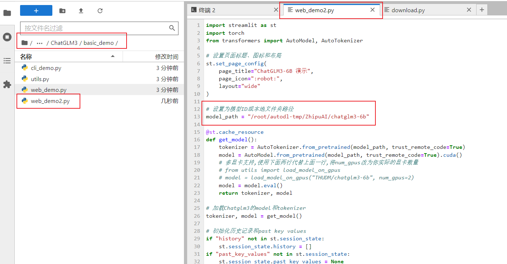
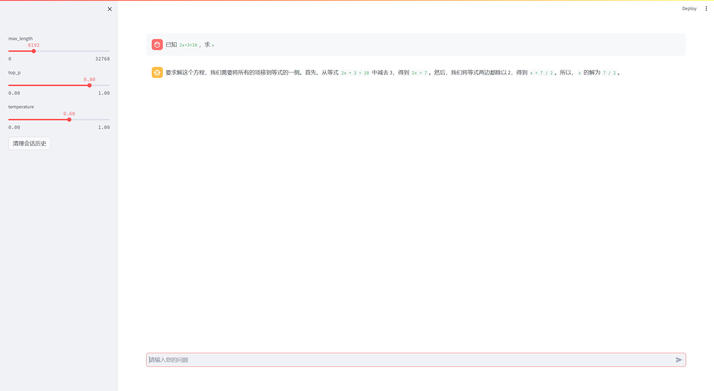

# ChatGLM3-6B-chat

## Environment preparation

Rent a 3090 or other 24G video memory graphics card machine on the [autodl](https://www.autodl.com/) platform. As shown in the figure below, select `PyTorch`-->`2.0.0`-->`3.8(ubuntu20.04)`-->`11.8`


Next, open the `JupyterLab` of the server you just rented, and open the terminal in it to start environment configuration, model download and run `demo`.

pip change source and install dependent packages

```shell
# Upgrade pip
python -m pip install --upgrade pip
# Change pypi source to accelerate library installation
pip config set global.index-url https://pypi.tuna.tsinghua.edu.cn/simple

pip install modelscope
pip install transformers
```

## Model download

Use the `snapshot_download` function in `modelscope` to download the model,The first parameter is the model name, and the parameter `cache_dir` is the download path of the model.

Create a `download.py` file in the `/root/autodl-tmp` path and enter the following content in it. Remember to save the file after pasting the code, as shown in the figure below. And run `python /root/autodl-tmp/download.py` to download. The model size is 14 GB, and it takes about 10~20 minutes to download the model.

```python
import torch
from modelscope import snapshot_download, AutoModel, AutoTokenizer
import os
model_dir = snapshot_download('ZhipuAI/chatglm3-6b', cache_dir='/root/autodl-tmp', revision='master')
```

## Code preparation

First, `clone` the code and open the academic image acceleration that comes with the autodl platform. For detailed usage of academic image acceleration, please see: https://www.autodl.com/docs/network_turbo/

```shell
source /etc/network_turbo
```

Then switch the path and clone the code.

```shell
cd /root/autodl-tmp
git clone https://github.com/THUDM/ChatGLM3.git
```

Switch the commit version to keep it consistent with the tutorial commit version, so that you can reproduce it better.

```shell
cd ChatGLM3
git checkout f823b4a3be9666b9b2a9daa43b29659e876a040d
```

Finally, cancel the image acceleration, because the acceleration may have a certain impact on the normal network, avoiding trouble in the subsequent download of other models.

```shell
unset http_proxy && unset https_proxy
```

Modify the code path and replace the model in line 13 of `/root/autodl-tmp/ChatGLM3/basic_demo/web_demo2.py` with the local `/root/autodl-tmp/ZhipuAI/chatglm3-6b`.



##Run demo

Modify the `requirements.txt` file and delete `torch` from it. `torch` is already in the environment and does not need to be installed. Then execute the following command:

```shell
cd /root/autodl-tmp/ChatGLM3
pip install -r requirements.txt
```

Run the following command to start the inference service

```shell
cd /root/autodl-tmp/ChatGLM3
streamlit run ./basic_demo/web_demo2.py --server.address 127.0.0.1 --server.port 6006
```

Map the `autodl` port to the local [http://localhost:6006](http://localhost:6006/) to see the demo interface.

Note: The model will be loaded only after the `http://localhost:6006` page is opened in the browser, as shown in the following figure:

