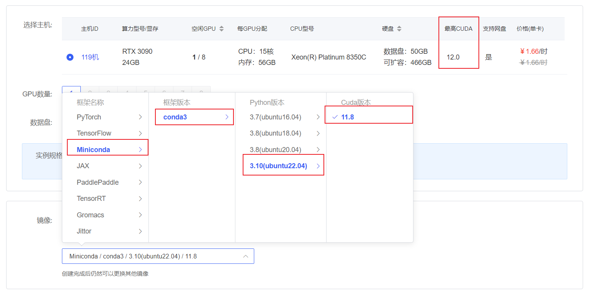
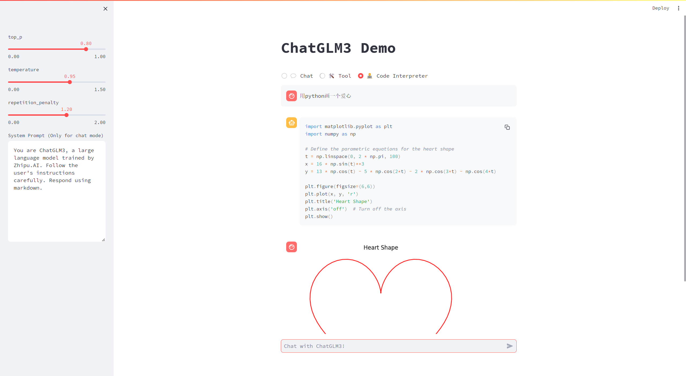

# ChatGLM3-6B Code Interpreter

> Please note that this project requires Python 3.10 or higher.

## Environment preparation

Since the project requires `python 3.10` or higher, we rent a 3090 or other 24G video memory graphics card machine in the [autodl](https://www.autodl.com/) platform. As shown in the figure below, select `Miniconda`-->`conda3`-->`3.10(ubuntu20.04)`-->`11.8`.



Next, open the `JupyterLab` of the server just rented, and open the terminal in it to start environment configuration, model download and run `demo`.

pip change source and install dependent packages

```bash
# Change pypi source to accelerate library installation
# Upgrade pip
python -m pip install --upgrade pip

pip config set global.index-url https://pypi.tuna.tsinghua.edu.cn/simple

pip install modelscope==1.9.5
pip install transformers==4.35.2

pip install torch==2.0.1+cu117 torchvision==0.15.2+cu117 torchaudio==2.0.2 --index-url https://download.pytorch.org/whl/cu117
```

## Model download

Use the `snapshot_download` function in `modelscope` to download the model. The first parameter is the model name, and the parameter `cache_dir` is the download path of the model.

Create a new `download.py` file in the `/root/autodl-tmp` path and enter the following content in it. Remember to save the file after pasting the code, as shown in the figure below. And run `python /root/autodl-tmp/download.py` to download. The model size is 14 GB. It takes about 10 to 20 minutes to download the model.

```python
import torch
from modelscope import snapshot_download, AutoModel, AutoTokenizer
importt os
model_dir = snapshot_download('ZhipuAI/chatglm3-6b', cache_dir='/root/autodl-tmp', revision='master')
```

## Code preparation

First, `clone` the code and open the academic image acceleration that comes with the autodl platform. For detailed usage of academic image acceleration, please see: https://www.autodl.com/docs/network_turbo/

```shell
source /etc/network_turbo
```

Then switch the path and clone the code.

```shell
cd /root/autodl-tmp
git clone https://github.com/THUDM/ChatGLM3.git
```

Switch the commit version to keep it consistent with the tutorial commit version so that everyone can reproduce it better.

```shell
cd ChatGLM3
git checkout f823b4a3be9666b9b2a9daa43b29659e876a040d
```

Finally, cancel the mirror acceleration, because the acceleration may have a certain impact on the normal network, to avoidThis will cause trouble for downloading other models later.

```shell
unset http_proxy && unset https_proxy
```

Then switch the path to the `composite_demo` directory and install related dependencies
```bash
cd /root/autodl-tmp/ChatGLM3/composite_demo
pip install -r requirements.txt
```

## Demo Run

Run the following code in the terminal to import the model path and Jupyter kernel:

```shell
export MODEL_PATH=/root/autodl-tmp/ZhipuAI/chatglm3-6b
export IPYKERNEL=python3
```

Then run the following code to run the demo:

```shell
streamlit run /root/autodl-tmp/ChatGLM3/composite_demo/main.py --server.address 127.0.0.1 --server.port 6006
```

As shown in the figure below, you can have fun playing with the code interpreter~

