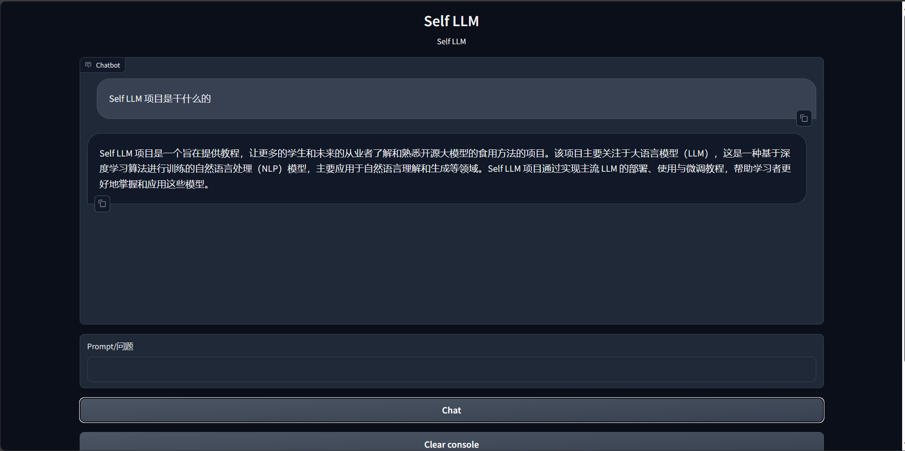

# Build a knowledge base assistant based on ChatGLM3 and LangChain

## Environment configuration

On the basis of the completed deployment of ChatGLM3, you also need to install the following dependent packages:

```bash
pip install langchain==0.0.292
pip install gradio==4.4.0
pip install chromadb==0.4.15
pip install sentence-transformers==2.2.2
pip install unstructured==0.10.30
pip install markdown==3.3.7
```

At the same time, we need to use the open source word vector model [Sentence Transformer](https://huggingface.co/sentence-transformers/paraphrase-multilingual-MiniLM-L12-v2) (HuggingFace link name: sentence-transformers/paraphrase-multilingual-MiniLM-L12-v2), the model parameters can be downloaded similar to ChatGLM3 model parameters are downloaded to the local /root/autodl-tmp/sentence-transformer. At the same time, in this section, the model parameter file of ChatGLM3-6B is stored in the local autodl-tmp/ZhipuAI/chatglm3-6b.

## Knowledge base construction

We choose a series of LLM open source tutorials from Datawhale as the source of the corpus, including:

- [Self LLM](https://github.com/datawhalechina/self-llm): A Chinese baby-exclusive large model tutorial based on the AutoDL platform, centered on open source large models and aimed at domestic beginners.
- [LLM Universe](https://github.com/datawhalechina/llm-universe): A large model application development tutorial for novice developers, designed to combine the personal knowledge base assistant project and complete the key introduction of large model development through a course.
- [LLM tutorial for Developers](https://github.com/datawhalechina/prompt-engineering-for-developers): a tutorial for developers who are interested inA developer's LLM introductory tutorial based on the content of Andrew Ng's large model series of courses.
- [So Large LLM](https://github.com/datawhalechina/so-large-lm): A tutorial on large-scale pre-trained language models, providing open source knowledge from data preparation, model building, training strategies to model evaluation and improvement, as well as the model's security, privacy, environment and legal ethics.
- [Hugging LLM](https://github.com/datawhalechina/hugging-llm): Introduces the principles, uses and applications of ChatGPT, lowers the threshold for use, and allows more interested non-NLP or algorithm professionals to use LLM to create value without barriers.

First, we need to clone the above remote open source repository to the local, you can use the following command:

```bash
# Enter the database disk
cd /root/autodl-tmp
# Open academic resource acceleration
source /etc/network_turbo
# Clone the above open source repository
git clone https://github.com/datawhalechina/self-llm.git
git clone https://github.com/datawhalechina/llm-universe.git
git clone https://github.com/datawhalechina/prompt-engineering-for-developers.git
git clone https://github.com/datawhalechina/so-large-lm.git
git clone https://github.com/datawhalechina/hugging-llm.git
# Turn off academic resource acceleration
unset http_proxy && unset https_proxy
```

Next, for the convenience of corpus processing, we will select all the markdown and txt files in the above warehouse as the sample corpus. Note that you can also select the code files to add to the knowledge base, but you need to perform additional processing on the code file format.

First, we find all the file paths that meet the conditions in the above warehouse. We define a function that recursively specifies the folder path and returns all the file paths that meet the conditions (that is, the files with the suffix .md or .txt):

```python
import os 
defget_files(dir_path):
# args: dir_path, target folder path
file_list = []
for filepath, dirnames, filenames in os.walk(dir_path):
# os.walk function will recursively traverse the specified folder
for filename in filenames:
# Determine whether the file type meets the requirements by the suffix
if filename.endswith(".md"):
# If it meets the requirements, add its absolute path to the result list
file_list.append(os.path.join(filepath, filename))
elif filename.endswith(".txt"):
file_list.append(os.path.join(filepath, filename))
return file_list
```

After getting all the target file paths, we can use the FileLoader object provided by LangChain to load the target file and get the plain text content parsed from the target file. Since different types of files need to correspond to different FileLoaders, we determine the target file type and call the corresponding type of FileLoader in a targeted manner. At the same time, call the load method of the FileLoader object to get the loaded plain text object:

```python
from tqdm import tqdm
from langchain.document_loaders import UnstructuredFileLoader
from langchain.document_loaders import UnstructuredMarkdownLoader

def get_text(dir_path):
# args: dir_path, target folder path
# First call the function defined above to get the target file path list
file_lst = get_files(dir_path)
# docs stores the loaded plain text object
docs =[]
# Traverse all target files
for one_file in tqdm(file_lst):
file_type = one_file.split('.')[-1]
if file_type == 'md':
loader = UnstructuredMarkdownLoader(one_file)
elif file_type == 'txt':
loader = UnstructuredFileLoader(one_file)
else:
# If the file does not meet the conditions, skip it directly
continue
docs.extend(loader.load())
return docs
```

Using the above function, we get `docs` as a list corresponding to a plain text object. After obtaining the list, we can introduce it into the LangChain framework to build a vector database. To build a vector database from a plain text object, we need to first divide the text into blocks, and thenThis block is vectorized.

LangChain provides a variety of text chunking tools. Here we use the string recursive splitter and select a chunk size of 500 and a chunk overlap length of 150:

```python
from langchain.text_splitter import RecursiveCharacterTextSplitter

text_splitter = RecursiveCharacterTextSplitter(
chunk_size=500, chunk_overlap=150)
split_docs = text_splitter.split_documents(docs)
```

Then we use the open source word vector model [Sentence Transformer](https://huggingface.co/sentence-transformers/paraphrase-multilingual-MiniLM-L12-v2) to vectorize text. LangChain provides an interface for directly introducing models from the HuggingFace open source community for vectorization:

```python
from langchain.embeddings.huggingface import HuggingFaceEmbeddings

embeddings = HuggingFaceEmbeddings(model_name="autodl-tmp/sentence-transformer")
```

At the same time, we choose Chroma as the vector database. Based on the documents after segmentation and the loaded open source vectorization model, load the corpus into the vector database under the specified path:

```python
from langchain.vectorstores import Chroma

# Define the persistence path
persist_directory = 'data_base/vector_db/chroma'
# Load the database
vectordb = Chroma.from_documents(
documents=split_docs,
embedding=embeddings,
persist_directory=persist_directory # Allows us to save the persist_directory directory to disk
)
# Persist the loaded vector database to diskvectordb.persist()
```

Integrate the above code together to build a script for the knowledge base:

```python
# First import the required third-party libraries
from langchain.document_loaders import UnstructuredFileLoader
from langchain.document_loaders import UnstructuredMarkdownLoader
from langchain.text_splitter import RecursiveCharacterTextSplitter
from langchain.vectorstores import Chroma
from langchain.embeddings.huggingface import HuggingFaceEmbeddings
from tqdm import tqdm
import os

# Get file path function
def get_files(dir_path):
# args: dir_path, target folder path
file_list = []
for filepath, dirnames, filenames in os.walk(dir_path):
# os.walk function will recursively traverse the specified folder
for filename in filenames:
# Determine whether the file type meets the requirements by the suffix name
if filename.endswith(".md"):
# If it meets the requirements, add its absolute path to the result list
file_list.append(os.path.join(filepath, filename))
elif filename.endswith(".txt"):
file_list.append(os.path.join(filepath, filename))
return file_list

# Load file function
def get_text(dir_path):
# args: dir_path, target folder path
# First call the aboveThe function defined in the text gets the target file path list
file_lst = get_files(dir_path)
# docs stores the plain text object after loading
docs = []
# Traverse all target files
for one_file in tqdm(file_lst):
file_type = one_file.split('.')[-1]
if file_type == 'md':
loader = UnstructuredMarkdownLoader(one_file)
elif file_type == 'txt':
loader = UnstructuredFileLoader(one_file)
else:
# If it is a file that does not meet the conditions, skip it directly
continue
docs.extend(loader.load())
return docs

# Target folder
tar_dir = ["/root/autodl-tmp/self-llm",
"/root/autodl-tmp/llm-universe",
"/root/autodl-tmp/prompt-engineering-for-developers",
"/root/autodl-tmp/so-large-lm",
"/root/autodl-tmp/hugging-llm",
]

# Load target file
docs = []
for dir_path in tar_dir:
docs.extend(get_text(dir_path))

# Split text into chunks
text_splitter = RecursiveCharacterTextSplitter(
chunk_size=500, chunk_overlap=150)
split_docs = text_splitter.split_documents(docs)

# Load open source word vector model
embeddings = HuggingFaceEmbeddings(model_name="autodl-tmp/sentence-transformer")

# Build vector database
# Define persistence path
persist_directory = 'data_base/vector_db/chroma'
# Load database
vectordb = Chroma.from_documents(
documents=split_docs,
embedding=embeddings,
persist_directory=persist_directory # Allows us to save the persist_directory directory to disk
)
# Persist the loaded vector database to disk
vectordb.persist()
```

Run the above script to build a persisted vector database locally, and then directly import the database without repeating the construction.

## InternLM access to LangChain

To build LLM applications conveniently, we need to customize an LLM class based on the locally deployed ChatGLM3-6B and connect ChatGLM to the LangChain framework. After completing the customized LLM class, the LangChain interface can be called in a completely consistent way without consideringConsider the inconsistency of the underlying model call.

It is not complicated to customize the LLM class based on the local deployment of ChatGLM3-6B. We only need to inherit a subclass from the LangChain.llms.base.LLM class and rewrite the constructor and the `_call` function:

```python
from langchain.llms.base import LLM
from typing import Any, List, Optional
from langchain.callbacks.manager import CallbackManagerForLLMRun
from transformers import AutoTokenizer, AutoModelForCausalLM

class ChatGLM_LLM(LLM):
# Customize the LLM class based on the local InternLM
tokenizer : AutoTokenizer = None
model: AutoModelForCausalLM = None

def __init__(self, model_path :str):# model_path: InternLM model path
# Initialize the model from local
super().__init__()
print("Loading model from local...")
self.tokenizer = AutoTokenizer.from_pretrained(model_path, trust_remote_code=True)
self.model = AutoModelForCausalLM.from_pretrained(model_path, trust_remote_code=True).to(torch.bfloat16).cuda()
self.model = self.model.eval()
print("Complete loading of local model")

def _call(self, prompt : str, stop: Optional[List[str]] = None,
run_manager: Optional[CallbackManagerForLLMRun] = None,
**kwargs: Any):
# Rewrite the call function
response, history = self.model.chat(self.tokenizer, prompt , history=[])
return response

@property
def _llm_type(self) -> str:
return "ChatGLM3-6B"
```

In the above class definition, we rewrite the constructor and the `_call` function respectively: for the constructor, we load the locally deployed ChatGLM3-6B model at the beginning of the object instantiation to avoid the long time of reloading the model for each call; the `_call` function is the core function of the LLM class, and LangChain will call this function to call LLM. In this function, we call the chat method of the instantiated model to call the model and return the call result.

In the overall project, we encapsulate the above code as llm.py, and then directly introduce the customLLM class.

## Build a retrieval Q&A chain

LangChain provides a retrieval Q&A chain object to encapsulate the entire RAG process. That is, we can call a `RetrievalQA` object provided by LangChain, and fill in the built database and custom LLM as parameters during initialization to easily complete the entire process of retrieval enhanced Q&A. LangChain will automatically complete the entire process of searching based on user questions, obtaining relevant documents, splicing into appropriate prompts, and handing them over to LLM Q&A.

First, we need to import the vector database built above. We can directly load the built database through Chroma and the word vector model defined above:

```python
from langchain.vectorstores import Chroma
from langchain.embeddings.huggingface import HuggingFaceEmbeddings
import os

# Define Embeddings
embeddings = HuggingFaceEmbeddings(model_name="autodl-tmp/sentence-transformer")

# Vector database persistence path
persist_directory = 'data_base/vector_db/chroma'

# Load database
vectordb = Chroma(
persist_directory=persist_directory, 
embedding_function=embeddings
)
```

The `vectordb` object obtained by the above code is the vector database object we have built. This object can perform semantic vector retrieval for the user's `query` to obtain knowledge fragments related to the user's question.

Next, we instantiate a custom LLM object based on ChatGLM3-6B:

```python
from LLM import ChatGLM_LLM
llm = ChatGLM_LLM(model_path = "autodl-tmp/ZhipuAI/chatglm3-6b")
llm.predict("Who are you")
```

To build a retrieval question-answer chain, you also need to build a Prompt Template, which is actually based on a string with variables. After the search, LangChain willThe retrieved relevant document fragments are filled into the Template variable to realize the construction of the Prompt with knowledge. We can instantiate such a Template object based on the Template base class of LangChain:

```python
from langchain.prompts import PromptTemplate

# The Prompt template we constructed
template = """Use the following context to answer the last question. If you don't know the answer, say you don't know, don't try to make up an answer. Try to make the answer concise and to the point. Always say "Thank you for your question! ”.
{context}
Question: {question}
Useful answer: """

# Call LangChain to instantiate a Template object, which contains two variables, context and question. When actually called, these two variables will be filled with the retrieved document fragment and the user's question
QA_CHAIN_PROMPT = PromptTemplate(input_variables=["context","question"],template=template)
```

Finally, you can call LanThe retrieval question-answering chain constructor provided by gChain builds a retrieval question-answering chain based on InternLM based on our custom LLM, Prompt Template and vector knowledge base:

```python
from langchain.chains import RetrievalQA

qa_chain = RetrievalQA.from_chain_type(llm,retriever=vectordb.as_retriever(),return_source_documents=True,chain_type_kwargs={"prompt":QA_CHAIN_PROMPT})
```

The obtained `qa_chain` object can realize our core function, that is, the professional knowledge base assistant based on the InternLM model. We can compare the results of the retrieval Q&A chain and pure LLM:

```python
# Retrieve Q&A chain answer results
question = "What is Self LLM"
result = qa_chain({"query": question})
print("The result of retrieving the Q&A chain answer question:")
print(result["result"])

# Only LLM answer effect
result_2 = llm(question)
print("The result of the large model answering question:")
print(result_2)
```

## Deploy Web Demo

After completing the above core functions, we can deploy it to a web page based on the Gradio framework to build a small Demo for easy testing and use.

First, we encapsulate the above code content into a function that returns the constructed retrieval question and answer chain object, and call this function to get the retrieval question and answer chain object as soon as Gradio is started. Then, we directly use this object for question and answer dialogue to avoid repeated loading of the model:

```python

from langchain.vectorstores import Chroma
from langchain.embeddings.huggingface import HuggingFaceEmbeddings
import os
from LLM import ChatGLM_LLM
from langchain.prompts import PromptTemplate
from langchain.chainsimport RetrievalQA

def load_chain():
# Load the Q&A chain
# Define Embeddings
embeddings = HuggingFaceEmbeddings(model_name="autodl-tmp/sentence-transformer")

# Vector database persistence path
persist_directory = 'data_base/vector_db/chroma'

# Load the database
vectordb = Chroma(
persist_directory=persist_directory, # Allows us to save the persist_directory directory to disk
embedding_function=embeddings
)

# Load a custom LLM
llm = ChatGLM_LLM(model_path = "autodl-tmp/ZhipuAI/chatglm3-6b")

# Define a Prompt Templatetemplate = """Use the following context to answer the last question. If you don't know the answer, say you don't know, don't try to make up an answer. Try to keep your answers brief and to the point. Always say "Thanks for your question!" at the end of your answer. ”.
{context}
Question: {question}
Useful answer: """

QA_CHAIN_PROMPT = PromptTemplate(input_variables=["context","question"],template=template)

# Run chain
qa_chain = RetrievalQA.from_chain_type(llm,retriever=vectordb.as_retriever(),return_source_documents=True,chain_type_kwargs={"prompt":QA_CHAIN_PROMPT})

return qa_chain
```

Then we define a class that is responsible for loading and storing the retrieval Q&A chain and responding to the action of calling the retrieval Q&A chain to answer in the Web interface:

```pythonn
class Model_center():
"""
Store the object of the retrieval question and answer chain
"""
def __init__(self):
# Constructor, load the retrieval question and answer chain
self.chain = load_chain()

def qa_chain_self_answer(self, question: str, chat_history: list = []):
"""
Call the question and answer chain to answer
"""
if question == None or len(question) < 1:
return "", chat_history
try:
chat_history.append(
(question, self.chain({"query": question})["result"]))
# Append the question and answer result directly to the question and answer history, Gradio will display itShow it
return "", chat_history
except Exception as e:
return e, chat_history

```

Then we just need to follow the Gradio framework usage method, instantiate a web interface and bind the click action to the answer method of the above class:

```python
import gradio as gr

# Instantiate core function objects
model_center = Model_center()
# Create a web interface
block = gr.Blocks()
with block as demo:
with gr.Row(equal_height=True):
with gr.Column(scale=15):
# Displayed page title
gr.Markdown("""<h1><center>Self LLM</center></h1>
<center>Self LLM</center>""")

with gr.Row():
with gr.Column(scale=4):
# Create a chatbot object
chatbot = gr.Chatbot(height=450, show_copy_button=True)
# Create a textbox component for input prompt.
msg = gr.Textbox(label="Prompt/question")

with gr.Row():
# Create a submit button.
db_wo_his_btn = gr.Button("Chat")
with gr.Row():
# Create a clear button to clear the contents of the chatbot component.
clear = gr.ClearButton(
components=[chatbot], value="Clear console")

# Set the button's click event. When clicked, call the qa_chain_self_answer function defined above, pass in the user's message and chat history, and then update the text box and chatbot components.
db_wo_his_btn.click(model_center.qa_chain_self_answer, inputs=[
msg, chatbot], outputs=[msg, chatbot])

gr.Markdown("""Reminder: <br>
1. It may take a long time to initialize the database, please wait patiently.
2. If an exception occurs during use, it will be displayed in the text input box, please don't panic. <br>
""")
gr.close_all()
# Start directly
demo.launch()
```

By encapsulating the above code as the run_gradio.py script and running it directly through the python command, you can start the Web Demo of the knowledge base assistant locally. By default,Run on port 7860, and use a similar deployment method to map the server port to the local port to access:

