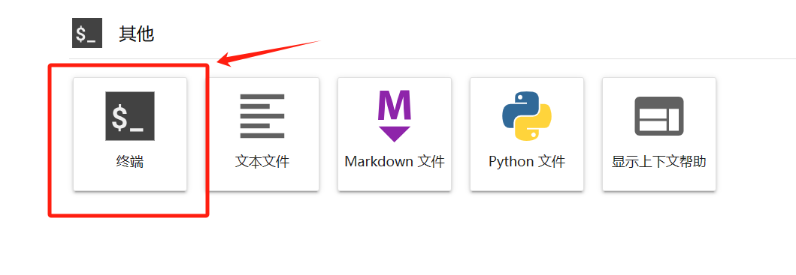

# DeepSeek-Coder-V2-Lite-Instruct FastApi deployment call

## **Environment preparation**

Rent two 3090 container instances with 24G*2 video memory size in the `AutoDL` platform, and select the image as follows `PyTorch`→`2.1.0`→`3.10(ubuntu22.04)`→`12.1`


Next, open the local device terminal and use `ssh` to access. Copy the login command and password in the terminal to complete the login


The interface after `ssh` login is as shown in the figure👇


Or you can directly open the `AutoDL` web shortcut tool and select `JupyterLab` And click on the terminal to open it (this method does not require verification🫠)



Then we can check whether the number of cards in the container example we created is correct. This step will ensure that our subsequent video memory is sufficient

```bash
nvidia-smi
```


Next, start environment configuration, model download and run demonstration ~

`pip` Change source to speed up download and install dependent packages

```bash
# Upgrade pip
python -m pip install --upgrade pip
# Change pypi source to speed up library installation
pip config set global.index-url https://pypi.tuna.tsinghua.edu.cn/simple

pip install fastapi==0.104.1
pip install uvicorn==0.24.0.post1
pip install requests==2.32.3
pip install modelscope==1.9.5
pip install transformers==4.39.2
pip install streamlit==1.24.0
pip install sentencepiece==0.1.99
pip install accelerate==0.27.0
pip install tiktoken==0.7.0
pip install huggingface_hub==0.23.4
pip install flash-attn==2.5.9.post1
```

> Considering that some students may encounter some problems in configuring the environment, we have prepared the DeepSeek-Coder-V2-Lite-Instruct environment image on the AutoDL platform. Click the link below and directly create the Autodl example.
> ***https://www.codewithgpu.com/i/datawhalechina/self-llm/Deepseek-coder-v2***

## Model download

Use the `snapshot_download` function in `modelscope` to download the model. The first parameter is the model name, the parameter `cache_dir` is the custom model download path, and the parameter `revision` is the model warehouse branch version. Master represents the main branch, which is also the default branch for general model uploads.

First switch to the `autodl-tmp` directory, `cd /root/autodl-tmp` 

Then create a new `python` script named `model_download.py`, enter the following content and save it

```python
# model_download.py
import torch
from modelscope import snapshot_download, AutoModel, AutoTokenizer

model_dir = snapshot_download('deepseek-ai/DeepSeek-Coder-V2-Lite-Instruct', cache_dir='/root/autodl-tmp', revision='master')
```

Then enter `python model_download.py` in the terminal to download. Note that the model weight file is relatively large, so you need to wait patiently for a while until the model download is complete.

## Code preparation

Create a new `api.py` file in the `/root/autodl-tmp` path and enter the following content in it. Remember to save the file after pasting the code. The following code has very detailed comments. If you have any questions, please raise an `issue` 😊

```python
# api.py
from fastapi import FastAPI, Request
from transformers import AutoTokenizer, AutoModelForCausalLM, pipeline
import uvicorn
import json
import datetime
import torch

# Set device parameters
DEVICE = "cuda" # Use CUDA
CUDA_DEVICES = ["0", "1"] # CUDA device ID list, here we have two 3090s, so they are 0 and 1 respectively
DEVICE_IDS = [f"{DEVICE}:{device_id}" for device_id in CUDA_DEVICES] # Combine CUDA device information

# Clear GPU memory function
def torch_gc():
if torch.cuda.is_available(): # Check if CUDA is available
for device_id in DEVICE_IDS: # Loop through each CUDA device
with torch.cuda.device(device_id): # Specify CUDA device
torch.cuda.empty_cache() # Clear CUDA cache
torch.cuda.ipc_collect() # Collect CUDA memory fragments

# Create FastAPI application
app = FastAPI()

# Endpoint for handling POST requests
@app.post("/")
async def create_item(request: Request):
global model, tokenizer # Declare global variables to use models and tokenizers inside functions
json_post_raw = await request.json() # Get JSON data for POST request
json_post = json.dumps(json_post_raw) # Convert JSON data to string
json_post_list = json.loads(json_post) # Convert string to Python object
prompt = json_post_list.get('prompt') # Get prompt in request
history = json_post_list.get('history') # Get the history in the request
max_length = json_post_list.get('max_length') # Get the maximum length in the request
top_p = json_post_list.get('top_p') # Get the top_p parameter in the request
top_k = json_post_list.get('top_k') # Get the top_k parameter in the request
temperature = json_post_list.get('temperature') # Get the temperature parameter in the request
repetition_penalty = json_post_list.get('repetition_penalty') # Get the repetition penalty parameter in the request
model_input = []
for q, a in history:
model_input.append({"role": "user", "content": q})
model_input.append({"role": "assistant", "content": a})
model_input.append({"role": "user", "content": prompt})

# Call the model for dialogue generation
model_output = generator(
model_input, 
max_new_tokens=max_length if max_length else 1024,
top_k=top_k if top_k else 5, # If the top_k parameter is not provided, 0.5 is used by default
top_p=top_p if top_p else 0.7, # If the top_p parameter is not provided, 0.7 is used by default
temperature=temperature if temperature else 0.95, # If the temperature parameter is not provided, 0.95 is used by default, 
repetition_penalty=repetition_penalty if repetition_penalty else 1.1, # If not providedRepeat penalty parameter, default is 1.1, 
do_sample=True
)
response = model_output[0]['generated_text'][-1]['content']
history.append([prompt, response])
now = datetime.datetime.now() # Get the current time
time = now.strftime("%Y-%m-%d %H:%M:%S") # Format the time as a string
# Build response JSON
answer = {
"response": response,
"history": history,
"status": 200,
"time": time
}
# Build log information
log = "[" + time + "] " + '", prompt:"' + prompt + '", response:"' + repr(response) + '"'print(log) # print log
torch_gc() # perform GPU memory cleanup
return answer # return response

# main function entry
if __name__ == '__main__':
# load pre-trained tokenizer and model
mode_name_or_path = '/root/autodl-tmp/deepseek-ai/DeepSeek-Coder-V2-Lite-Instruct'
tokenizer = AutoTokenizer.from_pretrained(mode_name_or_path, trust_remote_code=True)
model = AutoModelForCausalLM.from_pretrained(mode_name_or_path, trust_remote_code=True, torch_dtype=torch.bfloat16, device_map="auto")
generator = pipeline(
"text-generation",model=model,
tokenizer=tokenizer, 
trust_remote_code=True, 
device_map="auto"
)

# Start FastAPI application
# Use port 6006 to map the port of autodl to the local computer, so that the api can be used locally
uvicorn.run(app, host='0.0.0.0', port=6006, workers=1) # Start the application on the specified port and host
```

## API deployment

Enter the following command in the terminal to start the `api` service.

```shell
cd /root/autodl-tmp
python api.py
```

The following result appears in the terminal, indicating that the `api` service is enabled successfully.


At this point, we can observe the usage of video memory after the model weights are loaded😄


By default, it is deployed on port `6006` and is called through the `POST` method. You can create a new terminal and use `curl` call, as shown below:

```shell
curl -X POST "http://127.0.0.1:6006" \
-H 'Content-Type: application/json' \
-d '{"prompt": "你好", "history": []}'
```

The return value is as follows:

```json
{
"response": " Hello! Is there anything I can help you with? Whether it is a problem in daily life or a doubt in work and study, I will try my best to help you and answer it here.",
"history": [
[
"Hello",
" Hello! Is there anything I can help you with? Whether it is a problem in daily life or a doubt in work and study, I will try my best to help you and answer it here."
]
],
"status": 200,
"time": "2024-06-23 23:56:27"
}
```

The call example result is shown in the figure below:


We can also use the `requests` library in `Python` to call, as shown belowExample:

```python
# request.py
import requests
import json

def get_completion(prompt):
headers = {'Content-Type': 'application/json'}
data = {"prompt": prompt, "history": []}
response = requests.post(url='http://127.0.0.1:6006', headers=headers, data=json.dumps(data))
return response.json()['response']

if __name__ == '__main__':
print(get_completion('Hello, please introduce DeepSeek-Coder-V2-Lite-Instruct large language model~'))
```

The return value is as follows:

```
DeepSeek is a Chinese artificial intelligence company focused on achieving AGI. If you mentioned "DeepSeek-Coder-V2-Lite-Instruct" is part of a product or service developed by the company, then the following is a general introduction to it:

1. **Model Overview**:
- DeepSeek Coder-V2-Lite-Instruct may be a specific version of a large language model. Large language models generally refer to computer programs that can understand and generate human natural language. Such models are usually trained with large amounts of data to learn language patterns and structures on a wide range of texts.
- The "Instruct" part may indicate that the model is specially designed to follow instructions or perform specific task instructions. This type of model is designed to better understand the user's query intent and provide more accurate answers.

2. **Technical Features**:
- **Performance Optimization**: As a "Lite" version, it may have optimized resource usage while maintaining high performance, allowing it to run efficiently in environments with low computational costs.
- **Instruction Following Ability**: "Instruct" indicates that the model is particularly good at handling tasks that require explicit instructions to be performed correctly, such as question answering, text generation, etc.

3. **Application Scenarios**:
- Due to the flexibility and strong context understanding capabilities of large language models, they can be applied to a variety of scenarios, including but not limited to:
- Content creation: help write articles, newspapers- Customer Support: Automatically answer common questions and provide instant customer support.
- Education and Training: Provide personalized learning materials and guidance for students and professionals.
- Research and Analysis: Assist researchers in literature review, data analysis, etc.

4. **Future Outlook**:
- With the continuous advancement of artificial intelligence technology, large language models may become more complex and powerful, able to play a role in more fields, and more accurately meet the needs of users.

Please note that the above description is based on the characteristics of general large language models and does not specifically refer to the specific functions and performance of "DeepSeek-Coder-V2-Lite-Instruct". If you need to know more about the model, it is recommended to consult DeepSeek directly or check the official documents and materials.
```

The call example result is shown in the figure below:

