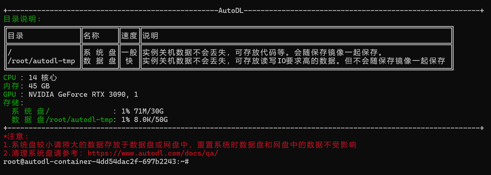
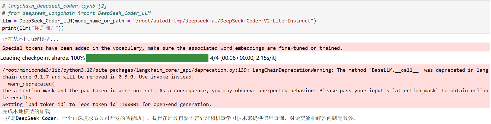
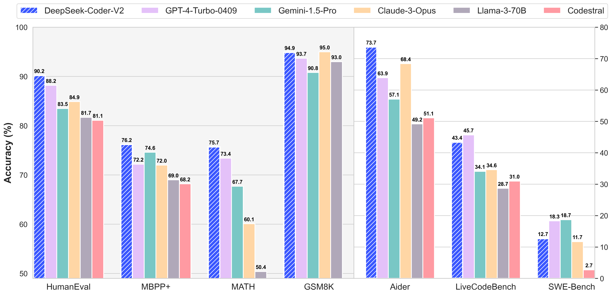
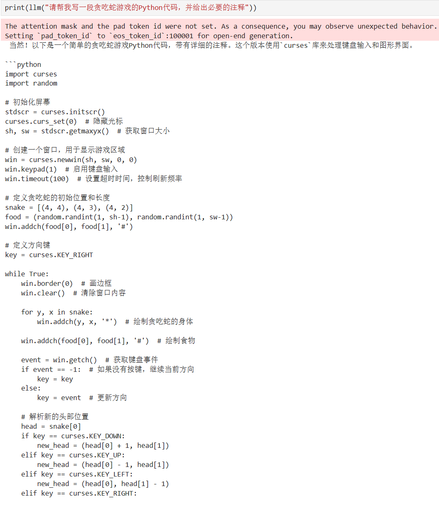

# DeepSeek-Coder-V2-Lite-Instruct access to LangChain

## **Environment preparation**

Rent two 3090 container instances with 24G*2 video memory size in the `AutoDL` platform, and select the image as follows `PyTorch`→`2.1.0`→`3.10(ubuntu22.04)`→`12.1`


Next, open the local device terminal and use `ssh` to access. Copy the login command and password in the terminal to complete the login


The interface after `ssh` login is successful is shown in the figure👇



Or you can directly open the `AutoDL` web shortcut tool and select `JupyterLab` And click on the terminal to open (this method does not require verification🫠)

 Next, start environment configuration, model download and run demonstration ~

`pip` source change to speed up download and install dependent packages

```shell
# Upgrade pip
python -m pip install --upgrade pip
# Change the installation of the pypi source acceleration library
pip config set global.index-url https://pypi.tuna.tsinghua.edu.cn/simple

pip install modelscope==1.9.5
pip install langchain==0.2.3
pip install transformers==4.39.2
pip install accelerate==0.27.0
pip install tiktoken==0.7.0
pip install transformers_stream_generator==0.0.4
pip install peft==0.10.0
pip install deepspeed==0.14.3
pip install huggingface_hub==0.23.4
pip install sentencepiece==0.1.99
pip install flash-attn==2.5.9.post1
pip install einops scipy 
```

> Considering that some students haveYou may encounter some problems when setting up the environment. We have prepared the DeepSeek-Coder-V2-Lite-Instruct environment image on the AutoDL platform. Click the link below and create an Autodl example directly.
> ***https://www.codewithgpu.com/i/datawhalechina/self-llm/Deepseek-coder-v2***

## Model download

Use the `snapshot_download` function in `modelscope` to download the model. The first parameter is the model name, the parameter `cache_dir` is the custom model download path, and the parameter `revision` is the model warehouse branch version. Master represents the main branch, which is also the default branch for general model uploads.

First switch to the `autodl-tmp` directory, `cd /root/autodl-tmp`

Then create a new `python` script named `model_download.py`, enter the following content in it and save it

```python
# model_download.py
import torch
from modelscope import snapshot_download, AutoModel, AutoTokenizer

model_dir = snapshot_download('deepseek-ai/DeepSeek-Coder-V2-Lite-Instruct', cache_dir='/root/autodl-tmp', revision='master')
```

Then enter `python model_download.py` in the terminal to download. Note that the model weight file is relatively large, so you need to wait patiently for a while until the model download is complete.

## Code preparation

To conveniently build the `LLM` application, we need to customize an LLM class based on the locally deployed `DeepSeek_Coder_LLM` and connect `DeepSeek-Coder-V2-Lite-Instruct` to the `LangChain` framework. After completing the custom `LLM` class, you can call the `LangChain` interface in a completely consistent way without considering the inconsistency of the underlying model call.

Customizing the `LLM` class based on the locally deployed `DeepSeek-Coder-V2-Lite-Instruct` is not complicated. We only need to import the `LLM` class from `LangChain.llms.base.LLM` class inherits a subclass and overrides the constructor and `_call` function:

```python
# langchain_deepseek_coder.ipynb [1]
from langchain.llms.base import LLM
from typing import Any, List, Optional
from langchain.callbacks.manager import CallbackManagerForLLMRun
from transformers import AutoTokenizer, AutoModelForCausalLM, GenerationConfig, LlamaTokenizerFast
import torch

class DeepSeek_Coder_LLM(LLM): # Define a DeepSeek_Coder_LLM class that inherits from LLM
# Class variable, initialized to None, will be assigned in the initialization method
tokenizer: AutoTokenizer = None
model: AutoModelForCausalLM = None

def __init__(self, mode_name_or_path: str): # Initialization method, accepts model path or name as parameter

super().__init__() # Call the initialization method of the parent class
print("Loading model from local...") # Print the prompt information of loading model
# Use AutoTokenizer to load tokenizer from pre-trained model
self.tokenizer = AutoTokenizer.from_pretrained(mode_name_or_path, use_fast=False, trust_remote_code=True)
# Use AutoModelForCausalLM to load language model from pre-trained model
self.model = AutoModelForCausalLM.from_pretrained(
mode_name_or_path,
torch_dtype=torch.bfloat16, # Set PyTorch data type to bfloat16
device_map="auto", # Let the model automatically select the device
trust_remote_code=True # Trust remote code
)
# Load generation configuration from pre-trained model
self.model.generation_config = GenerationConfig.from_pretrained(mode_name_or_path)
print("Complete loading of local model") # Print prompt message of model loading completion

def _call(self, prompt: str, stop: Optional[List[str]] = None,
run_manager: Optional[CallbackManagerForLLMRun] = None,
**kwargs: Any): # Define _call method for generating textmessages = [{"role": "user", "content": prompt }] # Define a message list, including the user's role and content
# Apply the chat template to generate input IDs
input_ids = self.tokenizer.apply_chat_template(messages, tokenize=False, add_generation_prompt=True)
# Convert the input ID to the input format required by the model and convert it to a PyTorch tensor
model_inputs = self.tokenizer([input_ids], return_tensors="pt").to('cuda')
# Generate text using the model and set generation parameters
generated_ids = self.model.generate(
model_inputs.input_ids,
max_new_tokens=512, # Maximum number of newly generated tokens
top_k=5, # Number of tokens sampled each time
top_p=0.8, # Sampling by probability distribution
temperature=0.3, # Temperature parameter, affecting the randomness of generated text
repetition_penalty=1.1, # Repeated penalty to avoid repeated generation of the same text
do_sample=True # Whether to use sampling
)
# Extract the actual generated text ID from the generated ID
generated_ids = [
output_ids[len(input_ids):] for input_ids, output_ids in zip(model_inputs.input_ids, generated_ids)
]
# Decode the generated ID into text and skip special tokens
response = self.tokenizer.batch_decode(generated_ids, skip_special_tokens=True)[0]
return response # Returns the generated text

@property
def _llm_type(self) -> str: # Defines a property to return the model type
return "DeepSeek_Coder_LLM"
```

In the above class definition, we rewrite the constructor and the `_call` function respectively:

- For the constructor, we load the locally deployed `DeepSeek-Coder-V2-Lite-Instruct` model at the beginning of object instantiation, so as to avoid the time waste caused by reloading the model for each call;

- The `_call` function is the core function of the LLM class. `Langchain` will call this function to call `LLM`. In this function, we call the `generate` method of the instantiated model to call the model and return the call result.

In addition, when implementing a custom `LLM` class, according to the requirements of the `Langchain` framework, we need to define the `_identifying_params` attribute. This property returns a dictionary containing the parameters that uniquely identify this `LLM` instance.It is very important for caching and tracking because it helps the system identify different model configurations for effective cache management and log tracking.

In the overall project, we encapsulate the above code as `deepseek_langchain.py`, and then directly introduce the custom `DeepSeek_Coder_LLM` class from this file.

## Model call

Then you can use it like any other `Langchain` large model function.

Let's first simply test the model's ability to have daily conversations😊

```python
# langchain_deepseek_coder.ipynb [2]
# from deepseek_langchain import DeepSeek_Coder_LLM
llm = DeepSeek_Coder_LLM(mode_name_or_path = "/root/autodl-tmp/deepseek-ai/DeepSeek-Coder-V2-Lite-Instruct")
print(llm("Who are you?"))
```

The return value is as follows:

```
I am DeepSeek Coder, an intelligent assistant developed by DeepSeek. I aim to use natural language processing andMachine learning technology is used to provide services such as information query, dialogue communication and question answering.
```

The call example result is shown in the figure below:



In addition, according to the official documentation, the `DeepSeek-Coder-V2-Lite-Instruct` model also has strong coding capabilities



So let's test a classic code problem🥰

```python
# langchain_deepseek_coder.ipynb [3]
print(llm("Please help me write a Python code for a snake game and give necessary comments"))

```

The return value is as follows:

```python
Of course! The following is a simple Python code for a snake game with detailed comments. This version uses the `curses` library to handle keyboard input and graphical interface.

```python
import curses
import random

# Initialize the screen
stdscr = curses.initscr()
curses.curs_set(0) # Hide the cursor
sh, sw = stdscr.getmaxyx()# Get the window size

# Create a window to display the game area
win = curses.newwin(sh, sw, 0, 0)
win.keypad(1) # Enable keyboard input
win.timeout(100) # Set the timeout to control the refresh rate

# Define the initial position and length of the snake
snake = [(4, 4), (4, 3), (4, 2)]
food = (random.randint(1, sh-1), random.randint(1, sw-1))
win.addch(food[0], food[1], '#')

# Define the arrow keys
key = curses.KEY_RIGHT

while True:
win.border(0) # Draw the border
win.clear() # Clear the window contents

for y, x in snake:
win.addch(y, x, '*') # Draw the body of the snake

win.addch(food[0], food[1], '#') # Draw food

event = win.getch() # Get keyboard events
if event == -1: # If no key is pressed, continue in the current direction
key = key
else:
key = event # Update direction

# Parse the new head position
head = snake[0]
if key == curses.KEY_DOWN:
new_head = (head[0] + 1, head[1])
elif key == curses.KEY_UP:
new_head = (head[0] - 1, head[1])
elif key == curses.KEY_LEFT:
new_head = (head[0], head[1] - 1)
elif key == curses.KEY_RIGHT:
```

The result of the call example is shown in the figure below:

