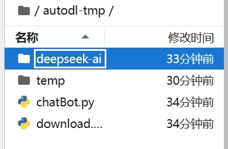
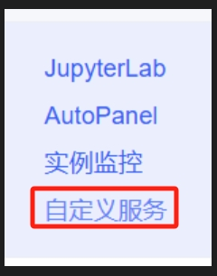
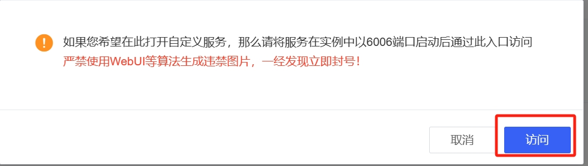
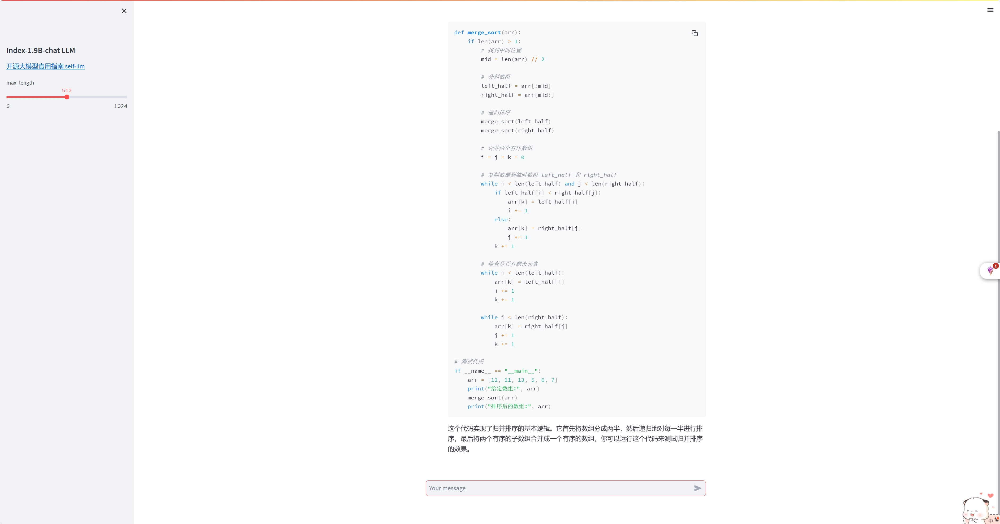

# DeepSeek-Coder-V2-Lite-Instruct WebDemo deployment

## Environment preparation

Rent a 2* 3090 and 48G graphics card machine on the [AutoDL](https://www.autodl.com/) platform. As shown in the figure below, select `PyTorch`-->`2.1.0`-->`3.10(ubuntu22.04)`-->`12.1`.


Next, open the `JupyterLab` of the server you just rented, and open the terminal in it to start environment configuration, model download and run `demo`.

pip changes the source and installs dependent packages.

```bash
# Change the pypi source to accelerate the installation of the library
pip config set global.index-url https://pypi.tuna.tsinghua.edu.cn/simple
# Upgrade pip
python -m pip install --upgrade pip

pip install modelscope==1.9.5
pip install transformers==4.39.2pip install streamlit==1.24.0
pip install sentencepiece==0.1.99
pip install accelerate==0.27.0
pip install transformers_stream_generator==0.0.4
pip install tiktoken==0.7.0
pip install huggingface_hub==0.23.4
pip install flash-attn==2.5.9.post1
```

> Considering that some students may encounter some problems in configuring the environment, we have prepared the DeepSeek-Coder-V2-Lite-Instruct environment image on the AutoDL platform. Click the link below and create an Autodl example directly.
> ***https://www.codewithgpu.com/i/datawhalechina/self-llm/Deepseek-coder-v2***

## Model download

Use the `snapshot_download` function in `modelscope` to download the model. The first parameter is the model name and the parameter `cache_dir` is the download path of the model, the parameter `revision` is the version of the model, and master represents the main branch, which is the latest version.

Create a new `download.py` file in the `/root/autodl-tmp` path and enter the following content in it. Remember to save the file after pasting the code, as shown in the figure below. And run `python /root/autodl-tmp/download.py` to execute the download. The model size is 40 GB, and it takes about 20 minutes to download the model.

```python
import torch
from modelscope import snapshot_download, AutoModel, AutoTokenizer
import os

model_dir = snapshot_download('deepseek-ai/DeepSeek-Coder-V2-Lite-Instruct', cache_dir='/root/autodl-tmp', revision='master')
```

The following result appears in the terminal, indicating that the download is successful.


## Code preparation

In `/rCreate a new `chatBot.py` file in the oot/autodl-tmp` path and enter the following content in it. Remember to save the file after pasting the code. The code below has very detailed comments. If you don't understand anything, please raise an issue.



The chatBot.py code is as follows

```python
# Import the required libraries
from transformers import AutoTokenizer, AutoModelForCausalLM, GenerationConfig
import torch
import streamlit as st

# Create a title and a link in the sidebar
with st.sidebar:
st.markdown("## Index-1.9B-chat LLM")
"[Open Source Large Model Eating Guide self-llm](https://github.com/datawhalechina/self-llm.git)"
# Create a slider to select the maximum length, ranging from 0 to 1024, with a default value of 512
max_length = st.slider("max_length", 0, 1024, 512, step=1)

# Create a title and a subtitle
st.title("💬 DeepSeek-Coder-V2-Lite-Instruct")
st.caption("🚀 A streamlit chatbot powered by Self-LLM")

# Define the model path
model_name_or_path = '/root/autodl-tmp/deepseek-ai/DeepSeek-Coder-V2-Lite-Instruct'

# Define a function to get the model and tokenizer
@st.cache_resource
def get_model():
# Get the tokenizer from the pre-trained model
tokenizer = AutoTokenizer.from_pretrained(model_name_or_path, use_fast=False, trust_remote_code=True)
# Get the model from the pre-trained model and set the model parameters
model = AutoModelForCausalLM.from_pretrained(model_name_or_path, torch_dtype=torch.bfloat16, device_map="auto", trust_remote_code=True)

return tokenizer, model

# Load the model and tokenizer of DeepSeek-Coder-V2-Lite-Instruct
tokenizer, model = get_model()

# If there is no "messages" in session_state, create a list containing default messages
if "messages" not in st.session_state:
st.session_state["messages"] = [{"role": "assistant", "content": "What can I do for you?"}]

# Iterate over all messages in session_state and display them on the chat interface
for msg in st.session_state.messages:
st.chat_message(msg["role"]).write(msg["content"])

# If the user enters content in the chat input box, do the following
if prompt := st.chat_input():
# Add the user's input to the messages list in session_state
st.session_state.messages.append({"role": "user", "content": prompt})
# Display the user's input on the chat interface
st.chat_message("user").write(prompt)

# Build input
input_ids = tokenizer.apply_chat_template(st.session_state.messages,tokenize=False,add_generation_prompt=True)
model_inputs = tokenizer([input_ids], return_tensors="pt").to('cuda')
generated_ids = model.generate(model_inputs.input_ids, max_new_tokens=512)
generated_ids = [
output_ids[len(input_ids):] for input_ids, output_ids in zip(model_inputs.input_ids, generated_ids)
]
response = tokenizer.batch_decode(generated_ids, skip_special_tokens=True)[0]
# Add the output of the model to the messages list in session_state
st.session_state.messages.append({"role": "assistant", "content": response})
# Display the output of the model on the chat interface
st.chat_message("assistant").write(response)
# print(st.session_state)
```

##Run demo

Run the following command in the terminal to start the streamlit service

```shell
streamlit run /root/autodl-tmp/chatBot.py --server.address 127.0.0.1 --server.port 6006 --server.enableCORS false
```

Click Custom Service



Click Visit
You can see the chat interface. The running effect is as follows:
