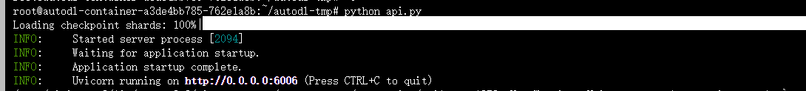
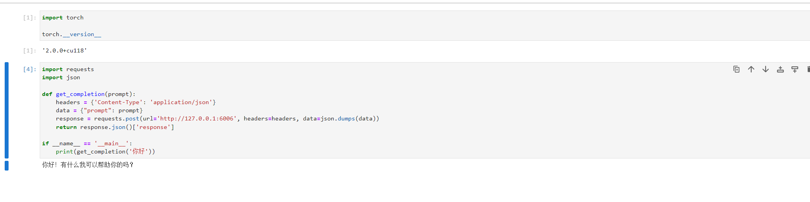

# DeepSeek-7B-chat FastApi deployment call

## DeepSpeek introduction

DeepSeek LLM, a high-level language model consisting of 7 billion parameters. It is trained from scratch on a huge dataset of 2 trillion English and Chinese tokens. To promote research, DeepSeek has opened DeepSeek LLM 7B/67B Base and DeepSeek LLM 7B/67B Chat to the research community.

## Environment preparation
Rent a 3090 or other 24G graphics card machine in the autodl platform. As shown in the figure below, select PyTorch-->2.0.0-->3.8(ubuntu20.04)-->11.8 (versions above 11.3 are acceptable)
Next, open the JupyterLab of the server you just rented, image and open the terminal in it to start environment configuration, model download and run demonstrations. 

Pip source change and installation of dependent packages
```
# Upgrade pip
python -m pip install --upgrade pip
# Change pypi source to accelerate library installation
pip config set global.index-url https://pypi.tuna.tsinghua.edu.cn/simple

pip install fastapi==0.104.1
pip install uvicorn==0.24.0.post1
pip install requests==2.25.1
pip install modelscope==1.9.5
pip install transformers==4.35.2
pip install streamlit==1.24.0
pip install sentencepiece==0.1.99
pip install accelerate==0.24.1
pip install transformers_stream_generator==0.0.4
```
## Model download
Use the snapshot_download function in modelscope to download the model. The first parameter is the model name, and the parameter cache_dir is the download path of the model.

Create a new download.py file in the /root/autodl-tmp path and enter the following content in it. Remember to save the file after pasting the code, as shown in the figure below. And run python /root/autodl-tmp/download.py performs downloading. The model size is 15 GB. It takes about 10 to 20 minutes to download the model.

```
import torch
from modelscope import snapshot_download, AutoModel, AutoTokenizer
from modelscope import GenerationConfig
model_dir = snapshot_download('deepseek-ai/deepseek-llm-7b-chat', cache_dir='/root/autodl-tmp', revision='master')
```

## Code preparation

Create a new api.py file in the /root/autodl-tmp path and enter the following content in it. Remember to save the file after pasting the code. The following code has very detailed comments. If you don’t understand it, please raise an issue.
```
from fastapi import FastAPI, Request
from transformers import AutoTokenizer, AutoModelForCausalLM, GenerationConfig
import uvicorn
import json
import datetime
import torch

# Set device parameters
DEVICE = "cuda" # Use CUDA
DEVICE_ID = "0" # CUDA device ID, empty if not set
CUDA_DEVICE = f"{DEVICE}:{DEVICE_ID}" if DEVICE_ID else DEVICE # Combine CUDA device information

# Clean up GPU memory function
def torch_gc():
if torch.cuda.is_available(): # Check if CUDA is available
with torch.cuda.device(CUDA_DEVICE): # Specify CUDA device
torch.cuda.empty_cache() # Clear CUDA cache
torch.cuda.ipc_collect() # Collect CUDA memory fragments

# Create FastAPI application
app = FastAPI()

# Process POEndpoint for ST request
@app.post("/")
async def create_item(request: Request):
global model, tokenizer # Declare global variables to use the model and tokenizer inside the function
json_post_raw = await request.json() # Get the JSON data of the POST request
json_post = json.dumps(json_post_raw) # Convert JSON data to a string
json_post_list = json.loads(json_post) # Convert a string to a Python object
prompt = json_post_list.get('prompt') # Get the prompt in the request
max_length = json_post_list.get('max_length') # Get the maximum length in the request

# Build messages
messages = [
{"role": "user", "content": prompt}
]
# Build input 
input_tensor = tokenizer.apply_chat_template(messages, add_generation_prompt=True, return_tensors="pt")
# Get output through the model
outputs = model.generate(input_tensor.to(model.device), max_new_tokens=max_length)
result = tokenizer.decode(outputs[0][input_tensor.shape[1]:], skip_special_tokens=True)

now = datetime.datetime.now() # Get the current time
time = now.strftime("%Y-%m-%d %H:%M:%S") # Format time as a string
# Build response JSON
answer = {
"response": result,"status": 200,
"time": time
}
# Build log information
log = "[" + time + "] " + '", prompt:"' + prompt + '", response:"' + repr(result) + '"'
print(log) # Print log
torch_gc() # Perform GPU memory cleanup
return answer # Return response

# Main function entry
if __name__ == '__main__':
mode_name_or_path = '/root/autodl-tmp/deepseek-ai/deepseek-llm-7b-chat'
# Load pre-trained tokenizer and model
tokenizer = AutoTokenizer.from_pretrained(mode_name_or_path, trust_remote_code=True)
model = AutoModelForCausalLM.from_pretrained(mode_name_or_path, trust_remote_code=True,torch_dtype=torch.bfloat16, device_map="auto")
model.generation_config = GenerationConfig.from_pretrained(mode_name_or_path)
model.generation_config.pad_token_id = model.generation_config.eos_token_id
model.eval() # Set the model to evaluation mode
# Start FastAPI application
# Use port 6006 to map the autodl port to the local, so that the api can be used locally
uvicorn.run(app, host='0.0.0.0', port=6006, workers=1) # Start the application on the specified port and host
```
## Api deployment

Enter the following command in the terminal to start the api service
```
cd /root/autodl-tmp
python api.py
```
After loading, the following information appearsIt means success.


By default, it is deployed on port 6006 and can be called through the POST method. You can use curl to call it, as shown below:
```
curl -X POST "http://127.0.0.1:6006" \
-H 'Content-Type: application/json' \
-d '{"prompt": "你好"}'
```
You can also use the requests library in Python to call it, as shown below:
```
import requests
import json

def get_completion(prompt):
headers = {'Content-Type': 'application/json'}
data = {"prompt": prompt}
response = requests.post(url='http://127.0.0.1:6006', headers=headers, data=json.dumps(data))
return response.json()['response']

if __name__ == '__main__':
print(get_completion('Hello'))
```
The return value is as follows:

```text
{
'response': 'Hello! Is there anything I can help you with? ', 
'status': 200, 
'time': '2023-12-01 17:06:10'
}
```
