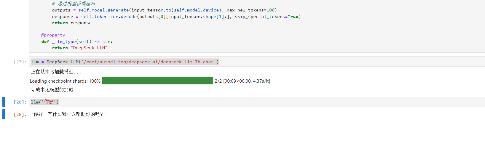

# DeepSeek-7B-chat langchain connection

This article mainly talks about how to connect `DeepSeek-7B-chat` to the `LLM` module of `langchain.llms.base` in `Langchain`. For other parts about how to connect to the vector database and `gradio`, please refer to the [internLM langchain](../InternLM/06-InternLM Connect to LangChain to Build Knowledge Base Assistant.md) module.

## Install dependencies

In addition to installing the model's running dependencies, you also need to install langchain dependencies.

```bash
pip install langchain==0.0.292
```

## DeepSeek-7B-chat Connect to LangChain

To conveniently build LLM applications, we need to customize an LLM class based on the locally deployed DeepSeek-7B-chat and connect DeepSeek-7B-chat to the LangChain framework. After completing the custom LLM class, you can call the LangChain interface in a completely consistent manner without considering the inconsistency of the underlying model call.

Based on the local deployment of DeepSeek-7B-chat Customizing the LLM class is not complicated. We only need to inherit a subclass from the LangChain.llms.base.LLM class and override the constructor and the `_call` function:

```python
from langchain.llms.base import LLM
from typing import Any, List, Optional
from langchain.callbacks.manager import CallbackManagerForLLMRun
from transformers import AutoTokenizer, AutoModelForCausalLM, GenerationConfig
import torch

class DeepSeek_LLM(LLM):
# Customize the LLM class based on the local InternLM
tokenizer : AutoTokenizer = None
model: AutoModelForCausalLM = None

def __init__(self, model_path :str):# model_path: InternLM model path
# Initialize the model from local
super().__init__()
print("Loading model from local...")
self.tokenizer = AutoTokenizer.from_pretrained(model_path, trust_remote_code=True)
self.model = AutoModelForCausalLM.from_pretrained(model_path, trust_remote_code=True,torch_dtype=torch.bfloat16, device_map="auto")
self.model.generation_config = GenerationConfig.from_pretrained(model_path)
self.model.generation_config.pad_token_id = self.model.generation_config.eos_token_id
self.model = self.model.eval()
print("Complete loading of local model")

def _call(self, prompt : str, stop: Optional[List[str]] = None,
run_manager: Optional[CallbackManagerForLLMRun] = None,
**kwargs: Any):
# Rewrite the call function
messages = [
{"role": "user", "content": prompt}
]
# Build input
input_tensor = self.tokenizer.apply_chat_template(messages, add_generation_prompt=True, return_tensors="pt")# Get outputs from the model
outputs = self.model.generate(input_tensor.to(self.model.device), max_new_tokens=100)
response = self.tokenizer.decode(outputs[0][input_tensor.shape[1]:], skip_special_tokens=True)
return response

@property
def _llm_type(self) -> str:
return "DeepSeek_LLM"
```

## Call

Then you can use it like any other langchain large model function.

```python
llm = DeepSeek_LLM('/root/autodl-tmp/deepseek-ai/deepseek-llm-7b-chat')

llm('Hello')
```

As shown below:

