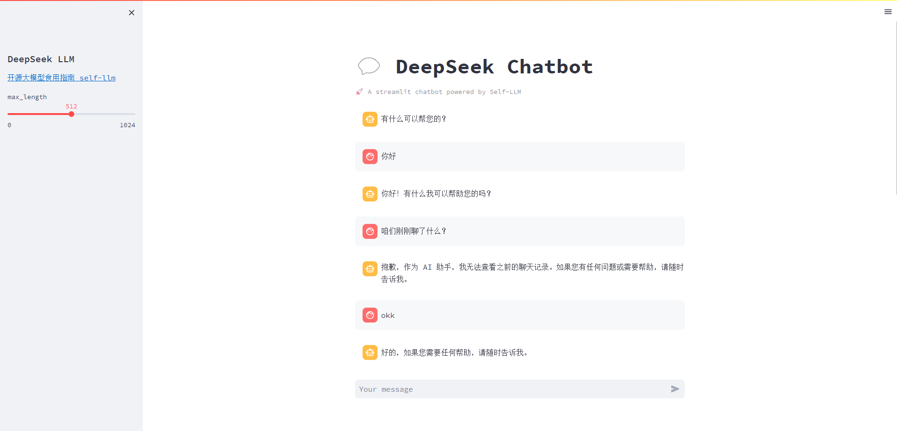

# DeepSeek-7B-chat WebDemo deployment

## DeepSpeek introduction

DeepSeek LLM is a high-level language model consisting of 7 billion parameters. It is trained from scratch on a large dataset of 2 trillion English and Chinese tokens. To promote research, DeepSeek has opened DeepSeek LLM 7B/67B Base and DeepSeek LLM 7B/67B Chat to the research community.

## Environment preparation
Rent a 3090 or other 24G graphics card machine in the autodl platform. As shown in the figure below, select PyTorch-->2.0.0-->3.8(ubuntu20.04)-->11.8 (versions above 11.3 are acceptable)
Next, open the JupyterLab of the server you just rented, image and open the terminal in it to start environment configuration, model download and run demonstrations. 

Pip source change and installation of dependent packages
```
# Upgrade pip
python -m pip install --upgrade pip
# Change pypi source to accelerate library installation
pip config set global.index-url https://pypi.tuna.tsinghua.edu.cn/simple

pip install modelscope==1.9.5
pip install transformers==4.35.2
pip install streamlit==1.24.0
pip install sentencepiece==0.1.99
pip install accelerate==0.24.1
pip install transformers_stream_generator==0.0.4
```
## Model download
Use the snapshot_download function in modelscope to download the model. The first parameter is the model name, and the parameter cache_dir is the download path of the model.

Create a new download.py file in the /root/autodl-tmp path and enter the following content in it. Remember to save the file after pasting the code, as shown in the figure below. And run python /root/autodl-tmp/download.py to execute the download. The model size is 15 GB. It takes about 10 to 20 minutes to download the model.

```
import torch
from modelscope import snapshot_download, AutoModel, AutoTokenizer
from modelscope import GenerationConfig
model_dir = snapshot_download('deepseek-ai/deepseek-llm-7b-chat', cache_dir='/root/autodl-tmp', revision='master')
```

## Code preparation

Create a new file `chatBot.py` in the `/root/autodl-tmp` path and enter the following content in it. Remember to save the file after pasting the code. The following code has very detailed comments. If you have any questions, please raise an issue.

```python
# Import the required libraries
from transformers import AutoTokenizer, AutoModelForCausalLM, GenerationConfig
import torch
import streamlit as st

# Create a title and a link in the sidebar
with st.sidebar:
st.markdown("## DeepSeek LLM")
"[Open Source Large Model Eating Guide self-llm](https://github.com/datawhalechina/self-llm.git)"
# Create a slider to select the maximum length, ranging from 0 to 1024, with a default value of 512
max_length = st.slider("max_length", 0, 1024, 512, step=1)

# Create a title and a subtitle
st.title("💬 DeepSeek Chatbot")
st.caption("🚀 A streamlit chatbot powered by Self-LLM")

# Define the model path
mode_name_or_path = '/root/autodl-tmp/deepseek-ai/deepseek-llm-7b-chat'

# Define a function to get the model and tokenizer
@st.cache_resource
def get_model():
# Get the tokenizer from the pre-trained model
tokenizer = AutoTokenizer.from_pretrained(mode_name_or_path, trust_remote_code=True)
# Get the model from the pretrained model and set the model parameters
model = AutoModelForCausalLM.from_pretrained(mode_name_or_path, trust_remote_code=True,torch_dtype=torch.bfloat16, device_map="auto")
# Get the generation configuration from the pretrained model
model.generation_config = GenerationConfig.from_pretrained(mode_name_or_path)
# Set the pad_token_id of the generation configuration to the eos_token_id of the generation configuration
model.generation_config.pad_token_id = model.generation_config.eos_token_id
# Set the model to evaluation mode
model.eval() 
return tokenizer, model

# Load Chatglm3 model and tokenizer
tokenizer, model = get_model()

# If there is no "messages" in session_state, create a list containing default messages
if "messages" not in st.session_state:
st.session_state["messages"] = [{"role": "assistant", "content": "How can I help you?"}]

# Traverse all messages in session_state and display them on the chat interface
for msg in st.session_state.messages:
st.chat_message(msg["role"]).write(msg["content"])

# If the user enters content in the chat input box, do the following
if prompt := st.chat_input():
# Add the user's input to the messages list in session_state
st.session_state.messages.append({"role": "user", "content": prompt})
# Display user input on the chat interface
st.chat_message("user").write(prompt)

# Build input
input_tensor = tokenizer.apply_chat_template(st.session_state.messages, add_generation_prompt=True, return_tensors="pt")
# Get output through the model
outputs = model.generate(input_tensor.to(model.device), max_new_tokens=max_length)
# Decode the output of the model and remove special tags
response = tokenizer.decode(outputs[0][input_tensor.shape[1]:], skip_special_tokens=True)
# Add the output of the model to sessIn the messages list in ion_state
st.session_state.messages.append({"role": "assistant", "content": response})
# Display the output of the model on the chat interface
st.chat_message("assistant").write(response)
```

## Run demo

Run the following command in the terminal to start the streamlit service, map the port to the local according to the instructions of `autodl`, and then open the link http://localhost:6006/ in the browser to see the chat interface.

```bash
streamlit run /root/autodl-tmp/chatBot.py --server.address 127.0.0.1 --server.port 6006
```

As shown below:

