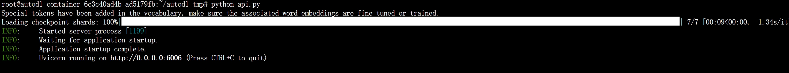
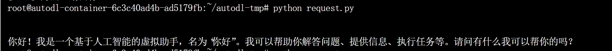

# 06-DeepSeek-MoE-16b-chat FastApi deployment call

## DeepSeek-MoE-16b-chat Introduction

The current version of DeepSeek MoE has 16 billion parameters, and the actual number of activated parameters is about 2.8 billion. Compared with its own 7B dense model, the performance of the two on 19 data sets has its own advantages and disadvantages, but the overall performance is relatively close. Compared with Llama 2-7B, which is also a dense model, DeepSeek MoE also has obvious advantages in mathematics and code. However, the computational workload of both dense models exceeds 180TFLOPs per 4k token, while DeepSeek MoE only has 74.4TFLOPs, which is only 40% of the two.

## Environment preparation
Rent a **dual 3090 and other 24G (48G in total)** graphics card machine on the autodl platform. As shown in the figure below, select PyTorch-->2.1.0-->3.10(ubuntu22.04)-->12.1
Next, open JupyterLab on the server you just rented, image and open the terminal to start environment configuration, model download and run demonstration. 

pip source change and installation of dependent packages
```shell
# Because it involves accessing github Therefore, it is best to open the academic image acceleration of autodl
source /etc/network_turbo
# Upgrade pip
python -m pip install --upgrade pip
# Replace the installation of the pypi source acceleration library
pip config set global.index-url https://pypi.tuna.tsinghua.edu.cn/simple
pip install modelscope transformers sentencepiece accelerate fastapi uvicorn requests streamlit transformers_stream_generator
# pip install -r requirements.txt
pip install https://github.com/Dao-AILab/flash-attention/releases/download/v2.4.2/flash_attn-2.4.2+cu122torch2.1cxx11abiFALSE-cp310-cp310-linux_x86_64.whl
```
## Model download
Use the `snapshot_download` function in `modelscope` to download the model. The first parameter is the model name, and the parameter `cache_dir` is the download path of the model.

Create a new `download.py` file in the `/root/autodl-tmp` path and enter the following content in it. Remember to save the file after pasting the code, as shown in the figure below. And run `python /root/autodl-tmp/download.py` to download. The model size is 30 GB. It takes about 10~20 minutes to download the model.

```python
import torch
from modelscope import snapshot_download, AutoModel, AutoTokenizer
import os
model_dir = snapshot_download('deepseek-ai/deepseek-moe-16b-chat', cache_dir='/root/autodl-tmp', revision='master')
```

## Code preparation

Create a new api.py file in the /root/autodl-tmp path andEnter the following content in it, and remember to save the file after pasting the code. The code below has very detailed comments. If you don’t understand anything, please raise an issue.
```python
from fastapi import FastAPI, Request
from transformers import AutoTokenizer, AutoModelForCausalLM, GenerationConfig
import uvicorn
import json
import datetime
import torch

# Set device parameters
DEVICE = "cuda" # Use CUDA
DEVICE_ID = "0" # CUDA device ID, empty if not set
CUDA_DEVICE = f"{DEVICE}:{DEVICE_ID}" if DEVICE_ID else DEVICE # Combine CUDA device information

# Clean up GPU memory function
def torch_gc():
if torch.cuda.is_available(): # Check if CUDA is available
with torch.cuda.device(CUDA_DEVICE): # Specify CUDA device
torch.cuda.empty_cache() # Clear CUDA cache
torch.cuda.ipc_collect() # Collect CUDA memory fragments

# Create FastAPI application
app = FastAPI()

# Endpoint for handling POST requests
@app.post("/")
async def create_item(request: Request):
global model, tokenizer # Declare global variables to use models and tokenizers inside functions
json_post_raw = await request.json() # Get JSON data for POST request
json_post = json.dumps(json_post_raw) # Convert JSON data to string
json_post_list = json.loads(json_post) # Convert string to Python object
prompt = json_post_list.get('prompt')# Get the prompt in the request
max_length = json_post_list.get('max_length') # Get the maximum length in the request

# Build messages
messages = [
{"role": "user", "content": prompt}
]
# Build input
input_tensor = tokenizer.apply_chat_template(messages, add_generation_prompt=True, return_tensors="pt")
# Get output through the model
outputs = model.generate(input_tensor.to(model.device), max_new_tokens=max_length)
result = tokenizer.decode(outputs[input_tensor.shape[1]:], skip_special_tokens=True)
now = datetime.datetime.now() # Get the current time
time = now.strftime("%Y-%m-%d %H:%M:%S") # Format the time as a string
# Build the response JSON
answer = {
"response": result,
"status": 200,
"time": time
}
# Build log information
log = "[" + time + "] " + '", prompt:"' + prompt + '", response:"' + repr(result) + '"'
print(log) # Print log
torch_gc() # Perform GPU memory cleanup
return answer # Return response

# Main function entry
if __name__ == '__main__':
mode_name_or_path = '/root/autodl-tmp/deepseek-ai/deepseek-moe-16b-chat'
# AddLoad tokenizer, trust_remote_code=True allows loading remote code
tokenizer = AutoTokenizer.from_pretrained(mode_name_or_path, trust_remote_code=True)
# Load language model, set data type to bfloat16 to optimize performance (to avoid bursting video memory), and automatically select GPU for inference
model = AutoModelForCausalLM.from_pretrained(mode_name_or_path, trust_remote_code=True,torch_dtype=torch.bfloat16, device_map="auto")
# Load and set generation configuration, using the same settings as the model
model.generation_config = GenerationConfig.from_pretrained(mode_name_or_path)
# Set pad token ID to the same as end token ID, used to generate the end tag of text
model.generation_config.pad_token_id = model.generation_config.eos_token_id
model.eval() # Set the model to evaluation mode
# Start FastAPI application
# Use port 6006 to map the autodl port to the local computer so that the api can be used locally
uvicorn.run(app, host='0.0.0.0', port=6006, workers=1) # Start the application on the specified port and host
```

## Api deployment

Enter the following command in the terminal to start the api service
```
cd /root/autodl-tmp
python api.py
```
After loading, the following information appears, indicating success.


By default, it is deployed on port 6006 and can be called via the POST method. You can use curl to call it. It is recommended that max_length be 100. If it is too much, the video memory may be exhausted. If it is too little, the answer output may be incomplete. As shown below:
```shell
curl -X POST "http://127.0.0.1:6006" \
-H 'Content-Type: application/json' \
-d '{"prompt": "Hello, who are you?", "max_length": 100}'
```
You can also use the requests library in python to call it, as follows:
```python
import requests
import json

def get_completion(prompt, max_length):
headers = {'Content-Type': 'application/json'}
data = {"prompt": prompt,"max_length": max_length}
response = requests.post(url='http://127.0.0.1:6006', headers=headers, data=json.dumps(data))
return response.json()['response']

if __name__ == '__main__':
print(get_completion("Hello, who are you?", 100))
```
The return value is as follows: