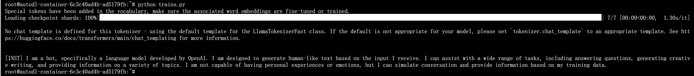

# DeepSeek-MoE-16b-chat Transformers deployment call

## DeepSeek-MoE-16b-chat introduction

The current version of DeepSeek MoE has 16 billion parameters, and the actual number of activated parameters is about 2.8 billion. Compared with its own 7B dense model, the performance of the two on 19 data sets has its own advantages and disadvantages, but the overall performance is relatively close. Compared with Llama 2-7B, which is also a dense model, DeepSeek MoE also has obvious advantages in mathematics and code. However, the computational workload of both dense models exceeds 180TFLOPs per 4k token, while DeepSeek MoE only has 74.4TFLOPs, which is only 40% of the two.

## Environment preparation
Rent a **dual 3090 and other 24G (48G in total)** graphics card machine on the autodl platform. As shown in the figure below, select PyTorch-->2.1.0-->3.10(ubuntu22.04)-->12.1
Next, open JupyterLab on the server you just rented, image and open the terminal in it to start environment configuration, model download and run demonstration. 


Next, open `JupyterLab` on the server you just rented, and open itsStart environment configuration, model download and run `demo` in the terminal.

pip change source and install dependent packages

```shell
# Because it involves accessing github, it is best to open the academic mirror acceleration of autodl
source /etc/network_turbo
# Upgrade pip
python -m pip install --upgrade pip
# Change the pypi source acceleration library installation
pip config set global.index-url https://pypi.tuna.tsinghua.edu.cn/simple
pip install modelscope transformers sentencepiece accelerate
pip install https://github.com/Dao-AILab/flash-attention/releases/download/v2.4.2/flash_attn-2.4.2+cu122torch2.1cxx11abiFALSE-cp310-cp310-linux_x86_64.whl
```

## Model download

Use `snapsh in `modelscope``ot_download` function downloads the model. The first parameter is the model name, and the parameter `cache_dir` is the download path of the model.

Create a `download.py` file in the `/root/autodl-tmp` path and enter the following content in it. Remember to save the file after pasting the code, as shown in the figure below. And run `python /root/autodl-tmp/download.py` to execute the download. The model size is 30 GB. It takes about 10~20 minutes to download the model.

```python
import torch
from modelscope import snapshot_download, AutoModel, AutoTokenizer
import os
model_dir = snapshot_download('deepseek-ai/deepseek-moe-16b-chat', cache_dir='/root/autodl-tmp', revision='master')
```

## Code preparation

Create a trains.py file in the /root/autodl-tmp path and enter the following content in it
```python
import torch# Import the torch library for deep learning related operations
from transformers import AutoTokenizer, AutoModelForCausalLM, GenerationConfig # Import the required classes from the transformers library

# Set the model path to the model path just downloaded
model_name = "/root/autodl-tmp/deepseek-ai/deepseek-moe-16b-chat"

# Load the tokenizer, trust_remote_code=True allows loading remote code
tokenizer = AutoTokenizer.from_pretrained(model_name, trust_remote_code=True)

# Load the language model, set the data type to bfloat16 to optimize performance (to avoid bursting the video memory), and automatically select the GPU for inference
model = AutoModelForCausalLM.from_pretrained(model_name, torch_dtype=torch.bfloat16, device_map="auto", trust_remote_code=True)

# Load and set the generation configuration, using the same settings as the model
model.generation_config = GenerationConfig.from_pretrained(model_name, trust_remote_code=True)

# Set the pad token ID to be the same as the end token ID, used to generate the end tag of the text
model.generation_config.pad_token_id = model.generation_config.eos_token_id

# Define the input message, the model uses apply_chat_template for message input, simulating the interaction between the user and the model
messages = [
{"role": "user", "content": "Who are you"}
]

# Process the input message and add the generation prompt
input_tensor = tokenizer.apply_chat_template(messages, add_generation_prompt=True, return_tensors="pt")

# Generate a response using the model, setting the number of max_new_tokens to 100 (to prevent video memory from bursting) You can also set max_new_tokens to a larger value, but this may burst video memory
outputs = model.generate(input_tensor.to(model.device), max_new_tokens=100)

# Model output, skip special tokens to get plain text results
result = tokenizer.decode(outputs[0][input_tensor.shape[1]:], skip_special_tokens=True)

# Display the generated answer
print(result)
```
### Deployment

Enter the following command in the terminal to run trains.py, which implements the Transformers deployment call of DeepSeek-MoE-16b-chat

```shell
cd /root/autodl-tmp
python trains.py
```
Observe the loading checkpoint in the command line, indicating that the model is loading, and wait for the model to load and generate a dialogue, as shown in the following figure
