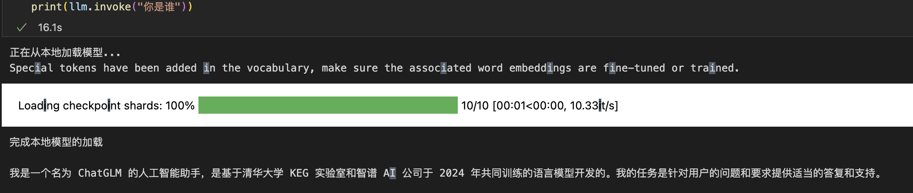

# GLM-4-9b-Chat connects to LangChain 

## Environment preparation

Based on `Environment preparation` and `Model download` of `01-ChatGLM4-9B-chat FastApi deployment call`, we also need to install the `langchain` package. If you do not need to use fastapi related functions, you can not install `fastapi, uvicorn, requests`.

```bash
pip install langchain==0.2.1
```
Note that langchain uses the v0.2 version released in May 2024, but the code of this tutorial has been tested and is also compatible with the 0.1.15 version of langchain. The download method is as follows:
```bash
pip install langchain==0.1.15
```

> Considering that some students may encounter some problems in configuring the environment, we have prepared an environment image of GLM-4 on the AutoDL platform, which is suitable for the deployment environment of GLM-4 required in this tutorial. Click the link below and create an AutoDL example directly. (vLLM has higher requirements for torch version, and the higher the version, the more complete the model support and the better the effect, so a new image is created.) **https://www.codewithgpu.com/i/datawhalechina/self-llm/GLM-4**

## Code preparation

To build LLM applications conveniently, we need to customize an LLM class based on the locally deployed Chat and connect ChatGLM4 to the LangChain framework. After completing the customized LLM class, the LangChain interface can be called in a completely consistent manner without considering the inconsistency of the underlying model call.

Customizing the LLM class based on the locally deployed ChatGLM4 is not complicated. We only need to inherit a subclass from the Langchain.llms.base.LLM class and rewrite the constructor and _call function:

```python
from langchain.llms.base import LLM
from typing import Any, List, Optional, Dict
from langchain.callbacks.manager import CallbackManagerForLLMRun
from transformers import AutoTokenizer, AutoModelForCausalLM
import torch

class ChatGLM4_LLM(LLM):
# Customize LLM class based on local ChatGLM4
tokenizer: AutoTokenizer = None
model: AutoModelForCausalLM = None
gen_kwargs: dict = None

def __init__(self, mode_name_or_path: str, gen_kwargs: dict = None):
super().__init__()
print("Loading model from local...")
self.tokenizer = AutoTokenizer.from_pretrained(
mode_name_or_path, trust_remote_code=True
)
self.model = AutoModelForCausalLM.from_pretrained(mode_name_or_path, torch_dtype=torch.bfloat16, trust_remote_code=True, device_map="auto" ).eval() print("Complete loading of local model") if gen_kwargs is None: gen_kwargs = {"max_length": 2500, "do_sample": True, "top_k": 1} self.gen_kwargs = gen_kwargs def _call(self, prompt: str, stop: Optional[List[str]] = None, run_manager: Optional[CallbackManagerForLLMRun] = None, **kwargs: Any) -> str: messages = [{"role": "user", "content": prompt}] model_inputs = self.tokenizer.apply_chat_template( messages, tokenize=True, return_tensors="pt", return_dict=True, add_generation_prompt=True ) generated_ids = self.model.generate(**model_inputs, **self.gen_kwargs) generated_ids = [ output_ids[len(input_ids):] for input_ids, output_ids in zip(model_inputs['input_ids'], generated_ids) ] response = self. tokenizer.batch_decode(generated_ids, skip_special_tokens=True)[0]
return response

@property
def _identifying_params(self) -> Dict[str, Any]:
"""Returns the dictionary used to identify the LLM, which is essential for caching and tracking purposes."""
return {
"model_name": "glm-4-9b-chat",
"max_length": self.gen_kwargs.get("max_length"),
"do_sample": self.gen_kwargs.get("do_sample"),
"top_k": self.gen_kwargs.get("top_k"),
}

@property
def _llm_type(self) -> str:
return "glm-4-9b-chat"
```
In the above class definition, we rewrite the constructor and _call function respectively: For the constructor, we load the locally deployed ChatGLM4 model at the beginning of the object instantiation to avoid the time waste caused by reloading the model for each call; The _call function is the core function of the LLM class. Langchain will call this function to call LLM. In this function, we call the generate method of the instantiated model to call the model and return the call result.

In addition, when implementing a custom LLM class, according to the requirements of the langchain framework, we need to define the _identifying_params attribute. The function of this attribute is to return a dictionary containing parameters that can uniquely identify this LLM instance. This function is very important for caching and tracking because it can help the system identify different model configurations, thereby performing effective cache management and log tracking.

In the overall project, we encapsulate the above code as LLM.py, and will directly introduce the custom ChatGLM4_LLM class from this file later

## Call

Then you can use it like any other langchain model function. 

```python
from LLM import ChatGLM4_LLM
gen_kwargs = {"max_length": 2500, "do_sample": True, "top_k": 1}
llm = ChatGLM4_LLM(mode_name_or_path="/root/autodl-tmp/ZhipuAI/glm-4-9b-chat", gen_kwargs=gen_kwargs)
print(llm.invoke("Who are you"))
```

