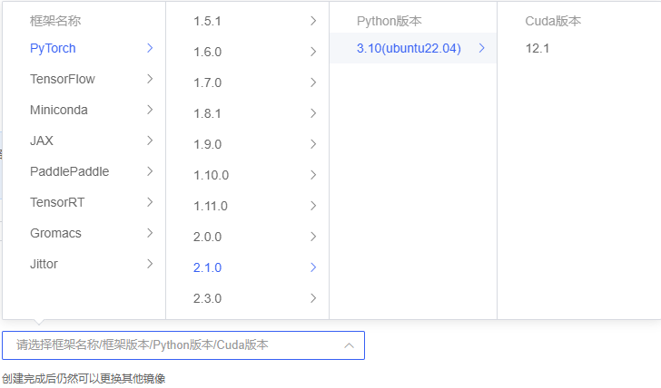
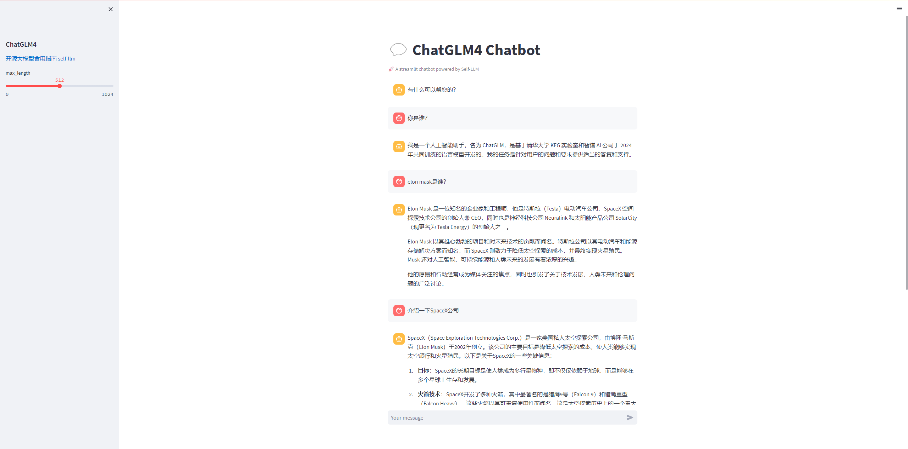

# GLM-4-9B-Chat WebDemo deployment

## Environment preparation
Rent a 4090 or other 24G graphics card machine in the autodl platform. As shown in the figure below, select PyTorch-->2.1.0-->3.10(ubuntu22.04)-->12.1
Next, open JupyterLab on the server you just rented, image and open the terminal in it to start environment configuration, model download and run the demonstration. 

pip change source and install dependent packages
```bash
# Upgrade pip
python -m pip install --upgrade pip
# Change pypi source to accelerate library installation
pip config set global.index-url https://pypi.tuna.tsinghua.edu.cn/simple

pip install modelscope==1.9.5
pip install "transformers>=4.37.0"
pip install streamlit==1.24.0
pip install sentencepiece==0.1.99
pip install accelerate==0.24.1
pip install transformers_stream_generator==0.0.4
pip install tiktoken
```
> Considering that some students may encounter some problems in configuring the environment, we have prepared an environment image of GLM-4 on the AutoDL platform, which is suitable for the deployment environment that requires GLM-4 in this tutorial. Click the link below and create an AutoDL example directly. (vLLM has higher requirements for the torch version, and the higher the version, the more complete the model support and the better the effect, so create a new image.) **https://www.codewithgpu.com/i/datawhalechina/self-llm/GLM-4**

## Model download
Use the snapshot_download function in modelscope to download the model. The first parameter is the model name, and the parameter cache_dir is the download path of the model.

Create a new download.py file in the /root/autodl-tmp path and enter the following content in it. Remember to save the file after pasting the code, as shown in the figure below. and run python /root/autodl-tmp/download.py executes the download. It takes about 2 minutes to download the model.

```python
mport torch
from modelscope import snapshot_download, AutoModel, AutoTokenizer
import os
model_dir = snapshot_download('ZhipuAI/glm-4-9b-chat', cache_dir='/root/autodl-tmp', revision='master')
```

## Code preparation

Create a new `ChatBot.py` file in the `/root/autodl-tmp` path and enter the following content in it. Remember to save the file after pasting the code. The following code has very detailed comments. If you don’t understand it, please raise an issue.

```python
# Import the required libraries
from transformers import AutoTokenizer, AutoModelForCausalLM, GenerationConfig
import torch
import streamlit as st

# Create a title and a link in the sidebar
with st.sidebar:
st.markdown("## ChatGLM4")
"[Open Source Large Model Eating Guide self-llm](https://github.com/datawhalechina/self-llm.git)"
# Create a slider to select the maximum length, ranging from 0 to 1024, with a default value of 512
max_length = st.slider("max_length", 0, 1024, 512, step=1)

# Create a title and a subtitle
st.title("💬 ChatGLM4 Chatbot")
st.caption("🚀 A streamlit chatbot powered by Self-LLM")

# Define the model path
mode_name_or_path = 'autodl-tmp/ZhipuAI/glm-4-9b-chat'

# Define a function to get the model and tokenizer
@st.cache_resource
def get_model():
# Get the tokenizer from the pre-trained model
tokenizer = AutoTokenizer.from_pretrained(mode_name_or_path, use_fast=False, trust_remote_code=True)
# Get the model from the pretrained model and set the model parameters
model = AutoModelForCausalLM.from_pretrained(mode_name_or_path, torch_dtype=torch.bfloat16, device_map="auto", trust_remote_code=True)

return tokenizer, model

# Load the model and tokenizer of Qwen1.5-4B-Chat
tokenizer, model = get_model()

# If there is no "messages" in session_state, create a list containing default messages
if "messages" not in st.session_state:
st.session_state["messages"] = [{"role": "assistant", "content": "How can I help you?"}]

# Traverse all messages in session_state and display them on the chat interface
for msg in st.session_state.messages:
st.chat_message(msg["role"]).write(msg["content"])

# If the user enters content in the chat input box, do the following
if prompt := st.chat_input():
# Add the user's input to the messages list in session_state
st.session_state.messages.append({"role": "user", "content": prompt})
# Display the user's input on the chat interface
st.chat_message("user").write(prompt)

# Build input
input_ids = tokenizer.apply_chat_template(st.session_state.messages,tokenize=False,add_ggeneration_prompt=True) model_inputs = tokenizer([input_ids], return_tensors="pt").to('cuda') generated_ids = model.generate(model_inputs.input_ids, max_new_tokens=512) generated_ids = [ output_ids[len(input_ids):] for input_ids, output_ids in zip(model_inputs.input_ids, generated_ids) ] response = tokenizer.batch_decode(generated_ids, skip_special_tokens=True)[0] # Add the output of the model to the messages list in session_state st.session_state.messages.append( {"role": "assistant", "content": response})
# Display the output of the model on the chat interface
st.chat_message("assistant").write(response)
# print(st.session_state)
```

## Run demo

Run the following command in the terminal to start the streamlit service, map the port to the local according to the instructions of `autodl`, and then open the link http://localhost:6006/ in the browser to see the chat interface.

```bash
streamlit run /root/autodl-tmp/ChatBot.py --server.address 127.0.0.1 --server.port 6006
```

As shown below:

