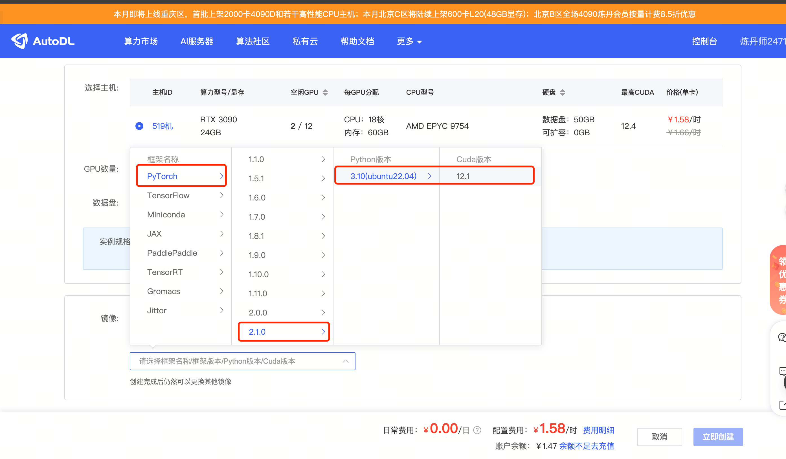

# 04-GLM-4-9B-Chat vLLM deployment call

## **vLLM Introduction**

The vLLM framework is an efficient large language model (LLM) **reasoning and deployment service system** with the following features:

- **Efficient memory management**: Through the PagedAttention algorithm, vLLM achieves efficient management of KV cache, reduces memory waste, and optimizes the operation efficiency of the model.

- **High throughput**: vLLM supports asynchronous processing and continuous batch processing requests, significantly improves the throughput of model reasoning, and accelerates text generation and processing speed.

- **Ease of use**: vLLM seamlessly integrates with the HuggingFace model, supports a variety of popular large language models, and simplifies the process of model deployment and reasoning. Compatible with OpenAI's API server.

- **Distributed reasoning**: The framework supports distributed reasoning in a multi-GPU environment, and improves the ability to process large models through model parallel strategies and efficient data communication.
- **Open Source**: vLLM is open source and has active community support, which makes it easy for developers to contribute and improve, and jointly promote technological development.

## **Environment Preparation**

Rent a graphics card machine with 24G video memory such as 3090 on the Autodl platform, as shown in the following figure, select PyTorch-->2.1.0-->3.10(ubuntu22.04)-->12.1

Next, open JupyterLab on the server you just rented, and open the terminal to start environment configuration, model download and run the demonstration.



pip changes the source to speed up downloading and installing dependent packages

```bash
# Upgrade pip
python -m pip install --upgrade pip
# Change the pypi source to speed up the installation of the library
pip config set global.index-url https://pypi.tuna.tsinghua.edu.cn/simple

pip install modelscope==1.11.0
pip install openai==1.17.1
pip install torch==2.1.2+cu121
pip install tqdm==4.64.1
pip install transformers==4.39.3
# Download flash-attn Please wait for about 10 minutes~
MAX_JOBS=8 pip install flash-attn --no-build-isolation
pip install vllm==0.4.0.post1
```

Directly installing vLLM will install CUDA 12.1 version.

```bash
pip install vllm
```

If we need to install vLLM in the CUDA 11.8 environment, we can use the following command to specify the vLLM version and python version to download.

```bash
export VLLM_VERSION=0.4.0
export PYTHON_VERSION=38
pip install https://github.com/vllm-project/vllm/releases/download/v${VLLM_VERSION}/vllm-${VLLM_VERSION}+cu118-cp${PYTHON_VERSION}-cp${PYTHON_VERSION}-manylinux1_x86_64.whl --extra-index-url https://download.pytorch.org/whl/cu118
```

> Considering that some students may encounter some problems in configuring the environment, we have prepared vLL on the AutoDL platformM environment image, which is suitable for any deployment environment that requires vLLM. Click the link below and create an AutoDL example directly. (vLLM has high requirements for the torch version, and the higher the version, the more complete the model support and the better the effect, so create a new image.) **https://www.codewithgpu.com/i/datawhalechina/self-llm/GLM-4**

Use the snapshot_download function in modelscope to download the model. The first parameter is the model name, and the parameter cache_dir is the download path of the model.

Create a new model_download.py file in the /root/autodl-tmp path and enter the following content in it. Please save the file in time after pasting the code, as shown in the figure below. And run `python /root/autodl-tmp/model_download.py` to execute the download. The model size is 14GB, and it takes about 2 minutes to download the model.

```bash
import torch 
from modelscope import snapshot_download, AutoModel, AutoTokenizer
osmodel_dir = snapshot_download('ZhipuAI/glm-4-9b-chat', cache_dir='/root/autodl-tmp', revision='master')
```

## **Code preparation**

### **python file**

Create a new vllm_model.py file in the /root/autodl-tmp path and enter the following content in it. Please save the file in time after pasting the code. The following code has very detailed comments. If you don't understand it, please raise an issue.

First, import the LLM and SamplingParams classes from the vLLM library. The `LLM` class is the main class for running offline inference using the vLLM engine. The `SamplingParams` class specifies the parameters of the sampling process, which is used to control and adjust the randomness and diversity of the generated text.

vLLM provides a very convenient encapsulation. We can directly pass in the model name or model path without manually initializing the model and word segmenter.

We can use this demo to get familiar with the use of the vLLM engine. The annotated content can enrich the model's capabilities, but it is not necessary. You can choose as needed.

```python
from vllm importLLM, SamplingParams
from transformers import AutoTokenizer
import os
import json

# When automatically downloading the model, specify to use modelscope. If not set, it will be downloaded from huggingface
# os.environ['VLLM_USE_MODELSCOPE']='True'

def get_completion(prompts, model, tokenizer=None, max_tokens=512, temperature=0.8, top_p=0.95, max_model_len=2048):
stop_token_ids = [151329, 151336, 151338]
# Create sampling parameters. temperature controls the diversity of generated text, and top_p controls the probability of core sampling
sampling_params = SamplingParams(temperature=temperature, top_p=top_p, max_tokens=max_tokens, stop_token_idsds=stop_token_ids)
# Initialize vLLM inference engine
llm = LLM(model=model, tokenizer=tokenizer, max_model_len=max_model_len,trust_remote_code=True)
outputs = llm.generate(prompts, sampling_params)
return outputs

if __name__ == "__main__": 
# Initialize vLLM inference engine
model='/root/autodl-tmp/ZhipuAI/glm-4-9b-chat' # Specify model path
# model="THUDM/glm-4-9b-chat" # Specify model name, automatically download model
tokenizer = None
# tokenizer = AutoTokenizer.from_pretrained(model, use_fast=False) # Pass vLLM model after loading tokenizer, but it is not necessary.text = ["Tell me about large language models.",
"Tell me how to get stronger."]
# messages = [
# {"role": "system", "content": "You are a useful assistant."},
# {"role": "user", "content": prompt}
# ]
# Messages as chat templates, not necessary.
# text = tokenizer.apply_chat_template(
# messages,
# tokenize=False,
# add_generation_prompt=True
# )

outputs = get_completion(text, model, tokenizer=tokenizer, max_tokens=512, temperature=1, top_p=1, max_model_len=2048)

# Output is a RequestO containing prompt, generated text, and other informationutput object list.
# Print output.
for output in outputs:
prompt = output.prompt
generated_text = output.outputs[0].text
print(f"Prompt: {prompt!r}, Generated text: {generated_text!r}")
```
The result is as follows:
```bash
Prompt: 'Tell me about the large language model. ', Generated text: 'The large language model is a natural language processing technology based on deep learning. It can understand, generate and translate natural language to provide users with a rich language interaction experience. \n\nHere are some key information about the large language model:\n\n### 1. Design goals\n\n- **Understanding natural language**: Able to understand the user's intentions and needs and respond accordingly. \n- **Generate natural language**: Generate grammatically and semantically consistent natural language answers based on input. \n- **Translate natural language**: Translate fluently between multiple languages. \n\n### 2. Technical architecture\n\n- **Deep learning**: using neural network technologyTrain a large amount of text data to achieve the model's understanding, generation and translation capabilities. \n- **Pre-training**: By pre-training on a large amount of unlabeled data, the model has preliminary language understanding and generation capabilities. \n- **Fine-tuning**: Fine-tune on a specific task to further improve the model's performance on the task. \n\n### 3. Application scenarios\n\n- **Question-answering system**: such as search engines, intelligent customer service, knowledge question-answering, etc. \n- **Text generation**: such as content creation, summary generation, dialogue generation, etc. \n- **Machine translation**: It is widely used in cross-language communication, global e-commerce and other fields. \n\n### 4. Development trend\n\n- **Model scale continues to expand**: With the improvement of computing power, the model scale will gradually increase, and the performance will also improve accordingly. \n- **Multimodal fusion**: Integrate natural language processing with other modal information such as images and voice to achieve a more comprehensive interactive experience. \n- **Interpretability and fairness**: Focus on the interpretability and fairness of the model to improve users' trust in the model. \n\nLarge language models play an important role in improving human-computer interaction and promoting information dissemination. \n\nLarge language models (LLMs) are a natural language processing (NLP) technology based on deep learning.Its core capability is to understand and generate natural language. Here are some key points about large language models:\n\n1. **Model size**: Large language models are huge, usually containing billions to hundreds of billions of parameters. For example, GPT-3 has 175 billion parameters, making it the largest language model to date. \n\n2. **Training data**: These models are usually trained on large amounts of text data, including books, news, web pages, etc. This data helps the model learn advanced features of language, such as grammar, semantics, and style. \n\n3. **Generative ability**: Large language models are able to autonomously generate coherent and logical text based on given text or context. This ability has a wide range of applications in text generation, summarization, machine translation, and other fields. \n\n4. **Adaptive ability**: Although these models can generate'

Prompt: 'Tell me how to become stronger. ', Generated text: '\nBecoming stronger is a comprehensive improvement process that includes all aspects of the body, mind, and spirit. Here are some suggestions to help you achieve your goal of becoming stronger:\n\n1. **Physical strengthening**:\n - **Regular exercise**: Develop a reasonable training plan, including aerobic exercise (such as running, swimming) and weight training, which can improve your body's endurance and strength.\n - **Nutritious diet**: A healthy diet is essential for your body's recovery and growth. Make sure you eat enoughEnough protein, carbohydrates, fat and trace elements. \n - **Sufficient sleep**: Ensure 7-9 hours of high-quality sleep every night, which is conducive to physical recovery and endocrine balance. \n\n2. **Psychological adjustment**: \n - **Positive thinking**: Maintain a positive attitude, adjust your mentality in time when facing challenges, and avoid the influence of negative emotions. \n - **Pressure resistance**: Develop the ability to face frustration and pressure, and enhance emotional management ability through meditation, yoga and other methods. \n\n3. **Spiritual growth**: \n - **Continuous learning**: Continuously enrich your knowledge and vision through reading, taking classes, participating in discussions, etc. \n - **Goal setting**: Clarify your long-term and short-term goals, and make plans to achieve these goals. \n\nSpecific measures are as follows: \n\n- **Make a plan**: Make a detailed plan according to your own situation, such as how many times a week to exercise, how long each exercise, etc. \n- **Track progress**: Record your training and diet, conduct self-evaluation regularly, and adjust the plan. \n- **Seek help**: If conditions permit, you can hire a professional coach for guidance. \n- **Be patient**: Becoming stronger is a long process that requires patience and perseverance. \n\nPlease selectively adopt these suggestions according to your actual situation, keep working hard, and you will become stronger and stronger. Come on! 🌟💪✊🏼🏃\u200d♀️🏃\u200d♂️👊\u200d♀️👊\u200d♂️🏋️\u200d♀️🏋️\u200d♂️🥗🍎💤📚💼🥼🧘\u200d♀️🧘\u 200d♂️🎯🎯🎯. 🎉🎉🎉🎉🎉🎉🎉🎉🎉🎉🎉🎉🎉🎉🎉🎉🎉🎉🎉🎉🎉🎉🎉🎉🎉🎉🎉🎉🎉🎉'
```

### **Create a server compatible with OpenAI API interface**

GLM4 compatible with OpenAI API protocol, so we can directly use vLLM to create an OpenAI API server. vLLM is very convenient for deploying servers that implement the OpenAI API protocol. By default, the server will be started at <u>http://localhost:8000</u>. The server currently hosts one Model, and implement the list model, completions, and chat completions ports.

- completions: This is a basic text generation task, where the model generates a piece of text after a given prompt. This type of task is usually used to generate articles, stories, emails, etc.
- chat completions: This is a conversation-oriented task, where the model needs Understand and generate conversations. This type of task is usually used to build chatbots or dialogue systems.

When creating a server, we can specify parameters such as model name, model path, chat template, etc.

-The --host and --port parameters specify the address.
--model parameter specifies the model name.
--chat-template parameter specifies the chat template.
--served-model-name specifies the name of the served model.
--max-model-len specifies the maximum length of the model.

`--max-model-len=2048` is specified here because the maximum length of the GLM4-9b-Chat model is too long, 128K, which causes vLLM to consume too much resources when initializing the KV cache.

```bash
python -m vllm.entrypoints.openai.api_server --model /root/autodl-tmp/ZhipuAI/glm-4-9b-chat --served-model-name glm-4-9b-chat --max-model-len=2048 --trust-remote-code
```

1. View the current model list through the curl command.

```bash
curl http://localhost:8000/v1/models
```

The return value is as follows:

```bash{"object":"list","data":[{"id":"glm-4-9b-chat","object":"model","created":1717567231,"owned_by":"vllm" ,"root":"glm-4-9b-chat","parent":null,"permission":[{"id":"modelperm-4fdf01c1999f4df1a0fe8ef96fd07c2f","object":"model_permission","created":1717567231 ,"allow_create_engine":false,"allow_sampling":true,"allow_logprobs":true,"allow_search_indices":false,"allow_view":true,"allow_fine_tuning":false,"organization":"*","group":null ,"is_blocking":false}]}]} ``` 1. Use curl command to test OpenAI Completions API.

```bash
curl http://localhost:8000/v1/completions \
-H "Content-Type: application/json" \
-d '{
"model": "glm-4-9b-chat",
"prompt": "你好", 
"max_tokens": 7, 
"temperature": 0 
}'
```

The return value is as follows:

```bash
{"id":"cmpl-8bba2df7cfa1400da705c58946389cc1","object":"text_completion","created":1717568865,"model":"glm-4-9b-chat","choices":[{"index":0,"text":",How can I help you? Hello","logprobs":null,"finish_reason":"length","stop_reason":null}],"usage":{"prompt_tokens":3,"total_tokens":10,"completion_tokens":7}}
```

You can also use Python scripts to request OpenAI Completions API. Here, an extra parameter `extra_body` is set, and we pass in `stop_token_ids` stop word ids. When the OpenAI API cannot meet the requirements, you can add it using the official VLLM documentation. https://docs.vllm.ai/en/latest/serving/openai_compatible_server.html

```python
from openai import OpenAI
client = OpenAI(
base_url="http://localhost:8000/v1",
api_key="token-abc123", # Just set it, just to pass the interface parameter verification
)

completion = client.chat.completions.create(
model="glm-4-9b-chat",
messages=[
{"role": "user", "content": "你好"}
],
# Set additional parameters
extra_body={
"stop_token_ids": [151329, 151336, 151338]
}
)

print(completion.choices[0].message)
```

The return value is as follows:

```bash
ChatCompletionMessage(content='\nHello 👋! Nice to meet you, how can I help you?', role='assistant', function_call=None, tool_calls=None)
```

1. Test the OpenAI Chat Completions API with the curl command.

```bash
curl http://localhost:8000/v1/chat/completions \
-H "Content-Type: application/json" \
-d '{ 
"model": "glm-4-9b-chat",
"messages": [ 
{"role": "system", "content": "You are a helpful assistant."},
{"role": "user", "content": "你好"}
],
"max_tokens": 7, 
"temperature": 0 

}'
```

The return value is as follows:

```bash
{"id":"cmpl-8b02ae787c7747ecaf1fb6f72144b798","object":"chat.completion","created":1717569334,"model":"glm-4-9b-chat","choices":[{"index":0,"message":{"role":"assistant","content":"\nHello 👋! Very happy"},"logprobs":null,"finish_reason":"length","stop_reason":null}],"usage":{"prompt_tokens":16,"total_tokens":23,"completion_tokens":7}
```

You can also use python script to request OpenAI Chat Completions API.

```python
from openai import OpenAIopenai_api_key = "EMPTY" # Just set it, just to pass the interface parameter verificationopenai_api_base = "http://localhost:8000/v1"client = OpenAI(
api_key=openai_api_key,
base_url=openai_api_base,
)

chat_outputs = client.chat.completions.create(
model="glm-4-9b-chat",
messages=[{"role": "system", "content": "You are a helpful assistant."},
{"role": "user", "content": "你好"},
],
# Set additional parameters
extra_body={
"stop_token_ids": [151329, 151336, 151338]
}
)
print(chat_outputs)
```

The return value is as follows:

```bash
ChatCompletion(id='cmpl-16b1c36dc695426cacee23b79d179d52', choices=[Choice(finish_reason='stop', index=0, logprobs=None, message=ChatCompletionMessage(content='\nHello 👋! How can I help you?', role='assistant', function_call=None, tool_calls=None), stop_reason=151336)], created=1717569519, model='glm-4-9b-chat', object='chat.completion', system_fingerprint=None, usage=CompletionUsage(completion_tokens=12, prompt_tokens=16, total_tokens=28))
```

The API backend will also print some logs and statistics when processing requests.

## **Speed ​​Test**

Since vLLM is an efficient large-scale language model inference and deployment service system, let's test the model generation speed. See how big the gap is with the original speed. Here we directly use the benchmark_throughput.py script that comes with vLLM for testing. You can put the benchmark_throughput.py script in the current folder under /root/autodl-tmp/. Or you can <u>download the script</u> yourself.

Here are some parameters of the benchmark_throughput.py script:

--model parameter specifies the model path or name.
--backend after inferenceThe distribution corresponds to vllm, hf and mii backends.
- --input-len Input length
- --output-len Output length
- --num-prompts Number of prompts generated
- --seed 2024 Random seed
- --dtype float16 Floating point precision
- --max-model-len Maximum model length
- --hf_max_batch_size Maximum batch size of transformers library (only valid for hf inference backend and required)
- --dataset Path to dataset. (Data will be automatically generated if not set)

Test the speed of vLLM:

```bash
python benchmark_throughput.py \
--model /root/autodl-tmp/ZhipuAI/glm-4-9b-chat \
--backend vllm \
--input-len 64 \
--output-len 128 \
--num-prompts 25\
--seed 2024 \
--dtype float16 \
--max-model-len 512 \
--trust-remote-code
```

The results are as follows:

```
Throughput: 7.41 requests/s, 1423.36 tokens/s
```

Test the speed of the original method (using the transformers library of hunggingface):

```bash
python benchmark_throughput.py \
--model /root/autodl-tmp/ZhipuAI/glm-4-9b-chat \
--backend hf \
--input-len 64 \
--output-len 128 \
--num-prompts 25 \
--seed 2024 \
--dtype float16 \
--hf-max-batch-size 25 \
--trust-remote-code
```

The results are as follows:

```
Throughput: 3.40 requests/s, 652.15 tokens/s
```

Comparing the speeds of the two, in this test, the speed of vLLM is more than **100%** faster than the original speed (this test is relatively casual and is only for reference in this case, not for other cases).

| Reasoning Framework | Throughput | tokens/s |
| :---: | :---: | :---: |
| vllm | 7.41 requests/s | 1423.36 tokens/s |
| hf | 3.40 requests/s | 652.15 tokens/s |
| diff | 117.94% | 118.26% |